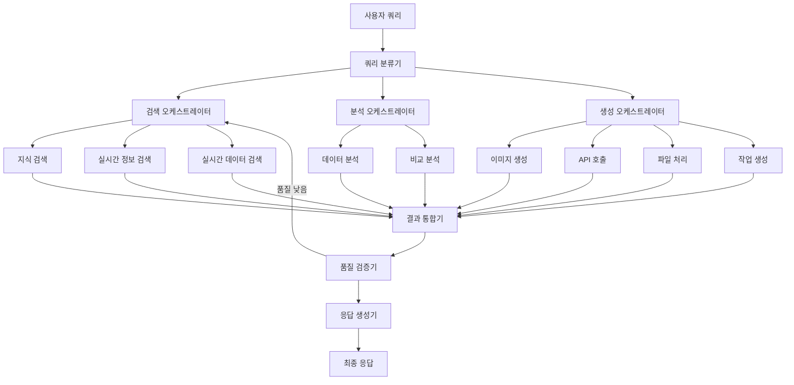

# NEOS

LangGraph, CrewAI, FastAPI를 활용한 지능형 멀티 에이전트 AI 시스템입니다. 복합적인 쿼리를 여러 전문 에이전트가 협력하여 처리하고, 고품질의 통합된 답변을 제공합니다.

## ✨ 주요 기능

### 🔍 **지능형 검색 에이전트**
- **지식 기반 검색**: 과거 쿼리와 지식 베이스에서 유사 정보 검색
- **실시간 정보 검색**: Tavily API를 통한 최신 웹 정보 수집
- **실시간 데이터 검색**: 통계, 시장 정보 등 수치 데이터 전문 검색

### 📊 **고급 분석 에이전트**
- **데이터 분석**: 수집된 정보의 통계 분석 및 패턴 발견
- **비교 분석**: 다중 소스 정보 비교 및 유사성 분석

### 🎨 **콘텐츠 생성 에이전트**
- **이미지 생성**: OpenAI DALL-E를 통한 이미지 생성
- **API 호출**: 외부 서비스 통합 (날씨, 환율, 주식 등)
- **파일 처리**: 문서 분석, 변환, 요약
- **작업 생성**: 프로젝트 계획 및 태스크 자동 생성

### 🚀 **지능형 워크플로우**
- **LangGraph** 기반 복잡한 에이전트 오케스트레이션
- **동적 라우팅**: 쿼리 의도에 따른 최적 에이전트 선택
- **품질 검증**: 응답 품질 자동 평가 및 재처리
- **실시간 처리**: WebSocket 지원으로 실시간 상호작용

## 🏗️ 시스템 아키텍처



## 🛠️ 기술 스택

### **핵심 프레임워크**
- **FastAPI**: 현대적인 비동기 웹 프레임워크
- **LangGraph**: 상태 기반 에이전트 워크플로우 관리
- **CrewAI**: 협력적 AI 에이전트 시스템

### **데이터베이스 & 캐싱**
- **PostgreSQL + pgvector**: 벡터 임베딩 지원 관계형 DB
- **Redis**: 고성능 캐싱 및 세션 관리

### **AI 서비스**
- **OpenAI GPT-4**: 언어 모델 및 임베딩
- **OpenAI DALL-E 3**: 이미지 생성
- **Tavily**: 실시간 웹 검색

### **개발 도구**
- **SQLAlchemy**: 비동기 ORM
- **Pydantic**: 데이터 검증
- **asyncpg**: 고성능 PostgreSQL 드라이버

## 🚀 빠른 시작

### 1. 프로젝트 클론 및 설정
```bash
git clone <repository-url>
cd multi-agent-ai-system

# Python 가상환경 생성
python -m venv venv
source venv/bin/activate  # Windows: venv\Scripts\activate

# 의존성 설치
pip install -r requirements.txt
```

### 2. 환경 변수 설정
```bash
# .env 파일 생성
cp .env.example .env

# 필수 API 키 설정
# - OPENAI_API_KEY: OpenAI API 키
# - TAVILY_API_KEY: Tavily 검색 API 키
```

### 3. 데이터베이스 시작
```bash
# Docker Compose로 PostgreSQL, Redis 시작
docker-compose up -d postgres redis

# 또는 수동 설치 후 데이터베이스 초기화
psql -U postgres -d ai_system -f init.sql
```

### 4. 애플리케이션 실행
```bash
# 개발 서버 시작
python main.py

# 또는 uvicorn 직접 실행
uvicorn main:app --reload --host 0.0.0.0 --port 8000
```

### 5. API 테스트
```bash
# 헬스체크
curl http://localhost:8000/api/v1/health

# 쿼리 테스트
curl -X POST http://localhost:8000/api/v1/query \
  -H "Content-Type: application/json" \
  -d '{"query": "2024년 AI 트렌드에 대해 분석해주세요"}'
```

## 📚 API 문서

애플리케이션 실행 후 다음 URL에서 대화형 API 문서를 확인할 수 있습니다:

- **Swagger UI**: http://localhost:8000/docs
- **ReDoc**: http://localhost:8000/redoc

### 주요 엔드포인트

#### 🔍 쿼리 처리
```http
POST /api/v1/query
Content-Type: application/json

{
  "query": "사용자 질문",
  "user_id": "선택적_사용자_ID",
  "session_id": "선택적_세션_ID",
  "preferences": {}
}
```

#### 📊 시스템 상태
```http
GET /api/v1/health
GET /api/v1/stats/system
```

#### 📈 트렌딩 & 연관 검색어
```http
GET /api/v1/trending?time_period=daily&limit=10
GET /api/v1/related/{query_id}
```

#### 🔌 실시간 WebSocket
```javascript
const ws = new WebSocket('ws://localhost:8000/api/v1/ws/session123');
ws.send(JSON.stringify({
  type: 'query',
  query: '실시간 질문',
  user_id: 'user123'
}));
```

## 🎯 사용 예시

### 정보 검색 쿼리
```json
{
  "query": "2024년 한국의 경제 성장률과 주요 산업 동향을 분석해주세요"
}
```

### 비교 분석 쿼리  
```json
{
  "query": "ChatGPT와 Claude의 성능을 비교 분석해주세요"
}
```

### 콘텐츠 생성 쿼리
```json
{
  "query": "AI 로봇이 미래 도시에서 일하는 모습을 그려주세요"
}
```

### 작업 계획 쿼리
```json
{
  "query": "웹 애플리케이션 개발 프로젝트의 상세 계획을 세워주세요"
}
```

### CLI 도구 사용법

#### 1. **시스템 상태 확인**
```bash
# 전체 시스템 상태 체크
python neos/cli.py status

# 설정 확인
python neos/cli.py config
```

#### 2. **개별 에이전트 테스트**
```bash
# 검색 에이전트 테스트
python neos/cli.py agent test-agent knowledge_search "AI 최신 트렌드"
python neos/cli.py agent test-agent realtime_info_search "2024년 기술 뉴스"

# 분석 에이전트 테스트
python neos/cli.py agent test-agent data_analysis "시장 데이터 분석"
python neos/cli.py agent test-agent comparative_analysis "A vs B 비교"

# 생성 에이전트 테스트
python neos/cli.py agent test-agent image_generation "로봇 이미지 생성"
python neos/cli.py agent test-agent task_creation "프로젝트 계획 수립"

# 결과를 JSON으로
python neos/cli.py agent test-agent knowledge_search "AI 트렌드" --output json
```

#### 3. **에이전트 성능 벤치마크**
```bash
# 카테고리별 벤치마크
python neos/cli.py agent benchmark-agent --category search
python neos/cli.py agent benchmark-agent --category analysis
python neos/cli.py agent benchmark-agent --category generation
python neos/cli.py agent benchmark-agent --category all

# 병렬 실행으로 성능 테스트
python neos/cli.py agent benchmark-agent --category all --concurrent
```

#### 4. **전체 워크플로우 테스트**
```bash
# 단일 쿼리 워크플로우 테스트
python neos/cli.py workflow test "2025년 AI 트렌드를 분석해주세요"

# 커스텀 사용자/세션으로
python neos/cli.py workflow test "분석 요청" --user-id custom_user --session-id custom_session

# JSON 출력으로
python neos/cli.py workflow test "쿼리" --output json
```

#### 5. **워크플로우 벤치마크**
```bash
# 기본 쿼리들로 벤치마크
python neos/cli.py workflow benchmark

# 특정 쿼리들로
python neos/cli.py workflow benchmark -q "AI 트렌드" -q "스마트폰 비교" -q "이미지 생성"

# 파일에서 쿼리 로드
python neos/cli.py workflow benchmark --file tests/sample_queries.txt

# 병렬 실행
python neos/cli.py workflow benchmark --concurrent
```

#### 6. **대화형 모드**
```bash
# 대화형 CLI 시작
python neos/cli.py interactive

# 대화형 모드 명령어들
Query> 2024년 AI 트렌드 분석해주세요    # 워크플로우 실행
Query> agent knowledge_search AI 트렌드  # 특정 에이전트 테스트
Query> status                           # 상태 확인
Query> help                            # 도움말
Query> exit                            # 종료
```

#### 7. **MCP 테스트**
```bash
# MCP 서버 및 도구 상태 확인
python neos/cli.py mcp status

# 실제 웹 검색 테스트
python -m neos.cli mcp test-tool web_search_mcp -p '{"query":"Python 최신 기능","max_results":5}'

# 파일 시스템 작업 테스트  
python -m neos.cli mcp test-tool file_processing_mcp -p '{"operation":"list","file_path":"."}'

# 데이터베이스 상태 확인
python -m neos.cli mcp test-tool database_mcp -p '{"operation":"health_check"}'

# Git 상태 확인
python -m neos.cli mcp test-tool git_mcp -p '{"operation":"status"}'

# 모든 도구 일괄 테스트
python -m neos.cli mcp test-all

# 새 도구 템플릿 생성
python -m neos.cli mcp register custom_api api_integration -d "커스텀 API 도구"
```

### 테스트 마커 및 분류

#### 테스트 마커
- `unit`: 단위 테스트 (빠름, Mock 사용)
- `integration`: 통합 테스트 (실제 서비스 연동)
- `agents`: 에이전트별 테스트
- `workflow`: 워크플로우 테스트  
- `api`: API 엔드포인트 테스트
- `slow`: 느린 테스트 (성능, 벤치마크)

#### 테스트 카테고리별 실행 시간
- **Unit Tests**: ~30초 (Mock 기반, 빠름)
- **Agent Tests**: ~2분 (실제 에이전트 생성/실행)
- **Workflow Tests**: ~3분 (전체 파이프라인)
- **Integration Tests**: ~5분 (외부 서비스 연동)
- **Slow Tests**: ~10분+ (성능, 벤치마크)

### 커버리지 리포트

```bash
# HTML 커버리지 리포트 생성
make coverage
# 또는
python scripts/test_runner.py all --coverage --html

# 리포트 확인
open htmlcov/index.html
```

### CI/CD 파이프라인

```bash
# 전체 CI 파이프라인 (로컬)
make ci

# 개발 중 빠른 검증
make dev-test
```

### 문제 해결

#### 테스트 실패 시
```bash
# 상세한 에러 정보로 재실행
pytest -vvv --tb=long --no-header

# 특정 테스트만 디버깅
pytest tests/test_agents.py::TestSearchAgents::test_knowledge_search_agent_creation -vvs

# 로그 출력 포함
pytest --log-cli-level=DEBUG
```

#### 환경 문제 시
```bash
# 의존성 재설치
make clean install

# Docker 환경 재시작
make docker-restart

# 전체 환경 정리 후 재구성
make dev-clean dev-setup
```

### 에이전트 커스터마이징
```python
# agents/custom_agent.py에서 새로운 에이전트 생성
class CustomSearchAgent(SearchAgent):
    def __init__(self):
        super().__init__(
            name="custom_search",
            search_type="custom",
            role="Custom Specialist",
            goal="Your specific goal",
            backstory="Agent background"
        )
    
    async def execute(self, query: str, context: Dict[str, Any]):
        # 커스텀 로직 구현
        pass
```

### 워크플로우 확장
```python
# workflow/graph.py에서 새로운 노드 추가
workflow.add_node("custom_processor", self._custom_processing)
workflow.add_edge("result_integrator", "custom_processor")
```

### 캐싱 전략 설정
```python
# 특정 쿼리 타입에 대한 캐시 TTL 조정
await cache_manager.set(key, value, ttl=7200)  # 2시간
```

## 📊 모니터링 & 성능

### 주요 메트릭
- **응답 시간**: 쿼리 처리 시간
- **품질 점수**: AI 응답 품질 평가 (0-1)
- **캐시 적중률**: 캐시 효율성
- **에이전트 성공률**: 각 에이전트별 성공률

### 로그 분석
```bash
# 로그 레벨 설정 (DEBUG, INFO, WARNING, ERROR)
export LOG_LEVEL=INFO

# 구조화된 로그 출력
tail -f logs/application.log | jq '.'
```

### 성능 최적화 팁
1. **캐싱 활용**: 자주 사용되는 쿼리 캐싱
2. **배치 처리**: 임베딩 생성 시 배치 처리
3. **연결 풀링**: DB 연결 풀 크기 조정
4. **인덱스 최적화**: 벡터 검색 인덱스 튜닝

## 🐳 Docker 배포

### 전체 스택 배포
```bash
# 전체 애플리케이션 실행
docker-compose --profile full up -d

# 관리 도구 포함 실행  
docker-compose --profile tools up -d
```

### 프로덕션 배포
```bash
# 프로덕션 환경 변수 설정
export DEBUG=false
export LOG_LEVEL=INFO

# 스케일링
docker-compose up -d --scale api=3
```

## 🔒 보안 고려사항

### API 키 관리
- 환경 변수로 민감 정보 관리
- 프로덕션에서 `.env` 파일 보안

### 데이터베이스 보안
```sql
-- 사용자별 권한 설정
GRANT SELECT, INSERT, UPDATE ON query_history TO app_user;
```

### 입력 검증
- 쿼리 길이 제한 (10,000자)
- SQL 인젝션 방지
- XSS 공격 방지

## 📊 LLM 호출 데이터셋 수집

NEOS는 모델 학습을 위해 모든 LLM 호출을 자동으로 추적하고 저장합니다.

### 주요 기능
- **자동 수집**: 워크플로우 실행 시 LLM 호출 자동 추적
- **상세 메타데이터**: 세션, 사용자, 워크플로우 단계, 에이전트, 토큰 사용량, 레이턴시 등
- **다양한 포맷**: JSONL, JSON, CSV, OpenAI fine-tuning, Anthropic 형식 지원
- **자동 저장**: 워크플로우 완료 시 자동으로 `datasets/` 디렉토리에 저장

### 설정
`.env` 파일에서 데이터셋 수집을 제어할 수 있습니다:

```bash
# 데이터셋 자동 저장 활성화/비활성화
DATASET_AUTO_SAVE=true

# 저장 형식 (jsonl, json, csv)
DATASET_SAVE_FORMAT=jsonl

# 데이터셋 저장 경로
DATASET_BASE_PATH=datasets
```

### CLI 명령어

```bash
# 수집 상태 확인
uv run python -m neos.cli dataset status

# 데이터셋 내보내기
uv run python -m neos.cli dataset export -f jsonl
uv run python -m neos.cli dataset export -f openai    # OpenAI fine-tuning 형식
uv run python -m neos.cli dataset export -f anthropic # Anthropic 형식

# 특정 세션/에이전트 데이터만 내보내기
uv run python -m neos.cli dataset export --session <session_id>
uv run python -m neos.cli dataset export --agent realtime_info_search

# 수집 활성화/비활성화
uv run python -m neos.cli dataset enable
uv run python -m neos.cli dataset disable

# 수집된 데이터 초기화
uv run python -m neos.cli dataset clear

# 저장된 데이터셋 파일 목록
uv run python -m neos.cli dataset list-files
```

### 데이터 구조

각 레코드는 다음 정보를 포함합니다:

```json
{
  "call_id": "unique-uuid",
  "timestamp": "2025-10-01T13:52:20",
  "session_id": "session-uuid",
  "user_id": "user-id",
  "workflow_step": "realtime_info_search",
  "agent_name": "realtime_info_search",
  "provider": "anthropic",
  "model": "claude-sonnet-4",
  "temperature": 0.1,
  "input_messages": [...],
  "output_text": "...",
  "prompt_tokens": 1234,
  "completion_tokens": 567,
  "total_tokens": 1801,
  "latency_ms": 2481.18,
  "success": true,
  "tags": ["web_search", "synthesis"]
}
```

## 🗺️ 로드맵

### ✅ v1.0 (완료)
- [x] 멀티 에이전트 LangGraph 워크플로우
- [x] OpenAI + Anthropic 멀티 Provider 지원
- [x] 다층 캐싱 시스템
- [x] 벡터 기반 의미적 검색
- [x] 실시간 WebSocket 통신
- [x] 품질 기반 자동 재처리
- [x] LLM 호출 데이터셋 자동 수집 및 저장

### v1.1 (예정)
- [ ] 멀티모달 입력 지원 (이미지, 오디오)
- [ ] 그래프 데이터베이스 통합
- [ ] 고급 A/B 테스트 프레임워크
- [ ] Google Gemini, Cohere 등 추가 LLM Provider

### v1.2 (예정)
- [ ] 분산 에이전트 실행
- [ ] 실시간 협업 기능  
- [ ] 로컬 LLM 지원 (Ollama)
- [ ] 고급 워크플로우 빌더 UI
