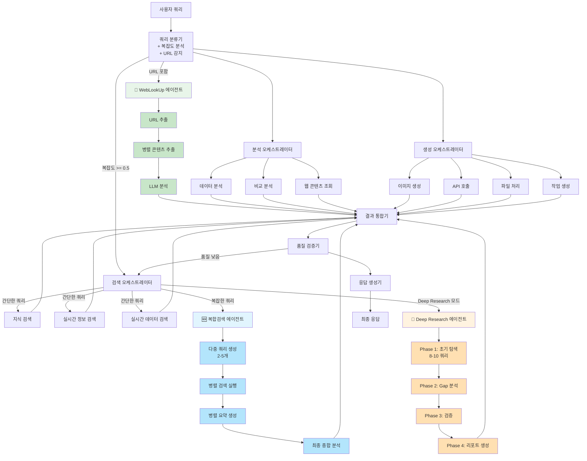

# NEOS

LangGraph, CrewAI, FastAPI를 활용한 지능형 멀티 에이전트 AI 시스템입니다. 복합적인 쿼리를 여러 전문 에이전트가 협력하여 처리하고, 고품질의 통합된 답변을 제공합니다.

## ✨ 주요 기능

### 🔍 **지능형 검색 에이전트**
- **지식 기반 검색**: 과거 쿼리와 지식 베이스에서 유사 정보 검색
- **실시간 정보 검색**: Tavily API를 통한 최신 웹 정보 수집
- **실시간 데이터 검색**: 통계, 시장 정보 등 수치 데이터 전문 검색
- **🔗 WebLookUp 에이전트**: 사용자가 제공한 URL의 내용을 직접 추출하고 분석 **[NEW]**
  - 자동 URL 감지 및 라우팅
  - 다중 URL 병렬 처리
  - **🎭 Playwright 동적 렌더링 지원** - JavaScript 기반 SPA 페이지 처리 **[NEW]**
  - BeautifulSoup 기반 HTML 파싱 및 콘텐츠 추출
  - LLM 기반 콘텐츠 분석 및 요약
  - 다국어 지원 (한국어, 영어, 일본어, 중국어)
- **🆕 복합검색 에이전트**: 복잡한 쿼리를 여러 관점으로 분해하여 심층 분석
  - LLM 기반 검색 쿼리 다각화 (2-5개)
  - 병렬 검색 및 요약으로 빠른 처리
  - 다중 소스 정보의 종합적 통합 분석
- **🔬 Deep Research 모드**: 전문가 수준의 심층 조사 리포트 생성
  - 4단계 탐색 프로세스 (15-30분)
  - 30-50개 이상 소스에서 정보 수집
  - 전문가급 구조화된 마크다운 리포트
- **🚀 HyperDeepResearch 모드**: 극도로 고도화된 심층 조사 시스템
  - 8단계 체계적 프로세스 (30-60분)
  - **200+ 소스** 목표 수집 (최소 100개 보장)
  - **복합 검색 통합**: 5-8회 multi-query 검색 실행
  - 멀티 쿼리 서치: 20개 검색 쿼리 자동 생성
  - 3회 반복 심층 분석 + 교차 검증 + 비판적 사고
  - **🔍 Criticism Feedback Sub-Agent**: 중간 보고서 비판적 검토
    - 각 주요 Phase 완료 후 자동 피드백 생성
    - 논리적 타당성, 완전성, 균형성, 깊이 평가
    - 누락된 관점 및 추가 조사 영역 식별
    - 필요시 자동으로 추가 조사 트리거
    - 모든 피드백 및 추가 조사 내역 DB 저장
  - 완전한 DB 추적 (모든 단계 저장)

### 📊 **고급 분석 에이전트**
- **데이터 분석**: 수집된 정보의 통계 분석 및 패턴 발견
- **비교 분석**: 다중 소스 정보 비교 및 유사성 분석
- **🆕 웹 콘텐츠 조회**: URL에서 웹 페이지 내용 추출 및 분석
  - trafilatura 기반 깔끔한 텍스트 추출
  - 메타데이터 자동 수집 (제목, 저자, 날짜 등)
  - LLM 기반 콘텐츠 요약 및 인사이트 생성

### 🎨 **콘텐츠 생성 에이전트**
- **이미지 생성**: OpenAI DALL-E를 통한 이미지 생성
- **🆕 API 호출**: 외부 서비스 통합
  - **날씨 API**: OpenWeatherMap 기반 실시간 날씨 정보
  - **환율 API**: 실시간 환율 정보 (160+ 통화 지원)
  - **주식 API**: Yahoo Finance + FinancialDatasets.ai 주가 및 재무제표 조회
- **파일 처리**: 문서 분석, 변환, 요약
- **작업 생성**: 프로젝트 계획 및 태스크 자동 생성

### 🚀 **지능형 워크플로우**
- **LangGraph** 기반 복잡한 에이전트 오케스트레이션
- **동적 라우팅**: 쿼리 의도 및 복잡도에 따른 최적 에이전트 자동 선택
  - 간단한 검색: 기본 검색 에이전트
  - 복잡한 분석: 복합검색 에이전트 (자동 전환)
- **품질 검증**: 응답 품질 자동 평가 및 재처리
- **실시간 처리**: WebSocket 지원으로 실시간 상호작용
- **쿼리 복잡도 분석**: 자동으로 쿼리 복잡도 측정 (0.0-1.0)
  - 쿼리 길이, 다중 주제, 심층 분석 키워드 등 종합 평가
  - 임계값 이상 시 복합검색 에이전트 자동 활성화

## 🏗️ 시스템 아키텍처



## 🛠️ 기술 스택

### **핵심 프레임워크**
- **FastAPI**: 현대적인 비동기 웹 프레임워크
- **LangGraph**: 상태 기반 에이전트 워크플로우 관리
- **CrewAI**: 협력적 AI 에이전트 시스템

### **데이터베이스 & 캐싱**
- **PostgreSQL + pgvector**: 벡터 임베딩 지원 관계형 DB
- **Redis**: 고성능 캐싱 및 세션 관리

### **AI 서비스**
- **OpenAI GPT-4**: 언어 모델 및 임베딩
- **OpenAI DALL-E 3**: 이미지 생성
- **Tavily**: 실시간 웹 검색

### **개발 도구**
- **SQLAlchemy**: 비동기 ORM
- **Pydantic**: 데이터 검증
- **asyncpg**: 고성능 PostgreSQL 드라이버

## 🚀 빠른 시작

### 1. 프로젝트 클론 및 설정
```bash
git clone <repository-url>
cd multi-agent-ai-system

# Python 가상환경 생성
python -m venv venv
source venv/bin/activate  # Windows: venv\Scripts\activate

# 의존성 설치
pip install -r requirements.txt
```

### 2. 환경 변수 설정
```bash
# .env 파일 생성
cp .env.example .env

# 필수 API 키 설정
# - OPENAI_API_KEY: OpenAI API 키
# - TAVILY_API_KEY: Tavily 검색 API 키
```

### 3. 데이터베이스 시작

docker로 DB와 Redis 실행 방법은 [여기](./db/README.md)를 참고하세요.

### 4. 애플리케이션 실행
```bash
# 개발 서버 시작
python3 -m neos.main

# 또는 uvicorn 직접 실행
uvicorn neos.main:app --reload --host 0.0.0.0 --port 8000
```

### 5. API 테스트
```bash
# 헬스체크
curl http://localhost:8000/api/v1/health

# 쿼리 테스트
curl -X POST http://localhost:8000/api/v1/query \
  -H "Content-Type: application/json" \
  -d '{"query": "2024년 AI 트렌드에 대해 분석해주세요"}'
```

## 📚 API 문서

애플리케이션 실행 후 다음 URL에서 대화형 API 문서를 확인할 수 있습니다:

- **Swagger UI**: http://localhost:8000/docs
- **ReDoc**: http://localhost:8000/redoc

### 주요 엔드포인트

#### 🔍 쿼리 처리
```http
POST /api/v1/query
Content-Type: application/json

{
  "query": "사용자 질문",
  "user_id": "선택적_사용자_ID",
  "session_id": "선택적_세션_ID",
  "preferences": {}
}
```

#### 📊 시스템 상태
```http
GET /api/v1/health
GET /api/v1/stats/system
```

#### 📈 트렌딩 & 연관 검색어
```http
GET /api/v1/trending?time_period=daily&limit=10
GET /api/v1/related/{query_id}
```

#### 🔌 실시간 WebSocket
```javascript
const ws = new WebSocket('ws://localhost:8000/api/v1/ws/session123');
ws.send(JSON.stringify({
  type: 'query',
  query: '실시간 질문',
  user_id: 'user123'
}));
```

## 🎯 사용 예시

### URL 콘텐츠 분석 (WebLookUp 에이전트) 🔗
```bash
# 단일 URL 분석
uv run python -m neos.cli workflow test "https://www.anthropic.com/claude 이 페이지를 요약해줘"

# 다중 URL 비교
uv run python -m neos.cli workflow test "이 두 사이트를 비교해줘: https://github.com, https://gitlab.com"

# API 호출
curl -X POST http://localhost:8000/api/v1/query \
  -H "Content-Type: application/json" \
  -d '{
    "query": "https://blog.openai.com/chatgpt 이 글의 핵심 내용은?"
  }'
```

### 정보 검색 쿼리
```json
{
  "query": "2024년 한국의 경제 성장률과 주요 산업 동향을 분석해주세요"
}
```

### 비교 분석 쿼리
```json
{
  "query": "ChatGPT와 Claude의 성능을 비교 분석해주세요"
}
```

### 콘텐츠 생성 쿼리
```json
{
  "query": "AI 로봇이 미래 도시에서 일하는 모습을 그려주세요"
}
```

### 작업 계획 쿼리
```json
{
  "query": "웹 애플리케이션 개발 프로젝트의 상세 계획을 세워주세요"
}
```

## 🌐 API Call Agent 사용법

API Call Agent는 날씨, 환율, 주식 시장 데이터 등 외부 API와 통합하여 실시간 정보를 제공합니다.

### 📦 설정

#### 1. API 키 설정
```bash
# .env.template을 .env로 복사
cp .env.template .env

# .env 파일 편집
# 날씨 API (필수)
OPENWEATHER_API_KEY=your_api_key_here

# 환율 API (선택사항 - 없으면 무료 API 자동 사용)
EXCHANGERATE_API_KEY=your_api_key_here

# 주식 API (Yahoo Finance는 키 불필요, 기본값)
STOCK_API_PROVIDER=yahoo  # or "financialdatasets"
```

#### 2. API 키 발급
- **날씨**: https://openweathermap.org/api (무료)
- **환율**: https://www.exchangerate-api.com/ (선택사항)
- **주식**: Yahoo Finance (무료, 키 불필요) 또는 https://financialdatasets.ai/ (유료)

### 🌤️ 날씨 API 사용 (CLI)

```bash
# 기본 사용 (서울 날씨)
python -m neos.cli workflow test "서울 날씨 알려줘"

# 다른 도시 날씨
python -m neos.cli workflow test "도쿄 날씨는?"
python -m neos.cli workflow test "What's the weather in New York?"

# 상세 정보 포함
python -m neos.cli workflow test "뉴욕의 현재 기온과 습도 알려줘"
```

**응답 예시:**
```
Location: Seoul, KR
Temperature: 15.3°C (feels like 14.1°C)
Condition: partly cloudy
Humidity: 65%
Wind Speed: 3.5 m/s
Visibility: 10.0 km
```

### 💱 환율 API 사용 (CLI)

```bash
# 기본 환율 조회 (USD to KRW)
python -m neos.cli workflow test "달러 원화 환율"
python -m neos.cli workflow test "USD to KRW 환율"

# 다른 통화 쌍
python -m neos.cli workflow test "EUR to JPY 환율"
python -m neos.cli workflow test "유로 엔화 환율은?"

# 상세 정보 요청
python -m neos.cli workflow test "현재 달러 환율과 최근 변동 추이"
```

**응답 예시:**
```
From: USD
To: KRW
Exchange Rate: 1,320.50
Last Update: 2025-01-20 00:00:01 UTC
```

### 📈 주식 API 사용 (CLI)

#### 주가 조회
```bash
# 티커 심볼로 조회
python -m neos.cli workflow test "AAPL 주식 가격"
python -m neos.cli workflow test "NVDA 주가는?"

# 회사명으로 조회 (자동 매핑)
python -m neos.cli workflow test "애플 주식 정보"
python -m neos.cli workflow test "엔비디아 주가 알려줘"
python -m neos.cli workflow test "테슬라 주식은 어때?"

# 한국 주식
python -m neos.cli workflow test "삼성전자 주가"
python -m neos.cli workflow test "네이버 주식 정보"
python -m neos.cli workflow test "카카오 주가는?"

# 상세 정보 요청
python -m neos.cli workflow test "애플 주식의 현재가, 거래량, 시가총액 알려줘"
```

**응답 예시:**
```
Ticker: AAPL
Name: Apple Inc.
Current Price: $185.50
Change: +2.15 (+1.17%)
Volume: 58,234,567
Market Cap: $2.88T
P/E Ratio: 28.5
52-Week High: $199.62
52-Week Low: $164.08
```

#### 재무제표 조회
```bash
# 기본 재무제표
python -m neos.cli workflow test "애플 재무제표 보여줘"
python -m neos.cli workflow test "TSLA 재무제표"

# 특정 재무 정보
python -m neos.cli workflow test "엔비디아의 매출과 순이익은?"
python -m neos.cli workflow test "마이크로소프트의 현금흐름 정보"
python -m neos.cli workflow test "구글의 자산과 부채 현황"
```

**응답 예시:**
```
Financial Statements for AAPL:

Income Statement:
  - Total Revenue: $383.29B
  - Gross Profit: $170.78B
  - Operating Income: $114.30B
  - Net Income: $97.00B
  - EBITDA: $129.96B

Balance Sheet:
  - Total Assets: $352.76B
  - Total Liabilities: $290.44B
  - Stockholders Equity: $62.32B
  - Cash: $29.97B
  - Total Debt: $108.05B

Cash Flow:
  - Operating Cash Flow: $110.54B
  - Free Cash Flow: $99.58B
```

### 🔍 복합 쿼리 (CLI)

여러 API를 동시에 활용하는 쿼리도 가능합니다:

```bash
# 날씨 + 환율
python -m neos.cli workflow test "서울 날씨와 달러 환율 알려줘"

# 여러 주식 비교
python -m neos.cli workflow test "애플, 마이크로소프트, 구글 주가 비교"

# 주식 + 환율
python -m neos.cli workflow test "엔비디아 주가와 현재 달러 환율"
```

### 🎯 지원되는 회사명 → 티커 자동 매핑

| 한글 | 영문 | 티커 |
|-----|------|------|
| 애플 | Apple | AAPL |
| 마이크로소프트 | Microsoft | MSFT |
| 구글, 알파벳 | Google, Alphabet | GOOGL |
| 아마존 | Amazon | AMZN |
| 테슬라 | Tesla | TSLA |
| 엔비디아 | NVIDIA | NVDA |
| 삼성 | Samsung | 005930.KS |
| 네이버 | Naver | 035420.KS |
| 카카오 | Kakao | 035720.KS |

### 📚 더 알아보기

- **전체 문서**: [docs/API_INTEGRATIONS.md](docs/API_INTEGRATIONS.md)
- **빠른 시작**: [docs/API_QUICK_START.md](docs/API_QUICK_START.md)
- **예제 코드**: [examples/api_agent_example.py](examples/api_agent_example.py)

---

### CLI 도구 사용법

#### 1. **시스템 상태 확인**
```bash
# 전체 시스템 상태 체크
python neos/cli.py status

# 설정 확인
python neos/cli.py config
```

#### 2. **개별 에이전트 테스트**
```bash
# 검색 에이전트 테스트
python neos/cli.py agent test-agent knowledge_search "AI 최신 트렌드"
python neos/cli.py agent test-agent realtime_info_search "2024년 기술 뉴스"

# 분석 에이전트 테스트
python neos/cli.py agent test-agent data_analysis "시장 데이터 분석"
python neos/cli.py agent test-agent comparative_analysis "A vs B 비교"

# 생성 에이전트 테스트
python neos/cli.py agent test-agent image_generation "로봇 이미지 생성"
python neos/cli.py agent test-agent task_creation "프로젝트 계획 수립"

# 결과를 JSON으로
python neos/cli.py agent test-agent knowledge_search "AI 트렌드" --output json
```

#### 3. **에이전트 성능 벤치마크**
```bash
# 카테고리별 벤치마크
python neos/cli.py agent benchmark-agent --category search
python neos/cli.py agent benchmark-agent --category analysis
python neos/cli.py agent benchmark-agent --category generation
python neos/cli.py agent benchmark-agent --category all

# 병렬 실행으로 성능 테스트
python neos/cli.py agent benchmark-agent --category all --concurrent
```

#### 4. **전체 워크플로우 테스트**
```bash
# 단일 쿼리 워크플로우 테스트
python neos/cli.py workflow test "2025년 AI 트렌드를 분석해주세요"

# 커스텀 사용자/세션으로
python neos/cli.py workflow test "분석 요청" --user-id custom_user --session-id custom_session

# JSON 출력으로
python neos/cli.py workflow test "쿼리" --output json
```

#### 5. **워크플로우 벤치마크**
```bash
# 기본 쿼리들로 벤치마크
python neos/cli.py workflow benchmark

# 특정 쿼리들로
python neos/cli.py workflow benchmark -q "AI 트렌드" -q "스마트폰 비교" -q "이미지 생성"

# 파일에서 쿼리 로드
python neos/cli.py workflow benchmark --file tests/sample_queries.txt

# 병렬 실행
python neos/cli.py workflow benchmark --concurrent
```

#### 6. **대화형 모드**
```bash
# 대화형 CLI 시작
python neos/cli.py interactive

# 대화형 모드 명령어들
Query> 2024년 AI 트렌드 분석해주세요    # 워크플로우 실행
Query> agent knowledge_search AI 트렌드  # 특정 에이전트 테스트
Query> status                           # 상태 확인
Query> help                            # 도움말
Query> exit                            # 종료
```

#### 7. **MCP 테스트**
```bash
# MCP 서버 및 도구 상태 확인
python neos/cli.py mcp status

# 실제 웹 검색 테스트
python -m neos.cli mcp test-tool web_search_mcp -p '{"query":"Python 최신 기능","max_results":5}'

# 파일 시스템 작업 테스트  
python -m neos.cli mcp test-tool file_processing_mcp -p '{"operation":"list","file_path":"."}'

# 데이터베이스 상태 확인
python -m neos.cli mcp test-tool database_mcp -p '{"operation":"health_check"}'

# Git 상태 확인
python -m neos.cli mcp test-tool git_mcp -p '{"operation":"status"}'

# 모든 도구 일괄 테스트
python -m neos.cli mcp test-all

# 새 도구 템플릿 생성
python -m neos.cli mcp register custom_api api_integration -d "커스텀 API 도구"
```

### 테스트 마커 및 분류

#### 테스트 마커
- `unit`: 단위 테스트 (빠름, Mock 사용)
- `integration`: 통합 테스트 (실제 서비스 연동)
- `agents`: 에이전트별 테스트
- `workflow`: 워크플로우 테스트  
- `api`: API 엔드포인트 테스트
- `slow`: 느린 테스트 (성능, 벤치마크)

#### 테스트 카테고리별 실행 시간
- **Unit Tests**: ~30초 (Mock 기반, 빠름)
- **Agent Tests**: ~2분 (실제 에이전트 생성/실행)
- **Workflow Tests**: ~3분 (전체 파이프라인)
- **Integration Tests**: ~5분 (외부 서비스 연동)
- **Slow Tests**: ~10분+ (성능, 벤치마크)

### 커버리지 리포트

```bash
# HTML 커버리지 리포트 생성
make coverage
# 또는
python scripts/test_runner.py all --coverage --html

# 리포트 확인
open htmlcov/index.html
```

### CI/CD 파이프라인

```bash
# 전체 CI 파이프라인 (로컬)
make ci

# 개발 중 빠른 검증
make dev-test
```

### 문제 해결

#### 테스트 실패 시
```bash
# 상세한 에러 정보로 재실행
pytest -vvv --tb=long --no-header

# 특정 테스트만 디버깅
pytest tests/test_agents.py::TestSearchAgents::test_knowledge_search_agent_creation -vvs

# 로그 출력 포함
pytest --log-cli-level=DEBUG
```

#### 환경 문제 시
```bash
# 의존성 재설치
make clean install

# Docker 환경 재시작
make docker-restart

# 전체 환경 정리 후 재구성
make dev-clean dev-setup
```

## 🔬 복합검색 에이전트 상세

### 작동 원리

복합검색 에이전트는 복잡한 질문을 여러 관점에서 분석하여 심층적인 답변을 제공합니다.

#### 1. 자동 활성화 조건
- **복잡도 점수 ≥ 0.5**: 자동으로 쿼리 복잡도를 분석하여 임계값 이상 시 활성화
- **다중 주제 감지**: 2개 이상의 연결어(와, 과, 그리고, and, ,) 포함 시
- **명시적 의도**: "심층 분석", "종합", "포괄적" 등의 키워드 감지

#### 2. 처리 과정

```
사용자 쿼리: "GRPO vs PPO? 알고리즘 차이와 성능 분석"
    ↓
[1단계] LLM 기반 쿼리 다각화
    → "GRPO algorithm technical details"
    → "PPO vs GRPO differences comparison"
    → "GRPO performance benchmarks"
    → "PPO clipping mechanism analysis"
    → "GRPO vs PPO empirical results"
    ↓
[2단계] 병렬 검색 실행 (5 queries × 3 results = 15개)
    ↓
[3단계] 병렬 요약 생성 (60초 타임아웃)
    → 각 검색 결과를 LLM으로 3-5문장 요약
    ↓
[4단계] 최종 종합 분석 (90초 타임아웃)
    → 모든 요약을 통합하여 마크다운 형식의 심층 분석 생성
    ↓
[결과] 구조화된 종합 리포트
```

#### 3. 성능 최적화
- **병렬 처리**: 요약 작업을 동시에 실행하여 5배 속도 향상
- **타임아웃 관리**: 각 단계별 타임아웃으로 무한 대기 방지
- **토큰 최적화**: 적절한 max_tokens와 컨텐츠 길이 제한

#### 4. 사용 예시

```bash
# 복잡한 기술 비교 분석
uv run python -m neos.cli workflow test "Transformer vs State Space Model 아키텍처 비교 및 성능 분석"

# 다중 주제 종합 분석
uv run python -m neos.cli workflow test "엔비디아, AMD, 인텔의 AI 칩 전략과 시장 전망 분석"

# 심층 알고리즘 분석
uv run python -m neos.cli workflow test "RLHF, DPO, GRPO의 알고리즘적 차이와 실용성 비교"

# HyperDeepResearch 모드
uv run python -m neos.cli workflow hyper-deep-research "Tavily와 같은 검색 API 서비스들은 어떻게 유튜브 영상까지 검색에 활용할 수 있을까?"
```

## 🔬 Deep Research 모드

Deep Research는 복잡한 주제에 대한 **전문가 수준의 심층 조사 리포트**를 생성하는 특별 모드입니다. 단순 검색이 아닌 **다단계 탐색, 검증, 종합**을 통해 고품질의 연구 보고서를 제공합니다.

### 📋 주요 특징

- **장시간 실행**: 15-30분간 심층적인 조사 수행
- **대량 소스 수집**: 30-50개 이상의 웹 소스에서 정보 수집
- **4단계 심층 프로세스**:
  - Phase 1: 초기 광범위 탐색 (8-10개 다각도 쿼리)
  - Phase 2: Gap 분석 및 심화 탐색
  - Phase 3: 크로스 레퍼런스 및 검증
  - Phase 4: 전문가급 종합 리포트 생성
- **체크포인트 시스템**: 각 단계별 진행 상황 저장
- **마크다운 리포트**: 구조화된 Executive Summary, 상세 분석, 인사이트 제공

### 🆚 복합검색 vs Deep Research 비교

| 특징 | 복합검색 에이전트 | Deep Research |
|-----|----------------|---------------|
| **소요 시간** | 2-5분 | 15-30분 |
| **검색 쿼리 수** | 2-5개 | 15-20개 (다단계) |
| **소스 수** | 10-15개 | 30-50개+ |
| **분석 단계** | 1단계 (종합) | 4단계 (탐색→분석→검증→종합) |
| **적합한 용도** | 빠른 비교 분석 | 심층 연구 보고서 |
| **리포트 형식** | 간결한 분석 | 전문가급 구조화 리포트 |

### 🚀 사용법

#### CLI 명령어

```bash
# 기본 사용
uv run python -m neos.cli workflow deep-research "AI 반도체 시장 전망"

# 상세 출력
uv run python -m neos.cli workflow deep-research "양자컴퓨팅 기술 동향" --output text

# JSON 형식으로
uv run python -m neos.cli workflow deep-research "메타버스 산업 분석" --output json
```

#### API 호출

```bash
curl -X POST http://localhost:8000/api/v1/query \
  -H "Content-Type: application/json" \
  -d '{
    "query": "[Deep Research] 2024년 글로벌 AI 규제 동향 및 영향 분석"
  }'
```

### 📊 처리 과정 상세

```
사용자 요청: "올해 엔비디아, 알파벳, 그리고 메타의 주식 전망"
    ↓
━━━━━━━━━━━━━━━━━━━━━━━━━━━━━━━━━━━━━━━━━━━━━━━
Phase 1: 초기 광범위 탐색 (8-10개 쿼리)
━━━━━━━━━━━━━━━━━━━━━━━━━━━━━━━━━━━━━━━━━━━━━━━
    → "NVIDIA stock forecast 2024 analysis"
    → "Alphabet Google AI business growth"
    → "Meta metaverse revenue outlook"
    → "NVIDIA AI chip market dominance"
    → "Google Cloud vs competitors"
    → "Meta Reality Labs financial impact"
    → "Tech stocks comparison 2024"
    → "NVIDIA data center revenue trends"
    ↓
    병렬 검색 → 40-50개 웹 소스 수집
    병렬 요약 → 8개 관점별 요약 생성
    ↓
━━━━━━━━━━━━━━━━━━━━━━━━━━━━━━━━━━━━━━━━━━━━━━━
Phase 2: Gap 분석 및 심화 탐색
━━━━━━━━━━━━━━━━━━━━━━━━━━━━━━━━━━━━━━━━━━━━━━━
    LLM 분석: "어떤 정보가 부족한가?"
    → Gap 1: "엔비디아의 경쟁사 대비 우위"
    → Gap 2: "메타의 VR/AR 수익화 전략"
    → Gap 3: "알파벳의 AI 규제 리스크"
    ↓
    Targeted 검색 → 추가 10-15개 소스
    ↓
━━━━━━━━━━━━━━━━━━━━━━━━━━━━━━━━━━━━━━━━━━━━━━━
Phase 3: 크로스 레퍼런스 및 검증
━━━━━━━━━━━━━━━━━━━━━━━━━━━━━━━━━━━━━━━━━━━━━━━
    LLM 검증: 소스 간 일관성 확인
    → "여러 소스에서 확인된 사실"
    → "상충되는 정보 및 해석"
    → "신뢰도가 높은 핵심 인사이트"
    ↓
━━━━━━━━━━━━━━━━━━━━━━━━━━━━━━━━━━━━━━━━━━━━━━━
Phase 4: 전문가급 종합 리포트 생성
━━━━━━━━━━━━━━━━━━━━━━━━━━━━━━━━━━━━━━━━━━━━━━━
    구조화된 마크다운 리포트:

    # 엔비디아, 알파벳, 메타 주식 전망 - Deep Research Report

    ## 📋 Executive Summary
    [3-5문장의 핵심 요약]

    ## 🔍 상세 분석
    ### 엔비디아 (NVIDIA)
    - AI 칩 시장 지배력
    - 데이터센터 매출 성장
    - 경쟁 환경 분석

    ### 알파벳 (Google)
    - AI 비즈니스 전략
    - 클라우드 성장세
    - 규제 리스크

    ### 메타 (Meta)
    - 메타버스 투자 ROI
    - Reality Labs 현황
    - 광고 사업 안정성

    ## 💡 핵심 인사이트
    - [5-7개 bullet points]

    ## ⚠️ 주의사항 및 제한사항

    ## 📚 참고 정보
    - 총 47개 소스에서 정보 수집
    - 분석 완료: 2024-10-02
```

### 💡 사용 사례

#### 1. 기술 트렌드 조사
```bash
uv run python -m neos.cli workflow deep-research \
  "Transformer vs Mamba: 차세대 시퀀스 모델링 아키텍처 비교 분석"
```

#### 2. 시장 분석 리포트
```bash
uv run python -m neos.cli workflow deep-research \
  "2024년 글로벌 전기차 배터리 시장 동향 및 주요 기업 전략"
```

#### 3. 정책 및 규제 연구
```bash
uv run python -m neos.cli workflow deep-research \
  "EU AI Act의 주요 내용과 글로벌 기업들에 대한 영향 분석"
```

#### 4. 학술 주제 종합
```bash
uv run python -m neos.cli workflow deep-research \
  "RLHF, DPO, GRPO 알고리즘의 수학적 기반과 실용적 트레이드오프"
```

### ⚙️ 설정 및 튜닝

Deep Research Agent는 `search_agents.py`의 `DeepResearchAgent` 클래스에서 설정을 조정할 수 있습니다:

```python
self.config = {
    "max_queries_per_phase": 10,      # 각 단계별 최대 쿼리 수
    "results_per_query": 5,           # 각 쿼리당 결과 수
    "max_phases": 4,                  # 최대 탐색 단계
    "timeout_per_phase": 300,         # 각 단계당 타임아웃 (초)
    "min_sources": 30,                # 최소 소스 수
    "quality_threshold": 0.7          # 품질 임계값
}
```

### 🎯 언제 Deep Research를 사용해야 할까?

**Deep Research 사용 권장:**
- ✅ 복잡한 주제에 대한 종합 보고서 필요
- ✅ 다각도 분석 및 검증이 중요
- ✅ 전문가 수준의 인사이트 요구
- ✅ 시간 제약이 덜 중요 (15-30분 소요)

**복합검색 에이전트 사용 권장:**
- ✅ 빠른 비교 분석 (2-5분)
- ✅ 실시간 응답이 중요
- ✅ 간결한 답변 선호

## 🔗 WebLookUp 에이전트 **[NEW]**

WebLookUp 에이전트는 사용자가 제공한 URL의 내용을 직접 추출하고 분석하는 검색 전문 에이전트입니다.

### 🎯 주요 특징

- **🔍 자동 URL 감지**: 쿼리에서 URL을 자동으로 감지하고 WebLookUp 에이전트로 라우팅
- **⚡ 다중 URL 병렬 처리**: 여러 URL을 동시에 다운로드하고 분석
- **📄 스마트 콘텐츠 추출**: BeautifulSoup을 사용하여 주요 콘텐츠만 정확하게 추출
- **🤖 LLM 기반 분석**: 추출된 콘텐츠를 사용자 질문에 맞게 분석 및 요약
- **🌏 다국어 지원**: 한국어, 영어, 일본어, 중국어 자동 감지 및 대응
- **🔄 최우선 라우팅**: URL이 포함된 쿼리는 자동으로 WebLookUp 에이전트 선택

### 💡 작동 방식

```
사용자 쿼리: "https://www.anthropic.com/claude 이 페이지 요약해줘"
      ↓
[쿼리 분류기] → URL 감지: True
      ↓
[WebLookUp 에이전트 자동 선택]
      ↓
1. URL 추출 및 검증
2. 병렬 콘텐츠 다운로드
3. HTML 파싱 및 정리
4. LLM 분석 및 요약
      ↓
사용자 질문에 최적화된 답변 생성
```

### 🚀 사용 방법

#### CLI에서 URL 직접 입력
```bash
# 단일 URL 분석
uv run python -m neos.cli workflow test "https://www.anthropic.com/claude 이 페이지를 요약해줘"

# 다중 URL 비교
uv run python -m neos.cli workflow test "이 두 사이트를 비교해줘: https://github.com, https://gitlab.com"

# 특정 글 분석
uv run python -m neos.cli workflow test "https://blog.openai.com/chatgpt 이 글의 핵심 내용은?"
```

#### API 호출
```bash
curl -X POST http://localhost:8000/api/v1/query \
  -H "Content-Type: application/json" \
  -d '{
    "query": "https://techcrunch.com/article/ai-trends-2025 이 기사 분석해줘"
  }'
```

#### Python 코드
```python
from neos.agents.search_agents import WebLookUpAgent

agent = WebLookUpAgent()
result = await agent.execute(
    query="https://blog.example.com/post 이 글의 핵심 포인트를 정리해줘",
    context={
        "session_id": "session-123",
        "user_id": "user-456",
        "detected_language": "ko"
    }
)

# 결과 확인
for search_result in result['result']:
    print(f"제목: {search_result.title}")
    print(f"내용: {search_result.content[:200]}...")
    print(f"점수: {search_result.score}")
```

### 📊 지원 URL 형식

| 형식 | 예시 | 자동 변환 |
|-----|------|---------|
| HTTPS | `https://example.com` | 그대로 사용 |
| HTTP | `http://example.com` | 그대로 사용 |
| www | `www.example.com` | `https://www.example.com` |
| 도메인만 | `example.com` | `https://example.com` |

### 💼 실사용 예시

#### 1️⃣ CLI 명령어로 직접 사용 (권장)
```bash
# 단일 URL 분석 (정적 HTML)
uv run python -m neos.cli workflow web-lookup https://www.example.com

# 동적 페이지 렌더링 (JavaScript 지원) 🎭
uv run python -m neos.cli workflow web-lookup https://spa-app.com --dynamic

# 다중 URL 비교
uv run python -m neos.cli workflow web-lookup https://github.com https://gitlab.com

# 특정 질문과 함께
uv run python -m neos.cli workflow web-lookup https://blog.openai.com/chatgpt --query "이 글의 핵심 내용은?"

# JSON 출력
uv run python -m neos.cli workflow web-lookup https://www.anthropic.com/claude --output json
```

#### 2️⃣ 워크플로우를 통한 자동 라우팅
```bash
# URL이 포함된 쿼리는 자동으로 WebLookUp 에이전트 선택
uv run python -m neos.cli workflow test \
  "https://techcrunch.com/ai-trends 이 기사의 핵심 내용과 시사점을 분석해줘"
```
**자동 처리**: URL 감지 → WebLookUp 에이전트 선택 → 기사 다운로드 → 핵심 내용 추출 → LLM 분석

#### 3️⃣ 다중 사이트 비교
```bash
# CLI 명령어
uv run python -m neos.cli workflow web-lookup https://github.com https://gitlab.com

# 또는 워크플로우 자동 라우팅
uv run python -m neos.cli workflow test \
  "https://github.com과 https://gitlab.com의 주요 차이점을 비교해줘"
```
**자동 처리**: 2개 URL 감지 → 병렬 다운로드 → 각 사이트 분석 → 비교 리포트 생성

#### 4️⃣ 블로그 글 요약
```bash
# 질문과 함께
uv run python -m neos.cli workflow web-lookup https://blog.anthropic.com/claude \
  --query "이 글의 주요 개념을 3가지로 요약해줘"
```
**자동 처리**: 블로그 콘텐츠 추출 → 주요 개념 식별 → 3가지 핵심 요약

#### 5️⃣ 기술 문서 분석
```bash
uv run python -m neos.cli workflow web-lookup https://docs.python.org/3/library/asyncio.html \
  --query "asyncio의 핵심 기능을 설명해줘"
```
**자동 처리**: 문서 페이지 파싱 → 핵심 기능 추출 → 쉬운 설명으로 변환

### ⚙️ 기술적 특징

- **🎨 스마트 파싱**: BeautifulSoup4로 main, article, content 영역 우선 추출
- **🚀 비동기 처리**: aiohttp 기반 고속 병렬 다운로드
- **⏱️ 타임아웃 관리**: 30초 타임아웃으로 무한 대기 방지
- **🤖 User-Agent**: 적절한 User-Agent 설정으로 봇 차단 회피
- **📦 콘텐츠 정리**: 광고, 메뉴, 사이드바 자동 제거
- **🔍 메타데이터**: 제목, 설명, 주요 콘텐츠 자동 추출

### ⚠️ 제한사항

#### 정적 HTML 모드 (기본)
- ❌ JavaScript 렌더링 콘텐츠 미지원
- ✅ 빠른 처리 (1-3초/URL)
- ✅ 낮은 리소스 사용

#### Playwright 동적 모드 (--dynamic)
- ✅ JavaScript 렌더링 지원
- ✅ SPA (React, Vue, Angular) 지원
- ⚠️ 느린 처리 (10-30초/URL)
- ⚠️ 높은 메모리 사용 (~200MB/URL)
- ✅ 설치: `pip install playwright && playwright install chromium`

#### 공통 제한사항
- ❌ 로그인 필요 페이지 접근 불가
- ❌ CAPTCHA가 있는 페이지 처리 불가
- ❌ 일부 사이트 봇 차단 가능
- ⚠️ 매우 긴 페이지는 10,000자로 제한

### 📚 더 알아보기

- [WebLookUp Agent 가이드](docs/WEB_LOOKUP_AGENT.md)
- [Playwright 설치 및 설정](docs/PLAYWRIGHT_SETUP.md)

### 에이전트 커스터마이징
```python
# agents/custom_agent.py에서 새로운 에이전트 생성
class CustomSearchAgent(SearchAgent):
    def __init__(self):
        super().__init__(
            name="custom_search",
            search_type="custom",
            role="Custom Specialist",
            goal="Your specific goal",
            backstory="Agent background"
        )

    async def execute(self, query: str, context: Dict[str, Any]):
        # 커스텀 로직 구현
        pass
```

### 워크플로우 확장
```python
# workflow/graph.py에서 새로운 노드 추가
workflow.add_node("custom_processor", self._custom_processing)
workflow.add_edge("result_integrator", "custom_processor")
```

### 캐싱 전략 설정
```python
# 특정 쿼리 타입에 대한 캐시 TTL 조정
await cache_manager.set(key, value, ttl=7200)  # 2시간
```

## 📊 모니터링 & 성능

### 주요 메트릭
- **응답 시간**: 쿼리 처리 시간
- **품질 점수**: AI 응답 품질 평가 (0-1)
- **캐시 적중률**: 캐시 효율성
- **에이전트 성공률**: 각 에이전트별 성공률

### 로그 분석
```bash
# 로그 레벨 설정 (DEBUG, INFO, WARNING, ERROR)
export LOG_LEVEL=INFO

# 구조화된 로그 출력
tail -f logs/application.log | jq '.'
```

### 성능 최적화 팁
1. **캐싱 활용**: 자주 사용되는 쿼리 캐싱
2. **배치 처리**: 임베딩 생성 시 배치 처리
3. **연결 풀링**: DB 연결 풀 크기 조정
4. **인덱스 최적화**: 벡터 검색 인덱스 튜닝

## 🐳 Docker 배포

### 전체 스택 배포
```bash
# 전체 애플리케이션 실행
docker-compose --profile full up -d

# 관리 도구 포함 실행  
docker-compose --profile tools up -d
```

### 프로덕션 배포
```bash
# 프로덕션 환경 변수 설정
export DEBUG=false
export LOG_LEVEL=INFO

# 스케일링
docker-compose up -d --scale api=3
```

## 🔒 보안 고려사항

### API 키 관리
- 환경 변수로 민감 정보 관리
- 프로덕션에서 `.env` 파일 보안

### 데이터베이스 보안
```sql
-- 사용자별 권한 설정
GRANT SELECT, INSERT, UPDATE ON query_history TO app_user;
```

### 입력 검증
- 쿼리 길이 제한 (10,000자)
- SQL 인젝션 방지
- XSS 공격 방지

## 📊 LLM 호출 데이터셋 수집

NEOS는 모델 학습을 위해 모든 LLM 호출을 자동으로 추적하고 저장합니다.

### 주요 기능
- **자동 수집**: 워크플로우 실행 시 LLM 호출 자동 추적
- **상세 메타데이터**: 세션, 사용자, 워크플로우 단계, 에이전트, 토큰 사용량, 레이턴시 등
- **다양한 포맷**: JSONL, JSON, CSV, OpenAI fine-tuning, Anthropic 형식 지원
- **자동 저장**: 워크플로우 완료 시 자동으로 `datasets/` 디렉토리에 저장

### 설정
`.env` 파일에서 데이터셋 수집을 제어할 수 있습니다:

```bash
# 데이터셋 자동 저장 활성화/비활성화
DATASET_AUTO_SAVE=true

# 저장 형식 (jsonl, json, csv)
DATASET_SAVE_FORMAT=jsonl

# 데이터셋 저장 경로
DATASET_BASE_PATH=datasets
```

### CLI 명령어

```bash
# 수집 상태 확인
uv run python -m neos.cli dataset status

# 데이터셋 내보내기
uv run python -m neos.cli dataset export -f jsonl
uv run python -m neos.cli dataset export -f openai    # OpenAI fine-tuning 형식
uv run python -m neos.cli dataset export -f anthropic # Anthropic 형식

# 특정 세션/에이전트 데이터만 내보내기
uv run python -m neos.cli dataset export --session <session_id>
uv run python -m neos.cli dataset export --agent realtime_info_search

# 수집 활성화/비활성화
uv run python -m neos.cli dataset enable
uv run python -m neos.cli dataset disable

# 수집된 데이터 초기화
uv run python -m neos.cli dataset clear

# 저장된 데이터셋 파일 목록
uv run python -m neos.cli dataset list-files
```

### 데이터 구조

각 레코드는 다음 정보를 포함합니다:

```json
{
  "call_id": "unique-uuid",
  "timestamp": "2025-10-01T13:52:20",
  "session_id": "session-uuid",
  "user_id": "user-id",
  "workflow_step": "realtime_info_search",
  "agent_name": "realtime_info_search",
  "provider": "anthropic",
  "model": "claude-sonnet-4",
  "temperature": 0.1,
  "input_messages": [...],
  "output_text": "...",
  "prompt_tokens": 1234,
  "completion_tokens": 567,
  "total_tokens": 1801,
  "latency_ms": 2481.18,
  "success": true,
  "tags": ["web_search", "synthesis"]
}
```

## 🗺️ 로드맵

### v1.1 (진행 중)
- [ ] 멀티모달 입력 지원 (이미지, 오디오)
  - [ ] 이미지 기반 입력 지원
  - [ ] PDF 및 문서 파일 분석 지원
  - [ ] 오디오 파일 분석
- [x] API 호출 에이전트 (ApiCallAgent)
  - [x] 날씨 API 통합 (OpenWeatherMap)
  - [x] 환율 데이터 API 통합 (ExchangeRate-API + 무료 폴백)
  - [x] 주식 시장 데이터 API 통합 (Yahoo Finance + FinancialDatasets.ai)
  - [x] 재무제표 조회 (손익계산서, 대차대조표, 현금흐름표)
  - [x] 자연어 파라미터 추출 (도시명, 통화, 티커 자동 인식)
  - [x] CLI 사용법 문서화
- [ ] 그래프 데이터베이스 통합
- [ ] 고급 A/B 테스트 프레임워크
- [ ] Google Gemini, Cohere 등 추가 LLM Provider

### v1.2 (예정)
- [ ] 분산 에이전트 실행
- [ ] 실시간 협업 기능  
- [ ] 로컬 LLM 지원 (Ollama)
- [ ] 고급 워크플로우 빌더 UI
- [ ] API Rate Limiting
- [ ] 영상 분석 에이전트
