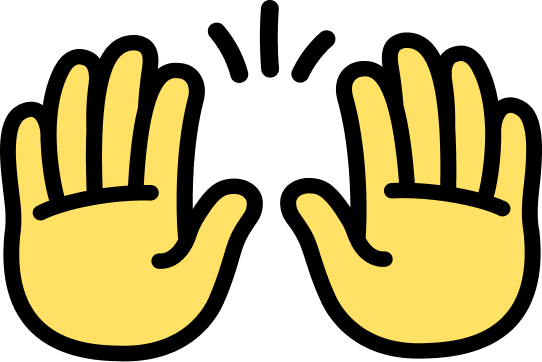
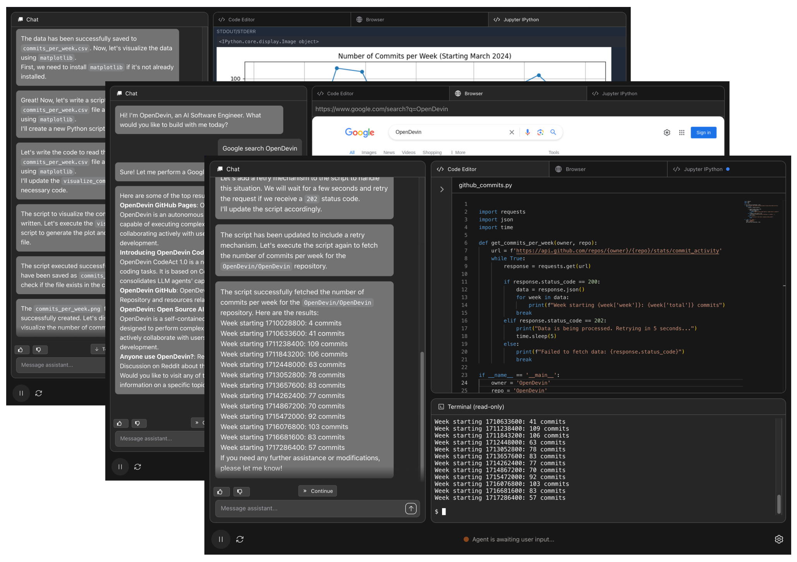

<a name="readme-top"></a>

<div align="center">
  
  <h1 align="center">NEOS</h1>
</div>

Welcome to NEOS, a platform for software development agents powered by AI.

NEOS agents can do anything a human developer can: modify code, run commands, browse the web, call APIs, and yes—even copy code snippets from StackOverflow.



## 💻 Running OpenHands Locally

### Option 1: CLI Launcher (Recommended)

The easiest way to run OpenHands locally is using the CLI launcher with [uv](https://docs.astral.sh/uv/). This provides better isolation from your current project's virtual environment and is required for OpenHands' default MCP servers.

**Install uv** (if you haven't already):

See the [uv installation guide](https://docs.astral.sh/uv/getting-started/installation/) for the latest installation instructions for your platform.

**Launch OpenHands**:
```bash
# Launch the GUI server
uvx --python 3.12 --from openhands-ai openhands serve

# Or launch the CLI
uvx --python 3.12 --from openhands-ai openhands
```

You'll find OpenHands running at [http://localhost:3000](http://localhost:3000) (for GUI mode)!

### Option 2: Docker

<details>
<summary>Click to expand Docker command</summary>

You can also run OpenHands directly with Docker:

```bash
docker pull docker.all-hands.dev/all-hands-ai/runtime:0.54-nikolaik

docker run -it --rm --pull=always \
    -e SANDBOX_RUNTIME_CONTAINER_IMAGE=docker.all-hands.dev/all-hands-ai/runtime:0.54-nikolaik \
    -e LOG_ALL_EVENTS=true \
    -v /var/run/docker.sock:/var/run/docker.sock \
    -v ~/.openhands:/.openhands \
    -p 3000:3000 \
    --add-host host.docker.internal:host-gateway \
    --name openhands-app \
    docker.all-hands.dev/all-hands-ai/openhands:0.54
```

</details>

> **Note**: If you used OpenHands before version 0.44, you may want to run `mv ~/.openhands-state ~/.openhands` to migrate your conversation history to the new location.

> [!WARNING]
> On a public network? See our [Hardened Docker Installation Guide](https://docs.all-hands.dev/usage/runtimes/docker#hardened-docker-installation)
> to secure your deployment by restricting network binding and implementing additional security measures.

### Getting Started

When you open the application, you'll be asked to choose an LLM provider and add an API key.
[Anthropic's Claude Sonnet 4](https://www.anthropic.com/api) (`anthropic/claude-sonnet-4-20250514`)
works best, but you have [many options](https://docs.all-hands.dev/usage/llms).

See the [Running OpenHands](https://docs.all-hands.dev/usage/installation) guide for
system requirements and more information.

## 💡 Other ways to run OpenHands

> [!WARNING]
> OpenHands is meant to be run by a single user on their local workstation.
> It is not appropriate for multi-tenant deployments where multiple users share the same instance. There is no built-in authentication, isolation, or scalability.
>
> If you're interested in running OpenHands in a multi-tenant environment, check out the source-available, commercially-licensed
> [OpenHands Cloud Helm Chart](https://github.com/all-Hands-AI/OpenHands-cloud)

You can [connect OpenHands to your local filesystem](https://docs.all-hands.dev/usage/runtimes/docker#connecting-to-your-filesystem),
interact with it via a [friendly CLI](https://docs.all-hands.dev/usage/how-to/cli-mode),
run OpenHands in a scriptable [headless mode](https://docs.all-hands.dev/usage/how-to/headless-mode),
or run it on tagged issues with [a github action](https://docs.all-hands.dev/usage/how-to/github-action).

Visit [Running OpenHands](https://docs.all-hands.dev/usage/installation) for more information and setup instructions.

If you want to modify the OpenHands source code, check out [Development.md](https://github.com/All-Hands-AI/OpenHands/blob/main/Development.md).

Having issues? The [Troubleshooting Guide](https://docs.all-hands.dev/usage/troubleshooting) can help.

## 📖 Documentation
  <a href="https://deepwiki.com/All-Hands-AI/OpenHands"></a>

To learn more about the project, and for tips on using OpenHands,
check out our [documentation](https://docs.all-hands.dev/usage/getting-started).

There you'll find resources on how to use different LLM providers,
troubleshooting resources, and advanced configuration options.

## 🤝 How to Join the Community

OpenHands is a community-driven project, and we welcome contributions from everyone. We do most of our communication
through Slack, so this is the best place to start, but we also are happy to have you contact us on Discord or Github:

- [Join our Slack workspace](https://join.slack.com/t/openhands-ai/shared_invite/zt-3847of6xi-xuYJIPa6YIPg4ElbDWbtSA) - Here we talk about research, architecture, and future development.
- [Join our Discord server](https://discord.gg/ESHStjSjD4) - This is a community-run server for general discussion, questions, and feedback.
- [Read or post Github Issues](https://github.com/All-Hands-AI/OpenHands/issues) - Check out the issues we're working on, or add your own ideas.

See more about the community in [COMMUNITY.md](./COMMUNITY.md) or find details on contributing in [CONTRIBUTING.md](./CONTRIBUTING.md).

## 📈 Progress

See the monthly OpenHands roadmap [here](https://github.com/orgs/All-Hands-AI/projects/1) (updated at the maintainer's meeting at the end of each month).

<p align="center">
  <a href="https://star-history.com/#All-Hands-AI/OpenHands&Date">
    
  </a>
</p>

## 📜 License

Distributed under the MIT License. See [`LICENSE`](./LICENSE) for more information.

## 🙏 Acknowledgements

OpenHands is built by a large number of contributors, and every contribution is greatly appreciated! We also build upon other open source projects, and we are deeply thankful for their work.

For a list of open source projects and licenses used in OpenHands, please see our [CREDITS.md](./CREDITS.md) file.

## 📚 Cite

```
@inproceedings{
  wang2025openhands,
  title={OpenHands: An Open Platform for {AI} Software Developers as Generalist Agents},
  author={Xingyao Wang and Boxuan Li and Yufan Song and Frank F. Xu and Xiangru Tang and Mingchen Zhuge and Jiayi Pan and Yueqi Song and Bowen Li and Jaskirat Singh and Hoang H. Tran and Fuqiang Li and Ren Ma and Mingzhang Zheng and Bill Qian and Yanjun Shao and Niklas Muennighoff and Yizhe Zhang and Binyuan Hui and Junyang Lin and Robert Brennan and Hao Peng and Heng Ji and Graham Neubig},
  booktitle={The Thirteenth International Conference on Learning Representations},
  year={2025},
  url={https://openreview.net/forum?id=OJd3ayDDoF}
}
```
