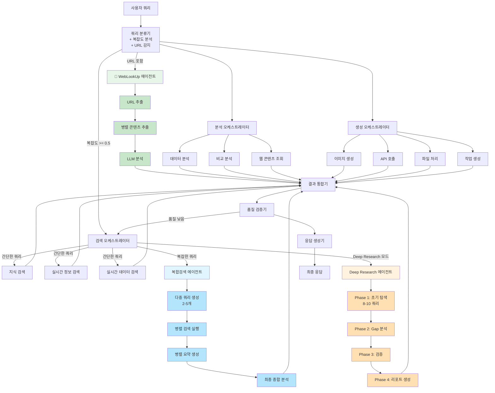

# NEOS 시스템 아키텍처

## 📐 개요

NEOS는 LangGraph 기반의 멀티 에이전트 AI 시스템으로, 복잡한 쿼리를 여러 전문 에이전트가 협력하여 처리합니다.

## 🏗️ 전체 시스템 구조



## 🎯 핵심 컴포넌트

### 1. 쿼리 분류기 (Query Classifier)
- **역할**: 사용자 쿼리 분석 및 적절한 에이전트 선택
- **기능**:
  - 언어 감지
  - 복잡도 분석 (0.0-1.0)
  - URL 감지 및 추출
  - 의도 분류
- **출력**: 필요한 에이전트 목록 및 메타데이터

### 2. 검색 오케스트레이터 (Search Orchestrator)
- **역할**: 검색 에이전트들의 병렬 실행 관리
- **지원 에이전트**:
  - Knowledge Search (지식 기반)
  - Realtime Info Search (실시간 정보)
  - Realtime Data Search (실시간 데이터)
  - Multi-Query Search (복합 검색)
  - Deep Research (심층 조사)
  - WebLookUp (URL 콘텐츠 추출)
- **최적화**:
  - MCP 도구 통합
  - 결과 중복 제거
  - 캐싱 (1800초 TTL)

### 3. 분석 오케스트레이터 (Analysis Orchestrator)
- **역할**: 수집된 데이터 분석
- **지원 에이전트**:
  - Data Analysis (데이터 분석)
  - Comparative Analysis (비교 분석)
  - Web Content Analysis (웹 콘텐츠 분석)

### 4. 생성 오케스트레이터 (Generation Orchestrator)
- **역할**: 콘텐츠 생성 및 API 호출
- **지원 에이전트**:
  - Image Generation (이미지 생성)
  - API Call (외부 API)
  - File Processing (파일 처리)
  - Task Creation (작업 생성)

### 5. 결과 통합기 (Result Processor)
- **역할**: 여러 에이전트 결과 통합
- **기능**:
  - 결과 병합 및 정규화
  - 중요도 기반 정렬
  - 메타데이터 통합

### 6. 품질 검증기 (Quality Validator)
- **역할**: 응답 품질 평가 및 재처리 트리거
- **평가 기준**:
  - 완전성
  - 관련성
  - 정확성
- **임계값**: 0.4 (최소 품질 점수)
- **재시도**: 최대 2회

### 7. 응답 생성기 (Response Generator)
- **역할**: 최종 사용자 응답 생성
- **기능**:
  - 자연어 응답 생성
  - 인용 및 소스 포함
  - 다국어 지원

## 🔄 워크플로우 실행 흐름

### 1. 간단한 정보 검색
```
사용자 쿼리 → 쿼리 분류 → 검색 실행 → 결과 통합 → 응답 생성
소요 시간: 2-5초
```

### 2. 복잡한 분석
```
사용자 쿼리 → 복잡도 분석 (≥0.5) → 복합검색 → 병렬 처리 → 종합 분석 → 응답
소요 시간: 10-30초
```

### 3. Deep Research
```
사용자 쿼리 → Deep Research 선택 → 4단계 탐색 → 검증 → 리포트 생성
소요 시간: 15-30분
```

### 4. URL 콘텐츠 분석
```
URL 쿼리 → URL 감지 → WebLookUp 선택 → 콘텐츠 추출 → LLM 분석 → 응답
소요 시간: 5-15초 (정적) / 10-30초 (동적)
```

## 🛠️ 기술 스택

### 핵심 프레임워크
- **FastAPI**: 비동기 웹 프레임워크
- **LangGraph**: 상태 기반 에이전트 워크플로우
- **CrewAI**: 협력적 AI 에이전트 시스템

### 데이터베이스 & 캐싱
- **PostgreSQL + pgvector**: 벡터 임베딩 지원
- **Redis**: 고성능 캐싱 (TTL 기반)

### AI 서비스
- **OpenAI GPT-4**: 언어 모델 및 임베딩
- **OpenAI DALL-E 3**: 이미지 생성
- **Tavily**: 실시간 웹 검색

### 도구 & 라이브러리
- **aiohttp**: 비동기 HTTP 클라이언트
- **BeautifulSoup4**: HTML 파싱
- **Playwright**: 동적 페이지 렌더링
- **SQLAlchemy**: 비동기 ORM
- **Pydantic**: 데이터 검증

## 📊 성능 특성

### 캐싱 전략
| 유형 | TTL | 용도 |
|------|-----|------|
| 검색 결과 | 30분 | 중복 검색 방지 |
| 임베딩 | 24시간 | 쿼리 임베딩 재사용 |
| 세션 | 1시간 | 사용자 세션 유지 |

### 타임아웃 설정
| 작업 | 타임아웃 |
|------|---------|
| 단일 검색 | 30초 |
| 복합 검색 | 10분 |
| Deep Research | 30분 |
| WebLookUp (정적) | 30초 |
| WebLookUp (동적) | 60초 |

### 병렬 처리
- 검색 에이전트: 동시 실행
- 요약 생성: asyncio.gather 사용
- URL 다운로드: 병렬 (정적) / 순차 (동적)

## 🔐 보안 고려사항

### API 키 관리
- 환경 변수로 관리
- 설정 파일 암호화
- 키 로테이션 지원

### 입력 검증
- 쿼리 길이 제한 (10,000자)
- URL 유효성 검증
- SQL 인젝션 방지
- XSS 공격 방지

### 데이터베이스 보안
- 연결 풀 관리
- 사용자별 권한 설정
- 민감 정보 암호화

## 📈 확장성

### 수평 확장
- Docker/Kubernetes 지원
- 상태 비저장 API 설계
- Redis를 통한 세션 공유

### 성능 최적화
- 연결 풀링
- 벡터 검색 인덱스
- 쿼리 결과 캐싱
- 비동기 I/O

## 🔗 관련 문서

- [WebLookUp Agent 상세](./WEB_LOOKUP_AGENT.md)
- [Deep Research 가이드](./DEEP_RESEARCH_GUIDE.md)
- [API 문서](./API_REFERENCE.md)
- [CLI 가이드](./CLI_GUIDE.md)
