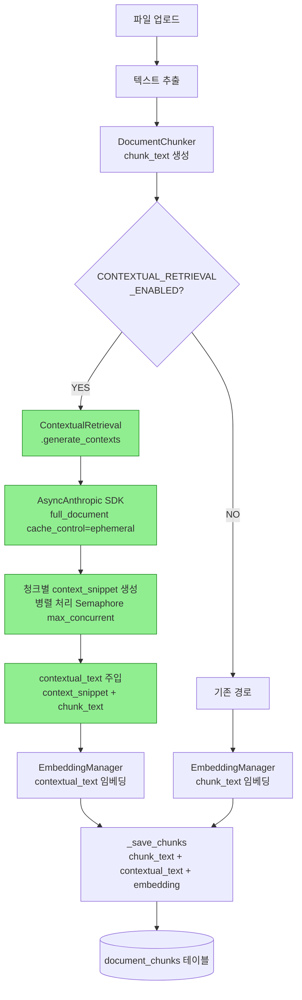
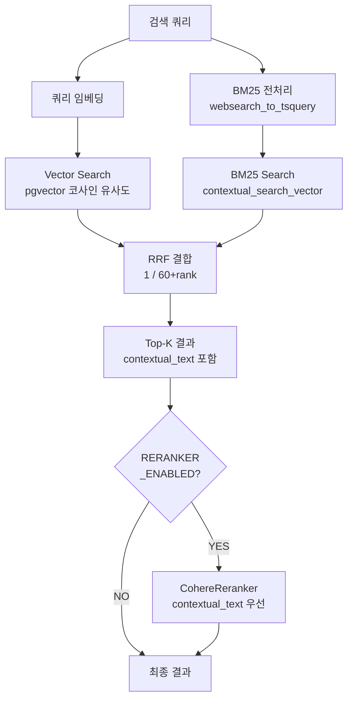

# Contextual Retrieval

**버전:** 1.0
**작성일:** 2026-03-15
**대상 시스템:** NEOS v0.22.0+
**관련 문서:** `docs/CONTEXTUAL_RETRIEVAL_PLAN.md`, `docs/CONTEXTUAL_RETRIEVAL_IMPLE.md`

---

## 목차

1. [개요](#1-개요)
2. [기술 원리](#2-기술-원리)
3. [NEOS 통합 아키텍처](#3-neos-통합-아키텍처)
4. [핵심 컴포넌트](#4-핵심-컴포넌트)
5. [데이터 흐름](#5-데이터-흐름)
6. [설정 참조](#6-설정-참조)
7. [비용 모델](#7-비용-모델)
8. [DB 스키마](#8-db-스키마)
9. [운영 및 모니터링](#9-운영-및-모니터링)
10. [알려진 특성 및 한계](#10-알려진-특성-및-한계)

---

## 1. 개요

**Contextual Retrieval**은 Anthropic이 발표한 RAG(Retrieval-Augmented Generation) 개선 기법이다. 문서를 청크로 분할할 때 각 청크가 전체 문서의 어떤 위치·맥락에 있는지를 LLM이 1~2문장으로 자동 생성하여 청크 앞에 붙인 뒤 임베딩한다.
참조: https://platform.claude.com/cookbook/capabilities-contextual-embeddings-guide

```
[기존]  chunk_text                              → 임베딩
[이후]  context_snippet + "\n\n" + chunk_text  → 임베딩
         (= contextual_text)
```

기존 RAG에서 청크는 문서에서 분리되는 순간 문맥을 잃는다. 예를 들어, "해당 조건이 충족될 경우 계약은 종료된다"는 청크는 어떤 계약·조항인지를 담지 않으면 검색 정확도가 낮아진다. Contextual Retrieval은 LLM이 생성한 컨텍스트 설명을 청크 앞에 붙여 이 문제를 해결한다.

### 1.1 기대 개선 효과 (Anthropic 실험 기준)

| 구성 | 검색 실패율 감소 | Top-5 정확도 |
|---|---|---|
| Baseline RAG | 기준선 | 80.92% |
| **Phase 1:** + Contextual Embedding | **–35%** | 88.12% |
| **Phase 1+2:** + Contextual BM25 | **–67%** | 88.86% |
| **Phase 1+2+3:** + Reranking | **–70%+** | 92.15% |

> **주의:** 위 수치는 Anthropic의 영어 문서 벤치마크 기준이다. 한국어 혼합 환경에서는 별도 평가가 필요하다.

### 1.2 구현 상태

NEOS v0.22.0에서 3개 Phase 모두 구현 완료:

| Phase | 내용 | 상태 |
|---|---|---|
| Phase 1 | Contextual Embedding — 청크별 컨텍스트 생성 + contextual_text 임베딩 | ✅ 완료 |
| Phase 2 | Contextual Hybrid Search — BM25 + Vector + RRF | ✅ 완료 |
| Phase 3 | Reranking — Cohere Reranker가 contextual_text 우선 사용 | ✅ 완료 |

---

## 2. 기술 원리

### 2.1 컨텍스트 생성 프롬프트

Anthropic이 공개한 컨텍스트 생성 프롬프트 구조:

```
<document>
{전체 문서 텍스트}
</document>

Here is the chunk we want to situate within the whole document:

<chunk>
{청크 텍스트}
</chunk>

Please give a short succinct context to situate this chunk within the overall document
for the purposes of improving search retrieval of the chunk.
Answer only with the succinct context and nothing else.
```

**생성 예시:**

원본 청크:
```
The defendant shall pay liquidated damages of $10,000 per day for each day of delay.
```

생성된 컨텍스트 (`context_snippet`):
```
This chunk is from Section 8 (Penalties and Liquidated Damages) of a construction
contract between ABC Corp and XYZ Builders, specifying financial consequences for delays.
```

최종 임베딩 텍스트 (`contextual_text`):
```
This chunk is from Section 8 (Penalties and Liquidated Damages) of a construction
contract between ABC Corp and XYZ Builders, specifying financial consequences for delays.

The defendant shall pay liquidated damages of $10,000 per day for each day of delay.
```

### 2.2 Anthropic Prompt Caching

Contextual Retrieval의 핵심 비용 절감 원리는 **Prompt Caching**이다. 문서 전체를 매 청크마다 전송하지 않고, 첫 번째 청크 처리 시 전체 문서를 5분짜리 임시 캐시에 저장한 뒤 이후 청크들은 캐시된 문서를 참조한다.

API 요청 시 `full_document` 블록에만 `cache_control`을 지정한다:

```python
content=[
    {
        "type": "text",
        "text": f"<document>\n{full_document}\n</document>\n\n",
        "cache_control": {"type": "ephemeral"},  # 전체 문서 캐시 (5분 TTL)
    },
    {
        "type": "text",
        "text": f"<chunk>\n{chunk_text}\n</chunk>\n\n...",
        # 청크마다 달라지므로 캐시하지 않음
    },
]
```

| 청크 순서 | 처리 방식 | 문서 토큰 단가 |
|---|---|---|
| 첫 번째 청크 | Cache Write | $1.00 / MTok |
| 2번째 이후 청크 | Cache Read | $0.08 / MTok **(90% 절감)** |

- 캐시 유효 시간: 5분 (동일 문서의 수십~수백 개 청크 처리에 충분)
- Anthropic 내부 테스트: 737 청크 처리 시 캐싱 없이 ~$9.20 → 캐싱 적용 후 ~$2.85 (69% 절감)

### 2.3 LangChain 대신 Anthropic SDK 직접 사용

NEOS의 `LLMFactory`는 `langchain_anthropic.ChatAnthropic`을 래핑한다. LangChain의 메시지 추상화는 content 블록 수준의 `cache_control`을 지원하지 않으므로, `ContextualRetrieval` 모듈은 `anthropic.AsyncAnthropic` SDK를 직접 사용하여 Prompt Caching을 정밀하게 제어한다.

---

## 3. NEOS 통합 아키텍처

### 3.1 전체 파이프라인 (활성화 시)



### 3.2 검색 파이프라인 (Phase 2+3)



### 3.3 변경된 파일 목록

| 파일 | 변경 유형 | 내용 |
|---|---|---|
| `neos/pipelines/document/contextual_retrieval.py` | **신규** | `ContextualRetrieval` 클래스, `ContextualChunk` dataclass |
| `db/migrations/020_add_contextual_retrieval.sql` | **신규** | DB 스키마 확장 |
| `neos/config/settings.py` | 수정 | `CONTEXTUAL_*` 7개 설정 추가 |
| `neos/pipelines/document/chunker.py` | 수정 | `DocumentChunk` dataclass 필드 추가 |
| `neos/database/models.py` | 수정 | `contextual_text` Column 추가 |
| `neos/pipelines/document/document_processor.py` | 수정 | step 8.5 처리 단계 삽입 |
| `neos/services/similarity_search_service.py` | 수정 | `DocumentChunkContextualSearchStrategy` 추가 |
| `neos/services/reranker.py` | 수정 | `contextual_text` 우선 텍스트 추출 |
| `neos/observability/metrics.py` | 수정 | Prometheus 지표 4개 추가 |
| `.env.template` | 수정 | 환경변수 예시 추가 |

---

## 4. 핵심 컴포넌트

### 4.1 `ContextualRetrieval` 클래스

**파일:** `neos/pipelines/document/contextual_retrieval.py`

```
ContextualChunk (dataclass)
  ├── original_chunk: DocumentChunk
  ├── contextual_text: str      ← 임베딩 대상 (context_snippet + "\n\n" + chunk_text)
  ├── context_snippet: str      ← 생성된 컨텍스트 설명만 (extra_metadata에 저장)
  ├── cache_hit: bool
  ├── tokens_used: int
  └── cost_usd: float

ContextualRetrieval
  ├── generate_contexts(full_document, chunks) → List[ContextualChunk]
  ├── _generate_context_for_chunk(full_document, chunk, chunk_index) → ContextualChunk
  └── estimate_cost(num_chunks, avg_doc_tokens, ...) → dict  [static]
```

**주요 동작:**
- `asyncio.Semaphore(max_concurrent)`로 동시 처리 수 제한
- `asyncio.gather(*tasks, return_exceptions=True)`로 개별 청크 실패 시 전체 중단 없이 fallback 처리
- API 응답의 `usage` 필드에서 캐시 히트 여부 및 청크별 비용 산출

**비용 사전 추정:**

```python
from neos.pipelines.document.contextual_retrieval import ContextualRetrieval

estimate = ContextualRetrieval.estimate_cost(
    num_chunks=50,
    avg_doc_tokens=50_000,
    avg_chunk_tokens=1_000,
    context_tokens=100,
)
# {'without_caching_usd': 2.06, 'with_caching_usd': 0.31, 'savings_pct': 85.0, ...}
```

### 4.2 `DocumentChunkContextualSearchStrategy`

**파일:** `neos/services/similarity_search_service.py`

BM25 + Vector + Reciprocal Rank Fusion(RRF) 하이브리드 검색 전략. `strategy="document_chunk_contextual"`로 활성화한다.

```python
results = await similarity_search_service.search(
    query="쿼리 텍스트",
    strategy="document_chunk_contextual",
    document_ids=[1, 2, 3],   # 권한 필터링 필수
    top_k=10,
)
```

반환 구조:

```python
{
    "chunk_id": int,
    "chunk_text": str,
    "contextual_text": str | None,
    "document_id": int,
    "chunk_index": int,
    "combined_score": float,      # vector_rrf + bm25_rrf
    "search_type": "contextual_hybrid_rrf",
}
```

SQL 구조: `WITH vector_results AS ... bm25_results AS ... combined AS ...` CTE 형태로 두 결과를 `FULL OUTER JOIN` 후 RRF 스코어(`1.0 / (60 + rank)`)로 정렬한다.

### 4.3 Reranker 연동

**파일:** `neos/services/reranker.py:74-80`

`CohereReranker.rerank()`의 문서 텍스트 추출 우선순위:

```
contextual_text → content → query_text → title → ""
```

`DocumentChunkContextualSearchStrategy` 결과를 직접 전달하면 자동으로 `contextual_text` 기반 재랭킹이 적용된다.

### 4.4 Prometheus 지표

**파일:** `neos/observability/metrics.py`

| 지표 이름 | 타입 | 레이블 | 설명 |
|---|---|---|---|
| `contextual_retrieval_chunks_total` | Counter | `status` (success/fallback) | 처리된 청크 수 |
| `contextual_retrieval_cache_hits_total` | Counter | — | Anthropic Cache 히트 횟수 |
| `contextual_retrieval_cost_usd_total` | Counter | — | API 호출 누적 비용 (USD) |
| `contextual_retrieval_duration_seconds` | Histogram | — | 문서 전체 처리 소요 시간 |

`contextual_retrieval.py`에서 lazy import(`try/except`)로 메트릭을 기록하므로, 메트릭 오류가 파이프라인을 중단시키지 않는다.

---

## 5. 데이터 흐름

### 5.1 인덱싱 흐름 (Phase 1)

```
파일 업로드
    │
    ▼
DocumentProcessor.process_document()
    │
    ├─ [step 7]  텍스트 추출 → text_content
    │
    ├─ [step 8]  DocumentChunker.chunk_text() → List[DocumentChunk]
    │              (contextual_text=None, context_snippet=None)
    │
    ├─ [step 8.5] ContextualRetrieval.generate_contexts()  ← ENABLED=true 시
    │              │
    │              ├─ max_chunks_per_doc 초과분 사전 분리 (즉시 fallback 예약)
    │              │
    │              ├─ asyncio.gather() — Semaphore(max_concurrent)
    │              │     └─ _generate_context_for_chunk() per chunk
    │              │           └─ AsyncAnthropic.messages.create()
    │              │                 ├─ full_document: cache_control=ephemeral
    │              │                 └─ chunk_text: 일반 입력
    │              │
    │              ├─ budget_cap 초과 시 이후 결과 fallback
    │              └─ Prometheus 지표 기록
    │
    │              → chunks[i].contextual_text, context_snippet 주입
    │
    ├─ [step 9]  EmbeddingManager.embed_batch(contextual_text 또는 chunk_text)
    │
    └─ [step 10] _save_chunks() → document_chunks 테이블
                    ├─ chunk_text
                    ├─ contextual_text
                    └─ extra_metadata.contextual_retrieval_applied
```

### 5.2 검색 흐름 (Phase 2+3)

```
검색 쿼리
    │
    ▼
SimilaritySearchService.search(strategy="document_chunk_contextual")
    │
    ├─ EmbeddingManager.get_embedding(query) → query_embedding
    │
    └─ DocumentChunkContextualSearchStrategy.search()
           │
           ├─ Vector Search: embedding <=> query_embedding (pgvector)
           ├─ BM25 Search: contextual_search_vector @@ tsquery
           └─ RRF 결합 → Top-K 결과 (contextual_text 포함)
                │
                ▼ (RERANKER_ENABLED=true 시)
           CohereReranker.rerank()
                └─ contextual_text 우선 → Cohere cross-encoder 스코어링
                        │
                        ▼
                   최종 결과 반환
```

---

## 6. 설정 참조

`neos/config/settings.py` 및 `.env.template`:

| 설정명 | 기본값 | 설명 |
|---|---|---|
| `CONTEXTUAL_RETRIEVAL_ENABLED` | `false` | 기능 전체 on/off |
| `CONTEXTUAL_MODEL` | `claude-haiku-4-5-20251001` | 컨텍스트 생성 모델 (Haiku 권장) |
| `CONTEXTUAL_MAX_TOKENS` | `200` | 생성 최대 토큰 수 (1~2문장 = 80~150 토큰) |
| `CONTEXTUAL_MAX_CONCURRENT` | `3` | 동시 처리 청크 수 (속도 vs. Rate Limit 균형) |
| `CONTEXTUAL_MAX_CHUNKS_PER_DOC` | `200` | 문서당 최대 처리 청크 수 (비용 선제 통제) |
| `CONTEXTUAL_BUDGET_CAP_USD` | `0.10` | 문서당 비용 상한 (USD) |
| `CONTEXTUAL_EMBED_SOURCE` | `contextual` | 임베딩 소스 (`contextual` / `original`) |

**활성화 예시 (`.env`):**

```bash
CONTEXTUAL_RETRIEVAL_ENABLED=true
CONTEXTUAL_MODEL=claude-haiku-4-5-20251001
CONTEXTUAL_MAX_TOKENS=200
CONTEXTUAL_MAX_CONCURRENT=3
CONTEXTUAL_MAX_CHUNKS_PER_DOC=200
CONTEXTUAL_BUDGET_CAP_USD=0.10
CONTEXTUAL_EMBED_SOURCE=contextual
```

> `CONTEXTUAL_EMBED_SOURCE`는 현재 설정으로만 저장되며, 실제 임베딩 소스 선택은 `DocumentProcessor`의 `enable_contextual_retrieval` 플래그로 제어된다. 향후 "컨텍스트 생성은 하되 임베딩은 원본 사용" 시나리오를 위한 확장 포인트다.

---

## 7. 비용 모델

### 7.1 토큰 단가 (Haiku 4.5 기준)

| 토큰 종류 | 단가 |
|---|---|
| 입력 (일반) | $0.80 / MTok |
| 캐시 쓰기 (Cache Write) | $1.00 / MTok |
| 캐시 읽기 (Cache Read) | $0.08 / MTok |
| 출력 | $4.00 / MTok |

### 7.2 시나리오별 비용 비교

**문서 1개, 50K 토큰, 청크 50개, 청크당 1K 토큰, 컨텍스트 100 토큰 기준:**

| 처리 방식 | 비용 | 절감율 |
|---|---|---|
| 캐싱 없음 | $2.06 | 기준선 |
| **캐싱 적용** | **$0.31** | **85% 절감** |

### 7.3 NEOS 운영 예상 비용 (월 1,000건 처리 시)

| 문서 규모 | 평균 토큰 | 평균 청크 수 | 월 예상 비용 |
|---|---|---|---|
| 소규모 | 10K | 10개 | ~$0.50 |
| 중규모 | 50K | 50개 | ~$5.00 |
| 대규모 | 200K | 200개 | ~$40.00 |

### 7.4 비용 통제 메커니즘

두 가지 독립적인 레이어가 협력한다:

**레이어 1 — `CONTEXTUAL_MAX_CHUNKS_PER_DOC` (사전 슬라이싱):**

API 호출 전에 처리 대상 청크를 잘라낸다. 비용이 명확한 상한에 수렴하며, 문서 앞부분(일반적으로 더 중요한 부분)에 우선적으로 컨텍스트가 생성된다. 엄격한 비용 통제가 필요할 때 주로 조정하는 설정이다.

**레이어 2 — `CONTEXTUAL_BUDGET_CAP_USD` (처리 중 누적 비용 체크):**

`asyncio.gather()` 완료 후 결과 수집 단계에서 누적 비용을 확인한다. 비용 상한 초과 시점 이후의 결과들을 fallback으로 처리한다. 예상치 못한 과금에 대한 안전망 역할을 한다.

**Fallback 동작:**

비용 초과 또는 API 실패 시 해당 청크는 `contextual_text = chunk_text`(원본 텍스트 그대로), `context_snippet = ""`으로 처리된다. 임베딩도 `chunk_text` 기반으로 이루어져 기존 RAG와 동일하게 동작한다.

---

## 8. DB 스키마

### 8.1 추가된 컬럼 (`document_chunks` 테이블)

| 컬럼명 | 타입 | 설명 |
|---|---|---|
| `contextual_text` | `TEXT` | context_snippet + "\n\n" + chunk_text (임베딩 소스) |
| `contextual_search_vector` | `tsvector` | BM25 검색용 (트리거가 자동 관리) |

### 8.2 트리거

INSERT 또는 `chunk_text`/`contextual_text` UPDATE 시 `contextual_search_vector`가 자동 갱신된다. `contextual_text`가 있으면 그것으로, 없으면 `chunk_text`로 tsvector를 생성하므로 기존 청크도 BM25 검색 대상이 된다.

### 8.3 인덱스

| 인덱스 | 용도 |
|---|---|
| `idx_document_chunks_contextual_fts` (GIN) | BM25 검색 성능 |
| `idx_document_chunks_has_contextual` (partial) | contextual_text 있는 청크만 필터링 |

### 8.4 마이그레이션 실행

```bash
psql $DATABASE_URL -f db/migrations/020_add_contextual_retrieval.sql
```

### 8.5 롤백

```sql
DROP TRIGGER IF EXISTS chunk_contextual_search_vector_trigger ON document_chunks;
DROP FUNCTION IF EXISTS update_chunk_contextual_search_vector();
DROP INDEX IF EXISTS idx_document_chunks_contextual_fts;
DROP INDEX IF EXISTS idx_document_chunks_has_contextual;
ALTER TABLE document_chunks DROP COLUMN IF EXISTS contextual_search_vector;
ALTER TABLE document_chunks DROP COLUMN IF EXISTS contextual_text;
```

---

## 9. 운영 및 모니터링

### 9.1 애플리케이션 로그

정상 동작 시 아래 패턴의 로그가 출력된다:

```
[ContextualRetrieval] 시작: 50개 청크 처리, model=claude-haiku-4-5-20251001
[ContextualRetrieval] 완료: cache_hits=47/50, 총 비용=$0.003142, 소요=28.3s
```

`max_concurrent=3`(기본값) 환경에서 `cache_hits=47/50` 수준이면 정상이다. 처음 3개 청크는 캐시 미스가 발생하며 이는 정상 동작이다.

### 9.2 Prometheus 지표 확인

```bash
curl http://localhost:9090/metrics | grep contextual_retrieval
```

기대 출력:
```
contextual_retrieval_chunks_total{status="success"} 47.0
contextual_retrieval_chunks_total{status="fallback"} 3.0
contextual_retrieval_cache_hits_total 44.0
contextual_retrieval_cost_usd_total 0.003142
contextual_retrieval_duration_seconds_bucket{le="30.0"} 1.0
```

### 9.3 인덱싱 검증 쿼리

문서 처리 후 `contextual_text` 적용 여부 확인:

```sql
SELECT
    chunk_index,
    LENGTH(chunk_text)        AS chunk_len,
    LENGTH(contextual_text)   AS ctx_len,
    contextual_text IS NOT NULL AS has_context,
    (extra_metadata->>'context_snippet')::text AS snippet_preview
FROM document_chunks
WHERE document_id = <TEST_DOC_ID>
ORDER BY chunk_index
LIMIT 10;
```

### 9.4 검색 기능 검증

```python
from neos.services.similarity_search_service import similarity_search_service

results = await similarity_search_service.search(
    query="테스트 쿼리",
    strategy="document_chunk_contextual",
    document_ids=[1],
    top_k=5,
)
for r in results:
    print(r["combined_score"], r.get("contextual_text", "")[:80])
```

### 9.5 기법별 적용 권고

| 요구사항 | 권장 구성 | 예상 정확도 |
|---|---|---|
| 비용 최소화, 빠른 검색 | Phase 1 (Contextual Embedding만) | ~92% |
| 비용-성능 균형 | Phase 1+2 (Hybrid BM25 추가) | ~95% |
| 최대 정확도 | Phase 1+2+3 (Reranking 포함) | ~97% |

---

## 10. 알려진 특성 및 한계

### 10.1 초기 캐시 미스 (정상 동작)

`max_concurrent=3`(기본값) 환경에서 처음 3개 청크가 동시에 실행된다. 이 3개는 모두 캐시 미스(Cache Write)가 발생하며, 4번째 청크부터 캐시 히트가 기대된다. `max_concurrent=1`로 설정하면 첫 청크만 캐시 미스가 발생하지만 처리 속도가 크게 떨어진다.

### 10.2 Budget Cap의 사후 체크 특성

`asyncio.gather()`는 모든 태스크를 동시에 제출하므로, `CONTEXTUAL_BUDGET_CAP_USD`에 의한 비용 초과 감지는 결과 수집 단계에서 이루어진다. 이미 완료된 API 호출 결과는 사용하고, 그 시점 이후의 결과들을 fallback으로 처리한다. 엄격한 비용 선제 통제가 필요하다면 `CONTEXTUAL_MAX_CHUNKS_PER_DOC`을 보수적으로 설정하는 것이 더 효과적이다.

### 10.3 한국어 BM25 검색 한계

`contextual_search_vector` 생성 시 `to_tsvector('english', ...)` 설정을 사용한다. 한국어 문서에 영어 형태소 분석기가 적용되어 BM25 정확도가 떨어질 수 있다. 한국어 BM25가 필요하다면 PostgreSQL에 `pg_jieba` 계열 확장을 설치하고 마이그레이션 SQL을 수정해야 한다.

### 10.4 `DocumentChunk` 이름 충돌

`neos/pipelines/document/chunker.py`의 `DocumentChunk` (Python dataclass)와 `neos/database/models.py`의 `DocumentChunk` (SQLAlchemy ORM 모델)이 동일한 이름을 사용한다. `document_processor.py`에서는 ORM 인스턴스를 `db_chunk`로 네이밍하여 구분한다.

### 10.5 인덱싱 지연

Contextual Retrieval 활성화 시 문서당 인덱싱 시간이 증가한다:

| 구성 | 추가 지연 |
|---|---|
| Phase 1 (Contextual Embedding) | +30~60초 (청크 100개 기준, max_concurrent=3) |
| Phase 2 (BM25 인덱스) | +5초 이내 |
| Phase 3 (Reranking) | 검색 시 +100~200ms |

비동기 파이프라인이므로 인덱싱 지연이 실시간 사용자 응답에 영향을 주지 않으나, Celery 워커의 작업 큐 처리 시간 예산을 고려해야 한다.
