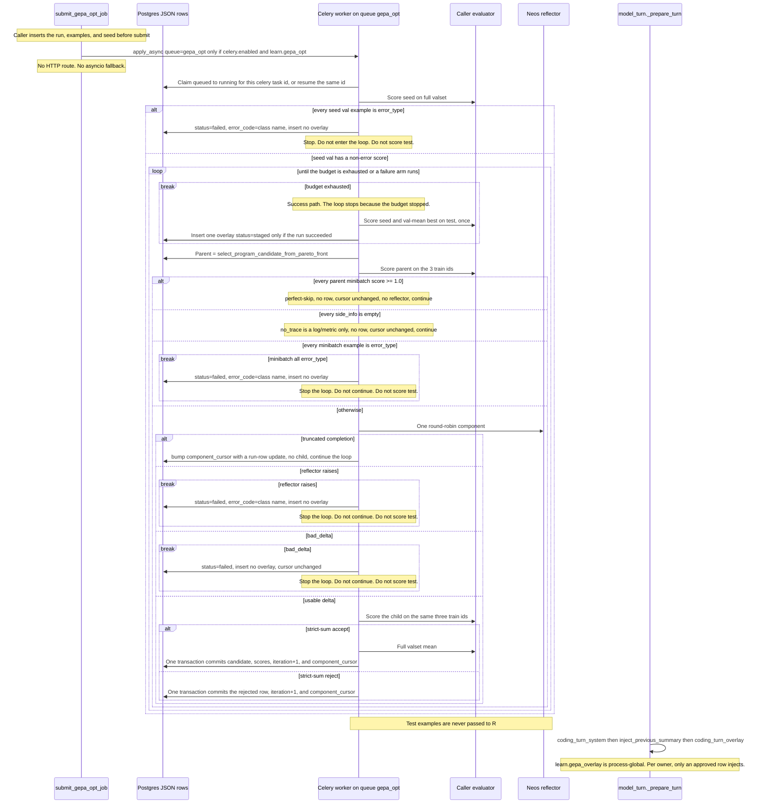

# GEPA self-improvement migration

| Field | Value |
| --- | --- |
| Author | TBD |
| Date | 2026-09-27 |
| Status | Draft |
| Branch | dev |

Audience: Neos engineers. This document specifies a thin in-tree kernel. It does not vendor the GEPA tree, and it does not quote upstream README benchmark figures.

Local reference implementation: `/Users/yeonwoosung/Desktop/gepa`, package `gepa` `0.1.4` (`pyproject.toml:11`). Core dependencies are empty (`pyproject.toml:20`). That checkout is not a Neos dependency.

## Overview

No live loop in Neos evolves prompts. Lessons are a human-gated markdown store. Deep-analysis (DA) scores claims inside one run and hashes prompts without writing them. HyperDeep rewrites report sections. None of those is GEPA.

This design adds `neos/gepa_opt/`: an in-process optimizer whose candidate is `dict[str, str]`, whose evaluator is caller-supplied, and whose reflector is an existing Neos model provider. State is Postgres JSON. The only production side effect in the first surface is a **staged** system-prompt overlay for the coding parent. Injection of that overlay is a separate flag, default off, and requires an explicit human/admin approval. The overlay is not a lesson.

A phase may call itself GEPA only when it runs Pareto parent selection, strict minibatch-sum acceptance, and valset-mean selection. PR2 also ships a one-shot path. That path is stored and logged as `not-gepa`. It is not a GEPA result.

## Background

| Surface | What it does today | Why it is not this kernel |
| --- | --- | --- |
| Learn store | `LessonStatus` is `staged` / `approved` / `archived` (`neos/learn/lessons.py:17-20`). `new_lesson` always sets `STAGED` (`lessons.py:107`). | Promotion is not a search loop. |
| Write gate | `force_stage_on_write` demotes `APPROVED` to `STAGED` when `learn.write_approval` is true (`lessons.py:51-53`). Default is true (`neos/config/schema.py:693`). `add` applies it in memory (`lessons.py:62`) and in Postgres (`neos/learn/postgres.py:49`). | A GEPA write must not demote an already approved overlay. |
| Promotion | `force_stage_on_write` also rewrites `APPROVED` to `STAGED` (`lessons.py:51-53`, `postgres.py:49`), and `update` remains the curator path (`lessons.py:75`, `postgres.py:121-138`). The curator is the production caller and it only archives (`neos/learn/curator.py:1`, `curator.py:69`). No HTTP route approves a lesson. | Do not reuse this path. There is no approver to extend. |
| Extract / curator | Neither calls an LLM (`curator.py:1`). | Reflection does not belong in `neos/learn/`. |
| Coding inject | `coding_turn_system` appends `## Lessons` only when `learn.coding_lessons` is true, the owner is non-empty, and status is approved (`neos/coding/learn_lessons.py:51-52`, `51-55`, `65`, `100-104`). Flag default false (`schema.py:694`). Cap 5 (`learn_lessons.py:19`, `95`). Bodies older than 7 days get a `may be stale` suffix (`learn_lessons.py:20`, `88-89`). | Overlay is a sibling section, not another lesson line. |
| Namespace | `namespace(owner)` is `owner:{id}` unless a workspace id is passed (`neos/learn/policy.py:75-79`). Coding inject calls it with the owner only (`learn_lessons.py:56`). | Overlay keys are `owner:{id}`, not workspace. |
| Clip | `clip_knowledge` cuts to `learn.max_knowledge_chars` (400) (`schema.py:701`, `policy.py:99-104`). `maybe_learn_ltm` clips **on write** (`neos/learn/memory_gate.py:58`). Inject does not clip. | Overlay text is not clipped on write or inject. |
| LTM vs lessons | `maybe_learn_ltm` either stages a `kind="fact"` lesson or writes `long_term_memories`, and returns (`memory_gate.py:53-73`). Tables are `learned_lessons` (`postgres.py:56`) and `long_term_memories` (`neos/memory/long_term.py:57`). | Never dual-write. Never store an overlay in either table. |
| Procedures | `learn.research_procedures` defaults false (`schema.py:696`). The extractor stages `kind="procedure"` (`neos/learn/extract.py:70-75`). Nothing reads those rows into a prompt. | Do not attach GEPA to this dead path. |
| Coding outcome | Terminal task statuses include `completed` / `failed` / `cancelled` (`neos/coding/domain/models.py:20-22`). Verify is a self-reported `PASS` / `FAIL` / `PARTIAL` (`neos/coding/phases.py:10`). `FAIL` is parsed in `phases.py` and stored at `model_turn.py:521-522`, and that store does not transition the task. There is no quality column on the coding task. | Run status and verdict strings are not a fitness function. Nothing in-repo is one. |
| Coding host | `execute_coding_task` runs `run_coding_delivery` inside soft 300s / hard 360s (`neos/coding/workers/celery_tasks.py:46-47`, `50-61`; limits from `neos/config/settings.py:61-65`). The delivery loop calls `advance_one_safe_point` (`neos/coding/workers/execution.py:83`) and, when `advance_until_complete` is false, returns `CONTINUING` after one successful safe point (`execution.py:133-134`). That flag defaults false (`execution.py:46`). `run_coding_delivery` does not set it (`neos/coding/workers/celery_runtime.py:171`). Further attempts stay inside the same 300/360 budget. The execution lease is `CODING_EXECUTION_LEASE_SECONDS`, default 30 (`settings.py:67-69`). The search must not take that lease. | Too short, and the wrong queue, for a search. Do not cite line 83 as the one-step contract. |
| Child stepper | `ChildStepper.step` is one model call or one tool batch (`neos/subagent/stepper.py:93-107`). `max_turns` is 1–8 (`neos/subagent/types.py:100-101`). The child builds its own system string and does not call `coding_turn_system` (`stepper.py:118-125`). | Do not inject the overlay here. |
| Thinking | `_guard_thinking_prefix` hashes the full system string plus the tool list and calls `strip_thinking` when that fingerprint changes (`neos/coding/loop/_durable/model_turn.py:238-267`). An append is still a change. `model_turn.py:190` is the `coding_turn_system` call, and `strip_thinking` is `model_turn.py:261`, invoked at `202`. | An appended overlay strips the same way. Do not weaken the guard. |
| Cache marker | `SYSTEM_PROMPT_DYNAMIC_BOUNDARY` is `<!-- neos:dynamic -->` (`neos/coding/prompts/builder.py:14`) and sits above the session tail (`builder.py:50-59`). `coding_turn_system` appends at the end of that string (`learn_lessons.py:104`). | The overlay appends below the marker, as its own section. |
| DA | `prompt_hashes` reads prompt files and returns a read-only map (`neos/workflow/deep_analysis/manifest.py:45-58`). It does not write them. D19 forbids auto-mutation; L5 is observation plus a golden gate (`neos/workflow/deep_analysis/DECISIONS.md:483-491`, `docs/deep_analysis_l5.md:3-5`). | Subject-prompt search is out of phase 1. `judge.md` and `report_judge.md` stay frozen (`manifest.py:33-35`). |
| Track F | Improvement-loop subagentization / diagnostician-as-spawn is closed (`docs/SUBAGENT_RUNTIME_DESIGN.md:55`). | Do not revive `scripts/deep_analysis_diagnostician.py`. |
| HyperDeep | `rewrite_section_with_improvements` rewrites a report section (`neos/agents/search_agents/hyper_deep_research/iterative_refiner.py:825-838`). `hyper_deep_agent.enabled` defaults false (`schema.py:769-770`). | Not a prompt search. Leave it alone. |
| Jev | Tool-risk banding never loosens `DENY`: a static `DENY` returns immediately (`neos/jev/gate.py:122-133`) and `narrow` takes the stricter of R₀ and the band floor (`neos/jev/banding.py:101-106`). The claim judge is an offline backtest and is not on the role-routing path (`neos/jev/claim_judge.py:1-8`). | Not a fitness function and not a mutation surface. |
| Research harness | Returns a weighted float. No committed train/val/test split. Vacuous without citations. | Not a dataset for this kernel. |
| Graph designer | No redesign loop. | Out of scope. |
| Skill catalogs | Read-only packs. Kebab spawn names in `neos/coding/skills/security-audit.md` are asserted by catalog tests. | No PR in this plan edits those trees. |
| Compaction wording | `COMPACTION_SUMMARY_INSTRUCTION` must not be reworded (`neos/coding/prompts/official.py:19-38`). | Not a candidate component. |
| Celery default | `CeleryConfig.enabled` is false (`schema.py:674-675`). | With Celery off there is no legal host for this job. |
| DA job shape | `run_deep_analysis_job` has its own soft/hard limits, calls `asyncio.run`, and retries with `resume=True` (`neos/tasks/deep_analysis_job_task.py:204-237`). When Celery is off, DA also starts an in-process task (`deep_analysis_job_task.py:5-8`). | Copy the worker shape. Do **not** copy the in-process fallback. |
| GEPA acceptance | Default criterion: minibatch **sum** strictly greater (`/Users/yeonwoosung/Desktop/gepa/src/gepa/strategies/acceptance.py:44-53`). | Same rule, reimplemented. Equal is reject. |
| GEPA selection | Valset score is the mean of per-example scores (`gepa/core/state.py:874-880`). Best candidate is max of those means (`state.py:716`). | Report and stage that candidate, not the minibatch winner. |
| GEPA parent | `select_program_candidate_from_pareto_front` drops dominated programs (`gepa/gepa_utils.py:113-115`) and then draws with frequency equal to the number of surviving val ids a program owns (`gepa_utils.py:116-133`). The score vector is the valset mean of candidates that already have a full val. | On only for a phase labeled GEPA. Reimplement the whole function, not only the frequency loop. |
| GEPA merge | `use_merge` defaults false (`gepa/api.py:68`). A legal merge needs dominators, a common ancestor, and at least one component that differs while one side still matches the ancestor. `merge.py:27-43` and `46-66` are the descendant-edit predicate and the ancestor filter. Dominators are `find_dominator_programs` (`gepa_utils.py:95-104`). | Off. Not implemented. |
| GEPA reflection | Placeholders are only `<curr_param>` and `<side_info>` (`gepa/api.py:159`). Reflective mutation calls `capture_traces=True` (`gepa/proposer/reflective_mutation/reflective_mutation.py:280`). | Fixed template, JSON `side_info`, call the Neos reflector unless every `side_info` is empty or the minibatch is all `>= 1.0`. |
| GEPA engines | `optimize_anything` registers `gepa`, `autoresearch`, `meta_harness`, and `best_of_n` (`gepa/oa/engines/__init__.py:1-12`). `autoresearch` and `meta_harness` spawn `claude` under `bwrap` (`gepa/oa/sandbox.py:1-6`). `gskill` is a Docker SWE fitness helper (`swe_fitness_fn.py:15-16`), not the optimizer. | Do not import `gepa.oa` or `optimize_anything`. |
| GEPA resume | `GEPAState.load` `pickle.load`s `gepa_state.bin` with no restricted unpickler (`gepa/core/state.py:747-751`). | Do not unpickle tenant bytes. Do not write that file. |

## Goals & Non-Goals

**Goals**

- A package `neos/gepa_opt/` that owns types, strict-sum acceptance, Pareto selection, a fixed reflection template, Postgres rows, one Celery task, and one inject function.
- Phase-1 fitness is whatever the caller passes: `fn(candidate, example) -> (float, side_info)`. Higher is better.
- Held-out test scores are computed once after search and stored. They are not inputs to the proposer or the reflector.
- One staged overlay per successful GEPA run. Injection of the single **approved** overlay for that owner, behind `learn.gepa_overlay` (default false).
- Job runs only when `celery.enabled` and `learn.gepa_opt` are both true.

**Non-goals**

- No edit to `learned_lessons`, the curator, `maybe_learn_ltm`, or `coding_turn_system`'s lesson cap.
- No coding-run status, verify verdict, Jev score, HyperDeep section rewrite, or research-harness float as fitness.
- No DA prompt-file writes. `judge.md` and `report_judge.md` stay byte-frozen. Track F stays closed.
- No merge. No `gepa_state.bin`. No litellm. No Claude CLI, Docker, or bwrap. No `execute.v1` host (that tool does not run those binaries unless they are already allowlisted, and this job must not depend on that).
- No vendor-pack edits: `skills/k-skill`, `skills/security-audit`, `skills/financial-services`, `skills/univer`, `neos/coding/skills/security-audit.md`.
- No change to `COMPACTION_SUMMARY_INSTRUCTION`.
- No ChildStepper inject. No API-process loop. No auto-approve. No HTTP route for submit or approve.
- `gskill` is not ported.

## Proposed Design

Package layout (names are stable):

```text
neos/gepa_opt/__init__.py
neos/gepa_opt/types.py          # candidate, splits, statuses, config
neos/gepa_opt/acceptance.py     # strict minibatch sum
neos/gepa_opt/pareto.py         # frequency-weighted parent, valset mean
neos/gepa_opt/reflect.py        # fixed template, two placeholders
neos/gepa_opt/engine.py         # in-process loop, no I/O policy of its own
neos/gepa_opt/evaluators.py     # empty registry until a caller registers one
neos/gepa_opt/store.py          # Postgres JSON read/write
neos/gepa_opt/inject.py         # coding_turn_overlay
neos/tasks/gepa_opt_job_task.py # submit_gepa_opt_job and the Celery task
```

The engine is pure given an evaluator, a reflector, and a clock/rng. The Celery task is the only production caller. Tests drive the engine with fakes.

Search, when `engine_label="gepa"`. This order is the only order. A child does not exist until the reflector returns.

1. Score the seed on the full valset (mean). It is not approved. If every val example is `error_type`, fail the run and do not stage an overlay.
2. Draw a parent with `select_program_candidate_from_pareto_front` (`gepa/gepa_utils.py:107-133`): drop dominated programs (`113-115`), then sample with frequency equal to surviving val-id ownership (`116-133`). The score vector is the valset mean of candidates that already have a full val.
3. Draw `MINIBATCH_SIZE = 3` examples from **train** only (upstream `reflection_minibatch_size` default, `gepa/api.py:157`, `370`). Score the **parent** on those ids. Capture `side_info`. One example must not escape the loop: record `0.0` and `{"error_type": "<ClassName>"}` with no exception string.
4. If every minibatch example is `error_type`, fail the run with `error_code` set to that class name and do not stage an overlay. A minority of bad examples stays `0.0` and the sum still runs. If every `side_info` is empty, do not call the reflector; log `no_trace` as a metric only, write no candidate row, and do not advance the cursor.
5. Otherwise reflect **one** component. Order is round-robin over `sorted(parent)`. The index is `component_cursor % len(sorted(parent))` (divergence in Loop pins). The reflector receives that name, `<curr_param>` (the current text), and `<side_info>`. It returns `component_name` plus a one-key `dict[str, str]` delta, and token usage. The child is the parent with that one key replaced. A delta that is not exactly `{component_name: new_text}` fails the run (`bad_delta`) with no overlay. A reflector exception fails the run with `error_code` set to the exception class name and no overlay.
6. Score the **child** on the same train ids. Accept iff `len(before)==len(after)`, both non-empty, and `sum(after) > sum(before)`. Otherwise reject. This matches `StrictImprovementAcceptance` (`acceptance.py:50-53`) and also rejects a length mismatch.
7. On accept, score the child on the full valset and update the front. Best is the max valset mean, not the last accept.
8. After the budget stops, score the seed and the best candidate on **test** once. Do not reflect again.
9. Insert one **staged** overlay whose body is the best candidate's components, only if the run succeeded. Leave any already approved overlay in place. A failed run inserts nothing.

`max_evals` counts evaluator calls only. `max_token_cost` counts reflector `input_tokens + output_tokens` from the usage object the reflector returns (the same two fields as `ModelUsage` in `neos/coding/model/base.py:45-47`). Do not add `cache_read_tokens`, `cache_write_tokens`, or `reasoning_tokens`. `reasoning_tokens` is already inside `output_tokens` (`base.py:50-52`). Either budget stops the loop. They are not the same counter. `reflector_tokens_used` is that integer.

PR2 ships the `not-gepa` one-shot. It still scores the seed on the full valset, makes one `proposal_kind="oneshot"` reflector call on one round-robin component, accepts only on the strict minibatch sum, full-vals the child only if that sum accepts, builds no front, and stages only on success. It is not a GEPA result.

### Loop pins

The engine is async because `Reflector.__call__` is async. The evaluator stays sync. The Celery task awaits the engine inside `asyncio.run`.

The reflection template is the constant from `instruction_proposal.py:129-145`. The only substitutions are `str.replace` of `<curr_param>` then `<side_info>`. Neos renders `<side_info>` as JSON with stable key order. Upstream renders markdown `# Example N` records. This kernel does not.

```text
I provided an assistant with the following instructions to perform a task for me:
```
<curr_param>
```

The following are examples of different task inputs provided to the assistant along with the assistant's response for each of them, and some feedback on how the assistant's response could be better:
```
<side_info>
```

Your task is to write a new instruction for the assistant.

Read the inputs carefully and identify the input format and infer detailed task description about the task I wish to solve with the assistant.

Read all the assistant responses and the corresponding feedback. Identify all niche and domain specific factual information about the task and include it in the instruction, as a lot of it may not be available to the assistant in the future. The assistant may have utilized a generalizable strategy to solve the task, if so, include that in the instruction as well.

Provide the new instructions within ``` blocks.
```

The provider adapter implements `ProposalAdapter.parse` (`instruction_proposal.py:75-99`), including the unpaired-fence salvage at lines 92-97, before the engine sees a `ReflectorResult`. A complete fence pair yields the inside, with one leading language-tag line stripped, and is not treated as a truncated `<think>` block. Otherwise the new text is the stripped completion after that salvage. A truncated completion (`finish_reason` `length` or `max_tokens`, and no fence pair, or an unclosed leading `<think>` when there is no complete fence pair) bumps `component_cursor` with an update of the run row and no candidate insert, so the next iteration selects the next sorted component. It does not fail the run and it is not `bad_delta`. `bad_delta` is only a returned dict that is not exactly `{component_name: new_text}`. `bad_delta` fails the run with no overlay and does not advance the cursor.

The adapter calls `create_coding_model` (`neos/utils/llm_factory.py:338`) and `collect_model_turn` (`neos/coding/harness/turn.py:65`). Token cost is `input_tokens + output_tokens` only. This does not construct `CodingRunService` and does not open a sandbox. `ModelRequest` still needs non-empty `task_id`, `run_id`, and `turn_id`. The production precedent is `call_via_harness` (`neos/workflow/deep_analysis/harness_bridge.py:179`).

Round-robin in this kernel is `sorted(component keys)` and `component_cursor % n`. The cursor advances in the same transaction as a `reflective` or `oneshot` candidate row, and also on a truncated completion by updating the run row with no candidate insert. A perfect-skip, a `no_trace` skip, and `bad_delta` do not advance it. Upstream is different and is not copied: `RoundRobinReflectionComponentSelector` (`component_selector.py:19-24`) walks `list(seed_candidate.keys())` (`state.py:323`), a per-candidate counter. `api.py:66` and `163` only name the strategy. jsonb does not preserve key order, so this kernel sorts.

`skip_perfect_score` is true and `perfect_score` is `1.0`, matching `gepa.optimize` (`api.py:59-62`), not `ReflectionConfig`'s false. When every parent minibatch score is `>= 1.0`, do not call the reflector, do not insert a candidate, do not advance the cursor, and do not fail the run. Strict-sum acceptance is unchanged.

`no_trace` is a Neos rule and a log/metric only. When every `side_info` is empty, do not call the reflector, do not insert a candidate, do not advance the cursor, and continue. It writes no candidate row. Upstream does not have this predicate. It skips the LM when trajectories or the reflective dataset are empty and also writes no row (`reflective_mutation.py:431-433`).

A rejected child is stored with `accepted=false`, a `reject_reason`, and `val_mean` null. It is excluded from the Pareto front and from the frequency draw. Upstream does not store it (`engine.py:642-662`).

Instance Pareto, and no other frontier. Do not implement hybrid, objective, or cartesian. The launcher's `frontier_type="hybrid"` is not this kernel.

1. Weight of a program is how many val-id fronts still contain it.
2. A program is dominated when it no longer uniquely owns any val id (`gepa_utils.py:40-51`). Remove worst val-mean first.
3. Draw with `rng.choice` on the multiset of surviving weights.
4. The score used for removal order is `per_program_tracked_scores`: the mean of stored val subscores. A partial map is allowed. An empty map is `-inf` (`state.py:874-880`, `904-907`).
5. An empty survivor list fails the run. Do not invent a fallback.

The minibatch is one shuffle of train ids with `random.Random(0)` for the run. There is no seed column. Take chunks of 3. When train is non-empty and `len % 3 != 0`, duplicate ids until the length is a multiple of 3, as `batch_sampler.py` pads, so the batch size stays 3. An empty train fails the run and inserts no overlay. The shuffle is `random.Random(0)` over the train ids, chunked by the last committed iteration, so repeating an uncommitted iteration draws the same three ids.

`max_evals` and `max_token_cost` have no SQL default. `insert_run_with_seed` requires both. `100` is `OptimizeAnythingConfig.max_evals` only. `gepa.optimize`'s `max_metric_calls` defaults to `None` (`api.py:72`). The stop check runs at the start of an iteration, so an iteration that starts under the cap may overshoot. The seed valset pass counts toward `max_evals`. The test pass does not.

Merge-before-reflect, the val cache, and val subsample are omitted. `use_merge=False` does not construct `MergeProposer` (`api.py:457-458`). The cache defaults off (`api.py:93`). Full val is the default policy.

`SIDE_INFO_MAX_BYTES = 8192` (UTF-8 JSON). A larger dict is stored as `{"truncated": true}` with no exception text and no original keys. This is not `clip_knowledge`.



## Adapter interface

Phase 1 has no in-repo fitness. PR3 adds an empty `register_evaluator` and the job sets `error_code=no_evaluator` before any search when the surface has none. That is a successful refusal, not a crash, and it does not require PR5. PR5 does not register a coding-run scorer. Nothing in the hook scores `CodingTaskStatus` or `VERDICT`.

```python
from collections.abc import Mapping, Sequence
from typing import Any, Literal, NamedTuple, Protocol

Candidate = dict[str, str]
SplitName = Literal["train", "val", "test"]
EngineLabel = Literal["gepa", "not-gepa"]


class Evaluator(Protocol):
    """One example. Higher score is better. Must not raise; the kernel also catches."""

    def __call__(
        self,
        candidate: Candidate,
        example: Mapping[str, Any],
    ) -> tuple[float, Mapping[str, Any]]: ...


class ReflectorUsage(NamedTuple):
    """Counted toward max_token_cost. Cache and reasoning fields are not included."""

    input_tokens: int
    output_tokens: int


class ReflectorResult(NamedTuple):
    """One component. delta is exactly {component_name: new_text}."""

    component_name: str
    delta: dict[str, str]
    usage: ReflectorUsage


class Reflector(Protocol):
    """Existing Neos provider behind this callable. Not litellm.

    The kernel picks the key (round-robin). The callable returns that same
    name, the replacement text, and ModelUsage-shaped token counts
    (neos/coding/model/base.py:45-47).
    """

    async def __call__(
        self, *, component_name: str, curr_param: str, side_info: str
    ) -> ReflectorResult: ...


class ProposerView(Protocol):
    """What reflection and parent selection may read. No test split."""

    @property
    def train(self) -> Sequence[Mapping[str, Any]]: ...

    @property
    def val(self) -> Sequence[Mapping[str, Any]]: ...


def accept_strict_minibatch_sum(
    scores_before: Sequence[float],
    scores_after: Sequence[float],
) -> bool:
    """True only when the minibatch sum is strictly greater.

    Empty or unequal lengths return False. Does not consult val or test.
    """
    ...
```

`EngineConfig` (PR1) fixes `merge=False` as `Literal[False]`. `engine_label="gepa"` requires `pareto=True`. `engine_label="not-gepa"` requires `pareto=False`. A candidate value that is not `str` is a type error at the boundary. Component keys are non-empty strings.

The reflection template is a constant in `reflect.py`. The only substitutions are the two placeholders. There is no `reflection_prompt_template` argument. The kernel renders `side_info` from the evaluator dicts (JSON, stable key order). It does not pass the raw example id list from the test split.

Per-example contract: the engine calls the evaluator inside `try`. On any exception it stores score `0.0` and `side_info={"error_type": type(exc).__name__}` and continues. The exception is not re-raised and its message is not stored.

## Data model

New tables. Do not add columns to `learned_lessons` or `long_term_memories`. Bodies are `jsonb`. Nothing in this schema calls `clip_knowledge` or stores a 400-character truncation. No pickle column.

### `gepa_opt_runs`

| Column | Type | Notes |
| --- | --- | --- |
| `run_id` | uuid pk | |
| `owner_namespace` | text not null | `owner:{id}` from `policy.namespace(owner)` with no workspace argument (`policy.py:75-79`) |
| `surface` | text not null | Phase 1: `coding_overlay` only |
| `engine_label` | text not null | `gepa` or `not-gepa` |
| `pareto_enabled` | bool not null | True iff `engine_label='gepa'` |
| `merge_enabled` | bool not null | Check constraint `= false` |
| `status` | text not null | `queued`, `running`, `succeeded`, `failed`. No `cancelled` until a cancel path exists. |
| `seed_candidate_id` | uuid null | Nullable FK. Set only after the seed candidate row exists. |
| `best_candidate_id` | uuid null | Nullable FK. Argmax valset mean. Updated in the same transaction as that candidate, never before the row exists. |
| `max_evals` | int not null | evaluator-call budget |
| `max_token_cost` | int not null | reflector-token budget; independent of `max_evals` |
| `evals_used` | int not null default 0 | |
| `reflector_tokens_used` | int not null default 0 | Sum of reflector `input_tokens + output_tokens` only. |
| `iteration` | int not null default 0 | resume cursor |
| `component_cursor` | int not null default 0 | Advanced when a reflective or oneshot candidate is inserted, and on a truncated completion with no candidate row. |
| `celery_task_id` | text null | |
| `error_code` | text null | class name or stable code, never `str(exc)` |
| `created_at` / `updated_at` / `finished_at` | timestamptz | |

### `gepa_opt_examples`

| Column | Type | Notes |
| --- | --- | --- |
| `example_id` | uuid pk | |
| `run_id` | uuid fk | |
| `owner_namespace` | text not null | Same `owner:{id}` as the run. Every read filters on it. |
| `split` | text not null | `train`, `val`, or `test` |
| `ordinal` | int not null | order inside the split |
| `payload` | jsonb not null | opaque to the kernel |

Unique `(run_id, split, ordinal)`. The proposer query filters `split <> 'test'`.

### `gepa_opt_candidates`

| Column | Type | Notes |
| --- | --- | --- |
| `candidate_id` | uuid pk | |
| `run_id` | uuid fk | |
| `owner_namespace` | text not null | Same `owner:{id}` as the run. Every read filters on it. |
| `parent_id` | uuid null | Null for the seed. One parent while merge is off. Not a jsonb array, so resume does not depend on key order. |
| `iteration` | int not null | Seed is `proposal_kind=seed` at iteration 0. Each later proposal uses the next iteration. |
| `proposal_kind` | text not null | `seed`, `reflective`, `oneshot` |
| `components` | jsonb not null | `dict[str, str]`. Not clipped |
| `accepted` | bool not null | minibatch decision; seed is true |
| `reject_reason` | text null | `not_strict`, `length_mismatch`. `no_trace` is a log/metric only and writes no candidate row. |
| `val_mean` | float null | null until a full valset pass |
| `test_mean` | float null | written at most once, after search |
| `created_at` | timestamptz | |

Unique `(run_id, iteration, proposal_kind)` is one proposal per iteration. Resume re-inserts only a rolled-back iteration.

### `gepa_opt_example_scores`

| Column | Type | Notes |
| --- | --- | --- |
| `score_id` | uuid pk | |
| `candidate_id` | uuid fk | |
| `example_id` | uuid fk | |
| `owner_namespace` | text not null | Same `owner:{id}` as the run. `side_info` is tenant text. Every read filters on it. |
| `split` | text not null | copied from the example; `test` rows are inserted only in the final pass |
| `phase` | text not null | `minibatch`, `full_val`, `held_out_test` |
| `score` | float not null | higher better; failures stored as `0.0` |
| `side_info` | jsonb not null | tenant data; default `{}` |

Unique `(candidate_id, example_id, phase)`.

### `gepa_opt_overlays`

| Column | Type | Notes |
| --- | --- | --- |
| `overlay_id` | uuid pk | |
| `owner_namespace` | text not null | same `owner:{id}` form |
| `surface` | text not null | `coding_overlay` |
| `status` | text not null | `staged`, `approved`, `archived` |
| `candidate_id` | uuid fk | body lives on the candidate |
| `run_id` | uuid fk | |
| `created_at` | timestamptz | |
| `approved_at` | timestamptz null | |
| `approved_by` | varchar(255) null | Actor id, matching `users.user_id` (`db/init.sql:11`) and `coding_approvals.decided_by` (`042_add_coding_approvals.sql:29`). Not a uuid. Not `text`. |
| `archived_at` | timestamptz null | |

Partial unique index: one row with `status='approved'` per `(owner_namespace, surface)`. There is no row-level security in v1. Isolation is the `owner_namespace` column on every table that holds tenant text, and every store method requires it. A lookup by `example_id`, `candidate_id`, or `score_id` alone is not a legal read.

approve locks both rows in one `SELECT … FOR UPDATE … ORDER BY overlay_id`. The archive `UPDATE` is an earlier statement in the same transaction, then the approve `UPDATE`. The unique index is not deferrable, so two approved rows never exist.

The curator (`curator.py:74`) is not given this table. `is_imperative` (`policy.py:60`) is not applied.

### Store methods

`insert_run_with_seed` (caller, before submit: run, examples, seed candidate, then `seed_candidate_id`), `submit_gepa_opt_job` (`apply_async` only, does not insert), `claim`, `commit_iteration` (one transaction: candidate, scores, `iteration+1`, `component_cursor` when a proposal row is inserted, `best_candidate_id` only when the new val mean wins), `fail_run`, `stage_overlay`, `approve`. SQL pattern: sqlalchemy `text`, `session.execute`, `async with await session_factory()`, `session.begin()` on writes. Factory shape is `resolve_lesson_session_factory` / `db_manager.get_session` (`lessons.py:133-144`).

## Job placement

`execute_coding_task` is the wrong host. The Celery delivery calls `advance_one_safe_point` in a loop (`execution.py:75-83`) and returns `CONTINUING` after one success when `advance_until_complete` is false (`execution.py:133-134`). Decorator limits stay 300/360 (`celery_tasks.py:46-47`). The 30s execution lease (`settings.py:67-69`) is not this job's budget, and the search must not take it. `ChildStepper.step` stays one model call or one tool batch (`stepper.py:93-107`).

Producer is `submit_gepa_opt_job(run_id, owner_namespace)` in `neos/tasks/gepa_opt_job_task.py`. It only `apply_async`s. It does not run the engine. This program adds no HTTP route for submit or approve (Key Decision 14). Tests and a one-off operator call are the callers. There is no auth check inside the function beyond the `owner_namespace` argument the caller passes. Do not copy `submit_deep_analysis_job`'s inline `asyncio.create_task` branch (`deep_analysis_job_task.py:296`).

The task is `neos.tasks.run_gepa_opt_job`. DA is not the registration pattern to copy: `run_deep_analysis_job` is a `@shared_task` (`deep_analysis_job_task.py:204`) sent with `apply_async(..., queue=settings.config.deep_analysis.job_queue)` onto the existing `analysis` queue (`schema.py:1359`, `deep_analysis_job_task.py:274-277`). It is not in `task_routes`, and `create_celery_app` includes only `neos.coding.workers.celery_tasks` (`celery_app.py:27`). A new name `gepa_opt` is not consumed until it is a real queue.

PR3 therefore:

- Adds `"neos.tasks.gepa_opt_job_task"` to that `include` list so the worker imports the module.
- Adds `Queue("gepa_opt", Exchange("gepa_opt"), routing_key="gepa_opt")` to `task_queues` (`celery_app.py:86-96`). `docker-compose.dev.yml:75` is only the command `celery -A neos.workflow.celery_app worker` with no `-Q`. The repo does not say that a worker with no `-Q` consumes every queue in `task_queues`.
- Adds `task_routes['neos.tasks.run_gepa_opt_job'] = {'queue': 'gepa_opt'}`.
- Sets `max_retries=2` on the decorator. Do not inherit `task_max_retries=3` (`celery_app.py:101`).
- Sets `soft_time_limit=1800` and `time_limit=2100` on the decorator. **Decision, not a measurement.** The global 300/360 (`celery_app.py:104-105`) applies if the decorator omits them. DA's 3600/3900 (`schema.py:1363-1364`) is not the number to copy.

The body is `asyncio.run`. It returns immediately unless `celery.enabled` and `learn.gepa_opt` are both true. `celery.enabled` defaults false (`schema.py:675`). That configuration has no legal host. `LEARN_GEPA_OPT` and `LEARN_GEPA_OVERLAY` are `LEGACY_EXACT_PATHS` aliases beside `LEARN_CODING_LESSONS` (`settings.py:223-226`). They do not read `os.environ`. The bool is `LearnConfig`, set from YAML. `CELERY_ENABLED` is YAML-only too.

**Resume.** One transaction claims the run: `UPDATE ... SET status='running', celery_task_id=:task WHERE run_id=:id AND owner_namespace=:ns AND status='queued' AND celery_task_id IS NULL`. Zero rows and `status='running'` with the same `celery_task_id` means resume. Zero rows otherwise means another worker owns it; exit without work. A lost claim (zero rows, and the row is not running under this `celery_task_id`) returns normally, writes nothing, does not raise, and does not retry. Re-read, always filtered by `owner_namespace`: the run row (`iteration`, `evals_used`, `reflector_tokens_used`, `seed_candidate_id`, `best_candidate_id`), examples, candidates, and scores. `iteration` is the last **committed** iteration. The commit that inserts the candidate and its score rows is the same transaction that sets `iteration = iteration + 1` and, when relevant, `best_candidate_id`. A crash before that commit leaves no partial candidate. Resume repeats that iteration. Evaluator calls may run again. `SoftTimeLimitExceeded` does not start a new run and does not insert an overlay: leave `status='running'` and retry with resume, up to `max_retries`. When retries are exhausted, set `status='failed'`, `error_code='soft_time_limit'`, and insert no overlay.

Insert order for the seed: insert the run with both candidate FKs null, insert the seed candidate, then set `seed_candidate_id`. Same for `best_candidate_id` after the winning candidate row exists.

The worker must not call `execute.v1`, must not spawn `claude`, and must not import `gepa.oa.engines` (`oa/engines/__init__.py:1-12`).

## Injection

`coding_turn_overlay(static_system, owner_id) -> str` lives in `neos/gepa_opt/inject.py`. `model_turn._prepare_turn` calls it **next to** `coding_turn_system`, after `inject_previous_summary`, so the section stays below `SYSTEM_PROMPT_DYNAMIC_BOUNDARY` (`builder.py:14`, `model_turn.py:190-191`):

```python
system = await coding_turn_system(self._config.system, input.owner_id)
system = inject_previous_summary(system, state.summary)
system = await coding_turn_overlay(system, input.owner_id)
```

The third assignment sits between `model_turn.py:191` and the `system_note` block at line 192, so the overlay is inside `system` before `_guard_thinking_prefix` (fingerprint at 202, strip at 261). Flag off returns the argument unchanged, with no extra newline. `tests/coding/loop/test_anthropic_loop.py` asserts `request.system == "code"`, so an unconditional newline would fail that test. A hook `system` note is a transcript message, not part of `system`. Compaction's model call (`compaction.py:208-217`) uses `COMPACTION_SUMMARY_INSTRUCTION` and must not receive the overlay. The overlay is not stored on `state.summary`, so the next compaction does not drop it. Tokens after `<!-- neos:dynamic -->` are the uncached second Anthropic system block. The marker text itself is not sent.

Rules:

- `learn.gepa_overlay` is a process-global `LearnConfig` boolean, same style as `coding_lessons` (`schema.py:694`), default false. It is not per owner. Flag off: return `static_system` unchanged (byte-identical), with no extra newline.
- Flag on, missing owner, or zero approved rows for that owner: return unchanged. Do not append an empty header.
- Flag on and one approved row for that owner: append `\n\n## Optimized overlay\n` plus one `### {component}` block per component of that single candidate. All components of that one row. Not five. Not a sample. Turning the flag on injects every owner's approved row, not one chosen owner.
- Do not call `clip_knowledge`, `is_imperative`, or `_lesson_inject_text`. No `may be stale` suffix.
- Do not call this from `ChildStepper` (`stepper.py:118-125`).
- Any system fingerprint change, including this append, still trips `_guard_thinking_prefix` (`model_turn.py:238-267`). That is correct. The first turn after approval strips replayed thinking. Later turns with a stable overlay do not, because the digest matches.

Approval is `store.approve(overlay_id, actor)`. It is not `LessonStore.update`, not the curator, and not a coding tool. No chat route approves an overlay in this plan.

## Security

- **No pickle.** Do not call `GEPAState.load` (`state.py:747-751`). Do not accept tenant-uploaded `gepa_state.bin`. Resume is SQL.
- **No CLI engines.** Do not import `optimize_anything` or `gepa.oa.engines`. `autoresearch` and `meta_harness` spawn `claude` and `bwrap` (`oa/sandbox.py:1-6`). `best_of_n` is in-process upstream and is still not imported; a one-shot in this tree is our own `not-gepa` path.
- **No litellm.** Core GEPA deps are empty; litellm is an extra (`pyproject.toml:20-32`). The reflector callable is built from the Neos provider the coding loop already uses.
- **No vendor writes.** Packs and the frozen prompt files listed under Invariants are not candidates and are not PR paths.
- **Tenant namespace.** `gepa_opt_runs`, `gepa_opt_examples`, `gepa_opt_candidates`, `gepa_opt_example_scores`, and `gepa_opt_overlays` each have `owner_namespace` (`owner:{id}`, no workspace suffix). There is no RLS in v1. Every store method takes `owner_namespace` and filters on it. A read by id alone is illegal. `side_info` stays on the score row and is rendered only into that run's reflector call. It is not copied into `learned_lessons` or `long_term_memories`.
- **Test isolation.** The reflector and the parent sampler receive `ProposerView` (train and val). Test payloads are loaded only by the final scoring pass.
- **Approval gate.** Staged text is invisible to `coding_turn_overlay`. The coding agent cannot approve itself.
- **Exception text.** Score rows and `error_code` store exception class names, not messages.
- **Prompt injection.** The overlay is system text. The control is human approval plus one-row uniqueness, not `is_imperative`. A bad approved overlay is a bad system prompt; roll back by archiving it.

## Observability

- Log `run_id`, `owner_namespace`, `engine_label`, `iteration`, `accepted`, `reject_reason`, `evals_used`, `val_mean`, `test_mean` after the final pass, and the Celery task id. Do not log `components` or `side_info` at info level.
- Metrics: runs started, runs refused (flag off, celery off), accepts, rejects by reason, evaluator errors (`error_type`), reflector token totals, job duration, overlays staged, overlays approved, injects served, injects skipped.
- A system-prefix strip caused by the overlay is the existing thinking-guard behavior (`model_turn.py:261`). Do not add a second stripper. A counter on inject-changed-system is enough.
- `error_code` on the run row is the operator-facing failure. User-facing chat copy is out of scope; this job does not write an assistant message (unlike `_persist_assistant_message` in the DA task).
- Trace volume: `side_info` larger than `SIDE_INFO_MAX_BYTES` (8192) is stored as `{"truncated": true}` only. No exception text. Not `clip_knowledge` (`policy.py:99-104`). PR2 tests this.

## Rollout

All flags default off.

| Flag | Default | Effect when false |
| --- | --- | --- |
| `celery.enabled` | false (`schema.py:675`) | Task refuses. No inline host. |
| `learn.gepa_opt` | false (new) | Task refuses even if Celery is on. |
| `learn.gepa_overlay` | false (new) | `coding_turn_overlay` is a no-op. System bytes unchanged. |

Order: ship PR1 with no flags and no behavior. Ship the engine dark. Ship the job with both host flags required, still no inject. Ship inject default off. Keep `learn.gepa_overlay` off until the one internal approved row has been read. The flag is process-global: the moment it is on, every owner who has an approved row is injected. Per-owner control in v1 is the overlay row (`staged` vs `approved`), not the flag. A per-owner allowlist would be a new column or config, not `LearnConfig`.

There is no percentage rollout inside the coding loop. The unit of rollout is the global flag plus which rows are `approved`.

## Alternatives

**Stuff the overlay into `learned_lessons`.** Rejected. `add` demotes approved rows when `write_approval` is on (`postgres.py:49`, `lessons.py:51-53`). Inject caps at 5 and suffixes stale bodies (`learn_lessons.py:19-20`, `95`). `clip_knowledge` runs on the LTM/fact write path at 400 characters (`memory_gate.py:58`, `schema.py:701`). The curator archives staged and old rows (`curator.py:33-46`, `69`). `is_imperative` would start filtering prompt text if anyone reused the memory gate (`policy.py:60`). Procedures already show a kind that is staged and never read (`extract.py:74`). A GEPA candidate is a multi-component system string, not a lesson.

**`pip install gepa` and call `optimize_anything`.** Rejected. The useful entry point pulls optional engines that import `claude` and `bwrap` (`oa/engines/__init__.py:9-12`, `oa/sandbox.py:1-6`). Resume is unguarded `pickle.load` (`state.py:751`). The full extra depends on litellm (`pyproject.toml:32`), which this process must not gain. We would still have to wrap Celery, tenancy, and approval. A direct dependency also makes "do not unpickle tenant bytes" a review comment instead of an unreachable call.

**Claude-CLI engines (`autoresearch`, `meta_harness`).** Rejected. They are not in-process (`oa/sandbox.py`). `execute.v1` will not run `claude`, Docker, or `bwrap` unless those binaries are already on the command allowlist, and putting them there to host a search would widen the coding sandbox. `gskill` is a SWE-smith/Docker fitness harness, not an optimizer, and is not a substitute.

**In-process `best_of_n` from upstream.** Rejected as an import. PR2 ships a one-shot in `engine.py` labeled `not-gepa`, with the same failure and staging rules. It must not be reported as a GEPA result: no Pareto front, no val-id frequencies.

**Run the search inside `execute_coding_task` or `ChildStepper.step`.** Rejected. One safe point is budgeted at 300/360 (`settings.py:61-65`). One child step is one model call or one tool batch (`stepper.py:93-107`) with `max_turns` at most 8 (`types.py:100-101`). A search needs its own queue and its own limits.

**DA graders as the phase-1 fitness.** Rejected for the first surface. Graders score claims inside one run. D19 forbids turning those signals into prompt writes (`DECISIONS.md:487-491`). Using them later is legal only against a **copy** of a subject prompt stored as a candidate, with `judge.md` and `report_judge.md` still unread by the mutator.

## Risks

| Risk | Why it is real | Mitigation in this design |
| --- | --- | --- |
| Fitness Goodhart | `COMPLETED` and `VERDICT: PASS` are easy to wire and are not quality (`models.py:20`, `phases.py:10`). An all-`error_type` seed val pass or minibatch fails the run and inserts no overlay. A legitimate all-zero with no `error_type` may still stage the seed. | No default fitness. If every minibatch example is `error_type`, or the reflector raises, the run fails and no overlay is inserted. |
| Selection bias | The staged candidate is the max val mean. `test_mean` does not remove that bias. | Report `test_mean` after search. Do not use it to pick the staged row. |
| N=1 | One evaluator call per `(candidate, example)`. The kernel does not average repeats. | Do not invent a repeat count. |
| Saturation | An all-perfect minibatch skips reflection (`skip_perfect_score`). The staged overlay can be the seed. Operators read accepts, not proposal count. | `skip_perfect_score` is on at `1.0`. Log accepts. |
| No stop_at_score | The run spends until `max_evals`, `max_token_cost`, or the time limit. A small `max_evals` can stop after the seed val pass. | No score ceiling. Caller sets both budgets. |
| Test leakage | A proposer that sees test ids overfits the number we will quote | `ProposerView` has no test attribute. Scores of phase `held_out_test` are written after the loop stops. |
| Thinking wipe | Overlay edits the system prefix (`model_turn.py:254-261`) | Accepted. Flag default off. Stable overlay does not re-strip. |
| Lesson-policy bleed | Next editor calls `clip_knowledge` or the curator | Separate tables. Inject tests use a body longer than 400 and more than 5 components. |
| Approved-row demotion | Copying `force_stage_on_write` would un-inject on the next run | Job insert is staged-only. Approve is a different transaction. |
| Pickle RCE | `gepa_state.bin` is `pickle.load` (`state.py:751`) | Format is not accepted. No file resume. |
| CLI sandbox escape | Importing `gepa.oa.engines` pulls `bwrap` hosts | Import ban in the engine package's tests. |
| Job overrun | 1800s may be short once the evaluator is a real coding fixture | Decision, not a promise. Hard limit kills the worker; resume continues from `iteration`. |
| `side_info` sensitive traces | Evaluator dicts can contain source and secrets | Not logged at info. Not injected into the system prompt. Only the reflector for that run sees the render. |
| D19 conflict | A later DA surface **is** auto-mutation if it writes `prompts/*.md` | Phase 1 is the coding overlay. Disk prompts stay frozen. |
| Cost | Every accept pays a full valset, same as upstream | Separate `max_evals` and `max_token_cost`. Merge off avoids a second proposer. |
| Celery-off deploys | Feature appears "on" in config but nothing runs | Required. `submit_gepa_opt_job` returns a refusal. It does not run inline. |

## Key Decisions

1. **Package name `neos/gepa_opt/`.** Closed. Thin in-tree kernel. Do not copy the upstream tree. Do not add `gepa` as a dependency. The rules reimplemented are strict sum (`acceptance.py:50-53`), val mean (`state.py:874-880`), Pareto selection (`gepa_utils.py:107-133`), and the two reflection placeholders (`api.py:159`).
2. **New tables, not `learned_lessons`.** Overlay text is not a lesson: no 400-char clip, no cap of 5, no stale suffix, no `is_imperative`, no curator.
3. **Human/admin approval.** Closed. The job writes `staged`. Inject reads `approved` only. The v1 entry point is `store.approve(overlay_id, actor)`, not an HTTP route and not auto-approve.
4. **Host.** New Celery task. Runs only if `celery.enabled` and `learn.gepa_opt`. No API-process fallback. Soft 1800 / hard 2100 is a **decision** to revisit.
5. **GEPA means the Pareto loop.** Parent selection is the whole of `select_program_candidate_from_pareto_front` (`gepa_utils.py:107-133`), domination included. Accept = strict minibatch sum (`acceptance.py:50-53`). Best = valset mean (`state.py:874-880`). Merge stays off (`api.py:68`). The one-shot shipped in PR2 is `not-gepa`.
6. **Test split is report-only.** Scored once after search. Not passed to the proposer.
7. **Reflector is a Neos provider callable.** It returns the component name, a one-key `dict[str, str]` delta, and `input_tokens` + `output_tokens`. Fixed template. Placeholders `<curr_param>` and `<side_info>` only. Round-robin is sorted keys plus `component_cursor`. `skip_perfect_score` is on at `1.0`. The fence parser lives in the provider adapter. Minibatch size 3. Empty feedback skips the reflector and logs `no_trace`. It writes no candidate row and does not advance the cursor.
8. **A minority of per-example failures score `0.0`.** If every example in the minibatch is `error_type`, or the reflector raises, the run fails and no overlay is inserted.
9. **First surface is the coding parent overlay.** Closed. The PR plan builds that surface only, not a DA subject prompt and not a child agent. Inject point is `model_turn.py:190-191`. A later DA copy, if any, stays off disk (`manifest.py:45-58`, D19 at `DECISIONS.md:483-491`). Track F stays closed (`docs/SUBAGENT_RUNTIME_DESIGN.md:55`).
10. **Do not demote** an approved overlay when a new run stages another one.
11. **Namespace `owner:{id}`** with no workspace suffix, matching coding lesson inject (`learn_lessons.py:56`).
12. **Rejected rows are audit-only and off the front.** A rejected child is stored and is not a Pareto survivor and not a frequency-draw parent.
13. **`max_evals` and `max_token_cost` are caller-supplied.** No SQL default and no silent `100000`. `insert_run_with_seed` requires both.
14. **No HTTP.** Closed. No route submits a run or approves an overlay. Callers are `insert_run_with_seed`, `submit_gepa_opt_job`, and `store.approve(overlay_id, actor)`. No PR in this plan adds an admin route.

## PR Plan

No PR edits `skills/k-skill`, `skills/security-audit`, `skills/financial-services`, `skills/univer`, `neos/coding/skills/security-audit.md`, `neos/workflow/deep_analysis/prompts/judge.md`, `neos/workflow/deep_analysis/prompts/report_judge.md`, or `COMPACTION_SUMMARY_INSTRUCTION`. No PR adds an HTTP route.

### PR1 — `gepa_opt` types and strict-sum acceptance

- **Depends on:** nothing.
- **Files:** `neos/gepa_opt/__init__.py`, `neos/gepa_opt/types.py`, `neos/gepa_opt/acceptance.py`, `tests/gepa_opt/test_types.py`, `tests/gepa_opt/test_acceptance.py`.
- **Behavior:** none at runtime. No settings, no Celery, no inject, no DB.
- **Tests:** strict greater accepts; equal rejects; empty rejects; length mismatch rejects; non-string component rejected; `merge` cannot be true; `engine_label="gepa"` implies `pareto=True`; `not-gepa` implies `pareto=False`; `ProposerView` exposes `train` and `val` and has no `test` attribute; overlay status is only `staged` / `approved` / `archived`.

### PR2 — In-process engine

- **Depends on:** PR1.
- **Files:** `neos/gepa_opt/pareto.py`, `neos/gepa_opt/reflect.py`, `neos/gepa_opt/engine.py`, `tests/gepa_opt/test_pareto.py`, `tests/gepa_opt/test_engine.py`.
- **Behavior:** library only. Fake evaluator and fake reflector in tests. No provider import in the test.
- **Tests:** `select_program_candidate_from_pareto_front` drops a dominated candidate before the frequency draw, using valset means of candidates that already have a full val; the child is built only after the reflector returns; the result's `component_name` matches the round-robin key and `delta` has that one key; accept then full-val updates the mean; reject does not; empty `side_info` does not call the reflector; one raising example becomes `0.0` plus `error_type` and the loop continues; every minibatch example `error_type`, or a raising reflector, fails the run and does not stage; `side_info` over 8192 bytes is stored as `{"truncated": true}`; test examples are absent from reflector prompts; `max_evals` counts evaluator calls and `max_token_cost` counts `input_tokens + output_tokens` only; the `not-gepa` path makes one reflector call and does not build a front; engine source does not import `gepa`, `litellm`, `pickle`, `cloudpickle`, or `bwrap`; `skip_perfect` does not call the reflector or advance the cursor; fence parse; a truncated completion bumps `component_cursor` with a run-row update and no candidate insert, does not fail the run, and is not `bad_delta`; `bad_delta` fails the run with no overlay and does not advance the cursor; train length not divisible by 3 still yields a batch of 3 by duplicating ids; empty train fails with no overlay; a rejected row is excluded from the front; `not-gepa` is `proposal_kind` `oneshot` and still strict-sum; an iteration may overshoot `max_evals`; test ids stay out of the reflector.

### PR3 — Postgres rows and Celery job

- **Depends on:** PR2.
- **Files:** `db/migrations/066_add_gepa_opt.sql` (next number after `065_allow_univer_subagent_parent.sql`; idempotent `CREATE TABLE`, `merge_enabled` check, partial unique index on approved overlays, `owner_namespace` on all five tables). Do not edit `db/BOOTSTRAP_ORDER.txt`: `db/migrations/NNN_*.sql` is included by number (`db/BOOTSTRAP_ORDER.txt:21-24`, `db/README.md:109-110`). Run `make db-check` and `make db-verify`. There is no Alembic tree. Also `neos/gepa_opt/store.py`, `neos/gepa_opt/evaluators.py` (empty `register_evaluator`), `neos/tasks/gepa_opt_job_task.py` (`submit_gepa_opt_job` and the task), `LearnConfig.gepa_opt: bool = False`, the settings env map next to `LEARN_CODING_LESSONS` (`neos/config/settings.py:224`), and the Celery `include` list, `Queue("gepa_opt")`, and `task_routes` entry in `neos/workflow/celery_app.py`. Tests: `tests/gepa_opt/test_store.py`, `tests/gepa_opt/test_job_task.py`.
- **Behavior:** `submit_gepa_opt_job` only `apply_async`s to `gepa_opt` when both flags are true. Otherwise it refuses. No HTTP. The empty registry makes the task set `error_code=no_evaluator` and insert no overlay. A test that wants a staged overlay registers a fake evaluator in that test. No inject.
- **Tests:** flag matrix; no `asyncio.create_task` fallback; `include` contains the task module; `gepa_opt` is in `task_queues` and `task_routes`; decorator `max_retries=2`, soft 1800, hard 2100; claim is a conditional `queued`→`running` update; a second task id does not enter a `running` row; resume re-reads committed rows for that `owner_namespace` and repeats an uncommitted iteration; `SoftTimeLimitExceeded` retries resume and does not insert an overlay; seed and best FKs are written only after the candidate row exists; `no_evaluator` before any search; fake evaluator can stage without touching an approved row; `merge_enabled` check; no pickle column; job does not write `learned_lessons`; `component_cursor` column; `commit_iteration` is one transaction; a lost claim returns without retry; submit does not call `insert_run_with_seed`; `approved_by` is `varchar(255)`. Mark `pytest.mark.no_db` on tests that must not import `CodingRunService`.

### PR4 — Injection flag

- **Depends on:** PR3 (needs the overlay table).
- **Files:** `neos/gepa_opt/inject.py`, the three-line call in `neos/coding/loop/_durable/model_turn.py` immediately after `inject_previous_summary` (`model_turn.py:190-191`), `LearnConfig.gepa_overlay: bool = False`, `tests/gepa_opt/test_inject.py`.
- **Behavior:** default off, byte-identical system. On: one `## Optimized overlay` section.
- **Tests:** flag false leaves the system unchanged; flag true with no approved row leaves it unchanged; one approved row appends the section below `<!-- neos:dynamic -->`; a second approved row cannot exist (unique index); body longer than 400 and more than 5 components is injected whole; imperative wording is not dropped; `may be stale` is not added; `ChildStepper` source still does not reference `coding_turn_overlay` or `coding_turn_system`; approving requires an actor argument; curator tests still only see `learned_lessons`; the call sits between line 191 and the hook note; flag off leaves a system of `"code"` unchanged.

### PR5 — Evaluator hook

- **Depends on:** PR3, which already ships the empty registry and the `no_evaluator` refusal. Independent of PR4. Do not block PR3 on a real fitness function.
- **Files:** extend `neos/gepa_opt/evaluators.py`, `tests/gepa_opt/test_evaluators.py`.
- **Behavior:** still no default coding fitness and no DA grader import. The hook is the place a later caller registers a real evaluator. It does not score run status.
- **Tests:** a registered fake is invoked per example; a scorer that reads `CodingTaskStatus` or `VERDICT` is rejected by the registry; test-split payloads are not present on a spy reflector. A comment states that a future DA subject-prompt fitness may call graders on a **copy** of a subject prompt and must not open `judge.md` or `report_judge.md` for writing.

## Open Questions

None. Submit and approve stay off HTTP (Key Decision 14). The first surface, the approver, and the in-tree kernel are Key Decisions 1, 3, and 9. Soft 1800 / hard 2100 and the 8192-byte `side_info` cap stay the numbers in Job placement and Observability.

## Invariants / tests that must not flip

Behaviors:

- `new_lesson` status is `STAGED` (`lessons.py:107`). `add` still force-stages when `write_approval` is on (`lessons.py:51-53`, `postgres.py:49`).
- `learn.coding_lessons`, `learn.research_procedures`, and `learn.write_approval` defaults stay false, false, and true (`schema.py:693-696`).
- Lesson inject cap stays 5 and the stale window stays 7 days (`learn_lessons.py:19-20`). `clip_knowledge` stays 400 on the write path (`schema.py:701`). Inject of lessons still does not clip.
- `maybe_learn_ltm` still returns after one of the two writes (`memory_gate.py:53-73`).
- `ChildStepper` still does not call `coding_turn_system` (`stepper.py:118-125`). `max_turns` stays 1–8 (`types.py:100-101`).
- `execute_coding_task` soft/hard stay 300/360 (`settings.py:61-65`).
- `_guard_thinking_prefix` still strips thinking when the system digest changes (`model_turn.py:244-261`).
- `SYSTEM_PROMPT_DYNAMIC_BOUNDARY` text stays `<!-- neos:dynamic -->` (`builder.py:14`).
- `COMPACTION_SUMMARY_INSTRUCTION` bytes stay (`official.py:19-38`).
- DA `prompt_hashes` stays a read of `RUN_PROMPTS` (`manifest.py:29-58`). D19 stays the heading at `DECISIONS.md:483` and the sentence at line 487 (`자동 변경(auto-mutation)하지 않는다`). Do not freeze the English gloss "no auto-mutation" as if it were the line text. `narrow` never returns a looser outcome than R₀ (`banding.py:101-106`). Static `DENY` still skips Jev (`gate.py:132-133`).
- `hyper_deep_agent.enabled` default stays false (`schema.py:770`).
- `celery.enabled` default stays false (`schema.py:675`).
- Security-audit spawn specs stay `security-audit-research` and `security-audit-general` in `neos/coding/skills/security-audit.md`. Do not rename them and do not add `research` / `general` / `analyze` / `compose` / `explore` / `implement` as the spawn targets for that skill.

Tests that lock the above and must stay green (do not rewrite them to make room for the overlay):

- `tests/learn/test_policy.py` (imperative detection and `test_clip_knowledge_respects_cap`)
- `tests/coding/loop/test_lesson_injection.py` (flag off, cap, stale suffix)
- `tests/config/test_config_schema.py` (`coding_lessons` and `research_procedures` default false)
- `tests/learn/test_research_procedures.py::test_research_procedures_default_off`
- `tests/subagent/test_types.py::test_ticket_clamps_max_turns_to_one_through_eight`
- `tests/subagent/test_store.py` (`CHECK (max_turns BETWEEN 1 AND 8)`)
- `tests/security_audit/test_skill_catalog.py` (kebab spawn names)
- Existing thinking-prefix tests under `tests/coding/` that expect `strip_thinking` when the system changes
- Jev monotonicity tests around `narrow` / static `DENY`
- DA manifest/golden tests that hash `judge.md` and `report_judge.md`

New tests must not collect through `tests/coding/conftest.py` if that import builds `Settings()` without a sandbox credential. Prefer `tests/gepa_opt/` and `pytest.mark.no_db` for the pure kernel.

Frozen paths (any diff in these is a failed review for this program):

- `skills/k-skill/**`
- `skills/security-audit/**`
- `skills/financial-services/**`
- `skills/univer/**`
- `neos/coding/skills/security-audit.md`
- `neos/workflow/deep_analysis/prompts/judge.md`
- `neos/workflow/deep_analysis/prompts/report_judge.md`
- `neos/coding/prompts/official.py` (`COMPACTION_SUMMARY_INSTRUCTION`)

## References

- `neos/learn/lessons.py`, `neos/learn/postgres.py`, `neos/learn/curator.py`, `neos/learn/policy.py`, `neos/learn/memory_gate.py`, `neos/coding/learn_lessons.py` — lesson store and inject.
- `neos/coding/loop/_durable/model_turn.py` — system assembly and thinking guard.
- `neos/coding/prompts/builder.py`, `neos/coding/prompts/official.py` — dynamic boundary and frozen compaction wording.
- `neos/subagent/stepper.py`, `neos/subagent/types.py` — child step bounds.
- `neos/coding/workers/celery_tasks.py`, `neos/config/settings.py`, `neos/workflow/celery_app.py` — coding task limits.
- `neos/tasks/deep_analysis_job_task.py` — long-job shape to copy, inline fallback to not copy.
- `neos/workflow/deep_analysis/DECISIONS.md` (D19), `neos/workflow/deep_analysis/manifest.py`, `docs/deep_analysis_l5.md`, `docs/DEEP_ANALYSIS_HARNESS_ROADMAP.md`, `docs/SUBAGENT_RUNTIME_DESIGN.md` (Track F closed at line 55), `docs/ROADMAP.md` (D19 restated as observation-only).
- `neos/jev/gate.py`, `neos/jev/banding.py`, `neos/jev/claim_judge.py` — not a mutation surface.
- `/Users/yeonwoosung/Desktop/gepa` `0.1.4`: `src/gepa/strategies/acceptance.py`, `src/gepa/core/state.py`, `src/gepa/gepa_utils.py`, `src/gepa/api.py`, `src/gepa/proposer/merge.py`, `src/gepa/oa/engines/__init__.py`, `src/gepa/oa/sandbox.py`, `pyproject.toml`.
- Agrawal et al., GEPA, arXiv:2507.19457. https://arxiv.org/abs/2507.19457
