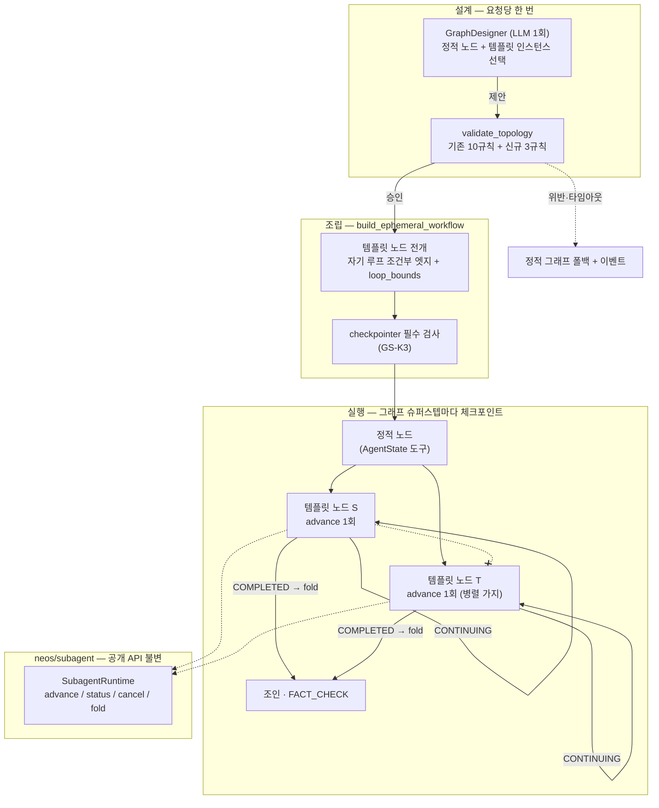

# 서브에이전트 노드 그래프 — 멀티에이전트 + 서브에이전트 그래프 엔지니어링 통합 설계

| 항목 | 값 |
|---|---|
| 작성일 | 2026-09-14 |
| 상태 | **초안 — 결정 대기** (GS0: K25 개정이 착수 조건) |
| 트랙 | 로드맵 트랙 **I** ([DEEP_ANALYSIS_HARNESS_ROADMAP.md](DEEP_ANALYSIS_HARNESS_ROADMAP.md) §1·§8) |
| 선행 설계 | [SUBAGENT_RUNTIME_DESIGN.md](SUBAGENT_RUNTIME_DESIGN.md) (K1–K16) · [PARENT_MEDIATED_COLLABORATION_DESIGN.md](PARENT_MEDIATED_COLLABORATION_DESIGN.md) (K17–K28) · [graph_design_passrate_preregistration.md](graph_design_passrate_preregistration.md) |
| 코드 기준 | `dev` 2026-09-14 |

> 🔴 **이 문서는 잠긴 결정 하나를 되연다.** `PARENT_MEDIATED_COLLABORATION_DESIGN.md`
> K25는 "`ParentKind.WORKFLOW` 없음"이고, Approach W(workflow-as-team)는 그 근거로
> 기각됐다. 이 설계는 **K25의 개정**을 요구한다. 개정이 `DECISIONS`에 기록되기 전에는
> 아래 어떤 단계도 착수하지 않는다(§8 GS0).

---

## 1. 한 줄

**그래프 설계자가 고르는 노드 중 일부를, 정해진 노드 핸들러가 아니라 경계가 선언된
서브에이전트 실행으로 만든다.** 노드는 여전히 `AgentState` 위의 도구이고, 서브에이전트는
여전히 잎(leaf)이며, 토폴로지를 승인하는 것은 여전히 결정론적 검증기다.

---

## 2. 지금 코드에 있는 것 (2026-09-14 실측)

두 시스템이 있고 **서로를 모른다.** `neos.subagent`를 import하는 곳에
`neos/workflow/graph*`는 없다.

### 2.1 그래프 쪽 — 설계는 하되 고르기만 한다

| 부품 | 위치 | 하는 일 |
|---|---|---|
| 노드 계약 | `neos/workflow/contracts.py` `NodeContract` | `reads` / `writes` / `requires` / `requires_unless` + 언바운드 `handler`. 등록 계약 31개 |
| 검증기 | `neos/workflow/topology.py` `validate_topology` | 규칙 10종: `unknown_node` · `missing_contract` · `unreachable_node` · `dead_end` · `unbounded_cycle` · `unsatisfied_requires` · `no_writer_for_required_key` · `missing_mandatory` · `budget_exceeded` · `empty_topology` |
| 설계자 | `neos/workflow/graph_designer.py` · `graph_designer_llm.py` | LLM 호출 **한 번**으로 카탈로그에서 노드를 골라 정적 엣지를 낸다. 스스로 승인하지 않는다 |
| 폴백 | `graph_design_ledger.design_graph_or_fallback` | 타임아웃·예외·위반이면 정적 그래프. 재설계 루프 없음. 이벤트 4종 |
| 조립 | `graph.py` `build_ephemeral_workflow` | **정적 엣지만.** 승인 게이트 노드는 checkpointer + `interrupt_before` 없이는 거부 |
| 플래그 | `workflow.graph_design_enabled = False` | 챗 경로는 `use_checkpointer=False` |

- `GraphTopology.loop_bounds`가 있고 `unbounded_cycle` 규칙이 그것을 본다. **지금 쓰는 설계는 없다.**
- `budget_exceeded`는 **돌지 않는다.** `node_costs` 표가 없어서 호출자가 budget을
  넘기지 않는다(`graph.py` 주석: 표 없이 budget만 주면 모든 설계가 거부된다).
- 설계자 통과율 L-1은 **15/20 = 75%**(2026-08-24, 계약 31개). 로드맵 트랙 G는 이 수의
  **재측정**을 요구한다.

### 2.2 서브에이전트 쪽 — 잎을 돌리되 부모가 둘뿐이다

| 부품 | 위치 | 하는 일 |
|---|---|---|
| 런타임 | `neos/subagent/runtime.py` `SubagentRuntime` | 공개 표면 넷: `advance` / `status` / `cancel` / `fold` (K3). `run_until_done` 없음 |
| 한 걸음 | `advance(ticket) -> StepOutcome` | SQL CAS 한 번 + 모델 턴 한 번. `CONTINUING` / `COMPLETED` / `FAILED` / `CANCELLED` |
| 명세 | `neos/subagent/catalog.py` | `explore`(읽기 전용, depth 0에서만 스폰) · `implement`(worktree, 스폰 불가). fail-closed |
| 티켓 | `neos/subagent/types.py` `SubagentTicket` | `parent_kind` ∈ {`CODING`, `DEEP_ANALYSIS`} · `parent_tool_call_id` · `briefing` · `model` pin · `max_turns` 1–8 · `sandbox_mode` |
| DA 어댑터 | `deep_analysis/subagent_adapter.investigate_via_subagent` | **호출당 `advance` 한 번.** `CONTINUING`이면 `partial`로 돌아가고 다음 라운드가 이어 간다 |
| 코딩 부모 | `loop/_durable/spawn.py` | Approach M: 부모가 매개하는 제한 팬아웃, 전달당 자식 한 걸음 (K19) |

---

## 3. 목표와 비목표

### 3.1 목표

1. **서브에이전트 노드 템플릿.** 설계자가 카탈로그에서 고를 수 있는 노드 중 일부가
   "명세 + 브리핑 매핑 + 출력 매핑 + 턴·모델 상한"으로 선언된 서브에이전트 실행이다.
2. **계약이 구성으로 참이다.** 템플릿 노드의 `reads`·`writes`는 선언에서 **생성**되므로
   `hand_curated`가 필요 없다. 트랙 G의 정직성 표(30개 중 19개 · 31개 중 18개)에서
   새 노드는 전부 기계 검증 쪽에 선다.
3. **예산이 처음으로 강제된다.** 템플릿은 `max_turns`와 모델 pin을 가지므로 비용 상한을
   **계산**할 수 있다. 이것이 트리에 없던 `node_costs`의 첫 원본이다.
4. **1-step 법을 그래프에서도 지킨다.** 노드 한 번 = `advance` 한 번. 계속은 그래프의
   경계 있는 자기 루프로 표현하고, 매 걸음이 체크포인트 경계다.
5. **제한 팬아웃.** 병렬 가지에 둔 템플릿 노드는 동시에 돌 수 있되 상한이 있다(≤4).
6. **무엇이 조립됐는지 원장이 답한다.** 설계·자식 실행·폴드가 모두 이벤트로 남는다.

### 3.2 비목표 (강제)

- ❌ **페르소나·팀메이트.** 노드를 "협업하는 에이전트 정체성"으로 만들지 않는다 —
  Approach W가 기각된 핵심 이유이며 **이 설계에서도 기각 상태로 남는다**(§4).
- ❌ 자식 간 채널. 자식은 잎이다. 합류는 그래프의 조인 노드가 한다.
- ❌ coordinator · `while(true)` · `run_until_done` · 노드 안의 자식 구동 루프.
- ❌ LLM의 토폴로지 승인. 승인은 결정론적 검증기만 한다(설계자 ≠ 승인자).
- ❌ 워크플로 부모의 쓰기 자식. `implement` 템플릿은 이 설계 범위 밖이다.
- ❌ 새 벤더 SDK 경로. 자식은 기존 `CodingModel` + `iter_model_turn`만 쓴다(K4).

---

## 4. K25를 왜, 어디까지 되여는가

K25와 Approach W 기각의 근거는 넷이었다. 각각에 이 설계가 어떻게 답하는지 적는다.

| 기각 근거 (원문) | 이 설계의 답 |
|---|---|
| "그 노드들은 `AgentState` 위의 도구이지 정체성이 아니다" | **동의하고 유지한다.** 템플릿 노드도 도구다. 정체성(`sa_…` run)은 노드가 아니라 **노드 실행 한 번**이 갖는다. 노드는 페르소나가 되지 않는다 |
| "planner를 더하면 `DeepEngine` 라우팅·DA와 싸운다" | planner 노드를 더하지 않는다. 설계자는 이미 있는 경계(`graph_design_enabled`) 안에서 **고르는 어휘만 넓힌다** |
| "MissionExecutor는 계약상 직렬이다" | 미션 노드를 건드리지 않는다. 팬아웃은 템플릿 노드의 병렬 가지로만 한다(§6.4) |
| "specialist를 `SubagentRuntime`에 배선하면 `ParentKind.WORKFLOW`를 발명한다" | **그렇다 — 이것이 개정의 실체다.** 목표 자체가 "그래프를 서브에이전트로 설계한다"로 바뀌었고, 부모 종류 없이 그 목표를 만족하는 경로는 없다 |

**개정 제안 (K25′):**

> `ParentKind.WORKFLOW`를 추가한다. 단 워크플로 부모는
> (a) `explore` 계열 **읽기 전용** 명세만 스폰하고,
> (b) 노드 한 번 호출에 `advance`를 **정확히 한 번** 부르며,
> (c) 체크포인터가 있는 실행 경로에서만 서브에이전트 노드를 조립하고,
> (d) 자식 폴드를 **검증되지 않은 보고**로만 상태에 쓴다.
> 1 세션 → 1 바인딩 → 1 `CodingTask` 법(K25 원문의 나머지)은 그대로다 — 워크플로
> 부모는 채널 세션에 붙지 않는다.

K24(중첩 금지)는 이후 Subagent P2가 depth-1 explore로 이미 완화했다
(`catalog.may_spawn`, `_MAX_SPAWN_DEPTH = 0`). 워크플로 부모의 자식은 **depth 0에서
스폰하지 않는 명세**만 쓴다 — 그래프가 이미 팬아웃을 표현하므로 자식이 또 팬아웃할
이유가 없다.

---

## 5. 핵심 결정

| # | 결정 | 근거 |
|---|---|---|
| **GS-K1** | 서브에이전트 노드는 **템플릿**이다. 템플릿 = `spec` + 브리핑 매핑(`reads` 키 → `ParentBriefing` 필드) + 출력 매핑(폴드 → `writes` 키) + `max_turns` + 모델 역할. 계약은 템플릿에서 **생성**한다 | 손으로 채운 계약은 추출기가 좋아지면 낡는다(트랙 G "낡은 면제 플래그"). 생성된 계약은 낡을 수 없다 |
| **GS-K2** | 노드 한 번 = `advance` 한 번. `CONTINUING`이면 **자기 자신으로 돌아가는 조건부 엣지**를 탄다. 루프 상한 = `max_turns`, `loop_bounds`에 **빌더가** 기입한다 | K3·DA 어댑터와 같은 1-step. 설계자는 정적 엣지만 내고(파서 계약 불변), 조건부 엣지는 계약에서 파생되므로 설계자가 틀릴 수 없다 |
| **GS-K3** | 서브에이전트 노드는 **checkpointer가 있는 경로에서만** 조립한다. 없으면 `EphemeralSubagentUnsupported`로 거부하고 `graph_design_fallback`에 사유를 남긴다 | 승인 게이트 노드(G2-b·G2-d)와 같은 방어. 자기 루프의 매 걸음이 재개 가능해야 한다. 챗 경로(`use_checkpointer=False`)는 정적 그래프로 폴백 |
| **GS-K4** | `parent_tool_call_id = "node:{node}:{topology_hash[:12]}"` — 결정론적. 반복은 같은 id로 `expected_checkpoint_id`를 넘겨 CAS로 이어 간다 | K15 CAS 재개가 그대로 성립. 같은 설계를 재개하면 같은 자식을 찾는다 |
| **GS-K5** | 폴드는 `AgentState.subagent_reports[node]`에 **unverified**로 쓴다. 새 검증 규칙 `unchecked_subagent_report`: 템플릿 노드에서 END까지의 **모든 경로**에 `FACT_CHECK` 또는 `QUALITY_VALIDATOR`가 있어야 한다 | DA K23(`explore_brief`는 클레임이 아니다)과 같은 신뢰 경계. 검증기의 "모든 경로" 분석을 그대로 재사용한다 |
| **GS-K6** | 템플릿 비용 상한 = `max_turns × (입력 상한 × 입력 단가 + max_output_tokens × 출력 단가)`, 카탈로그 가격으로 계산. 정적 노드는 **실측 전까지 비용 미선언**이므로 예산 검사는 **템플릿 노드만** 센다(규칙 이름을 바꿔 섞이지 않게 한다: `subagent_budget_exceeded`) | 지어낸 비용 표는 근거 없는 거부·승인을 만든다(`graph.py` 주석). 계산 가능한 것만 강제한다. 지표 정의가 바뀌면 키 이름을 바꾼다(로드맵 §10) |
| **GS-K7** | 팬아웃 상한 `workflow.subagent_max_active` 기본 **1**, 상한 **4**. 병렬 가지는 서로 다른 `writes` 키를 가져야 한다 — 새 규칙 `concurrent_write_conflict` | K18과 같은 상한. LangGraph 병렬 가지가 같은 키를 쓰면 리듀서 없이는 마지막 쓰기가 이긴다 — 조용한 유실 |
| **GS-K8** | 워크플로 취소는 `SubagentRuntime.cancel_for_parent`로 **모든** 살아 있는 자식을 끝낸다 | K27과 같은 고아 방지 |
| **GS-K9** | 플래그 셋, 전부 기본 `false`: `workflow.graph_design_enabled`(기존) · `workflow.subagent_nodes_enabled`(신규, 앞의 것을 요구) · `workflow.subagent_max_active`(=1) | 켜는 순서가 곧 측정 순서다(§9) |
| **GS-K10** | 브리핑 텍스트 중 설계자가 쓴 부분은 **데이터**다. 자식 시스템 프롬프트에 들어가지 않고 `ParentBriefing.goal/scope`로만 간다. 템플릿의 도구 집합은 명세 교집합을 넘지 못한다 | 설계자 출력은 LLM 자유 텍스트가 시스템 행동으로 바뀌는 경계다(`parse_topology` 독스트링). 읽기 전용 명세 + 도구 교집합이 폭발 반경을 묶는다 |

---

## 6. 설계

### 6.1 구조



### 6.2 템플릿 계약

```python
# neos/workflow/subagent_nodes.py (신규) — 모양만 제시한다
@dataclass(frozen=True, slots=True)
class SubagentNodeTemplate:
    name: str                          # 카탈로그 어휘. 예: "explore_web"
    spec: str                          # neos.subagent.catalog 에 등록된 읽기 전용 명세
    briefing_from: Mapping[str, str]   # ParentBriefing 필드 -> AgentState 키
    report_key: str                    # 폴드를 쓸 키. subagent_reports 아래
    max_turns: int                     # 1-8, SubagentTicket 과 같은 범위
    model_role: Literal["everyday", "powerful"]
    tools: frozenset[str]              # spec.allowed_tools 의 부분집합이어야 한다

    def contract(self) -> NodeContract:
        reads = frozenset(self.briefing_from.values()) | {"subagent_runs"}
        writes = frozenset({"subagent_reports", "subagent_runs"})
        return NodeContract(node=self.name, reads=reads, writes=writes,
                            requires=frozenset(self.briefing_from.values()),
                            handler=subagent_node_handler)
```

- 템플릿 등록 시 `tools ⊆ spec.allowed_tools`와 `spec.can_spawn is False`를 **import
  시점에** 검사한다(fail-closed). 어기면 등록 자체가 실패한다.
- `AgentState`에 `subagent_runs`(노드 → `run_id`·`checkpoint_id`·`step_kind`)와
  `subagent_reports`(노드 → 폴드 요약, 리듀서는 키 병합)를 선언한다. 선언하지 않은 키는
  트랙 G가 이미 9개를 회수한 결함 유형이다.

### 6.3 노드 한 번의 실행

```text
subagent_node_handler(state, node):
  ref    = state.subagent_runs.get(node)            # 없으면 첫 걸음
  ticket = SubagentTicket(parent_kind=WORKFLOW,
             parent_id=<thread_id>, parent_run_id=<execution_id>,
             parent_tool_call_id="node:{node}:{topology_hash[:12]}",
             spec=template.spec, briefing=<briefing_from 매핑>,
             model=<model_role 해석 1회>, max_turns=template.max_turns,
             sandbox_mode=NONE, run_id=ref.run_id, expected_checkpoint_id=ref.checkpoint_id)
  outcome = await runtime.advance(ticket)           # 정확히 한 번
  CONTINUING -> subagent_runs[node] 갱신, 라우터가 자기 자신으로
  COMPLETED  -> fold -> subagent_reports[node] (unverified), 라우터가 다음 노드로
  FAILED/CANCELLED -> subagent_reports[node] = 실패 사유, 다음 노드로 (조용한 degrade 금지: 이벤트)
```

- 모델은 **경계에서 한 번만** 해석한다(로드맵 트랙 B 불변식). 템플릿은 역할만 갖는다.
- 도구는 워크플로가 주는 `ToolPort`(DA의 `search`/`fetch`와 같은 모양)로만 제공한다.
  샌드박스 모드는 `NONE` — 워크플로 자식은 워크스페이스를 만지지 않는다.

### 6.4 조립 — 설계자는 정적 엣지만 낸다

설계자가 `A → S → B`를 내면 빌더가 `S`를 다음처럼 전개한다.

```text
add_node(S, subagent_node_handler)
add_conditional_edges(S, route_by_step_kind, {"continue": S, "done": B})
topology.loop_bounds[S] = template.max_turns      # 검증기가 unbounded_cycle 로 본다
```

- **전개는 검증 전에 한다.** 검증기는 전개된 토폴로지를 본다 — 자기 루프와 상한이
  검증기 눈에 보여야 `unbounded_cycle`이 무는지 확인할 수 있다.
- 병렬: 설계자가 `A → S`, `A → T`, `S → J`, `T → J`를 내면 LangGraph 병렬 가지가 된다.
  동시 실행 수는 `subagent_max_active`로 묶는다(초과분은 순차). 규칙
  `concurrent_write_conflict`가 같은 비리듀서 키를 쓰는 병렬 가지를 거부한다.

### 6.5 신규 검증 규칙

| 규칙 | 무엇을 거부하나 | 재사용하는 분석 |
|---|---|---|
| `unchecked_subagent_report` | 템플릿 노드에서 END까지 `FACT_CHECK`/`QUALITY_VALIDATOR`를 거치지 않는 경로가 하나라도 있음 | 기존 "모든 경로" 도달 분석 |
| `subagent_budget_exceeded` | 템플릿 노드 비용 상한 합 > budget | 기존 `budget_exceeded` 골격, 비용 표만 템플릿에서 |
| `concurrent_write_conflict` | 병렬 가지가 같은 비리듀서 키를 씀 | 기존 `writes` 집합 |

> 규칙을 더할 때는 **무는지 변이로 확인한다**(로드맵 §10: 무는지 보지 않고 세운
> 게이트는 없느니만 못하다). 각 규칙마다 "통과해야 할 토폴로지"와 "거부돼야 할
> 토폴로지" 쌍을 테스트로 고정한다.

### 6.6 원장과 화면

| 이벤트 | 발행 위치 | 비고 |
|---|---|---|
| `graph_design_requested/approved/rejected/fallback` | 기존 | 사유에 `ephemeral_subagent_unsupported` 추가(새 kind 아님) |
| `graph_subagent_step` | 템플릿 노드 | `run_id`·`step_kind`·`turn_count`·`tokens_delta` |
| `graph_subagent_folded` | 템플릿 노드 | `truncated`·`exit_reason`. 요약 본문은 이벤트에 싣지 않는다 |

- 새 kind는 **FE 라벨과 짝으로** 들어간다 — 트랙 C가 fixture + AST 대조로 강제하는
  규칙이다. 그래프 이벤트용 fixture가 없다면 GS5가 만든다.

---

## 7. 대안

| 대안 | 기각 이유 |
|---|---|
| **노드 안에서 자식을 끝날 때까지 구동** (`while not terminal: advance`) | K3이 금지한 `run_until_done`을 호출자 쪽에서 재발명한다. 노드 한 번이 상한 없는 시간을 쓴다 |
| **설계자가 조건부 엣지까지 설계** | 파서 계약(`[source, target]` 두 원소)을 깨고, 계속/종료 라우팅을 LLM이 틀릴 자리를 만든다. 계약에서 파생 가능한 것은 설계시키지 않는다 |
| **Approach W 원형** (노드 = 페르소나, planner 추가) | §4 표. 여전히 기각 |
| **LLM critic이 토폴로지 승인** | 설계자 ≠ 승인자. judge ≠ worker 원칙의 그래프판. 결정론적 검증기가 유일한 승인자다 |
| **정적 노드에도 추정 비용 표** | 지어낸 수치로 거부·승인을 가른다. 실측 비용이 생기면 그때 별도 규칙으로 |

---

## 8. 단계

| 단계 | 내용 | 완료 조건 | 선행 |
|---|---|---|---|
| **GS0 결정** | K25′를 `DECISIONS`에 기록. 트랙 G 설계자 통과율 **재측정 사전 등록** | 결정 커밋 · 사전 등록 커밋이 표본보다 먼저 | — |
| **GS1 계약** | `SubagentNodeTemplate`, `ParentKind.WORKFLOW`, `AgentState` 키 2개, import 시점 검사, 규칙 3종(변이 테스트 쌍 포함) | 플래그 off로 전체 스위트 초록. 기존 31개 계약의 검증 결과 **불변** | GS0 |
| **GS2 조립** | 템플릿 전개(자기 루프 + `loop_bounds`), checkpointer 필수 거부, `subagent_node_handler`(advance 1회) | 가짜 런타임으로 CONTINUING→COMPLETED 재개가 체크포인트를 가로질러 이어짐 | GS1 |
| **GS3 설계자** | 카탈로그에 템플릿 어휘, `prompts/graph_design.md` v3, 템플릿 비용 상한 → `subagent_budget_exceeded` 강제 | 가짜 설계자 테스트 + 프롬프트 파일 버전 증가 | GS2 |
| **GS4 팬아웃** | 병렬 가지, `subagent_max_active`, `concurrent_write_conflict`, 취소 전파 | 두 병렬 자식 × {정상, 취소, 한쪽 실패} | GS2 |
| **GS5 관측** | 이벤트 2종 + FE 라벨 짝, 비용 롤업을 실행 원장에 | FE fixture 대조 테스트 초록 | GS2 |
| **GS6 측정** | 사전 등록된 라이브 표본 — §9 | 판정 기록 | GS3·GS5 |

**각 단계는 플래그 기본 off로 병합한다.** 켜는 것은 GS6 판정 뒤의 별도 결정이다.

---

## 9. 측정 — 켜기 전에 잰다

로드맵 §6.1 규율을 그대로 따른다: 표본 1회 · 사전 등록 선행 · 한 표본에 한 변경.

| # | 지표 | 사전 등록할 것 |
|---|---|---|
| M-0 | **기준선 재측정**: 템플릿 없는 카탈로그의 L-1 통과율 | 75%(2026-08-24)와 같은 조건 · 같은 모델 · 같은 질의 집합 |
| M-1 | 템플릿 포함 카탈로그의 L-1 통과율 | M-0 대비 하락 허용폭과 반증 조건 |
| M-2 | 템플릿 노드를 **고른** 승인 설계의 비율 | 방향만 |
| M-3 | 템플릿 노드 실제 비용 / 계산 상한 | 상한이 실측을 덮는지(초과 0건이어야 한다) |
| M-4 | `unchecked_subagent_report` 거부율 | 방향만 |

- **M-0과 M-1은 다른 표본이다.** 한 표본에 카탈로그 확장과 기준선 재측정을 같이 넣으면
  귀속이 불가능해진다.
- 새 표본 경계: `workflow.subagent_nodes_enabled`를 켠 커밋 이후의 설계 통과율은 그 이전과
  **비교 불가**다. 로드맵 §4에 먼저 적는다.

---

## 10. 보안

| 위협 | 심각도 | 완화 |
|---|---|---|
| 설계자가 브리핑에 주입 문구를 넣음 | 높음 | GS-K10: 브리핑은 데이터 필드로만. 읽기 전용 명세 + 도구 교집합 |
| 템플릿이 쓰기 도구를 얻음 | 높음 | 등록 시 `tools ⊆ spec.allowed_tools` · `implement` 계열 금지 · import 시점 fail-closed |
| 폴드 요약이 검증된 사실로 응답에 섞임 | 중간 | GS-K5 규칙 + `subagent_reports`는 unverified 표지 |
| 병렬 자식 비용 폭주 | 중간 | 계산 상한 기반 예산 강제(GS-K6) + 동시 실행 상한(GS-K7) |
| 워크플로 취소 후 고아 자식 | 높음 | GS-K8 `cancel_for_parent` |

---

## 11. 열린 질문

1. **워크플로 실행이 어디서 도는가.** API 요청 스트림과 Celery 잡 중 무엇이 기본인지에 따라
   자기 루프의 걸음마다 드는 지연 예산이 다르다. GS2 착수 전에 실측으로 답한다.
2. **챗 경로.** checkpointer가 없어 서브에이전트 노드가 전부 폴백한다. 챗에서도 쓰려면
   챗 경로의 checkpointer 도입이 별건으로 필요하다 — 이 설계는 요구하지 않는다.
3. **정적 노드 비용.** 실측 비용이 쌓이면 `budget_exceeded`를 정적 노드까지 넓힐지는
   그때의 결정이다. 섞지 않기 위해 규칙 이름을 분리해 뒀다(GS-K6).
4. **H2(플러그인 계약)와의 관계.** 템플릿은 H2의 "네 층을 묶는 계약" 중 노드 층의 첫
   구체형이 될 수 있다. H2 설계가 시작되면 템플릿 스키마를 그쪽으로 옮길지 결정한다.
