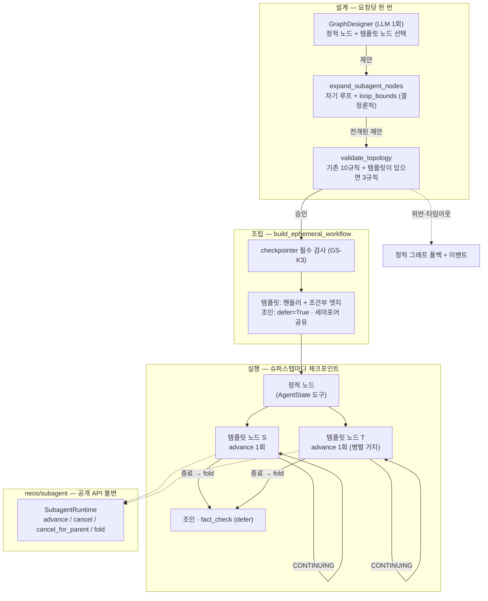

# 서브에이전트 노드 그래프 — 멀티에이전트 + 서브에이전트 그래프 엔지니어링 통합 설계

| 항목 | 값 |
|---|---|
| 작성일 | 2026-09-14 · **코드 대조 리뷰 2026-09-14** (§13) |
| 상태 | **결정됨 — K25′ 승인(2026-09-14, 사용자)**. GS1·GS2·GS4·GS5 코드 착수, 전부 플래그 기본 off |
| 트랙 | 로드맵 트랙 **I** ([DEEP_ANALYSIS_HARNESS_ROADMAP.md](DEEP_ANALYSIS_HARNESS_ROADMAP.md) §1·§8) |
| 선행 설계 | [SUBAGENT_RUNTIME_DESIGN.md](SUBAGENT_RUNTIME_DESIGN.md) (K1–K16) · [PARENT_MEDIATED_COLLABORATION_DESIGN.md](PARENT_MEDIATED_COLLABORATION_DESIGN.md) (K17–K28) · [graph_design_passrate_preregistration.md](graph_design_passrate_preregistration.md) |
| 결정 기록 | K25 행 개정: `PARENT_MEDIATED_COLLABORATION_DESIGN.md` Key Decisions 표 · 판정 원장: `neos/workflow/deep_analysis/DECISIONS.md` **D97** |
| 사전 등록 | M-0 기준선 재측정: [graph_design_passrate_remeasure_preregistration.md](graph_design_passrate_remeasure_preregistration.md) |
| 코드 기준 | `dev` `695bf1a2` (2026-09-14) · LangGraph **1.2.0** (`pyproject.toml` 고정) |

> 🔴 **이 문서는 잠긴 결정 하나를 되연다.** `PARENT_MEDIATED_COLLABORATION_DESIGN.md`
> K25는 "`ParentKind.WORKFLOW` 없음"이고, Approach W(workflow-as-team)는 그 근거로
> 기각됐다. 개정 K25′는 **2026-09-14 사용자가 제한 (a)–(d)와 함께 승인**했고
> K25 행과 D97에 기록됐다(§8 GS0). Approach W 자체는 여전히 기각이다.

---

## 1. 한 줄

**그래프 설계자가 고르는 노드 중 일부를, 정해진 노드 핸들러가 아니라 경계가 선언된
서브에이전트 실행으로 만든다.** 노드는 여전히 `AgentState` 위의 도구이고, 서브에이전트는
여전히 잎(leaf)이며, 토폴로지를 승인하는 것은 여전히 결정론적 검증기다.

---

## 2. 지금 코드에 있는 것 (2026-09-14 실측, 리뷰에서 줄 단위 대조)

두 시스템이 있고 **서로를 모른다.** `neos/workflow/graph*` 어디도 `neos.subagent`를
import하지 않는다(DA의 `deep_analysis/subagent_adapter.py`만 한다).

### 2.1 그래프 쪽 — 설계는 하되 고르기만 한다

| 부품 | 위치 | 하는 일 (실측) |
|---|---|---|
| 노드 계약 | `neos/workflow/contracts.py` `NodeContract` | `reads` / `writes` / `requires` / `requires_unless` + 언바운드 `handler` + `hand_curated` / `writes_hand_curated`. **`@node_contract` 31개 전부 `graph.py`** |
| 검증기 | `neos/workflow/topology.py` `validate_topology` | 규칙 10종: `empty_topology` · `unknown_node` · `unreachable_node` · `dead_end` · `unbounded_cycle` · `missing_contract` · `unsatisfied_requires` · `missing_mandatory` · `no_writer_for_required_key` · `budget_exceeded` (독스트링은 아직 "여덟 가지"라 적는다) |
| "모든 경로" 분석 | `_guaranteed_keys` · `_conditional_violations` | **START → N 방향의 must-analysis 하나뿐이다.** 선행 노드의 보장 키 집합을 교집합한다. N → END 방향(후방 지배, postdominance) 분석은 **없다** |
| 사이클 상한 | `GraphTopology.loop_bounds` | `unbounded_cycle`은 **키가 있는지만** 본다. 값은 어디서도 읽히지 않고 LangGraph에도 전달되지 않는다. `topology_hash`에는 포함된다 |
| 설계자 | `graph_designer.py` · `graph_designer_llm.py` | LLM 호출 **한 번**으로 카탈로그에서 노드를 골라 정적 엣지를 낸다. `parse_topology`는 `loop_bounds`를 **절대 채우지 않는다** → 설계자는 통과 가능한 사이클을 낼 수 없다 |
| 관문 | `graph_design_ledger.design_graph_or_fallback` | 타임아웃·예외·위반이면 `topology=None`(정적 폴백). 재설계 루프 없음. 이벤트 4종 **`graph_design_requested` / `accepted` / `rejected` / `fallback`**. `mandatory` 기본값은 비었고 I1은 `must_write={"final_response"}`로 건다 |
| 해시 | `graph_design_ledger.topology_hash` | sha256 앞 **16자**. 정렬된 nodes·edges·`loop_bounds`. `initial_writes`는 제외 |
| 조립 | `graph.py` `build_ephemeral_workflow` | **정적 엣지만.** 승인 게이트 노드(`execution_approval`/`mission_approval`)는 checkpointer + `interrupt_before` 없이는 `EphemeralApprovalGateUnsupported` |
| 재개 | `resume_graph.resume_graph_for` | 상태의 `execution_topology` 페이로드로 그래프를 **다시 짓고 재검증**한다. 복원·검증 실패는 정적으로 흐르지 않고 503 |
| 실행 설정 | `execute_workflow` | `recursion_limit: 50` 고정(checkpointer 유무 무관). `thread_id = user_input["session_id"]` |
| 플래그 | `workflow.graph_design_enabled = False` | — |

- **체크포인터 유무는 경로마다 다르고, 챗은 체크포인터가 있다.** `use_checkpointer=True`:
  `chat_stream_pipeline`(웹 챗) · `workflow_stream_handlers` · `query_service` · `channels/gateway` ·
  `celery_tasks.execute_workflow_async` · `execute_workflow` 기본값.
  `use_checkpointer=False`: **`ui_submit_handlers`(A2UI 폼 제출) 하나뿐.**
  `execute_workflow` 독스트링의 "chat API 는 False" 는 낡았다.
- **챗의 `thread_id`는 대화 id다** (`session_id = conversation_id`). 한 대화의 여러 턴이 **같은
  LangGraph 스레드**를 쓰고, 채널 값은 다음 턴으로 이월된다(리듀서 채널 포함, §6.7에서 실측).
- `budget_exceeded`는 **돌지 않는다.** `node_costs` 표가 없어서 호출자가 budget을 넘기지 않는다.
- 설계자 통과율 L-1은 **15/20 = 75%**(2026-08-24, 계약 31개). 그 뒤 `mandatory`→`must_write`,
  `requires_unless`(`a3375f8c`), writes 추출 확장(`6cd49a79`)이 들어왔다 — 같은 조건의 재측정이
  아니라 **새 기준선**이 필요하다(M-0).
- 측정 도구 `scripts/graph_design_passrate.py`는 아직 `mandatory=(response_generator,)`를 넘긴다.
  **프로덕션이 버린 규칙으로 잰다** — M-0 사전 등록이 이것을 먼저 고친다.

### 2.2 서브에이전트 쪽 — 잎을 돌리되 부모가 둘뿐이다

| 부품 | 위치 | 하는 일 (실측) |
|---|---|---|
| 런타임 | `neos/subagent/runtime.py` `SubagentRuntime` | `advance(ticket)` · `status(run_id)` · `fail_if_stale(run_id, *, now, stale_after_sec)` · `cancel(run_id, reason)` · **`cancel_for_parent(parent_kind, parent_id, reason)`** · `delete_for_parent` · `fold(run_id, *, parent_headroom_chars=None, sibling_count=None)`. `run_until_done` 없음 (K3) |
| 한 걸음 | `advance(ticket) -> StepOutcome` | 종료 상태면 걸음 없이 즉시 반환. 아니면 CAS `reserve` → **모델 턴 하나 XOR 도구 배치 하나(≤10개)** → `commit`. CAS 불일치면 **걸음 없이** 현재 상태를 돌려주고 `subagent.cas_mismatch` 발행 |
| 한 걸음 ≠ 한 턴 | `stepper.py` | `max_turns`는 **모델 턴**만 센다. 도구 호출이 있는 턴 뒤에는 도구 배치 걸음이 따르고, `turn_count >= max_turns`면 다음 걸음이 `turns_exhausted`로 끝낸다 → 도구를 부르는 자식은 **`2·max_turns + 1` 걸음 이상**을 쓸 수 있다(한 턴에 도구가 10개를 넘으면 더) |
| 명세 | `neos/subagent/catalog.py` | `explore`: 읽기 도구 + DA의 `search`/`fetch` + **`spawn_agent.v1`**, **`can_spawn=True`**(Subagent P2, depth 0에서만). `implement`: worktree 쓰기, `can_spawn=False`. `_MAX_SPAWN_DEPTH = 0`. fail-closed 조회 |
| 스폰 차단 실제 위치 | `stepper._child_tools` · `_tool_permitted` | 자식이 보는 도구 = **ToolPort가 정의한 것 ∩ `allowed_tools`**. `spawn_agent.v1`은 부모가 `NestedSpawnHost`를 주입해야 동작한다 |
| 티켓 | `neos/subagent/types.py` `SubagentTicket` | `parent_kind` ∈ {`CODING`, `DEEP_ANALYSIS`} · `parent_id` · `parent_run_id` · `parent_tool_call_id` · `spec` · `briefing` · `model: ModelPin` · `max_turns` 1–8 · `sandbox_mode` · `expected_checkpoint_id` · `run_id` · `pending_steer` · `input/output_cost_micros_per_million` · `spawn_depth` 0–1 |
| 브리핑 | `ParentBriefing` | `goal`(필수, 공백 거부) · `why` · `already_tried` · `scope` · `success` · `report_budget_chars` 256–16384 |
| DA 어댑터 | `deep_analysis/subagent_adapter.investigate_via_subagent` | **호출당 `advance` 한 번.** `CONTINUING`이면 `partial`. ToolPort = `DAToolPort(search_fn, fetch_fn)`(정의는 `search`/`fetch` 두 `ToolDefinition`). 모델 = `resolve_harness_model(role)` → `ModelPin`, 런타임의 `CodingModel`은 `build_da_subagent_runtime`에서 한 번 생성 |
| 코딩 부모 | `loop/_durable/spawn.py` | Approach M: 부모가 매개하는 제한 팬아웃, 전달당 자식 한 걸음 (K19). 취소는 `cancel_for_parent(ParentKind.CODING, task_id, …)` |
| DB | `db/migrations/055_add_subagent_tables.sql` | **`CHECK (parent_kind IN ('coding', 'deep_analysis'))`** — 새 값은 마이그레이션 없이는 INSERT가 실패한다. **`UNIQUE (parent_kind, parent_id, parent_tool_call_id)`** — `resolve_or_create`가 이 삼중키로 기존 run을 찾는다. `user_id` 컬럼 없음 |
| 메트릭 | `subagent/metrics.py` `_PARENTS` | {`coding`, `deep_analysis`} 밖의 값은 **조용히 `coding` 라벨**로 기록된다 |

---

## 3. 목표와 비목표

### 3.1 목표

1. **서브에이전트 노드 템플릿.** 설계자가 카탈로그에서 고를 수 있는 노드 중 일부가
   "명세 + 브리핑 매핑 + 출력 매핑 + 턴·모델 상한"으로 선언된 서브에이전트 실행이다.
2. **계약이 구성으로 참이다.** 템플릿 노드의 `reads`·`writes`는 선언에서 **생성**되므로
   `hand_curated`가 필요 없다. 트랙 G의 정직성 표에서 새 노드는 전부 기계 검증 쪽에 선다
   — 단 그 "기계"는 AST 추출기가 아니라 **핸들러 행동 테스트**다(§8 GS2).
3. **예산이 처음으로 강제된다.** 템플릿은 `max_turns`와 모델 역할을 가지므로 비용 상한을
   **계산**할 수 있다(§5 GS-K6). 이것이 트리에 없던 비용 표의 첫 원본이다.
4. **1-step 법을 그래프에서도 지킨다.** 노드 한 번 = `advance` 한 번. 계속은 그래프의
   경계 있는 자기 루프로 표현한다.
5. **제한 팬아웃.** 병렬 가지에 둔 템플릿 노드는 동시에 돌 수 있되 상한이 있다(≤4).
6. **무엇이 조립됐는지 원장이 답한다.** 설계·자식 걸음·폴드가 모두 이벤트로 남는다.

### 3.2 비목표 (강제)

- ❌ **페르소나·팀메이트.** 노드를 "협업하는 에이전트 정체성"으로 만들지 않는다 —
  Approach W가 기각된 핵심 이유이며 **이 설계에서도 기각 상태로 남는다**(§4).
- ❌ 자식 간 채널. 자식은 잎이다. 합류는 그래프의 조인 노드가 한다.
- ❌ coordinator · `while(true)` · `run_until_done` · 노드 안의 자식 구동 루프.
- ❌ LLM의 토폴로지 승인. 승인은 결정론적 검증기만 한다(설계자 ≠ 승인자).
- ❌ 워크플로 부모의 쓰기 자식. `implement` 템플릿은 이 설계 범위 밖이다.
- ❌ 워크플로 자식의 중첩 스폰. `NestedSpawnHost`를 주입하지 않는다.
- ❌ 새 벤더 SDK 경로. 자식은 기존 `CodingModel` + `iter_model_turn`만 쓴다(K4).

---

## 4. K25를 왜, 어디까지 되여는가

K25와 Approach W 기각의 근거는 넷이었다. 각각에 이 설계가 어떻게 답하는지 적는다.

| 기각 근거 (원문) | 이 설계의 답 |
|---|---|
| "그 노드들은 `AgentState` 위의 도구이지 정체성이 아니다" | **동의하고 유지한다.** 템플릿 노드도 도구다. 정체성(`sa_…` run)은 노드가 아니라 **노드 실행 스코프 하나**가 갖는다. 노드는 페르소나가 되지 않는다 |
| "planner를 더하면 `DeepEngine` 라우팅·DA와 싸운다" | planner 노드를 더하지 않는다. 설계자는 이미 있는 경계(`graph_design_enabled`) 안에서 **고르는 어휘만 넓힌다** |
| "MissionExecutor는 계약상 직렬이다" | 미션 노드를 건드리지 않는다. 팬아웃은 템플릿 노드의 병렬 가지로만 한다(§6.4) |
| "specialist를 `SubagentRuntime`에 배선하면 `ParentKind.WORKFLOW`를 발명한다" | **그렇다 — 이것이 개정의 실체다.** 목표 자체가 "그래프를 서브에이전트로 설계한다"로 바뀌었고, 부모 종류 없이 그 목표를 만족하는 경로는 없다 |

**K25′ (2026-09-14 사용자 승인):**

> `ParentKind.WORKFLOW`를 추가한다. 단 워크플로 부모는
> (a) `explore` 계열 **읽기 전용** 명세만 스폰하고,
> (b) 노드 한 번 호출에 `advance`를 **정확히 한 번** 부르며,
> (c) 체크포인터가 있는 실행 경로에서만 서브에이전트 노드를 조립하고,
> (d) 자식 폴드를 **검증되지 않은 보고**로만 상태에 쓴다.
> 1 세션 → 1 바인딩 → 1 `CodingTask` 법(K25 원문의 나머지)은 그대로다 — 워크플로
> 부모는 채널 세션에 붙지 않는다.

**(a)를 코드에서 무엇이 보증하는가 — 원안의 가정이 틀렸다.** 원안은 "`spec.can_spawn is False`를
import 시점에 검사한다"고 적었지만 `explore`는 P2 이후 `can_spawn=True`이고, 쓰기 명세
`implement`만 `False`다 — 그 검사는 **모든 읽기 전용 명세를 거부**한다. 실제 보증은 셋이다:

1. 템플릿 도구 집합 ⊆ `spec.allowed_tools` **−** {`spawn_agent.v1`} **−** 쓰기 도구(`implement`
   전용 도구 집합), 등록 시점 fail-closed.
2. 워크플로 ToolPort는 템플릿 도구만 정의한다 — 자식에게 보이는 도구는 `ToolPort ∩ allowed_tools`다.
3. 워크플로 호스트는 `NestedSpawnHost`를 주입하지 않는다 — `spawn_agent.v1`이 새어 들어와도
   `nested_spawn_unavailable`로 실패한다.

(K24 행 원문 "`can_spawn` stays `False` on `EXPLORE`"도 P2 이후 코드와 어긋나 있다. 그 행은 이
설계가 고치지 않는다 — 워크플로 부모는 위 셋으로 depth와 무관하게 스폰을 막는다.)

---

## 5. 핵심 결정

| # | 결정 | 근거 |
|---|---|---|
| **GS-K1** | 서브에이전트 노드는 **템플릿**이다. 템플릿 = `spec` + 도구 집합 + 브리핑 매핑(`ParentBriefing` 필드 → `AgentState` 키) + `max_turns` + 모델 역할 + 진행 라벨. 계약은 템플릿에서 **생성**한다: `reads` = 브리핑 키 ∪ {`subagent_scope`, `subagent_runs`}, `writes` = {`search_results`, `subagent_runs`, `subagent_reports`}, `requires` = 브리핑 키. 템플릿 계약은 `NODE_CONTRACTS`(31개)에 **넣지 않고** 별도 레지스트리에 둔다 | 손으로 채운 계약은 추출기가 좋아지면 낡는다. 별도 레지스트리여야 플래그 off에서 31개 계약의 검증 결과가 **구성상** 불변이다 |
| **GS-K1′** | **출력 매핑 = `search_results`에 `SearchResult` 하나를 덧붙인다** (`source="subagent:<node>"`, `metadata.unverified=True`, `run_id`, `citations`). `subagent_reports[node]`에는 본문 없는 감사 메타데이터만 쓴다 | 원안은 폴드를 `subagent_reports`에만 썼다 — **그 키를 읽는 노드가 하나도 없다.** `fact_check`·`result_integrator`·`quality_validator`·`response_generator`는 `search_results`를 읽는다. 그리고 그 키는 이미 `operator.add` 리듀서라 병렬 가지에서도 안전하다 |
| **GS-K2** | 노드 한 번 = `advance` 한 번. `CONTINUING`이면 **자기 자신으로 가는 조건부 엣지**를 탄다. 루프 상한은 `max_turns`가 아니라 **걸음 상한 `max_advances = 2·max_turns + 1`**이고, `loop_bounds[S]`에 **빌더가** 기입하며 **핸들러가 강제한다**(상한에 닿으면 `runtime.cancel(run_id, "graph_step_cap")` → 폴드 → 실패 보고 + 이벤트) | 한 걸음은 모델 턴 XOR 도구 배치다(§2.2). `max_turns`로 루프를 묶으면 도구를 쓰는 자식이 절반만 돌고 잘린다. `loop_bounds`는 LangGraph에 전달되지 않으므로 **강제 지점은 핸들러뿐이다** |
| **GS-K2′** | 설계된 run의 `recursion_limit` = max(50, 노드 수 + Σ(`max_advances` − 1) + 1). 템플릿이 없으면 지금과 같은 50 | 자기 루프는 슈퍼스텝을 쓴다. 고정 50은 템플릿 3개(각 17걸음)면 넘는다 → `GraphRecursionError` |
| **GS-K3** | 서브에이전트 노드는 **checkpointer가 있는 경로에서만** 조립한다. 없으면 `EphemeralSubagentUnsupported`로 거부하고 `graph_design_fallback`에 사유 `ephemeral_subagent_unsupported`를 남긴다 | 승인 게이트 노드와 같은 방어. **실제로 폴백하는 경로는 A2UI 폼 제출(`ui_submit_handlers`) 하나다** — 챗·스트림·Celery는 체크포인터가 있어 조립된다(원안의 "챗은 폴백"은 틀렸다) |
| **GS-K4** | 자식 정체성: `parent_kind=WORKFLOW`, `parent_id = parent_run_id = subagent_scope`, `parent_tool_call_id = "node:<node>"`. `subagent_scope`(`wf_<hex>`)는 **오케스트레이터가** 승인된 토폴로지에 템플릿이 있을 때만 `execute_workflow` 호출마다 새로 발급해 초기 상태에 싣는다. 첫 걸음이 `spec`·`max_turns`·`provider`·`model`을 `subagent_runs[node]`에 **고정**하고 이후 걸음은 그 값을 쓴다 | `thread_id`는 대화 단위라 턴마다 재사용된다 — `parent_id=thread_id`면 둘째 턴이 UNIQUE 삼중키로 **첫 턴의 완료된 자식을 되찾아** 옛 보고를 낸다. 스코프는 체크포인트에 실리므로 승인 재개는 같은 자식을 잇는다. 고정은 재개 사이의 배포·라우팅 변경이 살아 있는 자식을 바꾸지 못하게 한다 |
| **GS-K5** | 보고는 **unverified**다. 새 규칙 `unchecked_subagent_report`: 템플릿 노드에서 END까지의 **모든 경로**가 `fact_check`를 지나야 한다. `quality_validator`는 검사 노드로 인정하지 않는다 | DA K23과 같은 신뢰 경계. `quality_validator`는 완결성 점수를 매길 뿐 주장을 검증하지 않는다. **분석은 새로 짠다** — 기존 must-analysis는 START→N 방향이라 재사용할 수 없고, 필요한 것은 "`fact_check`를 지우면 S에서 END에 닿는가"의 BFS다 |
| **GS-K6** | 템플릿 비용 상한(micros) = `max_turns × (입력 천장 × 입력 단가 + CHILD_MAX_OUTPUT_TOKENS × 출력 단가)`. 입력 천장 = 카탈로그 `input_limit`, 없으면 `context_window`. 가격·창이 없으면 **미가격 → fail closed**. 규칙 `subagent_budget_exceeded`는 **템플릿 노드만** 센다 | 원안의 "입력 상한"은 **존재하지 않는다** — 자식 요청은 `max_output_tokens=4096`만 걸고 입력 한도는 없으며, 대화 기록 상한은 **바이트**(1 MiB)다. 모델 창은 프로바이더가 강제하는 진짜 천장이라 느슨하지만 참인 상한이다. `4096`은 스테퍼의 공개 상수로 올려 두 곳이 같은 수를 읽게 한다 |
| **GS-K6′** | 예산 `workflow.subagent_budget_micros`는 기본 `None`이고, **`subagent_nodes_enabled=True`면 필수**다(설정 검증기가 거부). 수를 지어내지 않는다 | 근거 없는 기본값은 근거 없는 거부·승인을 만든다(`graph.py` 주석). 켜는 사람이 수를 적게 한다 |
| **GS-K7** | 팬아웃 상한 `workflow.subagent_max_active` 기본 **1**, 상한 **4**. 기전 = **조립된 그래프 하나(=실행 하나)가 공유하는 `asyncio.Semaphore`** 를 `advance` 둘레에 건다. LangGraph `max_concurrency`는 쓰지 않는다 | `max_concurrency`는 그래프 **전체 노드**의 동시성이라 정적 노드까지 묶는다. "초과분은 순차"는 LangGraph 기능이 아니다 — 세마포어가 그것을 만든다. 상한은 프로세스 전역이 아니라 **실행당**이다 |
| **GS-K7′** | 규칙 `concurrent_write_conflict`: 서로 도달할 수 없는(병렬일 수 있는) 두 노드가 **리듀서 없는** 키를 같이 쓰면 거부. 리듀서 키 집합은 `AgentState` 주석(`Annotated`)에서 뽑는다 | 원안의 "마지막 쓰기가 이긴다 — 조용한 유실"은 **LangGraph 1.2에서 틀렸다**: 같은 슈퍼스텝의 두 쓰기는 `InvalidUpdateError`로 **run이 죽는다**(§6.7 실측). 조용하지 않지만 사용자 요청이 죽는다 |
| **GS-K7″** | **조인 노드는 `defer=True`로 조립한다**: 템플릿의 후손 중 선행 노드가 둘 이상인 노드 | 자기 루프 길이가 다른 두 가지가 합류하면 LangGraph는 조인 노드를 **가지마다 한 번씩** 돌린다 — 하류 `response_generator`까지 두 번(§6.7 실측). 대기 엣지 `add_edge([S,T], J)`도 답이 아니다: 배리어는 S의 **첫 걸음**에 채워진다 |
| **GS-K8** | 워크플로가 예외·취소로 끝나면 `SubagentRuntime.cancel_for_parent(ParentKind.WORKFLOW, subagent_scope, reason)`로 살아 있는 자식을 끝낸다. 승인 대기(`GraphInterrupt`)는 끝이 아니므로 취소하지 않는다 | K27과 같은 고아 방지. 메서드는 이미 있다 |
| **GS-K9** | 플래그, 전부 기본 off: `workflow.graph_design_enabled`(기존) · `workflow.subagent_nodes_enabled`(신규, 앞의 것과 `subagent_budget_micros`를 요구) · `workflow.subagent_max_active`(=1, 1–4) · `workflow.subagent_budget_micros`(=None). 자리는 `neos/config/schema.py` `WorkflowConfig`. 프로파일 YAML은 건드리지 않는다 | 켜는 순서가 곧 측정 순서다(§9) |
| **GS-K9′** | 새 규칙 셋은 **토폴로지에 템플릿 노드가 하나라도 있을 때만** 평가한다 | 플래그를 켠 뒤에도 템플릿 없는 설계의 검증 결과가 켜기 전과 같다 — M-1이 "템플릿이 섞인 설계"와 "그 밖"을 가를 수 있다 |
| **GS-K10** | **설계자는 브리핑 텍스트를 쓰지 않는다.** 설계자 출력은 여전히 `nodes`/`edges`뿐이고(파서 계약 불변), 브리핑은 템플릿 매핑이 `AgentState`에서 읽는다. 자식 시스템 프롬프트는 기존 `build_explore_system_prompt()` 그대로, 브리핑은 `render_brief`로 **사용자 메시지**에만 들어간다 | 원안은 "설계자가 쓴 브리핑 부분"을 전제했지만 그런 필드가 없다. 주입 표면은 사용자 질의(`original_query`) — 오늘의 정적 경로와 같은 크기다 |

---

## 6. 설계

### 6.1 구조



### 6.2 템플릿 계약

```python
# neos/workflow/subagent_nodes.py — 실제 모양
@dataclass(frozen=True, slots=True)
class SubagentNodeTemplate:
    name: str                          # 카탈로그 어휘. 예: "explore_web"
    spec: str                          # neos.subagent.catalog 에 등록된 명세
    tools: frozenset[str]              # ⊆ spec.allowed_tools − {spawn_agent.v1} − 쓰기 도구
    briefing_from: Mapping[str, str]   # ParentBriefing 필드 -> AgentState 키 ("goal" 필수)
    max_turns: int                     # 1-8, SubagentTicket 과 같은 범위
    model_role: Literal["everyday", "powerful"]
    label: str                         # 진행 이벤트 라벨 (GS5)

    @property
    def max_advances(self) -> int: return 2 * self.max_turns + 1

    def contract(self) -> NodeContract:  # 생성된다 -- hand_curated 없음
        briefing_keys = frozenset(self.briefing_from.values())
        return NodeContract(node=self.name,
            reads=briefing_keys | {"subagent_scope", "subagent_runs"},
            writes=frozenset({"search_results", "subagent_runs", "subagent_reports"}),
            requires=briefing_keys, handler=_unbound_template_handler)
```

- 등록 시점 검사(fail-closed, 어기면 import 실패): 명세가 존재 · 명세가 쓰기 명세가 아님 ·
  도구 규칙(§4) · `goal` 매핑 존재 · `max_turns` 1–8 · 이름이 `WorkflowNode` 값·기존 계약과 겹치지 않음.
- `AgentState` 신규 키 셋(전부 `NotRequired`): `subagent_scope: str | None`,
  `subagent_runs: Annotated[dict, 키 병합]`(노드 → `scope`·`run_id`·`checkpoint_id`·`steps`·
  `terminal`·고정값), `subagent_reports: Annotated[dict, 키 병합]`(노드 → `status`·`exit_reason`·
  `truncated`·토큰·`cost_micros`). 리듀서가 필요한 이유는 병렬 가지(§6.7).
- 첫 템플릿은 하나만 등록한다: `explore_web` = `explore` + {`search`, `fetch`} +
  `goal ← original_query` + `max_turns=4`(티켓 기본값과 같다) + `everyday`.

### 6.3 노드 한 번의 실행

```text
subagent_node_handler(state, node):              # 템플릿마다 하나, host 가 바인딩
  scope = state.subagent_scope                   # 없으면 → 실패 보고 (subagent_scope_missing)
  ref   = state.subagent_runs.get(node)          # scope 가 다르면 이전 턴 것 → 무시(None)
  pin   = ref.pin if ref else host.pin(template) # 모델은 경계에서 한 번만 해석, 이후 고정
  ticket = SubagentTicket(parent_kind=WORKFLOW,
             parent_id=scope, parent_run_id=scope, parent_tool_call_id=f"node:{node}",
             spec=pin.spec, briefing=ParentBriefing(goal=state[briefing_from["goal"]], ...),
             model=pin.model, max_turns=pin.max_turns, sandbox_mode=NONE,
             run_id=ref.run_id, expected_checkpoint_id=ref.checkpoint_id,
             input/output_cost_micros_per_million=pin.rates)
  async with host.semaphore:
      outcome = await runtime.advance(ticket)    # 정확히 한 번. 예외 → 실패 보고, 재시도 없음
  steps = ref.steps + 1
  CONTINUING and steps <  max_advances -> {subagent_runs[node]: 갱신}          (라우터: 자기 자신)
  CONTINUING and steps >= max_advances -> runtime.cancel(run_id, "graph_step_cap") 후 종료로 처리
  종료(COMPLETED/FAILED/CANCELLED)      -> fold -> {subagent_runs[node]: terminal,
                                                  subagent_reports[node]: 메타,
                                                  search_results: [보고] (COMPLETED·본문 있음) 또는 []}
```

- **종료 걸음은 계약의 `writes` 셋을 전부 반환한다**(`search_results`는 빈 목록일 수 있다) —
  검증기가 믿는 "done 엣지 위에서 writes 보장"이 구성상 참이다.
- 모델은 **경계에서 한 번만** 해석한다(트랙 B 불변식): 첫 걸음에서 역할 → `ModelPin`,
  가격은 `resolve_coding_rate_micros`. 템플릿은 역할만 갖는다.
- 도구는 `DAToolPort`(`search`/`fetch`)를 재사용한다 — 새 ToolPort를 짓지 않는다. 샌드박스 `NONE`.
- 이벤트는 §6.6.

### 6.4 조립 — 설계자는 정적 엣지만 낸다

설계자가 `A → S → B`를 내면 **검증 전에** 전개한다(`expand_subagent_nodes`, 멱등):

```text
edges += (S, S)                       # 자기 루프
loop_bounds[S] = template.max_advances
```

빌더(`build_ephemeral_workflow`)는 전개된 토폴로지를 받아:

```text
add_node(S, host.handler_for(S))
add_conditional_edges(S, route, [S, *done_targets])   # route: 살아 있으면 [S], 아니면 done_targets
add_node(J, handler, defer=True)                      # 템플릿 후손 중 선행 노드 ≥2 인 노드
```

- 전개된 토폴로지가 그대로 `execution_topology` 페이로드에 실린다 — 재개가 같은 것을 다시 짓는다.
  전개가 멱등이라 재개 경로가 한 번 더 전개해도 같다.
- `done_targets`가 둘 이상이면 라우터가 목록을 돌려 팬아웃한다(§6.7 실측).
- 동시 실행 수는 `subagent_max_active` 세마포어로 묶는다(GS-K7).

### 6.5 신규 검증 규칙

| 규칙 | 무엇을 거부하나 | 분석 |
|---|---|---|
| `unchecked_subagent_report` | 템플릿 노드에서 END까지 `fact_check`를 거치지 않는 경로가 하나라도 있음 | **새로 짠다**: 검사 노드를 지운 그래프에서 S의 후속으로부터 END가 닿는가(BFS) |
| `subagent_budget_exceeded` | 템플릿 노드 비용 상한 합 > `subagent_budget_micros`, 또는 미가격 템플릿 | 기존 `budget_exceeded`의 fail-closed 모양. 비용 표는 GS-K6 |
| `concurrent_write_conflict` | 서로 도달 불가능한 두 노드가 리듀서 없는 키를 같이 씀 | 도달성 BFS + `writes` 교집합 − 리듀서 키. **보수적**이다 — 깊이가 달라 실제로는 겹치지 않는 쌍도 거부한다 |

- 규칙은 `validate_topology(..., subagent=SubagentRuleInputs | None)`로 들어간다. `None`(기본)이면
  함수는 **바이트 단위로 지금과 같은 경로**를 탄다. `topology.py`는 여전히 계약 레지스트리도
  `neos.subagent`도 import하지 않는다.
- 규칙마다 "통과해야 할 토폴로지"와 "거부돼야 할 토폴로지" 쌍을 테스트로 고정한다(로드맵 §10:
  무는지 보지 않고 세운 게이트는 없느니만 못하다).

### 6.6 원장과 화면

| 이벤트 | 발행 위치 | 목적지 | 비고 |
|---|---|---|---|
| `graph_design_requested/accepted/rejected/fallback` | 기존 | span + 구조적 로그 | 폴백 사유에 `ephemeral_subagent_unsupported`·`subagent_host_unavailable` 추가(새 kind 아님) |
| `graph_subagent_step` | 템플릿 노드 | span + 로그 | `node`·`run_id`·`step_kind`·`steps`·`turn_count`·`tokens_delta` |
| `graph_subagent_folded` | 템플릿 노드 | span + 로그 | `node`·`run_id`·`status`·`exit_reason`·`truncated`·토큰·`cost_micros`. **요약 본문은 싣지 않는다** |
| `subagent.*` (런타임) | `SubagentRuntime` | 메트릭(`MetricsEventSink`) + 로그 | `_PARENTS`에 `workflow` 추가 — 없으면 `coding` 라벨로 섞인다 |

- **트랙 C의 fixture + AST 대조는 DA 원장 kind(`tests/fixtures/deep_analysis_event_kinds.json`)에만
  걸린다.** 그래프 설계 이벤트는 원장이 아니라 span/로그로 가며 FE 어휘가 없다 — 원안의
  "새 kind는 FE 라벨과 짝으로(트랙 C가 강제)"는 이 경로에 해당하지 않았다.
- **FE에 실제로 닿는 표면은 노드 진행 라벨이다** (`on_node_start(step_name=get_node_label(node))`).
  라벨이 없으면 노드 이름을 title-case로 보여 준다. 그래서 짝 규칙의 이 경로판은: **등록된
  템플릿마다 `NODE_LABELS`에 라벨이 있고, 템플릿이 아닌 비정적 라벨은 없다**를 양방향 테스트로 건다.
- 비용 롤업의 "실행 원장"은 워크플로 run에는 없다 — `graph_subagent_folded` 페이로드와
  `subagent_reports`가 그 자리다. 진행 이벤트의 `max_steps`는 자기 루프 걸음을 반영해 계산한다.

### 6.7 실패 · 재시도 · 재개 (원안에 없던 절)

LangGraph 1.2.0에서 실측한 사실(스크래치 프로브, LLM 없음):

| 사실 | 결과 |
|---|---|
| 같은 슈퍼스텝의 두 노드가 리듀서 없는 키를 씀 | `InvalidUpdateError` — run이 죽는다 |
| 길이가 다른 자기 루프 두 가지가 조인 J로 합류 | J·그 하류가 **두 번** 돈다. `defer=True`면 한 번 |
| 조건부 엣지 라우터가 목록 반환 | 팬아웃 동작 |
| `NotRequired[Annotated[dict, 병합]]` | 리듀서 동작 · `defer` + `interrupt_before` + 체크포인터 재개 동작 |
| 같은 `thread_id`로 다음 턴 실행 | 이전 턴 채널 값(리듀서 dict 포함)이 **이월된다** |
| `recursion_limit` | 슈퍼스텝 수로 강제. 저장소는 50을 넘기고, LangGraph 1.2 기본은 10007 |

| 상황 | 동작 | 근거 |
|---|---|---|
| **`advance`가 돌아온 뒤, LangGraph 체크포인트가 쓰이기 전에 죽음** | 재실행된 노드는 옛 `ref`(옛 `checkpoint_id`)로 `advance`를 부른다 → CAS 불일치 → **걸음 없이** 최신 상태 반환 → `ref` 갱신. 이중 모델 호출 없음 | `runtime.advance`의 `reservation.matched` 분기 |
| 첫 걸음(`run_id=None`) 뒤 죽음 | `resolve_or_create`가 UNIQUE 삼중키로 같은 run을 찾고, `expected=None` vs 커밋된 체크포인트 → 불일치 → 걸음 없음 | `InMemorySubagentStore`/Postgres 같은 규칙 |
| 걸음 **도중** 죽음(자리표시 체크포인트만 남음) | `expected`가 자리표시와 같거나 `None`이면 인수(takeover) → 실제 걸음 | K15 |
| 낡은 `expected_checkpoint_id` 일반 | 위와 같다. CAS 불일치도 **걸음 수 1**로 센다 — 상한은 진전 없는 반복도 묶는다 | `subagent_cas_mismatch_total{parent_kind="workflow"}` |
| 승인 대기(`interrupt_before`) | 슈퍼스텝 전체가 멈춘다. 자식은 유휴이고 워크플로는 `fail_if_stale`를 부르지 않는다. 스코프는 체크포인트에 있어 재개가 같은 자식을 잇는다 | 프로브 |
| **재개 사이 토폴로지·템플릿 변경** | `resume_graph_for`가 템플릿 계약을 포함해 재검증한다. 템플릿이 사라졌으면 `missing_contract` → 503. `max_turns`·모델이 바뀌었으면 `ref`의 고정값이 이긴다 | GS-K4 |
| 자식 FAILED/CANCELLED | 종료 걸음이 `writes` 전부를 반환(`search_results=[]`), `subagent_reports[node]`에 사유, `graph_subagent_folded` 발행. 하류 `requires`는 구조적으로 충족되고 `fact_check`는 빈 목록이면 `fact_check_skipped=True`를 명시한다 | 조용한 degrade 금지 |
| 걸음 상한 도달 | `cancel(run_id, "graph_step_cap")` → KILLED 폴드 → 실패 보고 | GS-K2 |
| 호스트(런타임·모델) 생성 실패 | 설계 단계에서 잡아 정적 폴백 + `subagent_host_unavailable` 사유 | 기본이 꺼진 기능이 요청을 죽이지 않는다 |
| 다음 턴(같은 대화) | 새 `subagent_scope` → 이월된 `ref`는 scope가 달라 무시 → 새 자식 | GS-K4 |
| 소유권 | `subagent_runs`에 `user_id`는 없다. `run_id`·`scope`는 **요청 입력에서 오지 않고** 스레드 체크포인트에서만 온다. 스레드 소유는 기존 `require_stream_session_owner`·승인 소유 검사가 지킨다 | 코딩 부모의 `snapshot.parent_id != task_id` 검사와 같은 원리(스코프가 곧 부모) |
| 보존 | 대화 삭제가 `delete_for_parent(WORKFLOW, …)`를 부르지 않는다 | §11 열린 질문 |

---

## 7. 대안

| 대안 | 기각 이유 |
|---|---|
| **노드 안에서 자식을 끝날 때까지 구동** (`while not terminal: advance`) | K3이 금지한 `run_until_done`을 호출자 쪽에서 재발명한다. 노드 한 번이 상한 없는 시간을 쓴다 |
| **설계자가 조건부 엣지까지 설계** | 파서 계약(`[source, target]` 두 원소)을 깨고, 계속/종료 라우팅을 LLM이 틀릴 자리를 만든다 |
| **Approach W 원형** (노드 = 페르소나, planner 추가) | §4 표. 여전히 기각 |
| **LLM critic이 토폴로지 승인** | 설계자 ≠ 승인자. 결정론적 검증기가 유일한 승인자다 |
| **정적 노드에도 추정 비용 표** | 지어낸 수치로 거부·승인을 가른다 |
| **팬아웃 그룹 노드** (노드 한 번에 자식 여럿을 한 걸음씩) | K25′ (b) "노드 한 번에 `advance` 정확히 한 번"을 어긴다. 승인 범위 밖 |
| **`parent_id = thread_id` + 토폴로지 해시** | 대화 스레드는 턴마다 재사용된다 — 같은 설계를 다시 고른 둘째 턴이 첫 턴 자식을 되찾는다 |
| **보고를 `subagent_reports`에만** | 읽는 노드가 없다 — 보고가 응답에 닿지 않는다 |
| **대기 엣지 `add_edge([S, T], J)`** | 배리어는 노드가 **돌 때마다** 채워진다 — S의 첫 CONTINUING 걸음에 J가 풀린다 |

---

## 8. 단계

| 단계 | 내용 | 완료 조건 · 테스트 계획 | 선행 |
|---|---|---|---|
| **GS0 결정** | K25 행 개정 + D97. M-0 사전 등록. 측정 도구가 프로덕션 규칙(`must_write`)으로 재도록 수정 | 결정·사전 등록 커밋이 **어떤 표본보다 먼저**. 이 단계는 표본을 돌리지 않는다 | — |
| **GS1 계약** | `ParentKind.WORKFLOW` + 마이그레이션 **058**(CHECK 확장) · 메트릭 라벨 · `SubagentNodeTemplate` + 등록 검사 · `AgentState` 키 셋 · 규칙 3종 · 설정 4종 | ① 규칙마다 통과/거부 변이 쌍 ② 등록 검사가 스폰·쓰기 도구·쓰기 명세·중복 이름을 거부 ③ **플래그 off: `NODE_CONTRACTS`가 31개 그대로, 정적 토폴로지 위반 집합 불변, `subagent=None`과 생략이 같은 결과** ④ 설정 기본값 off · 켤 때 선행 조건 거부 ⑤ BOOTSTRAP_ORDER 완전성 | GS0 |
| **GS2 조립** | 전개(멱등) · checkpointer 필수 · 핸들러(advance 1회) · 라우터 · 스코프 발급 · `recursion_limit` 계산 · 재개 경로 | ① 실제 `SubagentRuntime` + `InMemorySubagentStore` + 스크립트 모델로 `MemorySaver` 위에서 CONTINUING→COMPLETED가 체크포인트를 가로질러 잇고 `advance` 호출 수 = 노드 실행 수 ② 체크포인트 전 크래시 재실행이 걸음을 늘리지 않음 ③ 걸음 상한 → cancel ④ FAILED도 writes 전부 반환 ⑤ 체크포인터 없으면 거부 ⑥ 플래그 off면 설계 경로가 템플릿을 보지 않음 | GS1 |
| **GS3 설계자** | 카탈로그에 템플릿 어휘 · 템플릿 예산 강제. 프롬프트 v3는 **M-1 사전 등록과 함께** | ① 플래그 off 카탈로그·렌더된 프롬프트가 바이트 단위로 같음 ② 켜면 템플릿이 카탈로그 줄로 나타남 ③ 예산 초과 설계 거부 | GS2 |
| **GS4 팬아웃** | 병렬 가지 · 세마포어 · `concurrent_write_conflict` · 조인 `defer` · 취소 전파 | 두 병렬 자식 × {정상, 한쪽 실패, 워크플로 취소} · 조인이 한 번만 돔 · 동시 `advance` 수 ≤ `subagent_max_active` | GS2 |
| **GS5 관측** | 이벤트 2종 · 템플릿 라벨 짝 · 비용 필드 | 라벨 양방향 테스트 · 이벤트 페이로드에 본문 없음 | GS2 |
| **GS6 측정** | 사전 등록된 라이브 표본 — §9 | 판정 기록 | GS3·GS5 |

**각 단계는 플래그 기본 off로 병합한다.** 켜는 것은 GS6 판정 뒤의 별도 결정이다.

---

## 9. 측정 — 켜기 전에 잰다

로드맵 §6.1 규율을 그대로 따른다: 표본 1회 · 사전 등록 선행 · 한 표본에 한 변경.

| # | 지표 | 사전 등록할 것 |
|---|---|---|
| M-0 | **기준선 재측정**: 템플릿 없는 카탈로그(31개)의 L-1 통과율 | [사전 등록 문서](graph_design_passrate_remeasure_preregistration.md). 08-24와 같은 질의 20개·프롬프트 v2(`7af3ebdd3e0a6bc2`)·everyday 역할. **규칙은 오늘 프로덕션 것**(`must_write`, `requires_unless`) — 같은 조건이 아니므로 75%와 나란히 놓지 않고 차이의 귀속을 사전에 적는다 |
| M-1 | 템플릿 포함 카탈로그의 L-1 통과율 | M-0 대비 하락 허용폭과 반증 조건. **템플릿을 고른 설계와 고르지 않은 설계를 따로 센다**(GS-K9′ 덕분에 후자는 M-0과 같은 규칙으로 판정된다) |
| M-2 | 템플릿 노드를 **고른** 승인 설계의 비율 | 방향만 |
| M-3 | 템플릿 노드 실제 비용 / 계산 상한 | 상한이 실측을 덮는지(초과 0건이어야 한다) |
| M-4 | 새 규칙 3종 각각의 거부율 | 방향만. 규칙별로 분리해 센다 — 한 플래그가 카탈로그와 규칙을 같이 켜므로 L-2 분해가 귀속 수단이다 |

- **M-0과 M-1은 다른 표본이다.**
- 새 표본 경계: `workflow.subagent_nodes_enabled`를 켠 커밋 이후의 설계 통과율은 그 이전과
  **비교 불가**다. 이 설계의 코드는 전부 플래그 off로 병합되므로 **병합 자체는 경계가 아니다**
  (로드맵 §4에 그렇게 적는다).

---

## 10. 보안

| 위협 | 심각도 | 완화 |
|---|---|---|
| 사용자 질의가 브리핑으로 주입 문구를 실어 나름 | 높음 | GS-K10: 브리핑은 사용자 메시지로만, 시스템 프롬프트 불변 · 읽기 전용 도구 둘(`search`/`fetch`) |
| 템플릿이 쓰기·스폰 도구를 얻음 | 높음 | 등록 시 도구 규칙(§4) · 쓰기 명세 금지 · `NestedSpawnHost` 미주입 · import 시점 fail-closed |
| 폴드 요약이 검증된 사실로 응답에 섞임 | 중간 | GS-K5 규칙 + `SearchResult.metadata.unverified`. ⚠️ `fact_check`는 런타임에 건너뛸 수 있다(`FACT_CHECK_ENABLED`·복잡도 임계) — 규칙은 **구조적** 보증이지 검증 보증이 아니다 |
| 병렬 자식 비용 폭주 | 중간 | 계산 상한 기반 예산 강제(GS-K6) + 동시 실행 상한(GS-K7) + 걸음 상한(GS-K2) |
| 워크플로 취소 후 고아 자식 | 높음 | GS-K8 `cancel_for_parent` |
| 다른 사용자의 자식 run 접근 | 중간 | run 식별자는 요청 입력에서 오지 않는다(§6.7 소유권) |

---

## 11. 열린 질문

1. ~~**워크플로 실행이 어디서 도는가.**~~ **답했다(리뷰):** API 스트림(웹 챗 `chat_stream_pipeline`,
   `workflow_stream_handlers`, `query_service`, 채널 게이트웨이)과 Celery(`execute_workflow_async`)
   모두 체크포인터 경로다. 요청 스트림 안에서 자기 루프 한 걸음은 모델 턴 하나(스테퍼 타임아웃 120초)
   또는 도구 배치 하나다 — **챗 지연 예산은 GS6 전에 따로 잰다**(설계자 지연과 섞지 않는다).
2. ~~**챗 경로.**~~ **답했다:** 챗은 체크포인터가 있어 조립된다. 대신 대화 스레드 재사용이 문제였고
   GS-K4(실행 스코프)가 답한다. 폴백하는 곳은 A2UI 폼 제출뿐이다.
3. **정적 노드 비용.** 실측 비용이 쌓이면 `budget_exceeded`를 정적 노드까지 넓힐지는 그때의 결정이다.
4. **H2(플러그인 계약)와의 관계.** 템플릿은 H2의 노드 층 첫 구체형이 될 수 있다.
5. **템플릿 없는 설계의 병렬 쓰기 충돌 (리뷰가 찾은 기존 결함).** 오늘 설계자가 `A→B`, `A→C`처럼
   가지를 내고 B·C가 `execution_steps` 같은 리듀서 없는 키를 쓰면 `InvalidUpdateError`로 run이 죽는다.
   GS-K9′ 때문에 `concurrent_write_conflict`는 템플릿 없는 설계에 걸리지 않는다 — 넓히면 M-0과
   비교가 끊기므로 **별도 사전 등록**이 필요하다.
6. **보존.** 대화 삭제 시 `delete_for_parent(WORKFLOW, scope)`를 부를 자리가 없다(스코프는 체크포인트
   안에 있다). GS6 전에 보존 정책을 정한다.
7. **프롬프트 v3.** 템플릿 노드는 v2 프롬프트의 카탈로그 줄로만 설계자에게 보인다. 문구를 더할지는
   M-1 사전 등록이 정한다 — 같은 표본에 카탈로그 확장과 프롬프트 변경을 같이 넣지 않는다.

---

## 12. 파일 지도

| 파일 | 역할 |
|---|---|
| `neos/subagent/types.py` | `ParentKind.WORKFLOW` |
| `neos/subagent/metrics.py` | `_PARENTS` += `workflow` |
| `neos/subagent/stepper.py` | `CHILD_MAX_OUTPUT_TOKENS` 공개 상수(행동 불변) |
| `db/migrations/058_allow_workflow_subagent_parent.sql` | CHECK 확장. 057은 병행 작업(sandbox ledger)과의 충돌을 피해 비워 둔다 |
| `neos/config/schema.py` | `WorkflowConfig` 신규 필드 3 + 선행 조건 검증 |
| `neos/workflow/state.py` | `AgentState` 신규 키 3 |
| `neos/workflow/topology.py` | `SubagentRuleInputs` + 규칙 3종 |
| `neos/workflow/subagent_nodes.py` | 템플릿·등록 검사·비용 상한·전개·호스트·핸들러·라우터 |
| `neos/workflow/graph_design_ledger.py` | `expand` · `subagent_rules` 통로 |
| `neos/workflow/graph.py` · `resume_graph.py` | 조립·스코프·`recursion_limit`·취소 전파·재개 |
| `neos/workflow/events.py` | 템플릿 라벨 |

---

## 13. 리뷰 반영 (2026-09-14)

초안을 코드와 줄 단위로 대조했다. **틀린 서술은 본문에서 고쳤고**, 여기에는 무엇이 틀렸고
어떻게 풀었는지만 남긴다.

### 13.1 틀린 사실

| # | 원안 | 실제 | 반영 |
|---|---|---|---|
| R1 | "챗 경로는 `use_checkpointer=False`" · GS-K3 "챗은 정적 폴백" | 웹 챗(`chat_stream_pipeline`)은 `True`. `False`는 A2UI 폼 제출 하나 | §2.1 · GS-K3 · §11 Q2 |
| R2 | 런타임 공개 표면 넷 | 일곱(`fail_if_stale`·`cancel_for_parent`·`delete_for_parent` 포함). `fold`는 `run_id`와 키워드 인자 둘 | §2.2 |
| R3 | "`advance` = SQL CAS 한 번 + 모델 턴 한 번" | 모델 턴 **XOR** 도구 배치. CAS 불일치는 걸음 없음 | §2.2 · GS-K2 |
| R4 | 루프 상한 = `max_turns` | 걸음은 `2·max_turns + 1` 이상. 그리고 `loop_bounds` 값은 아무도 읽지 않는다 | GS-K2 · §6.3 |
| R5 | "`spec.can_spawn is False`를 import 시점에 검사" · "depth 0에서 스폰하지 않는 명세" | `explore`는 `can_spawn=True` — 그 검사는 읽기 전용 명세 전부를 거부한다 | §4 (a)의 실제 보증 셋 |
| R6 | `unchecked_subagent_report`가 "기존 모든 경로 분석을 재사용" | 기존 분석은 START→N must-analysis. N→END 분석은 없다 | GS-K5 · §6.5 |
| R7 | 병렬 같은 키 쓰기 = "마지막 쓰기가 이긴다 — 조용한 유실" | LangGraph 1.2: `InvalidUpdateError`로 run이 죽는다 | GS-K7′ · §6.7 |
| R8 | "초과분은 순차" (기전 없음) | LangGraph에 노드별 동시성 상한이 없다. `max_concurrency`는 그래프 전체 | GS-K7 세마포어 |
| R9 | GS-K6 "입력 상한 × 입력 단가" | 입력 상한이 존재하지 않는다. 출력 4096은 스테퍼 사설 리터럴 | GS-K6 (카탈로그 창) |
| R10 | 폴드를 `subagent_reports`에 씀 | 그 키를 읽는 노드가 없다 — 보고가 응답에 닿지 않는다 | GS-K1′ |
| R11 | GS-K10 "설계자가 쓴 브리핑 부분" | 설계자는 `nodes`/`edges`만 낸다. 그런 필드는 없다 | GS-K10 |
| R12 | 이벤트 `graph_design_approved` | 실제 kind는 `graph_design_accepted` | §2.1 · §6.6 |
| R13 | "새 kind는 FE 라벨과 짝으로 — 트랙 C가 fixture+AST로 강제" | 그 fixture는 DA 원장 kind 전용. 그래프 이벤트는 span/로그이고 FE 어휘가 없다 | §6.6 (라벨 짝 테스트로 대체) |
| R14 | LangGraph 1.0.8 (메모리·원안 암묵) | `pyproject.toml`은 `langgraph==1.2.0` | 머리말 |
| R15 | "`DECISIONS`에 기록" | 그런 파일은 없다. K 결정은 설계 문서의 Key Decisions 표에 있고(K8 개정 선례), 판정 원장은 `neos/workflow/deep_analysis/DECISIONS.md` | 머리말 · GS0 |
| R16 | M-0 "75%와 같은 조건" | 그 뒤 `mandatory`→`must_write`·`requires_unless`·writes 추출이 바뀌었고, 측정 스크립트는 여전히 옛 `mandatory`를 넘긴다 | §2.1 · §9 · 사전 등록 |

### 13.2 빠진 설계

| # | 빠진 것 | 반영 |
|---|---|---|
| G1 | **DB CHECK 제약** `parent_kind IN ('coding','deep_analysis')` — 마이그레이션 없이는 첫 INSERT가 실패 | GS1 마이그레이션 058 |
| G2 | **대화 스레드 재사용** — `parent_id=thread_id`면 둘째 턴이 첫 턴 자식을 되찾음. 채널 이월 | GS-K4 실행 스코프 |
| G3 | **조인 중복 실행** — 길이 다른 자기 루프 합류 시 하류가 두 번 돔 | GS-K7″ `defer` |
| G4 | **`recursion_limit` 50 고정** | GS-K2′ |
| G5 | **크래시 멱등성**(advance 뒤·체크포인트 전) · 낡은 `expected_checkpoint_id` | §6.7 (CAS가 답한다, 걸음 수에 산입) |
| G6 | **재개 중 토폴로지·템플릿 변경** · 모델 고정 | §6.7 · GS-K4 |
| G7 | `interrupt_before`와의 상호작용 | §6.7 |
| G8 | FAILED 자식이 하류 `requires`에 미치는 영향 | §6.3 종료 걸음은 writes 전부 반환 |
| G9 | 자식 run 소유권 · 보존 | §6.7 · §11 Q6 |
| G10 | 메트릭 라벨 `_PARENTS`가 새 부모를 `coding`으로 기록 | GS1 |
| G11 | 단계별 테스트 계획 | §8 |
| G12 | 새 플래그의 스키마 자리 · 켤 때 선행 조건 · 예산 기본값 | GS-K6′ · GS-K9 |
| G13 | 새 규칙이 템플릿 없는 설계의 판정을 바꾸는지 | GS-K9′ |
| G14 | 템플릿 없는 설계의 기존 병렬 쓰기 충돌 결함 | §11 Q5 (범위 밖, 기록) |
