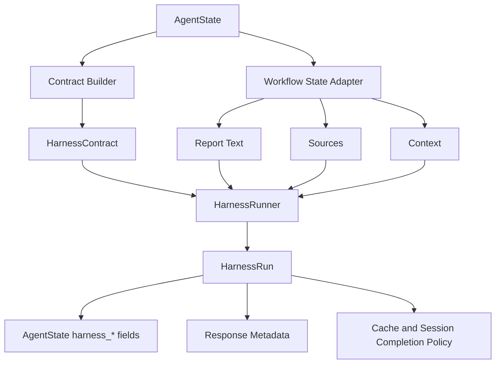

# NEOS Research Harness Whitepaper

**Status:** Runtime harness advancement implemented
**Last updated:** 2026-06-03
**Related documents:** `docs/HARNESS_PLAN.md`, `docs/HARNESS_IMPLE.md`, `docs/HARNESS_CR.md`

---

## Executive Summary

NEOS already had many validation mechanisms before the research harness work
began: fact checking, lightweight quality scoring, HyperDeep internal
verification, Mission validation contracts, and offline `neos_evals` graders.
The problem was not an absence of validation. The problem was that validation
was fragmented, inconsistently shaped, and not tied to a single runtime decision
about whether a research artifact could be treated as complete.

The research harness introduces that missing decision layer. It turns scattered
validation signals into a contract-driven runtime verdict:

- `pass`
- `advisory_pass`
- `needs_repair`
- `fail`
- `skipped`

The harness is hybrid in two ways. First, it is designed to bridge runtime
validation and offline evaluation. Second, it supports both blocking `gate`
mode and non-blocking `advisory` mode. This lets NEOS apply strict verification
where failure is costly, while preserving responsiveness for ordinary low-risk
requests.

The first implemented batch established the runtime foundation:

- shared harness data models
- policy selection
- contract construction
- deterministic checkers
- weighted scoring
- explicit verdicts
- final-response validation in the standard workflow
- gate failure enforcement before normal completion
- response metadata
- cache policy
- focused regression tests

The current implementation extends that foundation into a deeper contract layer
across the main runtime surfaces:

- bounded repair planning and standard workflow repair revalidation
- direct Deep Research API gating, repair attempt orchestration, and
  revalidation before completion
- Mission validation contract mapping and summary integration
- custom workflow builder harness processor support
- standard workflow and direct API harness events
- offline `neos_evals` grader result bridging
- explicit checker registry semantics for missing required checks
- async-capable checker execution
- optional deterministic topic coverage checking
- feature-flagged model-based factuality and bias/perspective checks
- deterministic performance-budget checks
- harness profile presets for common policy shapes
- dedicated persistence tables and repository behind a feature flag
- privacy-reviewed evidence storage policy with summary-only, redacted, and
  full modes

The remaining work is now mostly operational: calibrating model-based checks
with offline evals, wiring production-grade Direct Deep Research repair action
executors, exposing repair progress cleanly in clients, and deciding where full
evidence persistence is privacy-approved.

---

## 1. Why NEOS Needs a Research Harness

Research workflows differ from ordinary chat workflows. A research answer is not
only a text response; it is an artifact that often claims evidence, recency,
source coverage, and factual reliability. When such an artifact is cached,
stored, shown as complete, or used as memory for later work, NEOS is implicitly
saying: this output is good enough to reuse.

Before the harness, that implicit claim was too weakly enforced.

The existing system had useful validators, but their outputs lived in different
places and meant different things:

| Existing component | What it contributed | Limitation before harness |
| --- | --- | --- |
| `FactCheckProcessor` | Optional factual verification | Result was not part of one final verdict |
| `QualityValidator` | Completeness, relevance, coherence score | Too shallow for research quality |
| HyperDeep internal validation | Cross-validation, fact verification, bias checks, iterative refinement | Strong but local to HyperDeep |
| Mission `ValidationContract` | Contract concepts such as sources, freshness, coverage | Weak enforcement in current Mission path |
| `neos_evals` graders | Offline citation, factuality, diversity, coverage evaluation | Not connected to runtime result shape |

The harness answers a different question from any one checker:

> Given this request, this risk level, this output, and this evidence set, may
> NEOS finalize the artifact, cache it, and mark the session complete?

That question requires a runtime contract, not just another score.

---

## 2. Core Thesis

The research harness treats verification as a first-class workflow contract.

The contract defines:

- which mode applies: `off`, `advisory`, or `gate`
- how risky the request is
- what score is sufficient
- how many sources are required
- whether freshness is required
- which checks are mandatory
- how many repair attempts are allowed
- what failure policy should apply

The runner executes checkers against a candidate artifact and produces a
verdict. Workflow finalization then respects that verdict.

This separation matters. Checkers can evolve. Thresholds can change. New
runtime paths can be integrated. But the meaning of a verdict stays explicit
and stable.

---

## 3. Design Goals

### 3.1 Deterministic Checks First

The harness starts with cheap deterministic checks:

- source count
- source identity
- domain diversity
- citation marker validity
- citation coverage
- source freshness metadata
- workflow metadata integrity

These checks are fast, local, and easy to test. They catch many failure modes
without adding model cost or latency.

Model-based checks are also now part of the runtime, but they remain optional
and feature-flagged. `factuality` and `bias_perspective` use an injectable
model judge interface so tests can run with fake judges while production can
route through the LangChain LLM factory. If model checks are disabled, optional
checks skip cleanly, while required gate-mode factuality or bias checks fail
explicitly instead of silently passing.

This preserves the original deterministic-first posture while allowing
high-value contracts to ask deeper questions about factual support and
perspective balance.

### 3.2 Gate Only Where It Matters

Blocking every response would make NEOS slower and more brittle. Never blocking
would make validation toothless. The harness therefore separates two runtime
modes:

| Mode | Behavior | Typical use |
| --- | --- | --- |
| `gate` | Failed or unresolved verdict blocks normal finalization | deep research, HyperDeep, high-risk, freshness-sensitive, high-complexity work |
| `advisory` | Response can continue with warning metadata | ordinary low-risk requests |

The default policy uses `auto` mode, which upgrades to `gate` for research-like
or risk-sensitive scenarios and otherwise uses `advisory`.

### 3.3 Validate the Artifact That Users Receive

The code review identified a central issue in the first implementation: the
harness originally ran before `ResponseGenerator`, which meant it could validate
intermediate state rather than the actual final response. That undermined the
meaning of the verdict.

The improved workflow now validates after response generation:

```text
QUALITY_VALIDATOR
  -> SELF_REFLECTION
  -> RESPONSE_GENERATOR
  -> RESEARCH_HARNESS
  -> END
```

The harness therefore sees the `final_response` that would otherwise be
returned to the user.

### 3.4 Verdicts Must Affect Finalization

A gate verdict is not metadata. A gate verdict is a runtime control decision.

In the current implementation:

- `gate + pass` can complete normally.
- `gate + needs_repair` enters a bounded repair loop in the standard workflow
  when repair attempts remain.
- `gate + needs_repair` blocks normal completion when repair attempts are
  exhausted or when the runtime path does not execute repair.
- `gate + fail` returns a controlled failure result.
- failed gate outputs are not cached.
- failed gate outputs are not recorded as completed sessions.
- the unverified candidate text is retained as `blocked_response` for
  diagnostics and future repair.

### 3.5 Runtime and Offline Evaluation Should Share Shapes

Runtime checks and offline `neos_evals` graders now share compatible result
semantics through an adapter from `GraderResult` to `HarnessCheckResult`. The
runtime still does not depend on the heavy offline evaluation orchestrator, but
offline grader results can now drive harness verdict behavior in regression
tests and analysis.

---

## 4. Architecture Overview

The harness package is centered under:

```text
neos/workflow/harness/
```

Current runtime package layout:

```text
neos/workflow/harness/
  __init__.py
  models.py
  policy.py
  contract_builder.py
  events.py
  repair.py
  runner.py
  cache_policy.py
  privacy.py
  adapters/
    deep_research_report.py
    mission.py
    neos_evals.py
    workflow_state.py
  checkers/
    base.py
    citations.py
    sources.py
    freshness.py
    metadata.py
    model_based.py
    model_judge.py
    performance.py
```

High-level runtime flow:



The architecture deliberately separates runtime concerns:

| Concern | File | Responsibility |
| --- | --- | --- |
| Contract and result schema | `models.py` | Stable dataclasses and enums |
| Mode selection | `policy.py` | Decide `off`, `advisory`, or `gate` |
| Contract construction | `contract_builder.py` | Translate workflow state into a harness contract |
| Artifact extraction | `adapters/workflow_state.py` | Extract report text, sources, and context |
| Check orchestration | `runner.py` | Run checks, score, and decide verdict |
| Repair planning | `repair.py` | Convert failed checks into targeted bounded repair actions |
| Runtime events | `events.py` | Shared harness event payload vocabulary |
| Runtime adapters | `adapters/*.py` | Translate workflow, direct API, Mission, and eval shapes |
| Evidence privacy | `privacy.py` | Redact or preserve check evidence according to storage policy |

This split keeps the harness extensible. New checkers do not need to know how
workflow routing works. Workflow routing does not need to know how citation
coverage is computed.

---

## 5. Contract Model

The central runtime object is `HarnessContract`.

Conceptually, it contains:

```text
mode
risk_level
min_score
min_sources
min_citation_coverage
min_source_diversity
freshness_required
freshness_window_days
required_sources
required_checks
optional_checks
blocked_domains
preferred_domains
high_risk_categories
max_repair_attempts
failure_policy
metadata
```

The contract is not just configuration. It is the binding agreement between
request classification, workflow state, and finalization policy.

For example:

- A general low-risk answer can run in `advisory` mode.
- A `deep_research` request defaults to `gate`.
- A freshness-sensitive query defaults to `gate`.
- A Mission validation contract maps required sources, freshness, citation,
  factuality, and coverage requirements into the harness contract.
- A custom workflow node can run the research harness processor using
  `processor_type="research_harness"`.
- A request or workflow can select a `harness_profile`, such as
  `mission_strict` or `direct_deep_research`, to apply a preset bundle of mode,
  thresholds, required checks, and optional checks.

The current `build_harness_contract()` implementation draws from:

- `query_intent` or `intent`
- `complexity_score` or `query_classification`
- request metadata
- harness metadata
- workflow metadata
- `validation_contract`
- optional `harness_config`
- optional `harness_profile`

This lets the harness start as a standard workflow node while remaining ready
for Mission, custom workflow, and direct API integrations.

---

## 6. Policy Model

Policy selection happens in `decide_harness_policy()`.

The current decision order is:

1. If `RESEARCH_HARNESS_ENABLED=false`, return `off`.
2. If request metadata explicitly sets a harness mode, honor it when allowed.
3. If metadata selects a known `harness_profile`, apply the profile mode,
   threshold, risk level, and repair budget.
4. `hyper_deep_research` and `deep_research` use `gate`.
5. high-risk requests use `gate`.
6. freshness-required requests use `gate`.
7. high-complexity requests use `gate`.
8. configured default `gate` or allowed default `off` is respected.
9. otherwise use `advisory`.

The most important policy correction from code review is that the global
feature flag is authoritative. If an operator disables the harness during
incident response, request metadata cannot silently re-enable it.

Default thresholds:

| Setting | Default | Meaning |
| --- | ---: | --- |
| `RESEARCH_HARNESS_GATE_THRESHOLD` | `0.82` | minimum score for gate pass |
| `RESEARCH_HARNESS_ADVISORY_THRESHOLD` | `0.70` | minimum score for advisory pass |
| `RESEARCH_HARNESS_HIGH_RISK_THRESHOLD` | `0.90` | stricter high-risk gate threshold |
| `RESEARCH_HARNESS_MAX_REPAIR_ATTEMPTS` | `1` | standard bounded repair budget |
| `RESEARCH_HARNESS_HYPER_DEEP_REPAIR_ATTEMPTS` | `2` | HyperDeep/direct research repair budget |
| `RESEARCH_HARNESS_PERSIST_RUNS` | `false` | persist harness runs/checks to dedicated tables |
| `RESEARCH_HARNESS_MODEL_CHECKS_ENABLED` | `true` | enable model-based checkers when selected |
| `RESEARCH_HARNESS_MODEL_CHECK_TIMEOUT_SECONDS` | `20` | per-check model judge timeout |
| `RESEARCH_HARNESS_MODEL_CHECK_MAX_CLAIMS` | `8` | maximum sampled factual claims per factuality check |
| `RESEARCH_HARNESS_MODEL_CHECK_PROVIDER` | empty | optional provider override for harness judge |
| `RESEARCH_HARNESS_MODEL_CHECK_MODEL` | empty | optional model override for harness judge |
| `RESEARCH_HARNESS_EVIDENCE_STORAGE_POLICY` | `summary_only` | persistence policy for evidence and failed items |

The same settings are now documented in `.env.template`, which matters for
rollout and operational control. Explicit request mode still takes precedence
over profiles, but global disable remains authoritative.

---

## 7. Checkers Implemented in the Runtime

The current implementation includes deterministic and feature-flagged
model-based checkers. Deterministic checks establish the cheap first validation
layer. Model checks add deeper judgment when a contract explicitly selects
them.

The runner now has explicit checker registry semantics. If a required check is
selected but no checker is available, the harness materializes a failed
`HarnessCheckResult` for that check. Optional unavailable checks are not
materialized as failures. This prevents strict contracts from silently passing
when they request checks the runtime cannot execute.

### 7.1 Source Count

`SourceCountChecker` verifies that the artifact has enough unique sources and
that required sources are represented.

It helps catch:

- empty evidence sets
- insufficient source count
- missing required domains or source hints

### 7.2 Source Diversity

`SourceDiversityChecker` parses domains with `urllib.parse.urlparse` and scores
domain diversity. In gate mode, it fails when one domain dominates more than
60% of the source set.

It helps catch:

- overreliance on one source
- weak independence across evidence
- vendor- or domain-dominated research

### 7.3 Citation Validity

`CitationValidityChecker` parses numeric citation markers such as `[1]` and
checks that they resolve to known source IDs.

It helps catch:

- hallucinated citation IDs
- broken reference maps
- citation/source mismatch

### 7.4 Citation Coverage

`CitationCoverageChecker` scores sentence-level citation coverage. It counts a
sentence as covered when it has a numeric citation marker or a `(Source: ...)`
fallback.

It helps catch:

- uncited factual sentences
- reports that have sources but do not attach them to claims
- weak evidence presentation

### 7.5 Freshness

`FreshnessChecker` passes when freshness is not required. When freshness is
required, it looks for source dates in common fields such as:

- `published_at`
- `published_date`
- `date`
- `timestamp`
- corresponding nested metadata fields

The improved implementation treats missing source dates as `critical` in gate
mode. This prevents current/latest/recent claims from passing a gate solely
because other checks scored well.

### 7.6 Metadata Integrity

`MetadataIntegrityChecker` fails empty final reports and workflow contexts that
carry errors. It also records evidence when sources lack identity metadata.

It helps catch:

- incomplete workflow runs
- empty output masquerading as a report
- workflow errors hidden behind a final response

### 7.7 Topic Coverage

`TopicCoverageChecker` is an optional deterministic checker for configured
coverage requirements. It checks whether required topic strings appear in the
candidate report and skips cleanly when no coverage requirements are provided.

It helps catch:

- missing required sections or topics
- incomplete responses against Mission coverage contracts
- cheap first-pass coverage regressions before heavier model checks run

### 7.8 Factuality

`FactualityChecker` is a model-based checker selected by the `factuality`
check name. It samples up to `RESEARCH_HARNESS_MODEL_CHECK_MAX_CLAIMS`
candidate factual claims and asks an injectable model judge to compare those
claims against source snippets and citation context.

It helps catch:

- unsupported cited claims
- claims that are plausible but absent from the evidence set
- strict Mission contracts that require factuality beyond citation shape

Runtime behavior is intentionally conservative:

- optional `factuality` with model checks disabled skips with metadata
  `reason="model_checks_disabled"`
- required `factuality` with model checks disabled fails in gate mode
- enabled model checks execute through the async runner path
- failed unsupported claims are repairable through
  `regenerate_unsupported_claims`

### 7.9 Bias and Perspective

`BiasPerspectiveChecker` is a model-based checker selected by
`bias_perspective`. It asks the model judge to inspect source perspective
diversity, report framing, missing counterarguments, stakeholder coverage, and
high-risk categories from the contract.

It helps catch:

- single-perspective or vendor-dominated reports
- missing counterevidence
- loaded framing on high-risk topics
- reports that are factual but one-sided

The checker is best treated as optional/advisory until calibration data is
available. Failed results are repairable through
`add_perspective_balancing_sources`.

### 7.10 Performance Budget

`PerformanceBudgetChecker` is deterministic and registered by default. It
skips when no budget metadata is configured.

Supported budget fields are:

- `max_processing_time_ms`
- `max_validation_latency_ms`
- `max_total_llm_calls`
- `max_total_tokens`
- `max_repair_attempts_observed`

It helps catch artifacts that may be correct but operationally too expensive
for a policy. Performance failures are not repairable by the harness because
they represent operational budget violations, not content gaps.

---

## 8. Scoring and Verdict Semantics

The runner computes a weighted score from check results. Current default
weights are:

| Check | Weight |
| --- | ---: |
| citation coverage | `0.18` |
| citation validity | `0.12` |
| source diversity | `0.10` |
| source count | `0.08` |
| freshness | `0.07` |
| performance budget | `0.03` |
| metadata integrity | `0.02` |

Selected custom or optional checks that are not in this table use the runner's
default weight.

Skipped checks are excluded from weighted scoring. If every returned check is
skipped and all checks passed, the run score is treated as `1.0`; otherwise it
falls back to `0.0`. This keeps optional skipped model/performance checks from
diluting deterministic scores.

The score is not the whole decision. Verdict logic also considers:

- critical failures
- repairable failures
- remaining repair attempts
- required check failures
- mode-specific threshold

The improved required-check rule is especially important:

```text
gate mode:
  failed required check + repairable + attempts remain -> needs_repair
  failed required check + no attempts remain -> fail
```

This prevents a mandatory check from being outweighed by unrelated passing
checks.

The runner has both sync and async entry points:

- `run()` remains available for deterministic synchronous tests and callers.
- `arun()` executes async checkers with `checker.arun()` when present and falls
  back to `checker.run()` otherwise.
- `arun()` can emit `CHECK_STARTED` and `CHECK_COMPLETED` callbacks for
  standard workflow progress events and Direct Deep Research SSE collection.

Verdict meanings:

| Verdict | Meaning |
| --- | --- |
| `pass` | Gate-mode artifact satisfied the contract |
| `advisory_pass` | Advisory artifact is acceptable with non-blocking validation metadata |
| `needs_repair` | Failure is repairable and budget remains; runtime must repair and revalidate or block |
| `fail` | Artifact does not satisfy the contract |
| `skipped` | Harness was explicitly off |

---

## 9. Workflow Integration

The harness is now part of the standard LangGraph workflow.

Current successful research path:

```text
RESULT_INTEGRATOR
  -> FACT_CHECK
  -> QUALITY_VALIDATOR
  -> SELF_REFLECTION
  -> RESPONSE_GENERATOR
  -> RESEARCH_HARNESS
  -> END
```

Current repairable gate path:

```text
RESPONSE_GENERATOR
  -> RESEARCH_HARNESS
  -> RESEARCH_HARNESS_REPAIR
  -> RESEARCH_HARNESS
  -> END
```

This ordering is intentional:

- `FACT_CHECK` and `QUALITY_VALIDATOR` still run before the response is built.
- `SELF_REFLECTION` can still inspect integrated results before response
  generation.
- `RESPONSE_GENERATOR` creates the candidate final response.
- `RESEARCH_HARNESS` validates the exact final response candidate.
- `RESEARCH_HARNESS_REPAIR` creates a targeted repair plan, performs bounded
  repair work for supported actions, regenerates the candidate response, and
  returns to `RESEARCH_HARNESS` for revalidation.
- normal finalization occurs only after the harness state has been merged.

The graph wrapper for `_research_harness_node()` returns:

```python
{**state, **updates}
```

This matters because `RESEARCH_HARNESS` is now the final node. The node must
preserve the generated response state while adding `harness_*` fields.

---

## 10. Gate Enforcement

The main review-driven improvement is true gate enforcement.

The helper `_is_gate_harness_blocked()` treats these verdicts as blocking in
gate mode:

```text
fail
needs_repair
```

When blocked, `_create_workflow_result()` returns:

- `success=false`
- a controlled Korean explanation
- `blocked_response` containing the unverified candidate response
- harness metadata
- `research_harness_gate_failed` in `errors`

The controlled message is:

```text
검증 중 일부 핵심 조건을 만족하지 못해 최종 보고서로 확정하지 않았습니다.
부족한 항목: ...
가능한 다음 작업: 추가 검색 또는 수리 후 재검증
```

Then `execute_workflow()` avoids normal session completion. Instead, for blocked
gate results it calls `_record_session_harness_blocked()`, which writes a failed
session status with harness metadata.

This is the difference between a validation annotation and a runtime gate.

The direct Deep Research API follows the same gate semantics at completion
time. Before marking a report or assistant message completed, it validates the
assembled final report with `DeepResearchHarnessService`.

Direct Deep Research now returns a validation envelope containing:

- the `HarnessRun`
- the `HarnessContract`
- the assembled report text
- the normalized source list

That envelope lets the handler plan repair against the same contract that
produced the verdict. When a gate run returns `needs_repair`, the handler emits
`harness_repair_started`, calls `DeepResearchRepairService`, emits
`harness_repair_completed`, revalidates, and only then completes or fails the
report.

The repair service is deliberately bounded. It plans supported repair actions,
but actual Direct Deep Research section/source mutation is delegated to an
injectable action executor. If no executor is configured, actions are skipped
with explicit metadata rather than performing unsafe implicit rewrites. A gate
run that still returns `needs_repair` or `fail` after repair handling marks the
report failed and emits `harness_failed` instead of the normal completion
event.

---

## 11. Response Metadata and Cache Policy

Harness metadata is exposed in final response metadata:

```json
{
  "harness": {
    "enabled": true,
    "mode": "gate",
    "verdict": "pass",
    "score": 0.87,
    "failed_checks": [],
    "repair_attempts": 0,
    "threshold": 0.82,
    "risk_level": "medium"
  }
}
```

The metadata is additive. It does not replace legacy `quality_score`.

For repair planning, `ResearchHarnessProcessor` also stores compact per-check
metadata in `harness_metadata.check_results`. This preserves failed items,
severity, repairability, and checker metadata without requiring repair code to
reconstruct check results from free-form summaries.

Cache policy is centralized in `neos/workflow/harness/cache_policy.py`.

Current behavior:

| Harness state | Cache behavior |
| --- | --- |
| no harness metadata | preserve existing behavior |
| `pass` | allowed |
| `advisory_pass` | allowed |
| `skipped` | allowed |
| `gate + fail` | blocked |
| `needs_repair` | blocked |
| `advisory + fail` | blocked unless policy is `allow_advisory_fail` |

This avoids cache pollution from failed or unresolved research artifacts.

---

## 12. What the Code Review Changed

The code review identified five material issues and two operational/documentary
issues.

| Review issue | Status after improvement |
| --- | --- |
| Gate verdict did not block finalization | Fixed through result/session completion policy |
| Harness validated intermediate text | Fixed by moving harness after response generation |
| Freshness-required gate could pass with no source dates | Fixed by making missing dates critical in gate mode |
| Global disable could be overridden by explicit request mode | Fixed by making `RESEARCH_HARNESS_ENABLED=false` authoritative |
| `required_checks` selected checks but did not make failures blocking | Fixed in runner verdict logic |
| `.env.template` did not document settings | Fixed by adding research harness configuration |
| Harness unit tests triggered DB setup noise | Reduced by skipping DB fixtures for harness-focused tests |

This review cycle sharpened the meaning of "gate." The first implementation
created a harness verdict. The improved implementation makes the verdict govern
artifact finalization.

The subsequent harness advancement added the missing contract depth:

| Advancement | Current status |
| --- | --- |
| Missing required-check semantics | Implemented in runner registry handling |
| Async-capable checker execution | Implemented through `HarnessRunner.arun()` |
| Check-start event parity | Implemented through runner callbacks and SSE collection |
| Model factuality | Implemented behind model-check feature flags |
| Bias/perspective | Implemented behind model-check feature flags |
| Performance budgets | Implemented as a deterministic checker |
| Direct Deep Research repair loop | Implemented with bounded service and injectable executor |
| Evidence persistence policy | Implemented with summary-only default and redaction support |
| Harness profile presets | Implemented in policy and contract builder |
| Offline eval calibration mapping | Extended for `factuality` and `bias_perspective` |

---

## 13. Current Implementation Status

Implemented:

- `HarnessMode`, `HarnessVerdict`, `HarnessRiskLevel`
- `HarnessContract`, `HarnessCheckResult`, `HarnessRun`
- `HarnessRepairAction`, `HarnessRepairPlan`
- policy selection
- harness profile presets
- contract building from workflow state
- Mission validation contract mapping into harness config
- deterministic checkers for sources, citations, freshness, metadata
- optional deterministic topic coverage checker
- feature-flagged model-based factuality checker
- feature-flagged model-based bias/perspective checker
- deterministic performance budget checker
- injectable model judge protocol and LangChain-backed default judge
- robust model judge JSON parsing
- weighted scoring
- skipped-check score exclusion
- checker registry lookup and explicit missing required-check failures
- async runner path with sync-checker fallback
- check-start and check-completed event callbacks
- required-check blocking semantics
- final-response validation in the standard workflow
- bounded standard workflow repair planning and revalidation
- gate failure result blocking
- failed gate session status path
- direct Deep Research API harness gating before completion
- direct Deep Research validation envelope with run, contract, report, and sources
- direct Deep Research repair-start/repair-completed loop with revalidation
- direct API harness SSE events including check-start/check-completed and repair events
- shared harness event payloads
- Mission validation summary integration
- custom workflow harness processor support
- custom workflow gate blocking
- offline `neos_evals` grader bridge
- offline eval mapping for `factuality` and `bias_perspective`
- dedicated DB migration and repository for harness runs/checks
- persistence feature flag
- evidence storage policy metadata
- summary-only, redacted, and full evidence persistence modes
- harness response metadata
- cache policy
- environment template documentation
- focused unit and routing tests

Not yet implemented:

- production Direct Deep Research action executors for every planned repair
  action. The service can plan and orchestrate repair, but live mutation/search
  execution is intentionally injectable and skipped when no executor is
  configured.
- calibrated thresholds and false-positive review for model-based factuality
  and bias/perspective checks.
- client UX for displaying harness and repair progress in detail.
- privacy approval for using `RESEARCH_HARNESS_EVIDENCE_STORAGE_POLICY=full`
  outside controlled eval environments.

This boundary is deliberate. The current implementation covers the main verdict,
checker, repair orchestration, and persistence semantics. The remaining work is
primarily production action execution, calibration, and operational hardening.

---

## 14. Verification Status

Focused harness, workflow, Mission, Direct API, custom workflow, persistence,
and migration verification currently passes:

```bash
pytest tests/workflow/harness \
  tests/workflow/processors/test_research_harness_processor.py \
  tests/workflow/processors/test_research_harness_repair_processor.py \
  tests/workflow/test_harness_graph_routing.py \
  tests/workflow/test_harness_graph_repair.py \
  tests/workflow/test_harness_response_metadata.py \
  tests/workflow/mission \
  tests/api/test_deep_research_harness_service.py \
  tests/api/test_deep_research_harness_repair.py \
  tests/workflow/builder/test_node_executor_harness.py \
  tests/workflow/builder/test_workflow_executor_harness_state.py \
  tests/workflow/builder/test_workflow_executor_harness_gate.py \
  tests/database/repositories/test_harness_repository.py \
  tests/db/test_research_harness_migration_sql.py -q
```

Observed result:

```text
118 passed
```

Compile check:

```bash
python -m compileall neos/workflow/harness \
  neos/workflow/processors/research_harness_processor.py \
  neos/workflow/processors/research_harness_repair_processor.py \
  neos/workflow/graph.py \
  neos/api/services/deep_research_harness_service.py \
  neos/api/services/deep_research_repair_service.py \
  neos/api/handlers/deep_research_handlers.py \
  neos/workflow/mission \
  neos/workflow/builder
```

Observed result:

```text
compileall completed successfully
```

Baseline graph suite observed before this integration:

```bash
pytest tests/test_workflow_graph.py -q
```

Observed result:

```text
37 passed
```

Some focused tests still emit DB initialization log noise in the sandbox
(`Operation not permitted`) because shared fixtures touch database setup. Those
logs did not fail the verification commands above.

---

## 15. Operational Rollout

The harness is controlled by environment settings:

```text
RESEARCH_HARNESS_ENABLED=true
RESEARCH_HARNESS_ALLOW_OFF=false
RESEARCH_HARNESS_DEFAULT_MODE=auto
RESEARCH_HARNESS_GATE_THRESHOLD=0.82
RESEARCH_HARNESS_ADVISORY_THRESHOLD=0.70
RESEARCH_HARNESS_HIGH_RISK_THRESHOLD=0.90
RESEARCH_HARNESS_MAX_REPAIR_ATTEMPTS=1
RESEARCH_HARNESS_HYPER_DEEP_REPAIR_ATTEMPTS=2
RESEARCH_HARNESS_MODEL_CHECKS_ENABLED=true
RESEARCH_HARNESS_MODEL_CHECK_TIMEOUT_SECONDS=20
RESEARCH_HARNESS_MODEL_CHECK_MAX_CLAIMS=8
RESEARCH_HARNESS_MODEL_CHECK_PROVIDER=
RESEARCH_HARNESS_MODEL_CHECK_MODEL=
RESEARCH_HARNESS_STORE_FULL_CHECK_DETAILS=false
RESEARCH_HARNESS_PERSIST_RUNS=false
RESEARCH_HARNESS_EVIDENCE_STORAGE_POLICY=summary_only
RESEARCH_HARNESS_CACHE_POLICY=passed_only
```

Recommended rollout sequence:

1. Enable the integrated harness in internal environments and inspect
   pass/fail/needs-repair distribution.
2. Keep standard workflow repair budgets conservative
   (`RESEARCH_HARNESS_MAX_REPAIR_ATTEMPTS=1`) while observing latency.
3. Roll direct Deep Research gate and repair orchestration through staging.
   Verify repair events are emitted, skipped executor actions are explicit, and
   failed reports are not marked completed.
4. Enable Mission contract mapping for Mission-heavy workflows and compare
   Mission validation summaries with harness verdicts.
5. Expose harness events in clients so users can see validation and repair
   progress.
6. Apply migration `032_add_research_harness_tables.sql`, then enable
   `RESEARCH_HARNESS_PERSIST_RUNS=true` after migration validation.
7. Keep `RESEARCH_HARNESS_EVIDENCE_STORAGE_POLICY=summary_only` by default.
   Move to `redacted` only after reviewing stored rows for sensitive text
   leakage. Use `full` only in controlled internal eval environments.
8. Enable model-based checks first as optional/advisory checks, track latency,
   parse errors, and disagreement with offline evals, then promote factuality
   to required only for strict contracts with sufficient source evidence.

Operational metrics to track:

- harness mode distribution
- pass/fail/needs-repair rates
- most common failed checks
- gate block rate
- cache skip rate caused by harness failures
- validation latency
- repair success rate once repair execution exists
- model-check timeout and parse-error rate
- evidence redaction policy distribution
- user retry rate after blocked reports

---

## 16. Security and Safety Properties

The harness improves safety in several concrete ways:

1. **Feature flag authority**
   - Global disable cannot be overridden by ordinary request metadata.

2. **No silent gate failures**
   - Failed gate results cannot be normal successful workflow results.

3. **No failed gate cache writes**
   - Cache policy blocks failed or unresolved harness results.

4. **No completed session for blocked gate output**
   - Blocked gate results use a failed session status path.

5. **Diagnostic retention without user-facing false confidence**
   - The candidate text is retained as `blocked_response`, but the primary
     response is a controlled failure message.

6. **Bounded repair**
   - Repair planning is attempt-limited and returns to harness validation before
     finalization.

7. **Deterministic first pass**
   - Many failures are caught without adding model nondeterminism or network
     dependency.

8. **Explicit model-check disable semantics**
   - Optional model checks skip when disabled. Required model checks fail in
     gate mode when disabled, so a strict contract cannot silently pass.

9. **Privacy-reviewed persistence**
   - Evidence and failed items are summary-only by default. Redacted mode hashes
     sensitive text fields and strips URLs to domains. Full mode is explicit.

10. **Safe Direct repair default**
    - Direct Deep Research repair orchestration is bounded and executor-driven.
      Without an executor, planned actions are skipped explicitly rather than
      mutating reports implicitly.

These properties are still bounded by current implementation limits. For
example, model-based factuality is only as good as the sampled claims, source
snippets, prompt, and judge model. That is why offline calibration and staged
rollout remain important.

---

## 17. Roadmap

### Phase A: Repair Planner and Bounded Repair Execution

Status: implemented for the standard workflow; orchestration implemented for
Direct Deep Research with injectable action execution.

`needs_repair` now routes to a repair processor when gate mode has attempts
remaining. Repairable failures become targeted actions:

- rebuild citation maps
- request more sources
- search for independent domains
- date-constrained freshness search
- regenerate affected sections with citations

Repair remains bounded and targeted. The standard workflow revalidates after
repair before finalization. Direct Deep Research now emits repair events,
invokes a repair service, and revalidates before finalization. Production
section/source mutation remains executor-driven and must be wired per supported
action.

### Phase B: Direct Deep-Research API Gating

Status: implemented for completion gating, event collection, repair
orchestration, and revalidation.

The direct deep-research API now validates assembled report sections with the
harness before completion. Gate pass uses the harness score for quality.
Gate-mode `needs_repair` emits repair started/completed events and revalidates.
Gate failure or unresolved `needs_repair` marks the report failed and emits
harness failure events instead of normal completion.

### Phase C: Mission Validation Upgrade

Status: implemented for contract mapping and validation summaries.

Mission validation contract fields now translate into harness config:

- required sources
- min quality score
- freshness requirement
- citation requirement
- factuality requirement
- coverage requirement

Mission validation summaries also include harness mode, verdict, score, and
failed checks when harness state is present.

### Phase D: Streaming Events

Status: implemented for standard workflow progress and direct Deep Research SSE.

Clients can receive harness progress events:

- harness started
- check started
- check completed
- repair started
- repair completed
- harness completed

This matters because gate validation can be visible work, not invisible delay.

### Phase E: Offline Eval Bridge

Status: implemented for `GraderResult` conversion and extended model-check
mapping.

Offline graders adapt into `HarnessCheckResult` so runtime and offline
evaluation share compatible result semantics.

This also allows regression testing of:

- check thresholds
- model changes
- prompt changes
- repair behavior
- domain-specific validation policies

### Phase F: Dedicated Persistence

Status: migration and repository implemented behind a feature flag, with
privacy-reviewed evidence policy applied before check rows are written.

The implementation still stores harness summaries in state and response
metadata. Dedicated tables now exist for deployments that enable persistence:

- `research_harness_runs`
- `research_harness_check_results`

Persistence remains off by default through `RESEARCH_HARNESS_PERSIST_RUNS=false`
so operators can apply and verify the migration before writing runtime data.
When enabled, evidence defaults to `summary_only`. `redacted` hashes sensitive
text fields and stores URL domains only. `full` preserves raw evidence and
should be limited to approved eval environments.

### Phase G: Model-Based Checkers

Status: implemented behind feature flags.

`FactualityChecker` and `BiasPerspectiveChecker` use the shared model judge
protocol in `model_judge.py`. They are async-capable, injectable for tests, and
bounded by timeout/model/claim-count settings. Factuality maps to
`regenerate_unsupported_claims`; bias/perspective maps to
`add_perspective_balancing_sources`.

### Phase H: Performance Budgets

Status: implemented.

`PerformanceBudgetChecker` reads configured budget metadata and observed
context metrics, then fails when processing time, validation latency, LLM call
count, token count, or repair attempts exceed policy.

### Remaining Follow-Up Work

The next roadmap items are:

- Wire production Direct Deep Research action executors for supported repair
  actions.
- Calibrate model-based factuality and bias/perspective thresholds against
  offline eval fixtures.
- Build client UX for displaying harness and repair progress events.
- Review privacy policy before enabling redacted or full evidence storage in
  staging/production.
- Expand calibration docs and fixtures for high-citation but factually wrong,
  single-perspective, source-light, and expensive-but-correct reports.

---

## 18. Design Risks

| Risk | Why it matters | Mitigation |
| --- | --- | --- |
| False negative gate failures | Good reports may be blocked | advisory mode, transparent failed checks, bounded repair |
| False positive passes | Bad reports may appear verified | add factuality and bias checks, use offline bridge for regression |
| Latency increase | Users wait longer | deterministic-first checks, model checks only when needed |
| Model judge instability | Factuality/bias results can vary by model and prompt | injectable judge, JSON parser fallback, offline calibration |
| Cache underuse | More cache skips in advisory fail/gate fail | track cache skip rate, tune thresholds |
| Metadata drift | Runtime and eval schemas diverge | use shared harness result models |
| Repair loops become expensive | Cost and latency can grow | strict repair budget, targeted actions only |
| Direct repair no-op confusion | Repair orchestration can skip actions when no executor is configured | explicit skipped action metadata and SSE repair completed payload |
| Evidence leakage | Failed items can contain sensitive claims or snippets | summary-only default, redacted policy, full mode only after review |
| Operators cannot disable safely | Incident mitigation becomes hard | authoritative global feature flag |

---

## 19. Conceptual Summary

The research harness changes NEOS from a workflow that generates answers and
attaches quality hints into a workflow that can enforce research contracts.

The distinction is subtle but important:

- A quality score is descriptive.
- A harness verdict is operational.

The first tells a client how good an answer appears to be. The second tells the
runtime whether it may finalize, cache, and persist that answer as complete.

This is why the review-driven fixes were not cosmetic. Moving the harness after
`ResponseGenerator`, blocking failed gate results, respecting global disable,
and making required checks truly blocking all strengthen the same invariant:

> A gate-mode research artifact is not complete until the artifact the user
> would receive has satisfied the configured harness contract.

That invariant is the foundation for continued rollout and calibration.

---

## Appendix A: Key Files

| File | Role |
| --- | --- |
| `neos/workflow/harness/models.py` | Harness enums and dataclasses |
| `neos/workflow/harness/policy.py` | Mode/risk/threshold decision logic |
| `neos/workflow/harness/contract_builder.py` | State-to-contract translation |
| `neos/workflow/harness/runner.py` | Checker execution, scoring, verdicts |
| `neos/workflow/harness/cache_policy.py` | Cache write policy |
| `neos/workflow/harness/events.py` | Shared harness event payloads |
| `neos/workflow/harness/privacy.py` | Evidence and failed-item storage redaction |
| `neos/workflow/harness/repair.py` | Deterministic repair planner |
| `neos/workflow/harness/adapters/deep_research_report.py` | Direct Deep Research report/source extraction |
| `neos/workflow/harness/adapters/mission.py` | Mission contract to harness config mapping |
| `neos/workflow/harness/adapters/neos_evals.py` | Offline grader result bridge |
| `neos/workflow/harness/adapters/workflow_state.py` | Report/source/context extraction |
| `neos/workflow/harness/checkers/citations.py` | Citation validity and coverage |
| `neos/workflow/harness/checkers/sources.py` | Source count and diversity |
| `neos/workflow/harness/checkers/freshness.py` | Source recency/freshness |
| `neos/workflow/harness/checkers/metadata.py` | Metadata integrity |
| `neos/workflow/harness/checkers/model_based.py` | Topic coverage, factuality, and bias/perspective checkers |
| `neos/workflow/harness/checkers/model_judge.py` | Injectable model judge protocol, JSON parsing, prompts |
| `neos/workflow/harness/checkers/performance.py` | Deterministic performance budget checker |
| `neos/workflow/processors/research_harness_processor.py` | LangGraph processor wrapper |
| `neos/workflow/processors/research_harness_repair_processor.py` | Repair planning processor |
| `neos/workflow/graph.py` | Workflow routing and gate finalization |
| `neos/api/services/deep_research_harness_service.py` | Direct API harness service |
| `neos/api/services/deep_research_repair_service.py` | Direct API bounded repair orchestration |
| `neos/api/handlers/deep_research_handlers.py` | Direct API gate and SSE integration |
| `neos/workflow/mission/validators.py` | Mission validation summary integration |
| `neos/workflow/builder/executors.py` | Custom workflow harness processor branch |
| `neos/workflow/builder/workflow_executor.py` | Custom workflow harness state/gate blocking |
| `neos/database/repositories/harness_repository.py` | Harness persistence repository |
| `db/migrations/032_add_research_harness_tables.sql` | Dedicated harness persistence tables |
| `neos/workflow/processors/response_generator.py` | Response metadata shape |
| `.env.template` | Harness rollout settings |
| `docs/HARNESS_EVAL_CALIBRATION.md` | Runtime/offline model-check calibration note |

## Appendix B: Regression Tests

| Test file | Coverage |
| --- | --- |
| `tests/workflow/harness/test_policy.py` | Policy mode selection and global disable precedence |
| `tests/workflow/harness/test_contract_builder.py` | Contract construction |
| `tests/workflow/harness/test_mission_contract_adapter.py` | Mission contract adapter |
| `tests/workflow/harness/test_deep_research_adapter.py` | Direct API report/source adapter |
| `tests/workflow/harness/test_deterministic_checkers.py` | Citation/source/freshness/metadata checkers |
| `tests/workflow/harness/test_checker_registry.py` | Missing required-check and optional checker registry behavior |
| `tests/workflow/harness/test_model_based_checkers.py` | Topic coverage, factuality, bias/perspective, and model judge parsing |
| `tests/workflow/harness/test_performance_checker.py` | Performance budget checker and operational context extraction |
| `tests/workflow/harness/test_runner_async.py` | Async runner and sync-checker fallback |
| `tests/workflow/harness/test_runner_deterministic.py` | Pass, fail, needs-repair, required-check semantics |
| `tests/workflow/harness/test_repair_planner.py` | Failed-check to repair-action mapping |
| `tests/workflow/harness/test_events.py` | Shared harness event payloads |
| `tests/workflow/harness/test_neos_evals_adapter.py` | Offline grader bridge |
| `tests/workflow/harness/test_neos_evals_bridge_regression.py` | Offline grader results driving verdicts |
| `tests/workflow/harness/test_cache_policy.py` | Cache write decisions |
| `tests/workflow/processors/test_research_harness_processor.py` | State updates from processor |
| `tests/workflow/processors/test_research_harness_repair_processor.py` | Repair processor state updates |
| `tests/workflow/test_harness_graph_routing.py` | Final-response validation routing and state preservation |
| `tests/workflow/test_harness_graph_repair.py` | Repair routing helper behavior |
| `tests/workflow/test_harness_response_metadata.py` | Compact response metadata |
| `tests/api/test_deep_research_harness_service.py` | Direct Deep Research harness service and gate helper |
| `tests/api/test_deep_research_harness_repair.py` | Direct Deep Research repair service orchestration |
| `tests/workflow/mission/test_validators.py` | Mission summary harness integration |
| `tests/workflow/builder/test_node_executor_harness.py` | Custom workflow harness processor execution |
| `tests/workflow/builder/test_workflow_executor_harness_state.py` | Custom workflow initial harness state |
| `tests/workflow/builder/test_workflow_executor_harness_gate.py` | Custom workflow gate blocking |
| `tests/database/repositories/test_harness_repository.py` | Harness repository writes |
| `tests/db/test_research_harness_migration_sql.py` | Harness migration SQL structure |
| `tests/test_workflow_graph.py` | Legacy graph baseline and gate failure behavior |
