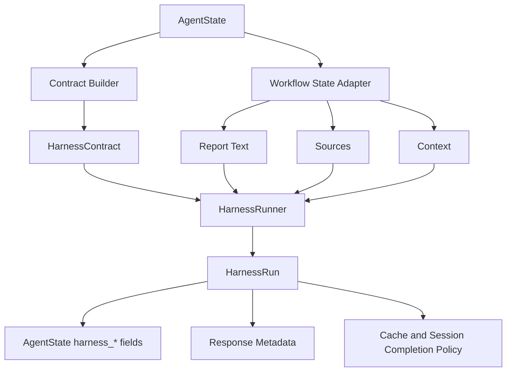

# NEOS Research Harness Whitepaper

**Status:** Runtime foundation implemented  
**Last updated:** 2026-05-31  
**Related documents:** `docs/HARNESS_PLAN.md`, `docs/HARNESS_IMPLE.md`, `docs/HARNESS_CR.md`

---

## Executive Summary

NEOS already had many validation mechanisms before the research harness work
began: fact checking, lightweight quality scoring, HyperDeep internal
verification, Mission validation contracts, and offline `neos_evals` graders.
The problem was not an absence of validation. The problem was that validation
was fragmented, inconsistently shaped, and not tied to a single runtime decision
about whether a research artifact could be treated as complete.

The research harness introduces that missing decision layer. It turns scattered
validation signals into a contract-driven runtime verdict:

- `pass`
- `advisory_pass`
- `needs_repair`
- `fail`
- `skipped`

The harness is hybrid in two ways. First, it is designed to bridge runtime
validation and offline evaluation. Second, it supports both blocking `gate`
mode and non-blocking `advisory` mode. This lets NEOS apply strict verification
where failure is costly, while preserving responsiveness for ordinary low-risk
requests.

The first implemented batch establishes the runtime foundation:

- shared harness data models
- policy selection
- contract construction
- deterministic checkers
- weighted scoring
- explicit verdicts
- final-response validation in the standard workflow
- gate failure enforcement before normal completion
- response metadata
- cache policy
- focused regression tests

The current implementation is intentionally not the full final harness. It does
not yet include repair execution, direct deep-research API gating, Mission
validator integration, custom workflow harness nodes, streaming harness events,
dedicated DB tables, or offline grader bridging. It is nevertheless the core
runtime contract on which those later capabilities can safely build.

---

## 1. Why NEOS Needs a Research Harness

Research workflows differ from ordinary chat workflows. A research answer is not
only a text response; it is an artifact that often claims evidence, recency,
source coverage, and factual reliability. When such an artifact is cached,
stored, shown as complete, or used as memory for later work, NEOS is implicitly
saying: this output is good enough to reuse.

Before the harness, that implicit claim was too weakly enforced.

The existing system had useful validators, but their outputs lived in different
places and meant different things:

| Existing component | What it contributed | Limitation before harness |
| --- | --- | --- |
| `FactCheckProcessor` | Optional factual verification | Result was not part of one final verdict |
| `QualityValidator` | Completeness, relevance, coherence score | Too shallow for research quality |
| HyperDeep internal validation | Cross-validation, fact verification, bias checks, iterative refinement | Strong but local to HyperDeep |
| Mission `ValidationContract` | Contract concepts such as sources, freshness, coverage | Weak enforcement in current Mission path |
| `neos_evals` graders | Offline citation, factuality, diversity, coverage evaluation | Not connected to runtime result shape |

The harness answers a different question from any one checker:

> Given this request, this risk level, this output, and this evidence set, may
> NEOS finalize the artifact, cache it, and mark the session complete?

That question requires a runtime contract, not just another score.

---

## 2. Core Thesis

The research harness treats verification as a first-class workflow contract.

The contract defines:

- which mode applies: `off`, `advisory`, or `gate`
- how risky the request is
- what score is sufficient
- how many sources are required
- whether freshness is required
- which checks are mandatory
- how many repair attempts are allowed
- what failure policy should apply

The runner executes checkers against a candidate artifact and produces a
verdict. Workflow finalization then respects that verdict.

This separation matters. Checkers can evolve. Thresholds can change. New
runtime paths can be integrated. But the meaning of a verdict stays explicit
and stable.

---

## 3. Design Goals

### 3.1 Deterministic Checks First

The harness starts with cheap deterministic checks:

- source count
- source identity
- domain diversity
- citation marker validity
- citation coverage
- source freshness metadata
- workflow metadata integrity

These checks are fast, local, and easy to test. They catch many failure modes
without adding model cost or latency.

Model-based checks are still important, especially for factuality, coverage,
bias, and contradiction analysis, but the architecture keeps them as later
extensions rather than the foundation.

### 3.2 Gate Only Where It Matters

Blocking every response would make NEOS slower and more brittle. Never blocking
would make validation toothless. The harness therefore separates two runtime
modes:

| Mode | Behavior | Typical use |
| --- | --- | --- |
| `gate` | Failed or unresolved verdict blocks normal finalization | deep research, HyperDeep, high-risk, freshness-sensitive, high-complexity work |
| `advisory` | Response can continue with warning metadata | ordinary low-risk requests |

The default policy uses `auto` mode, which upgrades to `gate` for research-like
or risk-sensitive scenarios and otherwise uses `advisory`.

### 3.3 Validate the Artifact That Users Receive

The code review identified a central issue in the first implementation: the
harness originally ran before `ResponseGenerator`, which meant it could validate
intermediate state rather than the actual final response. That undermined the
meaning of the verdict.

The improved workflow now validates after response generation:

```text
QUALITY_VALIDATOR
  -> SELF_REFLECTION
  -> RESPONSE_GENERATOR
  -> RESEARCH_HARNESS
  -> END
```

The harness therefore sees the `final_response` that would otherwise be
returned to the user.

### 3.4 Verdicts Must Affect Finalization

A gate verdict is not metadata. A gate verdict is a runtime control decision.

In the improved implementation:

- `gate + pass` can complete normally.
- `gate + fail` returns a controlled failure result.
- `gate + needs_repair` blocks normal completion until repair execution exists.
- failed gate outputs are not cached.
- failed gate outputs are not recorded as completed sessions.
- the unverified candidate text is retained as `blocked_response` for
  diagnostics and future repair.

### 3.5 Runtime and Offline Evaluation Should Share Shapes

The long-term design connects runtime checks to offline `neos_evals` graders.
The runtime should not depend on the heavy offline evaluation orchestrator, but
both layers should speak compatible result shapes. This makes it possible to
compare runtime harness behavior against regression suites and benchmark
changes to prompts, models, or checkers.

---

## 4. Architecture Overview

The harness package is centered under:

```text
neos/workflow/harness/
```

Current runtime package layout:

```text
neos/workflow/harness/
  __init__.py
  models.py
  policy.py
  contract_builder.py
  runner.py
  cache_policy.py
  adapters/
    workflow_state.py
  checkers/
    base.py
    citations.py
    sources.py
    freshness.py
    metadata.py
```

High-level runtime flow:



The architecture deliberately separates five concerns:

| Concern | File | Responsibility |
| --- | --- | --- |
| Contract and result schema | `models.py` | Stable dataclasses and enums |
| Mode selection | `policy.py` | Decide `off`, `advisory`, or `gate` |
| Contract construction | `contract_builder.py` | Translate workflow state into a harness contract |
| Artifact extraction | `adapters/workflow_state.py` | Extract report text, sources, and context |
| Check orchestration | `runner.py` | Run checks, score, and decide verdict |

This split keeps the harness extensible. New checkers do not need to know how
workflow routing works. Workflow routing does not need to know how citation
coverage is computed.

---

## 5. Contract Model

The central runtime object is `HarnessContract`.

Conceptually, it contains:

```text
mode
risk_level
min_score
min_sources
min_citation_coverage
min_source_diversity
freshness_required
freshness_window_days
required_sources
required_checks
optional_checks
max_repair_attempts
failure_policy
metadata
```

The contract is not just configuration. It is the binding agreement between
request classification, workflow state, and finalization policy.

For example:

- A general low-risk answer can run in `advisory` mode.
- A `deep_research` request defaults to `gate`.
- A freshness-sensitive query defaults to `gate`.
- A Mission validation contract can eventually map required sources and
  freshness requirements into the harness contract.
- A custom workflow node can eventually specify its own `required_checks`.

The current `build_harness_contract()` implementation draws from:

- `query_intent` or `intent`
- `complexity_score` or `query_classification`
- request metadata
- harness metadata
- workflow metadata
- `validation_contract`
- optional `harness_config`

This lets the harness start as a standard workflow node while remaining ready
for Mission, custom workflow, and direct API integrations.

---

## 6. Policy Model

Policy selection happens in `decide_harness_policy()`.

The current decision order is:

1. If `RESEARCH_HARNESS_ENABLED=false`, return `off`.
2. If request metadata explicitly sets a harness mode, honor it when allowed.
3. `hyper_deep_research` and `deep_research` use `gate`.
4. high-risk requests use `gate`.
5. freshness-required requests use `gate`.
6. high-complexity requests use `gate`.
7. configured default `gate` or allowed default `off` is respected.
8. otherwise use `advisory`.

The most important policy correction from code review is that the global
feature flag is authoritative. If an operator disables the harness during
incident response, request metadata cannot silently re-enable it.

Default thresholds:

| Setting | Default | Meaning |
| --- | ---: | --- |
| `RESEARCH_HARNESS_GATE_THRESHOLD` | `0.82` | minimum score for gate pass |
| `RESEARCH_HARNESS_ADVISORY_THRESHOLD` | `0.70` | minimum score for advisory pass |
| `RESEARCH_HARNESS_HIGH_RISK_THRESHOLD` | `0.90` | stricter high-risk gate threshold |
| `RESEARCH_HARNESS_MAX_REPAIR_ATTEMPTS` | `1` | standard bounded repair budget |
| `RESEARCH_HARNESS_HYPER_DEEP_REPAIR_ATTEMPTS` | `2` | planned HyperDeep/direct research repair budget |

The same settings are now documented in `.env.template`, which matters for
rollout and operational control.

---

## 7. Checkers Implemented in the Runtime Foundation

The current implementation includes deterministic checkers. They are not meant
to prove every factual claim. They establish a reliable first validation layer.

### 7.1 Source Count

`SourceCountChecker` verifies that the artifact has enough unique sources and
that required sources are represented.

It helps catch:

- empty evidence sets
- insufficient source count
- missing required domains or source hints

### 7.2 Source Diversity

`SourceDiversityChecker` parses domains with `urllib.parse.urlparse` and scores
domain diversity. In gate mode, it fails when one domain dominates more than
60% of the source set.

It helps catch:

- overreliance on one source
- weak independence across evidence
- vendor- or domain-dominated research

### 7.3 Citation Validity

`CitationValidityChecker` parses numeric citation markers such as `[1]` and
checks that they resolve to known source IDs.

It helps catch:

- hallucinated citation IDs
- broken reference maps
- citation/source mismatch

### 7.4 Citation Coverage

`CitationCoverageChecker` scores sentence-level citation coverage. It counts a
sentence as covered when it has a numeric citation marker or a `(Source: ...)`
fallback.

It helps catch:

- uncited factual sentences
- reports that have sources but do not attach them to claims
- weak evidence presentation

### 7.5 Freshness

`FreshnessChecker` passes when freshness is not required. When freshness is
required, it looks for source dates in common fields such as:

- `published_at`
- `published_date`
- `date`
- `timestamp`
- corresponding nested metadata fields

The improved implementation treats missing source dates as `critical` in gate
mode. This prevents current/latest/recent claims from passing a gate solely
because other checks scored well.

### 7.6 Metadata Integrity

`MetadataIntegrityChecker` fails empty final reports and workflow contexts that
carry errors. It also records evidence when sources lack identity metadata.

It helps catch:

- incomplete workflow runs
- empty output masquerading as a report
- workflow errors hidden behind a final response

---

## 8. Scoring and Verdict Semantics

The runner computes a weighted score from check results. Current default
weights are:

| Check | Weight |
| --- | ---: |
| citation coverage | `0.18` |
| citation validity | `0.12` |
| source diversity | `0.10` |
| source count | `0.08` |
| freshness | `0.07` |
| metadata integrity | `0.02` |

The score is not the whole decision. Verdict logic also considers:

- critical failures
- repairable failures
- remaining repair attempts
- required check failures
- mode-specific threshold

The improved required-check rule is especially important:

```text
gate mode:
  failed required check + repairable + attempts remain -> needs_repair
  failed required check + no attempts remain -> fail
```

This prevents a mandatory check from being outweighed by unrelated passing
checks.

Verdict meanings:

| Verdict | Meaning |
| --- | --- |
| `pass` | Gate-mode artifact satisfied the contract |
| `advisory_pass` | Advisory artifact is acceptable with non-blocking validation metadata |
| `needs_repair` | Failure is repairable and repair budget remains, or gate cannot yet finalize |
| `fail` | Artifact does not satisfy the contract |
| `skipped` | Harness was explicitly off |

---

## 9. Workflow Integration

The harness is now part of the standard LangGraph workflow.

Current successful research path:

```text
RESULT_INTEGRATOR
  -> FACT_CHECK
  -> QUALITY_VALIDATOR
  -> SELF_REFLECTION
  -> RESPONSE_GENERATOR
  -> RESEARCH_HARNESS
  -> END
```

This ordering is intentional:

- `FACT_CHECK` and `QUALITY_VALIDATOR` still run before the response is built.
- `SELF_REFLECTION` can still inspect integrated results before response
  generation.
- `RESPONSE_GENERATOR` creates the candidate final response.
- `RESEARCH_HARNESS` validates the exact final response candidate.
- normal finalization occurs only after the harness state has been merged.

The graph wrapper for `_research_harness_node()` returns:

```python
{**state, **updates}
```

This matters because `RESEARCH_HARNESS` is now the final node. The node must
preserve the generated response state while adding `harness_*` fields.

---

## 10. Gate Enforcement

The main review-driven improvement is true gate enforcement.

The helper `_is_gate_harness_blocked()` treats these verdicts as blocking in
gate mode:

```text
fail
needs_repair
```

When blocked, `_create_workflow_result()` returns:

- `success=false`
- a controlled Korean explanation
- `blocked_response` containing the unverified candidate response
- harness metadata
- `research_harness_gate_failed` in `errors`

The controlled message is:

```text
검증 중 일부 핵심 조건을 만족하지 못해 최종 보고서로 확정하지 않았습니다.
부족한 항목: ...
가능한 다음 작업: 추가 검색 또는 수리 후 재검증
```

Then `execute_workflow()` avoids normal session completion. Instead, for blocked
gate results it calls `_record_session_harness_blocked()`, which writes a failed
session status with harness metadata.

This is the difference between a validation annotation and a runtime gate.

---

## 11. Response Metadata and Cache Policy

Harness metadata is exposed in final response metadata:

```json
{
  "harness": {
    "enabled": true,
    "mode": "gate",
    "verdict": "pass",
    "score": 0.87,
    "failed_checks": [],
    "repair_attempts": 0,
    "threshold": 0.82,
    "risk_level": "medium"
  }
}
```

The metadata is additive. It does not replace legacy `quality_score`.

Cache policy is centralized in `neos/workflow/harness/cache_policy.py`.

Current behavior:

| Harness state | Cache behavior |
| --- | --- |
| no harness metadata | preserve existing behavior |
| `pass` | allowed |
| `advisory_pass` | allowed |
| `skipped` | allowed |
| `gate + fail` | blocked |
| `needs_repair` | blocked |
| `advisory + fail` | blocked unless policy is `allow_advisory_fail` |

This avoids cache pollution from failed or unresolved research artifacts.

---

## 12. What the Code Review Changed

The code review identified five material issues and two operational/documentary
issues.

| Review issue | Status after improvement |
| --- | --- |
| Gate verdict did not block finalization | Fixed through result/session completion policy |
| Harness validated intermediate text | Fixed by moving harness after response generation |
| Freshness-required gate could pass with no source dates | Fixed by making missing dates critical in gate mode |
| Global disable could be overridden by explicit request mode | Fixed by making `RESEARCH_HARNESS_ENABLED=false` authoritative |
| `required_checks` selected checks but did not make failures blocking | Fixed in runner verdict logic |
| `.env.template` did not document settings | Fixed by adding research harness configuration |
| Harness unit tests triggered DB setup noise | Reduced by skipping DB fixtures for harness-focused tests |

This review cycle sharpened the meaning of "gate." The first implementation
created a harness verdict. The improved implementation makes the verdict govern
artifact finalization.

---

## 13. Current Implementation Status

Implemented:

- `HarnessMode`, `HarnessVerdict`, `HarnessRiskLevel`
- `HarnessContract`, `HarnessCheckResult`, `HarnessRun`
- policy selection
- contract building from workflow state
- deterministic checkers for sources, citations, freshness, metadata
- weighted scoring
- required-check blocking semantics
- final-response validation in the standard workflow
- gate failure result blocking
- failed gate session status path
- harness response metadata
- cache policy
- environment template documentation
- focused unit and routing tests

Not yet implemented:

- model-based factuality checker
- topic coverage checker
- bias/perspective checker
- performance budget checker
- bounded repair execution
- direct deep-research API gating
- Mission validator upgrade
- custom workflow builder harness node
- streaming harness events
- dedicated harness DB persistence tables
- offline `neos_evals` grader bridge

This boundary is deliberate. The current implementation is a foundation, not a
claim that all planned harness capabilities are complete.

---

## 14. Verification Status

Focused harness verification currently passes:

```bash
pytest tests/workflow/harness \
  tests/workflow/processors/test_research_harness_processor.py \
  tests/workflow/test_harness_graph_routing.py \
  tests/workflow/test_harness_response_metadata.py -q
```

Observed result:

```text
30 passed
```

Compile check:

```bash
python -m compileall neos/workflow/harness \
  neos/workflow/processors/research_harness_processor.py \
  neos/workflow/graph.py
```

Observed result:

```text
compileall completed successfully
```

Broader legacy graph suite:

```bash
pytest tests/test_workflow_graph.py -q
```

Observed result:

```text
32 passed, 5 failed
```

The two new gate-enforcement graph tests pass. The remaining failures are
existing legacy/environment issues around lazy import expectations,
DB/checkpointer access in the sandbox, and health/stat expectations.

---

## 15. Operational Rollout

The harness is controlled by environment settings:

```text
RESEARCH_HARNESS_ENABLED=true
RESEARCH_HARNESS_ALLOW_OFF=false
RESEARCH_HARNESS_DEFAULT_MODE=auto
RESEARCH_HARNESS_GATE_THRESHOLD=0.82
RESEARCH_HARNESS_ADVISORY_THRESHOLD=0.70
RESEARCH_HARNESS_HIGH_RISK_THRESHOLD=0.90
RESEARCH_HARNESS_MAX_REPAIR_ATTEMPTS=1
RESEARCH_HARNESS_HYPER_DEEP_REPAIR_ATTEMPTS=2
RESEARCH_HARNESS_MODEL_CHECKS_ENABLED=true
RESEARCH_HARNESS_STORE_FULL_CHECK_DETAILS=false
RESEARCH_HARNESS_CACHE_POLICY=passed_only
```

Recommended rollout sequence:

1. Enable harness in internal environments with `advisory` behavior observed.
2. Keep `auto` mode and inspect distribution of advisory/gate decisions.
3. Enable `gate` for standard deep-research-like workflows.
4. Add direct deep-research API gating once report persistence behavior is
   tested.
5. Add Mission validation integration.
6. Add streaming events so clients can explain harness progress in real time.
7. Add repair execution and then reconsider `needs_repair` handling.
8. Add DB tables only after payload shapes stabilize.

Operational metrics to track:

- harness mode distribution
- pass/fail/needs-repair rates
- most common failed checks
- gate block rate
- cache skip rate caused by harness failures
- validation latency
- repair success rate once repair execution exists
- user retry rate after blocked reports

---

## 16. Security and Safety Properties

The harness improves safety in several concrete ways:

1. **Feature flag authority**
   - Global disable cannot be overridden by ordinary request metadata.

2. **No silent gate failures**
   - Failed gate results cannot be normal successful workflow results.

3. **No failed gate cache writes**
   - Cache policy blocks failed or unresolved harness results.

4. **No completed session for blocked gate output**
   - Blocked gate results use a failed session status path.

5. **Diagnostic retention without user-facing false confidence**
   - The candidate text is retained as `blocked_response`, but the primary
     response is a controlled failure message.

6. **Deterministic first pass**
   - Many failures are caught without adding model nondeterminism or network
     dependency.

These properties are still bounded by current implementation limits. For
example, deterministic citation coverage does not equal claim-level factuality.
That is why model-based factuality and offline eval bridging remain important
future work.

---

## 17. Roadmap

### Phase A: Repair Planner and Bounded Repair Execution

`needs_repair` currently blocks gate completion but does not execute repair
actions. The next step is to turn repairable failures into targeted actions:

- rebuild citation maps
- request more sources
- search for independent domains
- date-constrained freshness search
- regenerate affected sections with citations

Repair must stay bounded and targeted. It should not recursively rerun the
entire workflow without a narrowed target.

### Phase B: Direct Deep-Research API Gating

The direct deep-research API should use harness score and verdict rather than
`DEEP_RESEARCH_DEFAULT_QUALITY_SCORE` when the harness is enabled.

Gate pass should mark reports complete. Gate failure should mark reports failed
or partial according to policy.

### Phase C: Mission Validation Upgrade

Mission already has a validation contract concept. The next integration should
translate Mission contract fields into `HarnessContract` fields:

- required sources
- min quality score
- freshness requirement
- citation requirement
- factuality requirement
- coverage requirement

### Phase D: Streaming Events

Clients should receive harness progress events:

- harness started
- check started
- check completed
- repair started
- repair completed
- harness completed

This matters because gate validation can be visible work, not invisible delay.

### Phase E: Offline Eval Bridge

Offline graders should adapt into `HarnessCheckResult` so runtime and offline
evaluation share compatible result semantics.

This also allows regression testing of:

- check thresholds
- model changes
- prompt changes
- repair behavior
- domain-specific validation policies

### Phase F: Dedicated Persistence

The current implementation stores harness summaries in state and response
metadata. Dedicated tables can come later:

- `research_harness_runs`
- `research_harness_check_results`

The right time to add tables is after event payloads, check metadata, and repair
records stabilize.

---

## 18. Design Risks

| Risk | Why it matters | Mitigation |
| --- | --- | --- |
| False negative gate failures | Good reports may be blocked | advisory mode, transparent failed checks, bounded repair |
| False positive passes | Bad reports may appear verified | add factuality, coverage, bias, offline eval bridge |
| Latency increase | Users wait longer | deterministic-first checks, model checks only when needed |
| Cache underuse | More cache skips in advisory fail/gate fail | track cache skip rate, tune thresholds |
| Metadata drift | Runtime and eval schemas diverge | use shared harness result models |
| Repair loops become expensive | Cost and latency can grow | strict repair budget, targeted actions only |
| Operators cannot disable safely | Incident mitigation becomes hard | authoritative global feature flag |

---

## 19. Conceptual Summary

The research harness changes NEOS from a workflow that generates answers and
attaches quality hints into a workflow that can enforce research contracts.

The distinction is subtle but important:

- A quality score is descriptive.
- A harness verdict is operational.

The first tells a client how good an answer appears to be. The second tells the
runtime whether it may finalize, cache, and persist that answer as complete.

This is why the review-driven fixes were not cosmetic. Moving the harness after
`ResponseGenerator`, blocking failed gate results, respecting global disable,
and making required checks truly blocking all strengthen the same invariant:

> A gate-mode research artifact is not complete until the artifact the user
> would receive has satisfied the configured harness contract.

That invariant is the foundation for the remaining roadmap.

---

## Appendix A: Key Files

| File | Role |
| --- | --- |
| `neos/workflow/harness/models.py` | Harness enums and dataclasses |
| `neos/workflow/harness/policy.py` | Mode/risk/threshold decision logic |
| `neos/workflow/harness/contract_builder.py` | State-to-contract translation |
| `neos/workflow/harness/runner.py` | Checker execution, scoring, verdicts |
| `neos/workflow/harness/cache_policy.py` | Cache write policy |
| `neos/workflow/harness/adapters/workflow_state.py` | Report/source/context extraction |
| `neos/workflow/harness/checkers/citations.py` | Citation validity and coverage |
| `neos/workflow/harness/checkers/sources.py` | Source count and diversity |
| `neos/workflow/harness/checkers/freshness.py` | Source recency/freshness |
| `neos/workflow/harness/checkers/metadata.py` | Metadata integrity |
| `neos/workflow/processors/research_harness_processor.py` | LangGraph processor wrapper |
| `neos/workflow/graph.py` | Workflow routing and gate finalization |
| `neos/workflow/processors/response_generator.py` | Response metadata shape |
| `.env.template` | Harness rollout settings |

## Appendix B: Regression Tests

| Test file | Coverage |
| --- | --- |
| `tests/workflow/harness/test_policy.py` | Policy mode selection and global disable precedence |
| `tests/workflow/harness/test_contract_builder.py` | Contract construction |
| `tests/workflow/harness/test_deterministic_checkers.py` | Citation/source/freshness/metadata checkers |
| `tests/workflow/harness/test_runner_deterministic.py` | Pass, fail, needs-repair, required-check semantics |
| `tests/workflow/harness/test_cache_policy.py` | Cache write decisions |
| `tests/workflow/processors/test_research_harness_processor.py` | State updates from processor |
| `tests/workflow/test_harness_graph_routing.py` | Final-response validation routing and state preservation |
| `tests/workflow/test_harness_response_metadata.py` | Compact response metadata |
| `tests/test_workflow_graph.py` | Gate failure result/session completion behavior |

