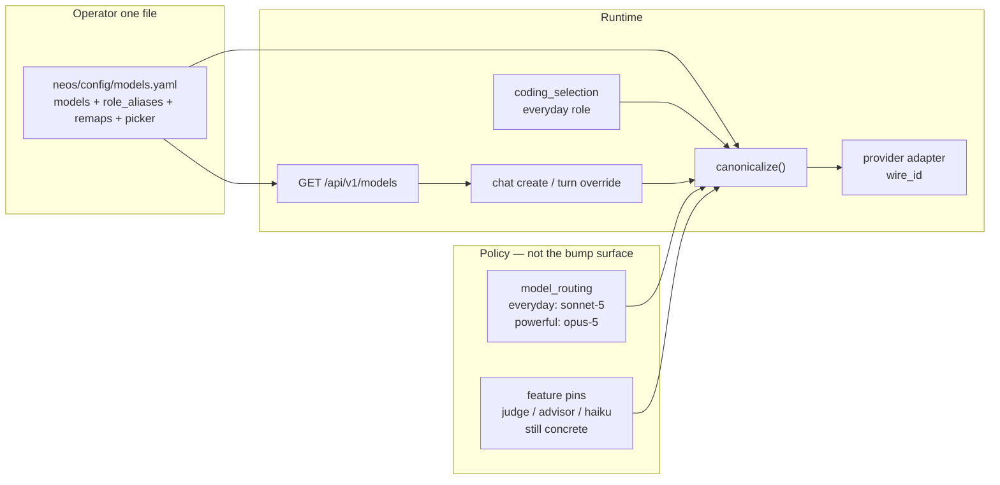
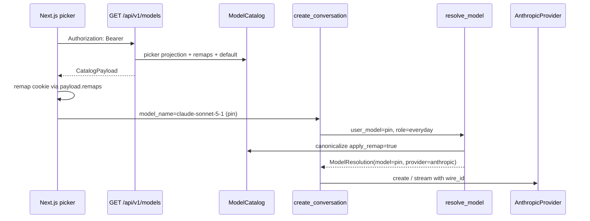

# Provider-Scoped Model Catalog

| Field | Value |
|---|---|
| Author | NEOS engineering |
| Date | 2026-09-13 |
| Status | Draft |
| Branch | `dev` (conceptual) |
| Product docs | `docs/CONFIGURATION.md` (Model Catalog / Model Routing) |
| Concepts from | hermes-agent catalog layers, iii llm-router — **behavior only**. No source, no prompts, no product port. |
| Out of scope | iii Function-Trigger-Worker rewrite; Hermes remote JSON as sole source of truth; coding-loop changes; ChannelGateway ownership of models |

---

## Overview

NEOS already has a model-facts file (`neos/config/models.yaml`) and a role-routing policy (`ModelRoutingConfig` in `neos/config/schema.py`). The header of `models.yaml` claims "새 Claude/GPT 모델 추가는 이 파일 편집으로 끝난다." That is true for **facts** (price, thinking contract, vision, selectable, generation prefixes). It is false for **live defaults and the chat picker**.

A Sonnet/Opus 5 → 5.1 or 5.5 bump today touches at least:

1. `neos/config/models.yaml` — pin, price, thinking, `anthropic_families:` prefix
2. `neos/config/schema.py` `ModelRoutingConfig` defaults (`everyday=claude-sonnet-5`, `powerful=claude-opus-5`)
3. `web/lib/ai/models.ts` — `chatModels`, `DEFAULT_CHAT_MODEL`, `MODEL_MAP`, `RETIRED_MODEL_MAP`
4. Lock tests: `tests/config/test_model_catalog_parity.py`, `tests/config/test_model_routing.py`, `web/tests/source/ai-models.test.ts`
5. Often also `web/lib/ai/providers.ts` (`getTitleModel` / `getArtifactModel` still pin `anthropic/claude-haiku-4.5`) and `db/chat_cost_tracking.sql` (still 4.5-era seed)

This design makes **`neos/config/models.yaml` the operator bump surface** for facts, role-alias current-pins, remaps, and picker projection. Roles point at **role aliases**, not dated IDs. The frontend **fetches** the catalog at runtime so a backend YAML deploy moves the picker without a web rebuild. Old cookies remap from the same file. Coding stays backend-routed. The catalog remains **not an allowlist** for internal pins.

**Honest "one place" claim.** After the stack lands, a point-release bump is:

| Edit | Required? |
|---|---|
| `models.yaml`: new pin, `role_aliases.<track>.current`, remaps that targeted the old pin, picker block move | **Yes — this is the operator file** |
| `tests/config/test_model_catalog_parity.py` selectable / tier / price lists | **Yes** — existing transcription locks; `CONFIGURATION.md` already requires them |
| `anthropic_families:` new prefix | **Only if** cache/advisor facts were measured for the new id (CA12). A 5.1 that shares the 5.0 contract inherits the existing `claude-sonnet-5` prefix. |
| Committed FE fallback `web/lib/ai/catalog.generated.ts` | **`scripts/generate_catalog_fallback.py` + CI `git diff --exit-code`**. Operator does not hand-edit. Live picker does not wait for this. |
| `schema.py`, handwritten `models.ts` maps | **No** |
| `getTitleModel` / `getArtifactModel` | **No** until optional aux PR; those are Haiku pins, not the Sonnet/Opus bump |

That is one catalog file plus the parity lists that already exist to catch typos — not four handwritten sources. It is not "literally one line" and this doc does not claim that.

---

## Background & Motivation

### Current state (verified 2026-09-13)

Three layers already exist, but they do not share identity:

| Layer | Path | What it owns today | What it actually is |
|---|---|---|---|
| Facts | `neos/config/models.yaml` + `neos/config/model_config.py` | IDs, provider, tiers, thinking, selectable, pricing, vision, `anthropic_families`, legacy `aliases` | Cold-start catalog. **Not an allowlist.** Unknown models pass with a one-shot warning. |
| Policy | `neos/config/schema.py` `ModelRoutingConfig` + `neos/config/model_routing.py` | `provider × {everyday, powerful}` → concrete ID | Defaults live in **Python**, not YAML. `config/neos.default.yaml` does **not** set `model_routing`. |
| Picker | `web/lib/ai/models.ts` | Hardcoded `chatModels` + gateway→backend `MODEL_MAP` + `RETIRED_MODEL_MAP` | No `GET /models`. Cookie `chat-model` stores a Vercel gateway id (`anthropic/claude-sonnet-5`). **Curated subset** of `selectable` pins, not the full list. |

Resolution precedence is already correct and must stay (`neos/config/model_routing.py` `resolve_model`):

1. `user` — request / picker
2. `conversation` — stored `conversations.model_name`
3. `feature_override` — `llm.model`, `coding_model.model`, DA `models.*`, etc.
4. `role_default` — `model_routing.{provider}.{role}`

Coding already does **not** pick models in the UI. `CreateCodingTaskRequest` (`neos/api/models/coding_models.py`) has only `prompt`. `resolve_coding_selection` (`neos/config/coding_selection.py`) uses `coding_model.model` if set, else Anthropic/OpenAI `everyday`, else the first selectable catalog entry for Gemini/Ollama.

Chat create **does** hardcode the provider. `resolve_new_chat_model` (`neos/api/services/chat_service.py:21-28`) always calls `resolve_model(..., provider="anthropic", role="everyday", user_model=model_name)`. An OpenAI picker selection still works only because `user_model` short-circuits before the role default; the returned `ModelResolution.provider` is still `"anthropic"` even when the model is `gpt-5.6-terra`. Downstream chat infers vendor from the name (`"claude" in model_name` in `chat_stream_pipeline.py:373`) and from `provider_for_model()`.

Feature pins do **not** follow roles. They stay explicit dated IDs:

| Pin | Location | Current default |
|---|---|---|
| `llm.fast_model` | `schema.py:137` | `claude-haiku-4-5-20251001` |
| `llm.advisor.model` | `schema.py:121` | `claude-opus-4-8` (advisor off by default) |
| `deep_analysis.models.judge` | `schema.py:714` | `None` → everyday role; catalog row `claude-opus-4-8` is the documented DA judge pin (`selectable: false`) |
| `recursive_agent.atomizer_model` | `schema.py:691` | `claude-haiku-4-5-20251001` |
| `artifacts.llm_model` | `schema.py:544` | `claude-haiku-4-5-20251001` |
| `query_classifier.llm_model` | `schema.py:633` | `claude-haiku-4-5-20251001` |
| `contextual_retrieval.model` | `schema.py:1642` | `claude-haiku-4-5-20251001` |
| `cron.llm_model` | `schema.py:1739` | `claude-haiku-4-5-20251001` |
| `a2ui.llm_model` | `schema.py:1753` | `claude-haiku-4-5-20251001` |
| FE title / artifact | `web/lib/ai/providers.ts:59,66` | `anthropic/claude-haiku-4.5` (gateway id) |

`claude-opus-5` is the powerful worker and the powerful picker tier, but `anthropic_families:` has **no** `claude-opus-5` prefix. `tests/config/test_anthropic_model_families.py` `_UNCOVERED` pins this. Advisor on that model is `unknown_executor_model`. Cache floor falls to 1024. Harmless while `llm.advisor.enabled` is false; it is exactly the drift CA12 was built to stop.

DB seed `db/chat_cost_tracking.sql:378-401` still inserts 4.5-era rows (`claude-sonnet-4-5-20250929`, `claude-opus-4-5-20251101`, `claude-haiku-4-5-20251001`). Runtime pricing prefers that table over the catalog (`CONFIGURATION.md`: DB → `models.yaml` → warn + 0). A 5.x pin with a catalog price still loses to a stale DB row if someone inserts one under the same name.

### How the FE actually picks a model on an existing thread

This path is what "sticky conversation" has to survive. Verified 2026-09-13:

1. `web/app/(chat)/chat/[id]/page.tsx:76` seeds `initialChatModel` from the **`chat-model` cookie**, not from `conversations.model_name`.
2. `web/app/(chat)/api/chat/route.ts:138` sends `metadata.model: mapToBackendModelName(selectedChatModel)` on **every** turn.
3. `resolve_turn_model_name` (`chat_stream_pipeline.py:110-132`) prefers that override whenever `is_user_selectable_model` is true.

So a cookie remap changes the **next message** on an old thread. The Postgres row is not rewritten; the thread still does not stay on the old pin. Today's `RETIRED_MODEL_MAP` already works this way (`anthropic/claude-opus-4.5` → `claude-opus-5`).

### Pain points a 5.1 / 5.5 bump hits

1. **Four sources of "what is current Sonnet".** YAML pin, Python role default, FE picker id, FE `DEFAULT_CHAT_MODEL`. They have already drifted once (4.6 retired, 4.5 thinking entry still in the picker, Opus 5 has no family facts).
2. **Gateway vs native ID spelling.** FE uses dotted 4.5 (`anthropic/claude-haiku-4.5`) and hyphenated 5 (`anthropic/claude-sonnet-5`). Backend uses hyphenated native (`claude-haiku-4-5-20251001`, `claude-sonnet-5`). Hermes has the same split: native Anthropic is hyphenated; OpenRouter uses `anthropic/claude-opus-5` with dots. NEOS translates only in a handwritten `MODEL_MAP`.
3. **Role names are not first-class.** `aliases.llm.claude_sonnet` already points at the pin `claude-sonnet-5`, but roles do not use it. Roles point at the pin. Moving a helper alias does not move everyday traffic.
4. **Prefix nesting will reject 5.1.** `_validate_families` forbids a prefix that is a prefix of another (`model_config.py:129-135`). `claude-sonnet-5` is a prefix of `claude-sonnet-5-1`. A naïve 5.1 generation row will fail catalog load. Matching already uses longest prefix (`_anthropic_family_for`); the nest ban is leftover from the declaration-order Python table.
5. **Unknown Claude request shaping is the opposite of modern.** `thinking_contract()` returns `BUDGETED` for unlisted models (`model_config.py:200-203`). A 5.1 pin used before the catalog row exists gets `temperature` + budgeted thinking and 400s on adaptive-only models. Hermes defaults unknown Claude to the modern contract and keeps an explicit *legacy* list. NEOS should steal that polarity — without stealing the substring tables.
6. **FE tests parse YAML with a regex.** `web/tests/source/ai-models.test.ts` `loadSelectableBackendModelIds()` slices `models:` … `anthropic_families:` and greps 2-space keys. Any new top-level section **between** those keys, or a new indent convention, silently breaks the lock.
7. **`selectable` ≠ picker membership.** `selectable` gates `list_models()` / `is_user_selectable_model`. The chat picker is a curated subset. Selectable-but-not-in-picker today: `gpt-6-astra`; Gemini `gemini-2.0-flash-exp`, `gemini-2.5-flash-lite`, `gemini-1.5-pro-latest` (default `selectable: true`). Projecting every selectable pin into `GET /models` would add Astra and Gemini to chat.

### What hermes-agent actually does (concepts, not code)

Hermes is **not** one catalog. Observed layers:

- `hermes_cli/models_catalog_static.py` `_PROVIDER_MODELS` — per-provider curated lists. Anthropic native: `claude-sonnet-5`, `claude-opus-4-8`, dated 4.5 pins. Order is used as a pin / picker floor.
- `website/static/api/model-catalog.json` — generated by `scripts/build_model_catalog.py` from those Python lists. Covers OpenRouter + Nous only. TTL ~20 minutes at fetch. **A generated snapshot, not a source of truth.**
- Live `GET /v1/models` + models.dev, merged on top of the curated floor.

Adding a Claude version in Hermes means updating `_PROVIDER_MODELS["anthropic"]`, capability tables (thinking / fast / max_tokens) that are **substring lists** in `agent/anthropic_adapter.py`, context lengths, pricing, aux defaults, aggregator copies (OpenRouter, Copilot, Bedrock), then rebuilding the JSON.

Family aliases (`sonnet` / `opus`) now **ERROR** when ambiguous (`hermes_cli/model_switch.py` `AmbiguousAliasError`). They stopped auto-latest after version-sort heuristics picked dated snapshots and cheap tiers.

Silent default is **not** the flagship: `PREFERRED_SILENT_DEFAULT_MODEL = "z-ai/glm-5.2"`. `/model nous` does not take `[0]` of a most-capable-first list.

**Steal:** normalize at the provider boundary; default-to-modern for unknown Claude; do not auto-resolve a family to latest; curated-first + live merge; silent default ≠ flagship; aux as a provider/catalog field.

**Avoid:** N copies of the same ID; substring capability tables; mixing dated / dotted / hyphenated without a translation table; role routing via catalog declaration order.

### What iii actually does (concepts, not code)

iii llm-router (`iii/tech-specs/2026-06-08-agentic/llm-router.md`) splits **routing identity** from **vendor wire**. `decide(model, provider?)`:

1. Explicit registered provider → that provider (works on a cold catalog).
2. Unique catalog owner of `model`. Collision → `ambiguous model` , never silent.
3. Heuristic regex from config.
4. `default_provider` if set.
5. Else error.

No everyday/powerful roles. No first-class Gemini provider. Anthropic IDs come from live `GET /v1/models`; curated data is pricing/capability enrich. OpenAI prefers an undated alias over a dated pin. Unknown models fail-open for **request shaping** (keep tools / images / thinking) and fail-closed for **pickers** (don't list what you don't know). Auth-empty or transient discovery keeps the last-good slice; an empty reconcile is the eviction path, not a blip.

**Steal:** facts vs policy; `(provider, id)` uniqueness; family vs dated pin; live list + curated enrich; fail-open request shaping on unknown; capability flags as the only per-model branch; auth-empty / transient-keep.

**Avoid:** empty catalog until discovery (NEOS static YAML is the better cold start); hiding the non-adaptive Claude 4.5 pins NEOS still serves; replacing role routing; adopting the ELv2 engine or Function-Trigger-Worker rewrite.

### Why this change is needed now

Anthropic is shipping 5.x point releases on a cadence that is faster than a four-file, two-language edit. The 4.6 → 5 cut already left Opus 5 without generation facts, a 4.5-thinking picker row, a 4.5-era DB seed, and a catalog header that over-promises. The next bump will repeat that unless identity, policy, and picker consume one file.

---

## Goals & Non-Goals

### Goals

1. **One operator file for a Claude point-release bump**, plus the existing parity lock lists. Adding Sonnet/Opus 5.1 or 5.5 is: a new `models:` pin, a `role_aliases.<track>.current` move, remap retargets, a picker-block move, and `test_model_catalog_parity.py`. `schema.py` role defaults and handwritten `web/lib/ai/models.ts` maps do not change. CI regenerates the FE fallback from YAML.
2. **Facts vs policy vs wire.** Catalog = facts + role-alias current-pin + remaps + picker projection. `model_routing` = roles pointing at **role aliases**. Provider adapters = wire-ID translation only.
3. **Frontend fetches the catalog at runtime.** `GET /api/v1/models` is the live picker source so a backend YAML deploy moves `current:` without a web rebuild. A generated fallback exists only for backend-down.
4. **Old cookies remap.** Remaps live in the catalog, applied on FE ingest and on BE **user** strings. FE turns follow the remapped cookie (today's path). See Key Decision 13.
5. **Coding stays backend-routed.** No `model` field on `CreateCodingTaskRequest` in this design. `resolve_coding_selection` keeps using `coding_model` + everyday role.
6. **Catalog is still not an allowlist** for internal / feature pins. `create_llm(model=...)`, DA `models.*`, advisor, judge, haiku helpers still accept unknown IDs with a warning.
7. **User-facing selection is still gated.** `is_user_selectable_model` remains the door for turn override, conversation create, regenerate. `selectable` ≠ picker membership.
8. **Compatible with the durable 1-step coding loop.** No ChannelGateway ownership. `learn.coding_lessons`, `channels.coding_invoke`, `inbound_media` stay default-off. Learning does not fail open.

### Non-Goals (hard)

- Adopting iii's engine, `iii-state`, or Function-Trigger-Worker rewrite.
- Adopting Hermes' remote `model-catalog.json` as the source of truth (it is a generated snapshot of Python lists).
- Making the catalog an allowlist for internal pins.
- A coding-UI model picker.
- A `fast` routing role. `test_policy_stays_at_two_roles` stays. Haiku helpers remain explicit pins.
- Auto-resolving bare `sonnet` / `opus` to "whatever is newest."
- Replacing role routing with catalog declaration order.
- Live Anthropic `/v1/models` as a required boot dependency.
- Unifying Gemini/Ollama into role routing or the chat picker.
- Rewriting `CostCalculator` DB-first pricing. The seed is stale; the *precedence* stays.
- Putting any of this in `ChannelGateway`.
- Copying Hermes/iii source, prompts, or product UX.
- Making existing threads sticky on `conversations.model_name` (would require the FE to stop seeding from the cookie). Out of this wave; documented as a follow-up.

---

## Proposed Design

### Mental model

Three identities, one resolution function. Two **different** "family" words stay separate on purpose:

| Identity | Example | Owner | Lifetime |
|---|---|---|---|
| **Role alias** | `sonnet-5`, `opus-5`, `haiku-4.5` | Catalog `role_aliases:` | Stable across point releases. What roles point at. |
| **Catalog pin** | `claude-sonnet-5`, later `claude-sonnet-5-1` | Catalog `models:` | Concrete SKU. What we log, bill, and store on new conversations after resolve. |
| **Wire id** | `claude-sonnet-5-1` (Anthropic hyphenated) | Provider adapter | What leaves the process. Never stored as the conversation's model. |
| **Advisor generation** (existing) | `anthropic_families[].family` = `sonnet-5` | Catalog `anthropic_families:` | Cache floor + advisor pairing. **Not** a routing alias. |

`ModelSpec.role_alias` references `role_aliases:` only. It never references `anthropic_families[].family`. Advisor lookup stays `canonical_model_family()` via prefix match.

Picker / cookie ids are a **projection** of a pin: an explicit `gateway_id` (required for every picker-visible row). They are not a fourth source of truth.



### 5.1 bump playbook (target experience)

Operator edits `neos/config/models.yaml` and updates the parity lock lists.

```yaml
models:
  claude-sonnet-5-1:
    provider: anthropic
    role_alias: sonnet-5
    tiers: [balanced]          # move the tier off claude-sonnet-5
    thinking: adaptive
    selectable: true
    vision: true
    gateway_id: anthropic/claude-sonnet-5-1
    picker:
      name: "Claude Sonnet 5.1"
      description: "Best balance of speed, intelligence, and cost"
      group: anthropic
    pricing: {input: 3.00, output: 15.00, cache_creation: 3.75, cache_read: 0.30}

  claude-sonnet-5:
    # Keep the row. selectable stays true so stored pins and non-FE
    # clients still pass is_user_selectable_model. picker: is removed
    # so it drops off GET /models.
    provider: anthropic
    role_alias: sonnet-5
    selectable: true
    thinking: adaptive
    vision: true
    pricing: {input: 3.00, output: 15.00, cache_creation: 3.75, cache_read: 0.30}

role_aliases:
  sonnet-5:
    current: claude-sonnet-5-1

# Remap values are catalog pins, not gateway ids.
# Retarget every remap that previously landed on claude-sonnet-5
# (today: four Google/xAI retired cookies).
remaps:
  "anthropic/claude-sonnet-5": claude-sonnet-5-1
  "google/gemini-2.5-flash-lite": claude-sonnet-5-1
  "google/gemini-3-pro-preview": claude-sonnet-5-1
  "xai/grok-4.1-fast-non-reasoning": claude-sonnet-5-1
  "xai/grok-code-fast-1-thinking": claude-sonnet-5-1
```

Do **not** add `anthropic_families` `family: sonnet-5.1` or a `claude-sonnet-5-1` prefix unless cache-minimum and advisor targets were measured (CA12 / `_UNCOVERED` rule). `claude-sonnet-5-1` then matches the existing `claude-sonnet-5` prefix (longest-wins after the nest-ban lift). A distinct contract is a **policy** change: new `role_aliases.sonnet-5.5` + `model_routing.anthropic.everyday: sonnet-5.5`.

No `schema.py` edit. No handwritten `models.ts` edit. FE refetch on next page load shows 5.1. New chats store `claude-sonnet-5-1`. The next FE turn on an old thread also uses 5.1 because the cookie remapped (Key Decision 13).

### Catalog schema additions

Keep the existing `ModelSpec` fields. Add the following, all optional with safe defaults so today's YAML still loads.

**YAML key order is load-bearing for the current FE regex test.** New top-level keys go **after** `anthropic_families:` (alongside existing `aliases:` / `defaults:`). Never insert `role_aliases:` / `remaps:` between `models:` and `anthropic_families:` until that regex test is deleted (PR5). PR1 must follow this order even if it also updates the test.

```python
class PickerRow(StrictConfigModel):
    """Copy for one picker row. Required on every picker-visible row — no name formatter."""
    name: str
    description: str
    group: Literal["anthropic", "openai", "reasoning"]
    gateway_id: str | None = None   # required on extras; default ModelSpec.gateway_id on the primary row


class PickerSpec(StrictConfigModel):
    """Opt-in chat-picker membership. Presence of this block = visible in GET /models.

    Not the same as selectable (list_models / is_user_selectable_model).
    """
    name: str
    description: str
    group: Literal["anthropic", "openai", "reasoning"]
    extras: list[PickerRow] = Field(default_factory=list)  # picker-only rows, same catalog pin


class ModelSpec(StrictConfigModel):
    # existing: provider, tiers, thinking, selectable, max_tokens,
    # description, vision, dimension, pricing
    role_alias: str | None = None     # key of role_aliases: only; never anthropic_families
    gateway_id: str | None = None     # cookie / picker id; NOT defaulted from the catalog key
    wire_id: str | None = None        # default catalog_key; Anthropic stays hyphenated
    id_forms: list[str] = []          # extra accepted spellings (never invents a dated suffix)
    picker: PickerSpec | None = None  # None = not in the chat picker


class RoleAlias(StrictConfigModel):
    current: str                      # must be a models: key


class ModelCatalog(StrictConfigModel):
    models: dict[str, ModelSpec]
    anthropic_families: list[AnthropicFamily]
    aliases: dict[str, dict[str, str]]        # existing legacy get_*_model_id; values stay pins
    defaults: dict[str, str]
    role_aliases: dict[str, RoleAlias] = {}   # AFTER anthropic_families in the YAML file
    remaps: dict[str, str] = {}               # raw string → catalog pin
    aux: dict[str, str] = {}                  # optional helper slots → pin (not v1)
```

**`gateway_id` is not inferred as `f"{provider}/{catalog_key}`.** Dated pins do not match live cookies (`anthropic/claude-haiku-4.5` ≠ `anthropic/claude-haiku-4-5-20251001`). Every picker-visible pin and every live `MODEL_MAP` entry must declare `gateway_id` explicitly. PR1 ports all of today's live picker ids.

**Picker membership is opt-in.** `picker:` present → one primary `GET /models` row, plus one row per `picker.extras`. `selectable: true` without `picker:` stays on `list_models()` / turn-override allowlist and stays **out** of the chat picker.

**v1 picker set (reproduce today's `chatModels`):**

| gateway_id | catalog pin | group | notes |
|---|---|---|---|
| `anthropic/claude-sonnet-5` | `claude-sonnet-5` | anthropic | primary |
| `anthropic/claude-opus-5` | `claude-opus-5` | anthropic | primary |
| `anthropic/claude-haiku-4.5` | `claude-haiku-4-5-20251001` | anthropic | **must** set `gateway_id`; default key form is wrong |
| `anthropic/claude-sonnet-4.5` | `claude-sonnet-4-5-20250929` | anthropic | same |
| `anthropic/claude-sonnet-4.5-thinking` | `claude-sonnet-4-5-20250929` | reasoning | `picker.extras` on the 4.5 pin |
| `openai/gpt-5.6-terra` | `gpt-5.6-terra` | openai | primary |
| `openai/gpt-5.6-sol` | `gpt-5.6-sol` | openai | primary |

**Out of the chat picker (decision):** `gpt-6-astra` stays `selectable: true`, no `picker:`. Gemini stays out. Chat payload is Anthropic + OpenAI only (`group` enum). Astra can join later by adding a `picker:` block — a product edit, not a projection accident.

**Uniqueness.** `(provider, catalog_key)` is unique because keys are unique and each spec has one provider. `(provider, wire_id)` must also be unique — validator error, never silent. Every `gateway_id` (primary + extras) must be unique across the catalog. `role_aliases.*.current` must exist in `models`. `remaps` values must be catalog **pins** (keys of `models`). Remap **targets** must be `selectable: true` (user-facing remap cannot land on the judge SKU). A remap target does **not** have to be picker-visible.

**Legacy `aliases.llm.*` stay pins in v1.** `_validate_references` and `_legacy_entry` keep requiring `target in self.models`. `get_llm_model_id("claude_sonnet")` remains `claude-sonnet-5` until someone points the alias at the new pin by hand. `role_aliases.sonnet-5.current` does **not** move the legacy alias API. That is an accepted leftover surface (Haiku-class, low churn).

**Do not** put role defaults in the catalog. That would mix facts and policy.

**Do not** generate a second JSON snapshot as the live FE source of truth. The API reads the in-process `ModelCatalog`. The generated TS file is a **fallback + test lock**, like Hermes' JSON — never the live SoT.

### Role aliases: pin, not latest

`role_aliases.sonnet-5.current` is an **operator pin**. It does not mean "the highest version string that starts with sonnet-5."

| Input | Behavior |
|---|---|
| Role default `sonnet-5` | Resolve to `role_aliases.sonnet-5.current` → `claude-sonnet-5` (today) |
| User / cookie `anthropic/claude-sonnet-5` | Exact gateway_id → pin (or remap if we later retarget that raw string) |
| User types `sonnet` | **Unknown** in v1 (`canonicalize` → `None`). Not guessed. Not "latest". User-facing door → 400. |
| User types `sonnet-5` | Allowed: it is a declared role alias |
| Conversation stored `claude-sonnet-5` | Backend resolve does **not** apply remaps (see canonicalize `apply_remap`). FE turns still follow the cookie. |

Bare `sonnet` / `opus` / `haiku` are **not** introduced as aliases in v1.

### Role policy change

Today (`schema.py:147-159`):

```python
class ModelRoutingConfig(StrictConfigModel):
    anthropic: ProviderModelRolesConfig = Field(
        default_factory=lambda: ProviderModelRolesConfig(
            everyday="claude-sonnet-5",
            powerful="claude-opus-5",
        )
    )
    openai: ProviderModelRolesConfig = Field(
        default_factory=lambda: ProviderModelRolesConfig(
            everyday="gpt-5.6-terra",
            powerful="gpt-5.6-sol",
        )
    )
```

After PR2:

```python
class ModelRoutingConfig(StrictConfigModel):
    anthropic: ProviderModelRolesConfig = Field(
        default_factory=lambda: ProviderModelRolesConfig(
            everyday="sonnet-5",
            powerful="opus-5",
        )
    )
    openai: ProviderModelRolesConfig = Field(
        default_factory=lambda: ProviderModelRolesConfig(
            everyday="gpt-5.6-terra",
            powerful="gpt-5.6-sol",
        )
    )
```

OpenAI stays on concrete pins until a GPT naming bump needs `role_aliases`. Claude is the 5.1/5.5 pressure.

`neos.default.yaml` still does **not** need to set `model_routing`. Operators who already overrode dated IDs in an env YAML keep those overrides; dated IDs remain valid role values (they are pins). The resolver accepts **role alias or pin**.

`warn_unknown_routed_models` must resolve role aliases before the membership check.

**Custom catalogs (`NEOS_MODEL_CONFIG_PATH`).** After PR2, schema defaults are `sonnet-5` / `opus-5`. A custom file that has no `role_aliases:` will not resolve those roles; boot logs the existing unknown-routed-model warning and everyday traffic has no pin. Every shipped catalog must include `role_aliases:`, **or** the deployment must set dated `model_routing` in env YAML. Document this in `CONFIGURATION.md` (PR5). Do not silently fall back to hardcoded dated IDs in Python — that re-creates the bump surface.

`test_role_defaults_map_to_current_models` changes from "everyday == `claude-sonnet-5`" to "everyday alias `sonnet-5` resolves to whatever `role_aliases.sonnet-5.current` is." The lock on the *current pin* stays in `test_model_catalog_parity.py`.

### Resolution — `canonicalize()` (implementable)

New module `neos/config/model_identity.py`. No I/O.

```python
@dataclass(frozen=True, slots=True)
class ModelIdentity:
    catalog_id: str          # pin key, e.g. claude-sonnet-5
    provider: str            # from spec, never guessed when known
    role_alias: str | None
    wire_id: str
    gateway_id: str | None   # None if the pin never declared one
    source: str              # role_alias | pin | remap | gateway | id_form

class RemapCycleError(ValueError): ...
class AmbiguousModelError(ValueError): ...  # reserved; v1 load validators make this unreachable at resolve time


def catalog_shaped(raw: str) -> str:
    """Strip a known provider/ prefix, then '.' → '-'. Never invents a dated suffix."""
    s = raw.strip()
    if "/" in s:
        prefix, rest = s.split("/", 1)
        if prefix in {"anthropic", "openai", "google", "gemini", "xai"} and rest:
            s = rest
    return s.replace(".", "-")


def _index(catalog: ModelCatalog) -> _Lookup:
    """Built once per catalog object. Maps the following → pin key:
    - models keys
    - each spec.gateway_id
    - each picker.extras[].gateway_id
    - each id_forms entry
    Duplicate keys across these surfaces are a load-time ValidationError.
    """


def canonicalize(
    raw: str,
    *,
    catalog: ModelCatalog,
    apply_remap: bool = True,
) -> ModelIdentity | None:
    """Return identity or None (unknown).

    v1 resolves only declared surfaces. Undeclared short names (sonnet, opus)
    return None — they are not guessed and not treated as 'latest'.
    """
```

**Algorithm** (this is the spec; implement it in this order, no extra heuristics):

1. If `raw` is not a `str` or `raw.strip()` is empty → `None`. (Chat pipeline already rejects non-str before calling.)
2. `current = raw.strip()`. `seen: list[str] = []`.
3. **Remap hop** (only if `apply_remap`):
   - While `current` is a key of `catalog.remaps`:
     - If `current in seen` or `len(seen) >= 4` → raise `RemapCycleError`.
     - Append `current` to `seen`.
     - `current = catalog.remaps[current]` (a catalog pin key).
   - After the loop, if `seen` is non-empty, `current` must be a `models:` key (enforced at load). Build identity from that pin with `source="remap"` and return. Do **not** continue into alias/gateway lookup — remap values are pins, not gateway ids.
4. **Declared role alias.** If `current` in `catalog.role_aliases`:
   - `pin = role_aliases[current].current`
   - Return identity from that pin, `source="role_alias"`.
5. **Catalog pin key.** If `current` in `catalog.models`:
   - Return identity from that pin, `source="pin"`.
6. **Exact gateway_id** (primary or extras) or **exact id_forms** entry:
   - Return identity from the owning pin, `source="gateway"` or `source="id_form"`.
7. **Spelling-only retry, once.** Let `spelled = catalog_shaped(current)`. If `spelled != current`, repeat steps 4–6 on `spelled` (no remaps, no second spelling pass). This turns `anthropic/claude-sonnet-5` into `claude-sonnet-5` **when that is already a pin key**. It does **not** turn `anthropic/claude-haiku-4.5` into `claude-haiku-4-5-20251001`. Dated pins require `gateway_id`, `id_forms`, or a remap. State that next to the code.
8. Else `None`.

**`apply_remap` by caller:**

| Caller | `apply_remap` | Why |
|---|---|---|
| User / cookie / picker / `metadata.model` / `CreateConversationRequest.model_name` | `True` | This is the remap surface |
| `ResolutionSource.CONVERSATION` (stored pin) | `False` | A remap of a raw gateway id must not rewrite a stored pin that happens to share a spelling |
| `ResolutionSource.FEATURE_OVERRIDE` | `False` | Feature pins are operator-authored concrete IDs |
| `thinking_contract` / request shaping | `False` | Need the pin if known; unknown stays unknown |
| Internal `create_llm(model=...)` | `False` | Catalog is not an allowlist; do not silently retarget |

`resolve_model` keeps its precedence. After it picks a string:

- If source is `USER` → `canonicalize(..., apply_remap=True)`.
- If source is `CONVERSATION` or `FEATURE_OVERRIDE` → `canonicalize(..., apply_remap=False)`.
- If source is `ROLE_DEFAULT` → `canonicalize(..., apply_remap=False)` (role values are aliases or pins, not cookies).

`ModelResolution.model` remains the **pin**. Add `role_alias: str | None = None`.

**Unknown / errors on doors:**

| Result | User-facing (create, turn override, regenerate) | Internal pin (`create_llm`, DA, advisor) |
|---|---|---|
| `ModelIdentity` whose pin is `selectable` | Accept | Accept |
| `ModelIdentity` whose pin is not `selectable` | Reject (today's `is_user_selectable_model`) | Accept + existing one-shot warning |
| `None` | Reject → **400** (same as today's non-selectable path; do not raise) | Pass through + warning |
| `RemapCycleError` | **400** with a stable error code | Log + treat as unknown |
| `AmbiguousModelError` | **400** | Log + treat as unknown |

v1 does not raise `AmbiguousModelError` from `canonicalize` because undeclared short names are `None`. Keep the type so a later prefix-scan can use it. Load-time uniqueness validators are what prevent silent collisions.

**`is_user_selectable_model`:** `canonicalize(raw, apply_remap=True)` then `spec.selectable` on the pin. `None` → `False`.

**`thinking_contract`:** `ident = canonicalize(raw, apply_remap=False)`. If ident is not None, return that pin's contract. Else if `catalog_shaped(raw).startswith("claude-")` (or `startswith("claude-")` after lowercasing) → `ADAPTIVE` when the flag is on. Else `BUDGETED`. Never run `_looks_like_claude` on a raw `anthropic/...` gateway string.



### Chat create provider

`resolve_new_chat_model` must stop hardcoding `provider="anthropic"`.

`resolve_model` only accepts `anthropic | openai` (`model_routing.py:39-40`). Gemini pins in today's catalog are `selectable: true` and have no `picker:`, so they stay off the chat UI but still pass `is_user_selectable_model` (`chat_handlers.py:143`). An API client that POSTs `model_name=gemini-1.5-pro-latest` today stores the name (`user_model` short-circuits; the hardcoded provider is only a discarded label). Calling `resolve_model(provider="gemini")` would `ValueError` and turn create into a **500**. Same for Ollama if it were selectable.

```python
_ROLE_ROUTED = frozenset({"anthropic", "openai"})

def resolve_new_chat_model(model_name: str | None) -> str:
    if model_name:
        identity = canonicalize(
            model_name, catalog=model_config.catalog, apply_remap=True
        )
        if identity is None:
            return model_name  # unknown: pass-through (not an allowlist)
        if identity.provider not in _ROLE_ROUTED:
            return identity.catalog_id  # gemini/ollama: do not call resolve_model
        return resolve_model(
            config=settings.config.model_routing,
            provider=identity.provider,  # type: ignore[arg-type]
            role="everyday",
            user_model=identity.catalog_id,
        ).model
    return resolve_model(
        config=settings.config.model_routing,
        provider="anthropic",
        role="everyday",
    ).model
```

The function still returns only a `str` (the pin). This PR fixes the provider *input* to `resolve_model`; it does not add a persisted `conversation.provider` column. Downstream still uses `provider_for_model()` / name heuristics.

Default empty-picker chats stay Anthropic everyday. PR3a tests must cover `gemini-1.5-pro-latest` → stored pin, no `ValueError`.

### GET /api/v1/models

New router, mounted next to chat in `neos/main.py`:

`GET {API_V1_PREFIX}/models`

Auth: `get_current_active_user` (same as chat). **Do not** include pins that lack `picker:`, `selectable: false` SKUs, or advisor/judge rows.

```python
class CatalogModelOut(BaseModel):
    id: str                 # gateway_id, what the cookie stores
    catalog_id: str         # backend pin
    name: str
    provider: str           # picker group: anthropic | openai | reasoning
    description: str
    thinking: Literal["adaptive", "budgeted", "none"]
    vision: bool
    role_alias: str | None
    default: bool           # true for the current Anthropic everyday pin's primary row

class CatalogResponse(BaseModel):
    version: int            # increment on incompatible payload shape
    etag: str               # see cache rules
    default_id: str         # gateway_id of Anthropic everyday current pin
    models: list[CatalogModelOut]
    remaps: dict[str, str]  # raw cookie/gateway id → gateway_id still in models[]
```

**Remap projection.** YAML `remaps` is `raw → catalog pin`. `to_picker_payload()` emits `raw → pin.gateway_id` (primary row, not an extra) **when that gateway_id is in `models[]`**. If the target pin has no `picker:` / no `gateway_id`, the payload remap value is `default_id` (must still be selectable — already required). FE cookie rewrite uses payload values (gateway ids). `mapToBackendModelName` is specified under Frontend (full chain; never `undefined`). Backend `canonicalize(apply_remap=True)` still accepts a raw gateway id if one is sent.

**Derivation:**

- One row per model that has `picker:`.
- One additional row per `picker.extras` entry, same `catalog_id`, `id = extra.gateway_id`, copy from the extra (`name`, `description`, `group`). `thinking` / `vision` come from the pin.
- `default_id` = primary `gateway_id` of `canonicalize(model_routing.anthropic.everyday, apply_remap=False)`.
- Chat providers only: `group` ∈ {anthropic, openai, reasoning}.

**Fixture (required test, PR4):** one payload covers

| raw | YAML remap target (pin) | payload remap value (gateway_id) |
|---|---|---|
| `anthropic/claude-haiku-4.5` | *(not a remap — live `gateway_id`)* | row `id` = that gateway_id, `catalog_id` = `claude-haiku-4-5-20251001` |
| `anthropic/claude-opus-4.5` | `claude-opus-5` | `anthropic/claude-opus-5` |
| `anthropic/claude-sonnet-5` after a 5.1 bump | `claude-sonnet-5-1` | `anthropic/claude-sonnet-5-1` |

Handler is read-only. `model_config.catalog` + `settings.config.model_routing`. No DB, no provider network.

**Cache / ETag.** Hash of: YAML file bytes (or mtime + size), **plus** the resolved `model_routing` dump (env YAML can change everyday without touching `models.yaml`), plus `role_aliases.*.current`. `Cache-Control: private, max-age=60`. FE loader uses `cache: "no-store"` (Next `fetch` otherwise caches RSC GETs and ignores our header).

**503** only if the catalog is **empty**. FE then uses `catalog.generated.ts`.

**Not** a live Anthropic merge.

### Thinking-variant YAML (4.5 pair)

The variant is **not** a second `models:` key. It is a picker extra on the dated pin:

```yaml
  claude-sonnet-4-5-20250929:
    provider: anthropic
    thinking: budgeted
    selectable: true
    vision: true
    gateway_id: anthropic/claude-sonnet-4.5
    id_forms: [claude-sonnet-4-5, claude-sonnet-4.5]
    picker:
      name: "Claude Sonnet 4.5"
      description: "Previous-generation balanced model"
      group: anthropic
      extras:
        - gateway_id: anthropic/claude-sonnet-4.5-thinking
          name: "Claude Sonnet 4.5 (Thinking)"
          description: "Extended thinking for complex problems"
          group: reasoning
    pricing: {input: 3.00, output: 15.00, cache_creation: 3.75, cache_read: 0.30}
```

`lib/ai/prompts.ts` / `providers.ts` keep branching on `thinking`/`reasoning` in the **gateway id**. Every picker-visible row has explicit `name` / `description` / `group`. PR5 does not invent copy.

### Frontend

`web/lib/ai/models.ts` becomes a **client of the catalog**, not a second catalog.

Keep:

- `ChatModel` type (aligned with `CatalogModelOut`).
- `mapToBackendModelName(id, catalog)` — **always returns a `string`**. Cookie rewrite is on page load, but `api/chat/route.ts` still maps `selectedChatModel` on every POST, so a stale cookie (`anthropic/claude-opus-4.5`, or `anthropic/claude-sonnet-5` after a 5.1 bump) can miss `models[]`. Payload remaps are `raw → gateway_id`, not `raw → pin`. Full chain:

```ts
function mapToBackendModelName(
  id: string,
  catalog: { models: CatalogModelOut[]; remaps: Record<string, string>; default_id: string },
): string {
  const byId = new Map(catalog.models.map((m) => [m.id, m.catalog_id]));
  const hit = byId.get(id);
  if (hit) return hit;                            // 1. live picker id → pin
  const remappedGateway = catalog.remaps[id];
  if (remappedGateway) {
    const pin = byId.get(remappedGateway);
    if (pin) return pin;                          // 2. raw cookie → payload gateway → pin
  }
  const generated = generatedFallbackMap[id];     // 3. last shipped generated map
  if (generated) return generated;
  const fallbackDefault = byId.get(catalog.default_id) ?? generatedDefaultPin;
  if (fallbackDefault) return fallbackDefault;    // 4. catalog default pin
  return id;                                      // 5. send raw; BE canonicalize(apply_remap=True)
}
```

Never send `undefined` / omit the field. Step 5 is how a cookie the generated file has not seen yet still reaches backend remaps.

- Last-resort default from **committed** `web/lib/ai/catalog.generated.ts` (see artifact contract below). Not a handwritten dated constant.

Remove as source of truth:

- Hardcoded `chatModels` array and `modelsByProvider`.
- Handwritten `MODEL_MAP`.
- Handwritten `RETIRED_MODEL_MAP` (lives in YAML `remaps:`).

Load path:

1. Server components (`page.tsx`, `chat/[id]/page.tsx`) call `callBackendAPI("/api/v1/models", { cache: "no-store" })`.
2. Pass `{ models, remaps, default_id }` into `Chat` → `MultimodalInput`. Do **not** import a module-level list inside the client component.
3. Cookie `chat-model`: if in `payload.remaps`, rewrite via `saveChatModelAsCookie` to the new **gateway id**. If the remapped id is not in `models`, use `default_id`.
4. `api/chat/route.ts` keeps sending `model_name` / `metadata.model` as **catalog pins** (`mapToBackendModelName`). Backend `canonicalize` also accepts gateway ids.

Dual-read until the hardcoded array is deleted: Next env `CATALOG_API=1` (server-only, not `AppConfig` — Next cannot read `schema.py`). When unset, use `catalog.generated.ts`. After soak, delete the handwritten array; keep the generated file as backend-down fallback.

Tests: stop regex-parsing `models.yaml`. Lock `to_picker_payload()` / generated fixture. Invariants stay: every payload remap target is a `models[].id`; no gateway id forwarded to the backend; reasoning rows keep `thinking`/`reasoning` in the id; gpt-4o and gpt-6-astra stay out of the picker; only anthropic/openai/reasoning groups.

#### `catalog.generated.ts` artifact contract

The file is the backend-down picker and the replacement for handwritten `DEFAULT_CHAT_MODEL`.

| Rule | Value |
|---|---|
| Location | `web/lib/ai/catalog.generated.ts` (**committed**) |
| Generator | `scripts/generate_catalog_fallback.py` — loads `models.yaml` + default `ModelRoutingConfig`, calls `to_picker_payload()`, writes the TS module (`models`, `remaps` as `raw → pin` for the fallback map, `default_id`, `default_pin`) |
| Who runs it | Operator or CI after a catalog YAML change. Not a Next build step (web CI has no Neos Python env by default). |
| Stale check | CI job with Python deps: run the script, then `git diff --exit-code -- web/lib/ai/catalog.generated.ts`. Fail the PR if YAML and the committed file disagree. |
| Live picker | Runtime `GET /models` on API deploy. YAML-only bumps do **not** require a web rebuild. |
| Fallback clock | Tracks the last **committed** catalog the web pipeline shipped. A 5.1 `current:` move without regenerating this file still serves 5.1 from the API; backend-down falls back to the previous pin (still selectable). |

Do not generate this file only in a backend job and leave it uncommitted — the Next image would have no fallback. Do not commit it with no stale check — that re-creates a second handwritten clock.

`getTitleModel` / `getArtifactModel` stay hardcoded until optional PR7.

### Cookie remaps and conversations (honest)

| Where | When | Behavior |
|---|---|---|
| FE page load | Cookie present | Rewrite cookie via **payload** remaps (gateway → gateway) |
| FE chat POST | Every message | `metadata.model` = pin of the (possibly remapped) cookie |
| BE `canonicalize(apply_remap=True)` | User-controlled strings | Accepts old gateway ids; lands on the remap pin |
| BE conversation / feature resolve | Stored pin / YAML pin | `apply_remap=False`. Row is not rewritten |

**Product consequence:** after a 5.1 cookie remap, the next FE message on an old thread is 5.1. That matches today's `RETIRED_MODEL_MAP`. We do **not** claim stored conversations stay on 5.0 for FE users.

Backend-only paths (coding everyday, DA role defaults, conversation-title jobs that read `conversation.model_name` without an FE override) stay on the stored / role pin.

Making threads sticky is a follow-up: seed `chat/[id]/page.tsx` from `conversation.model_name`, and stop sending a cookie override that disagrees with the row. Not in this wave.

### Thinking contract polarity (unknown Claude)

Today unknown → `BUDGETED`. After the flag `model_catalog.default_unknown_claude_adaptive` (default **false**):

```python
def thinking_contract(self, model: str) -> ThinkingContract:
    ident = canonicalize(model, catalog=self, apply_remap=False)
    if ident is not None:
        return self.models[ident.catalog_id].thinking
    if settings...default_unknown_claude_adaptive and catalog_shaped(model).lower().startswith("claude-"):
        return ThinkingContract.ADAPTIVE
    return ThinkingContract.BUDGETED
```

Listed 4.5 pins keep `thinking: budgeted`. No Hermes substring table.

### Generation prefixes and 5.1 nesting

Lift the nest ban in `_validate_families`. Keep **longest prefix wins**. Tests:

- prefixes `claude-sonnet-5` and `claude-sonnet-5-1` both legal
- `claude-sonnet-5-1-20260901` matches `claude-sonnet-5-1` when that prefix exists
- without a 5.1 prefix, `claude-sonnet-5-1` matches `claude-sonnet-5`
- `claude-sonnet-4-5` does not match `claude-sonnet-5`

Still reject **duplicate** prefixes. Still require `advisor_targets` to name declared advisor-generation values.

Fill the `claude-opus-5` gap only after measurement. Routing `role_aliases.opus-5` does **not** require advisor facts.

### Aux helpers (optional later)

Not required for Sonnet/Opus 5.1. Schema Haiku pins stay explicit. Follow-up may introduce `aux.fast` / `aux.title` and retarget `providers.ts`.

### Live discovery (off by default)

```yaml
# config/neos.default.yaml — default off
model_catalog:
  picker_api: false
  default_unknown_claude_adaptive: false
  live_anthropic: false
```

If `live_anthropic` is later enabled: merge **ids only** into an in-memory overlay. YAML wins. Live-only ids are never `selectable` and never picker-visible. Auth-empty or transient error: keep last overlay. Metric `neos_catalog_live_unknown_total` — **no `id` label** (unbounded). Do not fetch Hermes JSON.

### Coding loop

No change to `CreateCodingTaskRequest`. After role aliases, `coding_model.model: null` → everyday → `sonnet-5` → current pin. `warn_coding_model_price_drift` compares against the resolved pin. ChannelGateway stays out.

### Provider boundary normalization

`AnthropicProvider.create_llm` / `create_coding_model` send `wire_id` (default catalog key), never a gateway id, never a dotted form unless `wire_id` says so. OpenAI/Gemini/Ollama unchanged. Owned by PR1 (field + pass-through when unset = today's behavior) and verified in PR3a when chat starts resolving identities.

---

## API / Interface Changes

### New: `GET /api/v1/models`

See payload above. 200 / 401 / 503 (empty catalog only).

### New: `neos/config/model_identity.py`

- `canonicalize(raw, catalog, apply_remap=True) -> ModelIdentity | None`
- `catalog_shaped(raw) -> str`
- `RemapCycleError`, `AmbiguousModelError`
- `to_picker_payload(catalog, routing) -> CatalogResponse`

### Changed: `resolve_model`

Same signature. Canonicalize after pick with `apply_remap` only for `USER`. `ModelResolution` gains `role_alias`.

### Changed: `resolve_new_chat_model`

Provider from identity when it is `anthropic` or `openai`. If `identity.provider` is anything else (`gemini`, `ollama`), return `identity.catalog_id` and do **not** call `resolve_model`. Still returns a `str` only.

### Changed: `is_user_selectable_model`

Canonicalize first (`apply_remap=True`).

### Changed: `thinking_contract`

Flag-gated unknown-Claude → `ADAPTIVE`. Uses `catalog_shaped`.

### Changed: `_validate_families`

Allow nested prefixes; longest wins.

### Unchanged

- `CreateCodingTaskRequest`
- `resolve_coding_selection` precedence
- `create_llm` unknown-model pass-through
- DA `models.*` null → role default
- Two-role policy
- Channel / learn flag defaults
- Durable 1-step loop
- Legacy `aliases.llm.*` still pin-valued

---

## Data Model Changes

### YAML (source of truth)

Additive keys. Existing files load. New top-level keys **after** `anthropic_families:`.

Custom `NEOS_MODEL_CONFIG_PATH` after PR2: must ship `role_aliases:` or set dated `model_routing` in env YAML. Legacy `vision_models` conversion does **not** invent role aliases.

### Postgres

No new tables. `conversations.model_name` still stores the pin. No backfill.

`llm_model_pricing` seed: follow-up migration **adds** 5.x rows. Do not delete 4.5. Not on the picker critical path.

### Cookies

`chat-model` still stores a gateway id. Rewrite via payload remaps.

### No Redis / no iii-state

---

## Alternatives Considered

### A. Keep handwritten FE map; only move role defaults to aliases

**Pros:** Smallest backend change.

**Cons:** A 5.1 bump still edits `models.ts` + maps + tests. The drift we already have.

**Rejected** as the end state. Acceptable as a temporary stack step (PR1–PR2).

### B. Hermes-style remote JSON as the only SoT

**Pros:** Update pickers without a deploy.

**Cons:** Hermes' own builder says the JSON is a snapshot of Python lists. Network becomes a boot dependency.

**Rejected** as SoT.

### C. iii-style live `/v1/models` as the catalog

**Pros:** 5.1 appears the day Anthropic lists it.

**Cons:** Empty catalog until discovery; unpriced selectable hole; hides 4.5 budgeted pins; no roles.

**Rejected** as the primary catalog. Optional overlay, off by default.

### D. Roles keep dated IDs; catalog only grows picker metadata

**Pros:** Zero resolver change.

**Cons:** `schema.py` remains a bump surface.

**Rejected.**

### E. Auto-latest role alias (`sonnet` → max version)

**Pros:** Point releases are automatic.

**Cons:** Hermes disabled this after wrong guesses. Surprise contract changes on new chats and coding everyday.

**Rejected.** Operator `current:` pin is the control.

### F. Build-time generate `web/lib/ai/catalog.generated.ts` from `models.yaml` (no GET /models)

**Pros:** Deletes handwritten `chatModels` / `MODEL_MAP` without auth, ETag, dual-read, RSC fetch, or a Next proxy. Picker works when the backend is down. Baked fallback cannot drift from YAML if CI fails on staleness. Smallest path to "one file" for a **web-deployed** bump.

**Cons:** Moving `role_aliases.sonnet-5.current` does nothing until the **web** image rebuilds and ships. NEOS deploys backend and web separately; operators already change `models.yaml` on the API box (thinking contract, price, selectable) without a FE release. A 5.1 that is only a `current:` move would leave the picker and `DEFAULT_CHAT_MODEL` on 5.0 until someone remembers to rebuild Next. Cookie remaps for *new* gateway ids also would not exist until that rebuild.

**Decision: runtime API is the live picker; generation is the committed fallback + lock.** Reason a bump must take effect without a web rebuild: the operator file already lives on the backend, and `thinking` / pricing / `is_user_selectable_model` already change on API deploy. The picker has to follow the same process or we have re-created two bump clocks. PR4/PR5 stay. `scripts/generate_catalog_fallback.py` writes committed `web/lib/ai/catalog.generated.ts`; CI `git diff --exit-code` fails if it is stale. Backend-down and unit tests do not need a running API.

---

## Security & Privacy Considerations

| Threat | Severity | Mitigation |
|---|---|---|
| Picker lists internal judge / advisor SKUs | Medium | API emits only `picker:` rows. `claude-opus-4-8` has no `picker:`. |
| Unauthenticated catalog scrape | Low | Same session as chat. |
| User forces a non-selectable pin via `metadata.model` | Medium | `is_user_selectable_model` after canonicalize. Remap targets must be selectable. |
| Catalog poisoning via live merge | High if live-on | Overlay cannot set `selectable` or `picker`. YAML wins. Flag default off. |
| Ambiguous family silently billed as Opus | High | Bare `sonnet`/`opus` are unknown (400), not guessed. Roles use `sonnet-5` / `opus-5`. |
| Cross-provider fallback sending a Claude pin to OpenAI | High (existing) | `create_llm` already refuses fallback on explicit model/provider. |
| Cookie remap to a more expensive model without notice | Medium | Remaps are operator-authored. FE shows the new display name. |
| Learning / channel flags accidentally enabled | — | This design does not touch them. Stay `False`. |

---

## Observability

| Signal | Type | Purpose |
|---|---|---|
| Existing `neos_llm_unpriced_calls_total{provider,model}` | counter | Unpriced pin used. Alert > 0. |
| Existing create_llm unknown-model warning | log | Internal pin not in catalog. |
| Existing `warn_unknown_routed_models` at boot | log | Role default / role_alias current missing. |
| `neos_catalog_resolve_total{source,result}` | counter | `source=role_alias\|pin\|remap\|unknown`, `result=ok\|cycle\|unknown`. Low cardinality. |
| `neos_catalog_remap_total{result}` | counter | Cookie/id remap fired. **No raw-from id label.** |
| `neos_catalog_payload_build_seconds` | histogram | GET /models cost. |
| `neos_catalog_live_unknown_total` | counter | Live id not in YAML (only if live on). **No `id` label.** |
| Log on `role_aliases.*.current` change across reload | info | `sonnet-5 current claude-sonnet-5 → claude-sonnet-5-1` |

Alert: catalog empty at boot; unpriced calls > 0 for 10m; `result=cycle` > 0.

`neos_catalog_resolve_total` is useful and **not** a blocker for the 5.x price seed.

---

## Rollout Plan

All new `AppConfig` flags default **false**:

```yaml
model_catalog:
  picker_api: false                         # Stage 1
  default_unknown_claude_adaptive: false    # flip in its own PR
  live_anthropic: false
```

FE dual-read is **not** an AppConfig flag (Next cannot read it). Use server env `CATALOG_API=1`.

### Stages

1. **Schema + canonicalize, flags off.** Land `role_aliases`, `remaps` (pin values), `picker:` / `gateway_id` for today's live `chatModels`, nest-ban lift, `wire_id` pass-through. Roles still dated. Main green, including `web/tests/source/ai-models.test.ts`.
2. **Roles → aliases.** Schema defaults `sonnet-5` / `opus-5`. Custom-catalog note in CONFIGURATION (full rewrite waits for PR5).
3a. **Chat create uses catalog provider.**
3b. **Thinking polarity flag** — separate merge, still default false; flip after soak.
4. **GET /models** (`picker_api: true` in staging, then default-on once FE is ready).
5. **FE consumes the API** (`CATALOG_API=1` in staging). Delete handwritten maps. CI generates `catalog.generated.ts`. Rewrite `CONFIGURATION.md` bump playbook here.
6. **Optional hygiene:** DB seed add 5.x prices. Aux helpers. Live overlay.

### Rollback

- Unset `CATALOG_API` while the generated fallback still matches the last good picker.
- Role alias rollback: dated `model_routing` in env YAML.
- Thinking polarity: leave the flag false.
- Never roll back by emptying `models.yaml`.

### Compatibility with the coding loop

Stages 1–2 change the everyday pin the coding loop already consumes. `tests/coding/loop/test_durable_contracts.py` must stay green. Literal everyday-pin assertions (including `tests/coding/sandbox/test_runtime_ownership.py` `(None, "claude-sonnet-5")`) update in PR2 to resolve through the catalog.

---

## Risks

| Risk | Severity | Mitigation |
|---|---|---|
| `claude-sonnet-5` prefix hides 5.1 advisor facts | High | Lift nest ban; longest prefix; do not invent 5.1 advisor rows |
| FE ships before API and shows an empty picker | High | Generated fallback; 503 does not clear it |
| Remap target not selectable | High | Load validator + payload test |
| Projecting `selectable` into the picker adds Astra/Gemini | High | Picker opt-in; v1 set listed above |
| Unknown-Claude → adaptive 400s an unlisted old model | Medium | Flag default false; 4.5 stays listed budgeted |
| Conversation provider field wrong (hardcoded anthropic) | Medium | PR3a |
| Custom catalog without `role_aliases` after PR2 | Medium | Boot warning; document dated `model_routing` override |
| Lock tests become a third catalog | Medium | Parity tests lock pins/prices; FE tests lock payload invariants |
| Baked fallback stale after `current:` move without web rebuild | Medium | Live API is SoT; fallback is last web build, still a valid pin |
| Live discovery offers unpriced models | High | Live ids never selectable / never picker |

---

## Open Questions

Items 1–3 are **User confirmed 2026-09-13** — final product decisions, not reopenable in this wave. Remaining items are still the design's pick (in **bold**) unless product says otherwise.

1. **Should a role alias ever mean "latest" rather than the operator pin?**
   **User confirmed 2026-09-13: No.** `role_aliases.sonnet-5.current` is an operator pin, never auto-latest. Bare `sonnet` is unknown (`canonicalize` → `None` → 400 on user doors).

2. **Live Anthropic `GET /v1/models` merge on or off?**
   **User confirmed 2026-09-13: Off.** YAML is the source of truth. Optional overlay later, `live_anthropic` default false.

3. **When 5.1 ships, do existing Sonnet 5 *conversations* stay on 5.0?**
   **User confirmed 2026-09-13: FE jumps to 5.1.** Cookie remaps + per-turn `metadata.model` retarget the next message. `conversation.model_name` is not rewritten. Backend-only paths stay on the stored pin. Do **not** add sticky-from-conversation this wave.

4. **Is `sonnet-5` the right alias for 5.1 and 5.5?**
   **Same role alias until the thinking/pricing/advisor contract breaks.** Do not invent `anthropic_families.family: sonnet-5.1` without measurements. A broken contract → new `role_aliases.sonnet-5.5` + one role-policy edit.

5. **OpenAI `terra` / `sol` families in this wave?**
   **No.** Roles keep `gpt-5.6-terra` / `gpt-5.6-sol`.

6. **`aux.fast` retarget helpers this wave?**
   **No.**

7. **Picker thinking variant: suffix or boolean?**
   **Suffix on `picker.extras[].gateway_id`.** Same pin. See YAML example.

8. **`GET /models` guest-accessible without a backend JWT?**
   **No.** Same auth as chat.

9. **When do we rewrite `CONFIGURATION.md`?**
   **PR5** (when the operator playbook becomes true). Not PR4, not the price-seed PR.

10. **Judge pin `claude-opus-4-8`:** stay a feature override?
    **Yes.** No `picker:`. No role alias.

11. **Is `gpt-6-astra` in the chat picker?**
    **No.** Selectable, no `picker:`.

---

## Key Decisions

1. **YAML remains the source of truth; the API is a live projection; generated TS is a fallback.**
   Hermes' remote JSON is a snapshot. iii's live list is a bad cold start. Runtime fetch exists so a backend YAML deploy moves the picker without a web rebuild (Alternative F). Live Anthropic `GET /v1/models` merge is **off** (**User confirmed 2026-09-13**); optional overlay later, default false.

2. **Roles point at `role_aliases:`; conversations store pins; `ModelSpec.role_alias` never means advisor generation.**
   `anthropic_families[].family` stays the advisor/cache vocabulary.

3. **Role alias = operator pin, never auto-latest.** **User confirmed 2026-09-13.** Bare `sonnet` is unknown.

4. **`(provider, wire_id)` and every `gateway_id` uniqueness; collisions error.**

5. **Normalize spelling in `canonicalize()`; wire form in the adapter.**
   Remaps, gateway_ids, and id_forms are the translation table. Spelling-normalize never invents a dated suffix.

6. **Unknown Claude request shaping defaults to adaptive only behind a flag; listed 4.5 stays budgeted.**

7. **Catalog is still not an allowlist for internal pins.** User-facing doors stay gated by `selectable`.

8. **Coding UI does not gain a model picker.** ChannelGateway stays out.

9. **Do not adopt the iii engine or Hermes remote catalog as SoT.**

10. **Lift the anthropic family prefix nest ban.** Longest-prefix matching already exists.

11. **Silent / everyday default stays Sonnet-class, not Opus.**

12. **Stale DB price seed is a follow-up, not a blocker, and is not coupled to publishing this design file.**

13. **FE turns follow the remapped cookie. We do not claim stored conversations stay on the old pin.** **User confirmed 2026-09-13.**
    When 5.1 ships, FE jumps via cookie remaps + per-turn `metadata.model`. `conversation.model_name` is not rewritten. Backend-only paths stay on the stored pin. Do **not** add sticky-from-conversation this wave. `canonicalize` applies remaps only to user/cookie strings, not conversation or feature sources.

14. **YAML `remaps` are `raw → catalog pin`. The API projects targets to `gateway_id` for cookie rewrite.**

15. **Chat picker membership is opt-in (`picker:`), not `selectable`.** v1 reproduces today's seven `chatModels` rows (including the 4.5-thinking extra). Astra and Gemini stay out.

16. **Legacy `aliases.llm.*` remain pin-valued in v1.** Role-alias `current:` does not move `get_llm_model_id`.

---

## References

- `neos/config/models.yaml` — facts catalog (header currently over-promises)
- `neos/config/model_config.py` — loader, `ModelCatalog`, `thinking_contract`, `is_user_selectable_model`, `warn_unknown_routed_models`
- `neos/config/model_routing.py` — `resolve_model` precedence
- `neos/config/schema.py` — `ModelRoutingConfig`, helper pins (`fast_model`, `atomizer_model`, `artifacts`, `query_classifier`, `contextual_retrieval`, `cron`, `a2ui`), `LearnConfig.coding_lessons=False`
- `neos/config/coding_selection.py` — coding vendor+model, no UI
- `neos/api/services/chat_service.py` — `resolve_new_chat_model` hardcodes Anthropic
- `neos/api/services/chat_stream_pipeline.py` — per-turn override + `is_user_selectable_model`
- `neos/api/models/coding_models.py` — `CreateCodingTaskRequest` has no model
- `neos/utils/llm_factory.py` — `create_llm`, unknown-model warn, OpenAI fallback only when unspecified
- `neos/providers/anthropic.py` — `normalize_anthropic_request`; `create_llm` passes `model=` through as the wire id
- `web/lib/ai/models.ts` — hardcoded picker + maps
- `web/lib/ai/providers.ts` — title/artifact hardcoded Haiku gateway id
- `web/app/(chat)/api/chat/route.ts` — per-turn `metadata.model`
- `web/app/(chat)/chat/[id]/page.tsx` — picker seeded from cookie
- `web/components/chat.tsx`, `web/components/multimodal-input.tsx`, `web/app/(chat)/actions.ts`
- `web/tests/source/ai-models.test.ts` — regex YAML lock
- `tests/config/test_model_catalog_parity.py` — selectable / price / thinking locks
- `tests/config/test_anthropic_model_families.py` — `_UNCOVERED` includes `claude-opus-5`
- `tests/config/test_model_routing.py` — two-role pin
- `tests/coding/sandbox/test_runtime_ownership.py` — literal everyday pin
- `db/chat_cost_tracking.sql` — 4.5-era `llm_model_pricing` seed
- `docs/CONFIGURATION.md` — operator-facing catalog + routing docs
- hermes-agent: `hermes_cli/models_catalog_static.py`, `hermes_cli/model_normalize.py`, `hermes_cli/model_switch.py` (`AmbiguousAliasError`), `agent/anthropic_adapter.py` (default-to-modern), `scripts/build_model_catalog.py` (JSON is not SoT)
- iii: `tech-specs/2026-06-08-agentic/llm-router.md` (`decide`, facts vs policy, fail-open shaping, keep-on-empty)

---

## PR Plan

Product confirmed 2026-09-13: FE cookie-jump on 5.1 (no sticky-from-conversation), live Anthropic merge off, role aliases are pins not auto-latest.

Each PR **leaves `main` green**. PR2–PR5 are a **stack**, not independently mergeable in parallel; they may still land as separate reviews. PR6–PR8 are independent of the FE stack.

```
PR1 → PR2 → PR3a
        ↘ PR4 → PR5
             ↘ PR3b (flag flip anytime after PR1)
PR6 anytime (price seed only)
PR7 after PR5
PR8 anytime after PR1, behind flag
```

### PR1 — Catalog identity types (no user-visible change)

- **Title:** `catalog: add role_aliases, remaps, picker/gateway_id, canonicalize; allow nested prefixes`
- **Files:**
  - `neos/config/models.yaml` — add `role_aliases:` / `remaps:` / `picker:` / `gateway_id` **after** `anthropic_families:`; port every live `MODEL_MAP` entry's `gateway_id` (including `anthropic/claude-haiku-4.5`, `anthropic/claude-sonnet-4.5`, extras `-thinking`); copy `RETIRED_MODEL_MAP` as `raw → pin`; do not change pins or role defaults
  - `neos/config/model_config.py` — schema, uniqueness, nest-ban lift, remap-target-is-selectable, `role_aliases.*.current` exists; **do not** let `aliases.*` point at role aliases
  - `neos/config/model_identity.py` — new (`canonicalize`, `catalog_shaped`, `to_picker_payload`)
  - `neos/providers/anthropic.py` — send `wire_id` if set, else `model` (today's behavior)
  - `tests/config/test_model_identity.py` — new, including the three-row remap fixture
  - `tests/config/test_model_catalog.py`
  - `tests/config/test_anthropic_model_families.py` — nesting fixture
  - `web/tests/source/ai-models.test.ts` — **must stay green**: either do not insert keys between `models:` and `anthropic_families:`, or update the slice in this PR. Add lock: every current `chatModels[].id` is a declared `gateway_id` or a `remaps` key
- **Deps:** none
- **Description:** Additive. Roles still dated. Picker still hardcoded. `aliases.llm.claude_sonnet` stays a pin.

### PR2 — Roles point at role aliases

- **Title:** `routing: everyday/powerful default to sonnet-5/opus-5`
- **Files:**
  - `neos/config/schema.py` (`ModelRoutingConfig` defaults)
  - `neos/config/model_routing.py` (`role_alias` on `ModelResolution`; canonicalize after pick)
  - `neos/config/model_config.py` (`warn_unknown_routed_models`)
  - `neos/config/coding_selection.py`
  - `tests/config/test_model_routing.py`
  - `tests/coding/sandbox/test_runtime_ownership.py` and any other literal `claude-sonnet-5` everyday assertion found by grep
  - `docs/CONFIGURATION.md` — short custom-catalog / role-alias note (full playbook rewrite is PR5)
- **Deps:** PR1
- **Description:** Dated env-YAML overrides still work. Coding everyday follows the alias.

### PR3a — Chat provider from catalog

- **Title:** `chat: resolve provider from catalog identity`
- **Files:**
  - `neos/api/services/chat_service.py`
  - `neos/api/services/chat_stream_pipeline.py` (canonicalize before selectable check; `apply_remap=True` only on the request override)
  - chat create tests under `tests/api/` / `tests/services/` — include `gemini-1.5-pro-latest` (selectable, not role-routed) → stored pin, no `ValueError`
- **Deps:** PR1 (PR2 preferred)
- **Description:** Stops reporting Anthropic for a GPT user pick. Non-routed providers return `catalog_id` without calling `resolve_model`. No thinking-contract change. No new `conversation.provider` column.

### PR3b — Unknown-Claude adaptive flag

- **Title:** `catalog: flag default-to-adaptive thinking for unknown Claude`
- **Files:**
  - `neos/config/schema.py` (`model_catalog.default_unknown_claude_adaptive`, default false)
  - `neos/config/model_config.py` (`thinking_contract`)
  - `tests/config/test_model_catalog.py`
- **Deps:** PR1
- **Description:** Separate from PR3a. Flip the flag in a later one-line PR after watching 400s.

### PR4 — `GET /api/v1/models`

- **Title:** `api: expose catalog picker payload at GET /api/v1/models`
- **Files:**
  - `neos/api/models/catalog_models.py` (new)
  - `neos/api/handlers/catalog_handlers.py` (new)
  - `neos/main.py`
  - `neos/config/schema.py` (`picker_api`, default false)
  - `neos/config/model_identity.py` (`to_picker_payload` — remap projection to gateway_id)
  - `tests/api/test_catalog_api.py` (new)
- **Deps:** PR1, ideally PR2
- **Description:** Auth required. Picker-opt-in only. ETag includes routing. Enable the route behind `picker_api` until PR5.

### PR5 — FE consumes the API; delete hardcoded maps; operator docs

- **Title:** `web: fetch model catalog; retire models.ts maps`
- **Files:**
  - `web/lib/ai/models.ts` — types + `mapToBackendModelName` full chain (never `undefined`)
  - `web/lib/ai/catalog.ts` — new server loader, `cache: "no-store"`
  - `web/lib/ai/catalog.generated.ts` — **committed** fallback (do not hand-edit)
  - `scripts/generate_catalog_fallback.py` — writes the generated file from `to_picker_payload()`
  - CI job: run the script, `git diff --exit-code -- web/lib/ai/catalog.generated.ts`
  - `web/app/(chat)/page.tsx`, `chat/[id]/page.tsx`
  - `web/app/(chat)/api/chat/route.ts`
  - `web/app/(chat)/actions.ts` (`saveChatModelAsCookie` used for remap rewrite)
  - `web/components/chat.tsx` — thread `{models, remaps, default_id}` props
  - `web/components/multimodal-input.tsx` — stop importing module-level `chatModels` / `modelsByProvider`
  - `web/tests/source/ai-models.test.ts`, `web/tests/source/chat-route-model.test.ts`
  - `docs/CONFIGURATION.md` — **full** bump playbook rewrite (Open Q9)
- **Deps:** PR4
- **Description:** Staging: `CATALOG_API=1`. After soak, delete handwritten arrays. Live picker follows API deploy. Committed generated file is the backend-down fallback; CI fails if it is stale vs YAML.

### PR6 — 5.x price seed (hygiene)

- **Title:** `db: add Claude 5 prices to llm_model_pricing seed`
- **Files:**
  - `db/chat_cost_tracking.sql` and/or `db/migrations/0xx_llm_pricing_claude5.sql`
- **Deps:** none
- **Description:** **Adds** 5.x rows; does not delete 4.5. Does **not** require publishing or updating `docs/MODEL_CATALOG_DESIGN.md`.

### PR7 (optional) — Aux helpers + FE title/artifact

- **Title:** `catalog: aux.fast/title/artifact; providers.ts reads catalog`
- **Files:** `models.yaml` `aux:`, `schema.py` nullable helper defaults, `web/lib/ai/providers.ts`, tests
- **Deps:** PR1, PR5

### PR8 (optional) — Live Anthropic overlay, default off

- **Title:** `catalog: optional Anthropic live id overlay`
- **Files:** `neos/config/model_discovery.py` (new), schema flag, metrics **without** an `id` label, fixture tests (no network)
- **Deps:** PR1

A Claude 5.1 production bump after PR5 is: YAML (pin, `current:`, remaps, picker block) + parity lock lists + deploy API. CI refreshes `catalog.generated.ts` if the web pipeline runs; the live picker does not wait for it.
