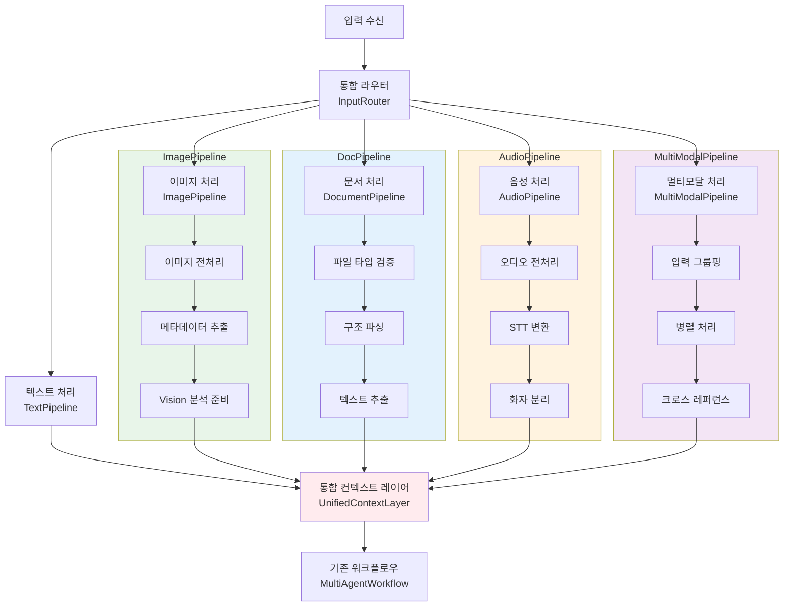

# 멀티모달 파이프라인 시스템

NEOS의 멀티모달 파이프라인 시스템은 텍스트, 이미지, 문서, 오디오 등 다양한 입력 타입을 통합적으로 처리합니다.

## 📋 목차

- [개요](#개요)
- [아키텍처](#아키텍처)
- [파이프라인 종류](#파이프라인-종류)
- [사용 방법](#사용-방법)
- [확장 가이드](#확장-가이드)
- [API 레퍼런스](#api-레퍼런스)

## 개요

### 주요 특징

- **통합 라우터**: 입력 타입을 자동으로 분류하고 적절한 파이프라인으로 라우팅
- **공통 인터페이스**: 모든 파이프라인이 동일한 베이스 클래스를 상속하여 일관성 보장
- **느슨한 결합**: 각 파이프라인이 독립적으로 동작하며 쉽게 추가/제거 가능
- **병렬 처리**: 멀티모달 입력 시 각 파이프라인을 병렬로 실행
- **통합 컨텍스트**: 모든 처리 결과를 하나의 통합된 형식으로 변환

### 지원하는 입력 타입

| 타입 | 설명 | 예시 |
|-----|------|------|
| **TEXT** | 순수 텍스트 쿼리 | "AI에 대해 설명해줘" |
| **IMAGE** | 이미지 파일 | JPG, PNG, GIF, WebP |
| **DOCUMENT** | 문서 파일 | PDF, DOCX, PPT, XLS, CSV |
| **AUDIO** | 음성 파일 | MP3, WAV, OGG, FLAC |
| **VIDEO** | 비디오 파일 | MP4, AVI, MOV (향후 지원) |
| **MULTIMODAL** | 여러 타입 혼합 | 이미지 + 문서 + 오디오 |

## 아키텍처



### 핵심 컴포넌트

1. **BasePipeline**: 모든 파이프라인의 추상 베이스 클래스
2. **InputRouter**: 입력 타입 분류 및 라우팅
3. **각 파이프라인**: 타입별 전문 처리 로직
4. **UnifiedContextLayer**: 결과 통합 및 워크플로우 연결
5. **PipelineRegistry**: 파이프라인 관리 (싱글톤)

## 파이프라인 종류

### 1. TextPipeline (텍스트 처리)

순수 텍스트 쿼리를 처리합니다.

**처리 단계:**
1. 검증: 쿼리 길이 및 유효성 확인
2. 전처리: 공백 정리, 언어 감지
3. 추출: 메타데이터 추출 (길이, 단어 수 등)
4. 분석: 쿼리 타입 분류 (질문, 비교, 분석 등)

**예시:**
```python
from neos.workflow.pipelines import TextPipeline, PipelineContext, InputType

pipeline = TextPipeline()
context = PipelineContext(
    query="AI의 발전 과정을 설명해줘",
    input_type=InputType.TEXT
)

result = await pipeline.process(context)
print(result.extracted_text)  # "AI의 발전 과정을 설명해줘"
print(result.metadata["language"])  # "ko"
```

### 2. ImagePipeline (이미지 처리)

이미지 파일을 전처리하고 Vision 모델 분석을 준비합니다.

**처리 단계:**
1. 검증: 파일 크기, 포맷 확인
2. 전처리: 이미지 로드, 리사이징, RGB 변환
3. 추출: 메타데이터 및 base64 인코딩
4. 분석: 품질 평가, Vision 모델 호출 준비

**지원 포맷:** JPG, PNG, GIF, WebP, BMP

**예시:**
```python
from neos.workflow.pipelines import ImagePipeline, PipelineContext, FileInput, InputType

pipeline = ImagePipeline()

file = FileInput(
    file_path="/path/to/image.jpg",
    filename="image.jpg"
)

context = PipelineContext(
    query="이 이미지에서 무엇이 보이나요?",
    input_type=InputType.IMAGE,
    files=[file]
)

result = await pipeline.process(context)
print(result.metadata["original_size"])  # (1920, 1080)
print(result.metadata["format"])  # "JPEG"
```

### 3. DocumentPipeline (문서 처리)

PDF, DOCX, PPT, XLS 등 다양한 문서를 파싱합니다.

**처리 단계:**
1. 검증: 파일 크기, 포맷 확인
2. 전처리: 문서 타입 결정
3. 추출: 텍스트, 이미지, 테이블 추출
4. 분석: 구조 분석, 복잡도 평가

**지원 포맷:** PDF, DOC, DOCX, XLS, XLSX, PPT, PPTX, CSV, TXT, MD

**예시:**
```python
from neos.workflow.pipelines import DocumentPipeline, PipelineContext, FileInput, InputType

pipeline = DocumentPipeline()

file = FileInput(
    file_path="/path/to/document.pdf",
    filename="document.pdf"
)

context = PipelineContext(
    query="이 문서를 요약해줘",
    input_type=InputType.DOCUMENT,
    files=[file]
)

result = await pipeline.process(context)
print(result.extracted_text[:200])  # 처음 200자
print(result.metadata["document_type"])  # "pdf"
```

### 4. AudioPipeline (음성 처리)

오디오 파일을 STT로 변환하고 분석합니다.

**처리 단계:**
1. 검증: 파일 크기, 포맷, 길이 확인
2. 전처리: 노이즈 제거, 정규화
3. 추출: STT 변환, 타임스탬프
4. 분석: 화자 분리, 언어 감지

**지원 포맷:** MP3, WAV, OGG, FLAC, M4A

**예시:**
```python
from neos.workflow.pipelines import AudioPipeline, PipelineContext, FileInput, InputType

pipeline = AudioPipeline()

file = FileInput(
    file_path="/path/to/audio.mp3",
    filename="audio.mp3"
)

context = PipelineContext(
    query="이 오디오를 전사해줘",
    input_type=InputType.AUDIO,
    files=[file]
)

result = await pipeline.process(context)
print(result.extracted_text)  # STT 결과
print(result.metadata["duration_seconds"])  # 120.5
```

### 5. MultiModalPipeline (멀티모달 처리)

여러 타입의 입력을 동시에 처리하고 크로스 레퍼런스 분석을 수행합니다.

**처리 단계:**
1. 검증: 다중 파일 확인
2. 전처리: 파일 타입별 그룹핑
3. 추출: 각 파이프라인 병렬 실행
4. 분석: 크로스 레퍼런스, 통합 품질 평가

**예시:**
```python
from neos.workflow.pipelines import MultiModalPipeline, PipelineContext, FileInput, InputType

pipeline = MultiModalPipeline()

files = [
    FileInput(file_path="/path/to/image.jpg", filename="image.jpg"),
    FileInput(file_path="/path/to/doc.pdf", filename="doc.pdf"),
    FileInput(file_path="/path/to/audio.mp3", filename="audio.mp3"),
]

context = PipelineContext(
    query="이 파일들을 종합적으로 분석해줘",
    input_type=InputType.MULTIMODAL,
    files=files
)

result = await pipeline.process(context)
print(result.analysis["input_types"])  # ["image", "document", "audio"]
print(result.analysis["cross_references"])  # 크로스 레퍼런스 정보
```

## 사용 방법

### 기본 사용법

#### 1. 멀티모달 워크플로우 사용

```python
from neos.workflow.multimodal_workflow import MultiModalWorkflow

workflow = MultiModalWorkflow()

# 텍스트만
result = await workflow.process(
    query="AI에 대해 설명해줘",
    user_id="user123",
    session_id="session456"
)

# 이미지 포함
result = await workflow.process(
    query="이 이미지를 분석해줘",
    files=[{
        "file_path": "/path/to/image.jpg",
        "filename": "image.jpg"
    }],
    user_id="user123"
)

# 멀티모달 (이미지 + 문서)
result = await workflow.process(
    query="이 자료들을 종합 분석해줘",
    files=[
        {"file_path": "/path/to/image.jpg", "filename": "image.jpg"},
        {"file_path": "/path/to/doc.pdf", "filename": "doc.pdf"},
    ],
    user_id="user123"
)
```

#### 2. 개별 파이프라인 사용

```python
from neos.workflow.pipelines import TextPipeline, PipelineContext, InputType

# 텍스트 파이프라인
pipeline = TextPipeline()
context = PipelineContext(
    query="Hello, world!",
    input_type=InputType.TEXT
)

result = await pipeline.process(context)

if result.success:
    print(f"Extracted: {result.extracted_text}")
    print(f"Language: {result.metadata['language']}")
    print(f"Insights: {result.insights}")
else:
    print(f"Error: {result.error}")
```

#### 3. 라우터로 자동 분류

```python
from neos.workflow.pipelines import InputRouter, FileInput

router = InputRouter()

# 자동 분류
files = [FileInput(filename="test.jpg", mime_type="image/jpeg")]
input_type = router.classify_input("분석해줘", files=files)
print(input_type)  # InputType.IMAGE

# 라우팅 (컨텍스트 + 파이프라인 반환)
context, pipeline = router.route(
    query="분석해줘",
    files=files,
    user_id="user123"
)

# 파이프라인 실행
result = await pipeline.process(context)
```

### FastAPI 통합

```python
from fastapi import FastAPI, UploadFile, File, Form
from neos.workflow.multimodal_workflow import MultiModalWorkflow

app = FastAPI()
workflow = MultiModalWorkflow()

@app.post("/api/v1/multimodal/query")
async def multimodal_query(
    query: str = Form(...),
    files: List[UploadFile] = File(default=[]),
    user_id: str = Form(default="anonymous")
):
    # 파일 변환
    file_inputs = []
    for file in files:
        content = await file.read()
        file_inputs.append({
            "filename": file.filename,
            "file_content": content,
            "mime_type": file.content_type,
            "file_size": len(content)
        })

    # 처리
    result = await workflow.process(
        query=query,
        files=file_inputs if file_inputs else None,
        user_id=user_id
    )

    return result
```

## 확장 가이드

### 새 파이프라인 추가

1. **파이프라인 클래스 생성**

```python
from neos.workflow.pipelines.base import BasePipeline, InputType, PipelineContext, PipelineResult

class VideoPipeline(BasePipeline):
    """비디오 처리 파이프라인"""

    def __init__(self):
        super().__init__(name="VideoPipeline", input_type=InputType.VIDEO)

    async def validate(self, context: PipelineContext) -> bool:
        # 검증 로직
        return True

    async def preprocess(self, context: PipelineContext) -> PipelineContext:
        # 전처리 로직
        return context

    async def extract(self, context: PipelineContext) -> PipelineResult:
        # 추출 로직
        return PipelineResult(
            success=True,
            input_type=InputType.VIDEO,
            stage=ProcessingStage.EXTRACTION
        )

    async def analyze(self, result: PipelineResult, context: PipelineContext) -> PipelineResult:
        # 분석 로직
        return result
```

2. **파이프라인 등록**

```python
from neos.workflow.pipelines import PipelineRegistry, InputType

registry = PipelineRegistry()
registry.register(InputType.VIDEO, VideoPipeline())
```

3. **라우터에 매핑 추가**

```python
# router.py에서
MIME_TYPE_MAPPING = {
    ...
    "video/mp4": InputType.VIDEO,
    "video/mpeg": InputType.VIDEO,
}
```

### 커스텀 분석 추가

기존 파이프라인을 상속하여 커스텀 분석을 추가할 수 있습니다:

```python
from neos.workflow.pipelines import ImagePipeline

class AdvancedImagePipeline(ImagePipeline):
    """고급 이미지 분석 파이프라인"""

    async def analyze(self, result, context):
        # 기본 분석 실행
        result = await super().analyze(result, context)

        # 추가 분석
        result.analysis["custom_metric"] = self._calculate_custom_metric(result)

        return result

    def _calculate_custom_metric(self, result):
        # 커스텀 메트릭 계산
        return 0.95
```

## API 레퍼런스

### BasePipeline

```python
class BasePipeline(ABC):
    async def validate(self, context: PipelineContext) -> bool
    async def preprocess(self, context: PipelineContext) -> PipelineContext
    async def extract(self, context: PipelineContext) -> PipelineResult
    async def analyze(self, result: PipelineResult, context: PipelineContext) -> PipelineResult
    async def process(self, context: PipelineContext) -> PipelineResult
```

### PipelineContext

```python
@dataclass
class PipelineContext:
    query: str
    input_type: InputType
    files: List[FileInput]
    user_id: Optional[str]
    session_id: Optional[str]
    language: Optional[str]
    preferences: Dict[str, Any]
    timestamp: datetime
    stage: ProcessingStage
    additional_context: Dict[str, Any]
```

### PipelineResult

```python
@dataclass
class PipelineResult:
    success: bool
    input_type: InputType
    stage: ProcessingStage
    extracted_text: Optional[str]
    extracted_data: Dict[str, Any]
    metadata: Dict[str, Any]
    analysis: Optional[Dict[str, Any]]
    insights: List[str]
    unified_context: Optional[str]
    error: Optional[str]
    warnings: List[str]
    processing_time_ms: Optional[float]
    timestamp: datetime
```

### FileInput

```python
@dataclass
class FileInput:
    file_path: Optional[str]
    file_content: Optional[bytes]
    mime_type: Optional[str]
    file_size: Optional[int]
    filename: Optional[str]
    url: Optional[str]
```

## 향후 계획

### Phase 1 (현재)
- [x] 기본 파이프라인 구조
- [x] 텍스트 처리
- [x] 이미지 전처리
- [x] 문서 메타데이터 추출
- [x] 오디오 구조 설계
- [x] 멀티모달 병렬 처리

### Phase 2 (진행 중)
- [x] Vision 모델 통합 (GPT-4V, Claude Vision)
- [x] PDF 파싱 (PyPDF2, pdfplumber)
- [ ] Word/Excel 파싱 (python-docx, openpyxl)
- [ ] STT 통합 (OpenAI Whisper)
- [ ] 화자 분리 (pyannote.audio)

### Phase 3 (계획)
- [ ] 비디오 처리 파이프라인
- [ ] 실시간 스트리밍 지원
- [ ] 웹 크롤링 통합
- [ ] 고급 크로스 레퍼런스 분석
- [ ] 자동 품질 평가 및 피드백

## 문제 해결

### 일반적인 문제

**Q: 파일이 지원되지 않는다는 오류가 발생합니다.**

A: `router.EXTENSION_MAPPING`이나 `router.MIME_TYPE_MAPPING`에 해당 파일 타입이 등록되어 있는지 확인하세요.

**Q: 멀티모달 처리 시 일부 파이프라인이 실패합니다.**

A: 각 파이프라인은 독립적으로 실행되며, 일부 실패해도 나머지는 계속 처리됩니다. `result.errors`를 확인하세요.

**Q: Vision 모델이 호출되지 않습니다.**

A: 현재는 Vision 모델 통합이 TODO 상태입니다. Phase 2에서 구현 예정입니다.

## 기여하기

새로운 파이프라인이나 기능을 추가하고 싶으시면:

1. 이슈를 생성하여 아이디어 공유
2. 포크 후 브랜치 생성
3. 테스트 코드 작성
4. PR 생성

## 라이센스

MIT License
