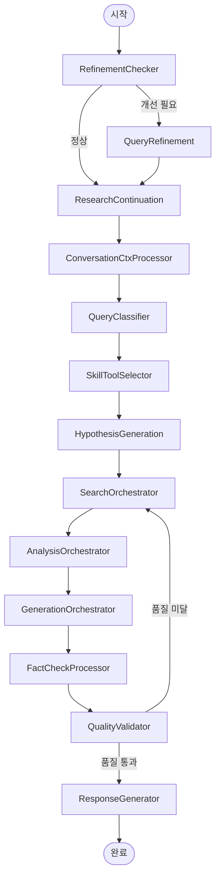

# NEOS 백엔드 아키텍처

> **버전:** 0.22.0
> **최종 업데이트:** 2026-03-02

## 목차

1. [프로젝트 개요](#1-프로젝트-개요)
2. [디렉터리 구조](#2-디렉터리-구조)
3. [핵심 기술 스택](#3-핵심-기술-스택)
4. [애플리케이션 초기화](#4-애플리케이션-초기화)
5. [API 구조](#5-api-구조)
6. [멀티에이전트 워크플로우](#6-멀티에이전트-워크플로우)
7. [데이터베이스 설계](#7-데이터베이스-설계)
8. [캐싱 전략](#8-캐싱-전략)
9. [인증 & 권한](#9-인증--권한)
10. [스킬 시스템](#10-스킬-시스템)
11. [비동기 태스크 처리](#11-비동기-태스크-처리)
12. [관찰가능성 스택](#12-관찰가능성-스택)
13. [유틸리티 컴포넌트](#13-유틸리티-컴포넌트)
14. [메모리 시스템](#14-메모리-시스템)
15. [외부 통합](#15-외부-통합)
16. [배포 구성](#16-배포-구성)
17. [성능 최적화 패턴](#17-성능-최적화-패턴)
18. [코드 컨벤션 & 패턴](#18-코드-컨벤션--패턴)

---

## 1. 프로젝트 개요

**NEOS (Neos Intelligent Search and Analysis System)**는 LangGraph 기반의 멀티에이전트 AI 워크플로우 플랫폼으로, 복잡한 쿼리를 자동으로 분해·처리·종합하는 지능형 검색·분석 시스템입니다.

### 핵심 특성

| 특성 | 설명 |
|------|------|
| **언어** | Python 3.12+ |
| **웹 프레임워크** | FastAPI 0.118 (비동기) |
| **워크플로우 엔진** | LangGraph 1.0.8 (StateGraph) |
| **주요 LLM** | Anthropic Claude (Opus/Haiku), OpenAI GPT-4 |
| **DB** | PostgreSQL 16 + pgvector |
| **캐시** | Redis + 시맨틱 캐시 |
| **태스크큐** | Celery 5.4 |
| **배포** | Docker / Docker Compose |

### 시스템 레이어 개요

```
┌─────────────────────────────────────────────────────────┐
│                     클라이언트 (Web/API)                  │
└──────────────────────────┬──────────────────────────────┘
                           │ HTTP / WebSocket / SSE
┌──────────────────────────▼──────────────────────────────┐
│              FastAPI 애플리케이션 (neos/main.py)          │
│         CORS │ GZip │ Request Logging Middleware         │
└──────────────────────────┬──────────────────────────────┘
                           │
┌──────────────────────────▼──────────────────────────────┐
│                   API 라우터 레이어                        │
│   auth / query / chat / document / deep-research / ...   │
└──────────────────────────┬──────────────────────────────┘
                           │
┌──────────────────────────▼──────────────────────────────┐
│            멀티에이전트 워크플로우 (LangGraph)              │
│  RefinementChecker → Classifier → Orchestrators → ...   │
│              Search / Analysis / Generation Agents       │
└──────┬──────────────────────────────────────┬───────────┘
       │                                      │
┌──────▼──────────┐               ┌──────────▼───────────┐
│  PostgreSQL     │               │   Redis Cache         │
│  + pgvector     │               │   + Semantic Cache    │
└─────────────────┘               └──────────────────────┘
```

---

## 2. 디렉터리 구조

```
neos/                          # 프로젝트 루트
├── neos/                      # 메인 애플리케이션 모듈
│   ├── main.py                # FastAPI 진입점
│   ├── api/                   # API 라우터 & 핸들러
│   │   ├── routers/           # 엔드포인트 라우터
│   │   ├── handlers/          # 비즈니스 로직 핸들러
│   │   └── services/          # 서비스 레이어
│   ├── workflow/              # LangGraph 워크플로우
│   │   ├── graph.py           # StateGraph 정의
│   │   ├── agents/            # 에이전트 구현
│   │   ├── orchestrators/     # 오케스트레이터
│   │   ├── processors/        # 프로세서 노드
│   │   ├── celery_app.py      # Celery 설정
│   │   └── telemetry.py       # OpenTelemetry 설정
│   ├── database/              # DB 모델 & 연결
│   │   ├── models.py          # SQLAlchemy 모델
│   │   ├── connection.py      # DB 연결 관리자
│   │   └── repositories/      # 데이터 접근 레이어
│   ├── config/                # 설정 관리
│   │   └── settings.py        # 전체 설정 (pydantic-settings)
│   ├── skills/                # 스킬 시스템
│   │   ├── base/              # 스킬 기반 클래스
│   │   ├── builtin/           # 내장 스킬
│   │   └── manager/           # 스킬 매니저
│   ├── tools/                 # 도구 통합
│   │   └── mcp_integration.py # MCP 클라이언트
│   ├── memory/                # 메모리 시스템
│   │   ├── short_term.py      # 단기 기억
│   │   ├── episodic.py        # 에피소딕 기억
│   │   ├── long_term.py       # 장기 기억
│   │   └── manager.py         # 메모리 오케스트레이터
│   ├── observability/         # 관찰가능성
│   │   ├── metrics.py         # Prometheus 메트릭
│   │   ├── middleware.py       # 추적 미들웨어
│   │   └── phoenix_client.py  # Arize Phoenix
│   ├── exporters/             # 보고서 내보내기
│   │   ├── html_exporter.py
│   │   ├── pdf_exporter.py
│   │   └── markdown_exporter.py
│   ├── services/              # 도메인 서비스
│   │   ├── evidence_graph_service.py  # Phase 3.2
│   │   └── kg_population_service.py   # Phase 3.1
│   └── utils/                 # 유틸리티
│       ├── semantic_cache.py
│       ├── smart_cache_manager.py
│       ├── circuit_breaker.py
│       ├── rate_limiter.py
│       └── cost_calculator.py
├── api_gateway/               # API 게이트웨이 설정
├── backoffice/                # 관리자 패널
├── config/                    # 인프라 설정
│   ├── prometheus/            # Prometheus 설정 & 알림
│   ├── grafana/               # Grafana 대시보드
│   ├── loki/                  # 로그 집계
│   └── nginx/                 # 리버스 프록시
├── db/                        # Alembic 마이그레이션
├── mcp/                       # MCP 서버 (예정)
├── web/                       # 프론트엔드
├── tests/                     # 테스트 스위트
├── examples/                  # 예제 구현
├── scripts/                   # 유틸리티 스크립트
├── docker/                    # Docker 설정
├── docs/                      # 문서
├── pyproject.toml             # 프로젝트 의존성
├── docker-compose.dev.yml     # 개발 환경
├── docker-compose.enterprise.yml  # 엔터프라이즈 환경
└── .env.template              # 환경 변수 템플릿
```

---

## 3. 핵심 기술 스택

### 3.1 웹 & 비동기

| 라이브러리 | 버전 | 용도 |
|-----------|------|------|
| FastAPI | 0.118.0 | 웹 프레임워크 |
| Uvicorn | 0.35.0 | ASGI 서버 |
| Granian | 2.6.0 | 고성능 ASGI 서버 |
| asyncpg | 0.30.0 | 비동기 PostgreSQL 드라이버 |
| aioredis | 2.0.1 | 비동기 Redis 클라이언트 |
| aiofiles | 24.1.0 | 비동기 파일 I/O |
| httpx | 0.28.1 | 비동기 HTTP 클라이언트 |

### 3.2 AI / LLM

| 라이브러리 | 버전 | 용도 |
|-----------|------|------|
| anthropic | 0.79.0 | Claude API (주 LLM) |
| openai | 2.21.0 | GPT-4, DALL-E, 임베딩 |
| langchain | 1.2.10 | LLM 체인 |
| langchain-anthropic | 1.3.2 | LangChain-Claude 통합 |
| langgraph | 1.0.8 | 에이전트 워크플로우 |
| crewai | 0.175.0 | 에이전트 프레임워크 |
| google-generativeai | 0.8.0 | Gemini 통합 |
| tavily-python | 0.7.11 | 웹 검색 API |

### 3.3 데이터베이스 & 벡터

| 라이브러리 | 버전 | 용도 |
|-----------|------|------|
| SQLAlchemy | 2.0.43 | ORM (비동기) |
| asyncpg | 0.30.0 | PostgreSQL 드라이버 |
| pgvector | 0.4.1 | 벡터 유사도 검색 |
| alembic | 1.13.0 | DB 마이그레이션 |
| redis | 6.4.0 | 캐싱 & 메시지 브로커 |

### 3.4 태스크큐 & 스케줄링

| 라이브러리 | 버전 | 용도 |
|-----------|------|------|
| celery | 5.4.0 | 비동기 태스크큐 |
| kombu | 5.4.0 | 메시지 큐 추상화 |

### 3.5 관찰가능성

| 라이브러리 | 버전 | 용도 |
|-----------|------|------|
| opentelemetry-* | 다양 | 분산 트레이싱 |
| arize-phoenix | 5.5.0 | LLM 관찰가능성 |
| prometheus-client | 0.20.0 | 메트릭 수집 |

### 3.6 문서 처리

| 라이브러리 | 버전 | 용도 |
|-----------|------|------|
| PyPDF2 | 3.0.1 | PDF 읽기 |
| PyMuPDF | 1.26.7 | PDF 처리 |
| trafilatura | 2.0.0 | 웹 콘텐츠 추출 |
| python-docx | 1.1.2 | Word 문서 |
| python-pptx | 1.0.2 | PowerPoint |
| openpyxl | 3.1.5 | Excel |
| playwright | 1.55.0 | 브라우저 자동화 |

### 3.7 인증 & 보안

| 라이브러리 | 버전 | 용도 |
|-----------|------|------|
| bcrypt | 4.0.0 | 패스워드 해싱 |
| python-jose | 3.3.0 | JWT 처리 |
| PyJWT | 2.10.1 | JWT |
| google-auth | 2.35.0 | Google OAuth |

---

## 4. 애플리케이션 초기화

**파일:** `neos/main.py`

### 4.1 Lifespan 관리

FastAPI의 `lifespan` 컨텍스트 매니저를 통해 애플리케이션 시작/종료 시퀀스를 관리합니다.

```
Startup 시퀀스:
  1. OpenTelemetry 초기화 (분산 트레이싱)
  2. PostgreSQL 연결 풀 생성 (pool_size=20, max_overflow=30)
  3. Redis 캐시 초기화
  4. SSE Stream Manager 시작
  5. Prometheus 메트릭 컬렉터 초기화
  6. 스킬 시스템 자동 발견 & 등록

Shutdown 시퀀스:
  1. 백그라운드 태스크 취소
  2. Stream Manager 정리
  3. 워크플로우 체크포인터 정리
  4. DB 연결 종료
  5. Redis 연결 종료
```

### 4.2 미들웨어 스택

```python
# 적용 순서 (바깥 → 안쪽)
app.add_middleware(RequestLoggingMiddleware)  # 요청 추적, request ID 생성, 실행 시간 측정
app.add_middleware(GZipMiddleware, minimum_size=1024)  # 응답 압축 (1KB 이상)
app.add_middleware(CORSMiddleware, ...)  # CORS 검증
```

### 4.3 예외 핸들러

| 예외 타입 | 처리 방식 |
|-----------|-----------|
| `NeosBaseException` | 커스텀 애플리케이션 예외 처리 |
| `HTTPException` | 표준 HTTP 오류 응답 |
| `Exception` | 예상치 못한 예외 글로벌 핸들링 |

---

## 5. API 구조

**위치:** `neos/api/`

### 5.1 라우터 목록

| 라우터 | 프리픽스 | 목적 |
|--------|---------|------|
| `auth_router` | `/api/v1/auth` | 사용자 등록, 로그인, 토큰 관리, OAuth |
| `query_router` | `/api/v1` | 메인 멀티에이전트 쿼리 처리 |
| `chat_router` | `/api/v1/chat` | 대화형 AI, 메시지 히스토리 |
| `document_router` | `/api/v1/documents` | 문서 업로드, 처리, 관리 |
| `multimodal_router` | `/api/v1/multimodal` | 이미지 분석, 멀티모달 처리 |
| `deep_research_router` | `/api/v1` | 심층 리서치 보고서 생성 |
| `skills_router` | `/api/v1/skills` | 스킬 관리 & 자동 발견 |
| `workflow_stream_router` | `/api/v1` | SSE/WebSocket 스트리밍 |
| `web_search_analytics_router` | `/api/v1/analytics` | 웹 검색 메트릭 & 분석 |
| `unified_router` | `/` | 문서 + 워크플로우 통합 |
| `similarity_chat_router` | `/api/v1/chat` | 벡터 기반 메시지 유사도 |
| `vote_router` | `/api/v1` | 사용자 피드백 & 투표 |
| `artifact_router` | `/api/v1` | 아티팩트 & 문서 관리 |
| `research_session_router` | `/` | 리서치 세션 추적 |
| `async_research_router` | `/` | Celery 기반 비동기 리서치 |
| `export_router` | `/` | 보고서 내보내기 (HTML/PDF/Markdown) |
| `refinement_router` | `/` | 인터랙티브 리서치 개선 |
| `template_router` | `/` | 리서치 템플릿 |

### 5.2 주요 엔드포인트

```
POST   /api/v1/query                      # 메인 쿼리 처리 (멀티에이전트)
GET    /api/v1/health                     # 헬스체크
GET    /api/v1/trending                   # 트렌딩 쿼리
POST   /api/v1/auth/register              # 사용자 등록
POST   /api/v1/auth/login                 # 이메일/패스워드 로그인
POST   /api/v1/auth/guest                 # 게스트 로그인
POST   /api/v1/deep-research/start        # 심층 리서치 시작
GET    /api/v1/chat/conversations         # 대화 목록
WS     /api/v1/chat/ws/{conversation_id}  # WebSocket 채팅
GET    /metrics                           # Prometheus 메트릭
```

---

## 6. 멀티에이전트 워크플로우

**파일:** `neos/workflow/graph.py`

### 6.1 워크플로우 다이어그램



### 6.2 워크플로우 노드 설명

| 노드 | 역할 |
|------|------|
| `RefinementChecker` | 쿼리가 개선이 필요한지 판단 |
| `QueryRefinement` | 불명확한 쿼리 개선 |
| `ResearchContinuation` | 이전 리서치 이어서 진행 (Phase 2.2) |
| `ConversationCtxProcessor` | 멀티턴 대화 컨텍스트 처리 |
| `QueryClassifier` | 쿼리 의도 분류 |
| `SkillToolSelector` | 적절한 스킬/도구 선택 |
| `HypothesisGeneration` | 리서치 가설 생성 (Phase 2.5) |
| `SearchOrchestrator` | 검색 에이전트 병렬 조율 |
| `AnalysisOrchestrator` | 분석 에이전트 조율 |
| `GenerationOrchestrator` | 생성 에이전트 조율 |
| `FactCheckProcessor` | 결과 사실 검증 |
| `QualityValidator` | 결과 품질 평가 |
| `ResponseGenerator` | 최종 응답 합성 |

### 6.3 에이전트 분류

#### 검색 에이전트 (Search Agents)

| 에이전트 | 역할 | 타임아웃 |
|---------|------|---------|
| `KnowledgeSearchAgent` | 지식 베이스 검색 | 20s |
| `RealtimeInfoSearchAgent` | 실시간 정보 검색 | 30s |
| `RealtimeDataSearchAgent` | 실시간 데이터 (주식, 날씨 등) | 30s |
| `MultiQuerySearchAgent` | 다중 쿼리 분해 검색 | 35s |
| `WebLookUpAgent` | 웹 검색 & 링크 추적 | 15s |
| `YouTubeSearchAgent` | YouTube 영상 검색 & 자막 분석 | 45s |

#### 분석 에이전트 (Analysis Agents)

| 에이전트 | 역할 | 타임아웃 |
|---------|------|---------|
| `DataAnalysisAgent` | 데이터 분석 & 통계 | 60s |
| `ComparativeAnalysisAgent` | 비교 분석 | 60s |
| `WebContentAnalysisAgent` | 웹 콘텐츠 추출 & 분석 | 45s |

#### 생성 에이전트 (Generation Agents)

| 에이전트 | 역할 |
|---------|------|
| `ImageGenerationAgent` | DALL-E 이미지 생성 |
| `ApiCallAgent` | 외부 API 통합 |
| `FileProcessingAgent` | 문서/파일 처리 |
| `TaskCreationAgent` | 리서치 결과로 태스크 생성 |

### 6.4 상태 관리

- **LangGraph StateGraph:** 분산 상태 머신으로 워크플로우 실행
- **PostgreSQL 체크포인터:** 워크플로우 상태를 DB에 영속 저장 (장애 복구 지원)
- **세션 격리:** 각 쿼리는 독립적인 상태 공간에서 실행

---

## 7. 데이터베이스 설계

**파일:** `neos/database/models.py`, `neos/database/connection.py`

### 7.1 주요 모델

#### 사용자 관리

```
User
├── user_id (PK, UUID, indexed)
├── email, username (unique, indexed)
├── password_hash (bcrypt)
├── is_active, is_verified, is_admin
├── role: user / admin / premium / enterprise / guest
├── google_id (OAuth)
├── subscription_tier, subscription_status (구독)
├── usage_quota, usage_current (JSONB, 사용량 추적)
├── preferences (JSONB)
└── 관계: query_histories, search_sessions, api_keys, refresh_tokens

APIKey          # 사용자 API 키 인증
RefreshToken    # JWT Refresh 토큰
UserOAuthAccount  # OAuth 계정 연동
```

#### 쿼리 & 검색

```
QueryHistory
├── original_query, processed_query
├── query_vector (Vector(1536), pgvector)  # 시맨틱 유사도용
├── query_intent, search_results (JSONB)
├── response_quality_score, execution_time_ms
└── tools_used (ARRAY)

RelatedQuery     # 쿼리 관계 (semantic/sequential/collaborative)
TrendingQuery    # 트렌딩 검색 분석
SearchSession    # 멀티쿼리 세션
```

#### 문서 관리

```
Document
├── filename, original_filename, file_size, mime_type, file_hash
├── storage_provider, storage_bucket, storage_key, storage_url
├── title, author, language, page_count, word_count
├── processing_status, processing_error
├── kg_extracted, embedding_processed, fts_indexed (처리 상태 플래그)
└── 관계: chunks, knowledge_graph

DocumentChunk
├── chunk_index, chunk_text, chunk_size
├── page_number, start_offset, end_offset
├── embedding (Vector(1536))  # 벡터 검색용
├── chunking_strategy: fixed / sentence / semantic / parent_child
└── chunk_type: paragraph / heading / list / table / code

KnowledgeGraph
├── entity_id, entity_type, entity_name, entity_description
├── entity_embedding (Vector(1536))
└── relations (JSONB)  # [{target, relation_type, confidence}]
```

#### 기타 모델

```
Organization     # 멀티테넌트 지원 (엔터프라이즈)
Vote / Feedback  # 사용자 결과 피드백
Artifact         # 생성된 아티팩트 & 출력물
ResearchSession  # 장기 리서치 추적
WebSearchAnalytics  # 검색 소스 성능 메트릭
```

### 7.2 DatabaseManager 설정

```python
# neos/database/connection.py
DatabaseManager:
  engine: AsyncEngine (SQLAlchemy 2.0)
  driver: asyncpg
  pool_size: 20
  max_overflow: 30
  pool_timeout: 30s
  pool_recycle: 1800s (30분)
  pool_pre_ping: True (연결 상태 사전 확인)
  prepared_statement_cache: 비활성화 (안정성)
```

### 7.3 Alembic 마이그레이션

```
db/
└── migrations/          # Alembic 마이그레이션 파일
    ├── env.py
    ├── script.py.mako
    └── versions/        # 버전별 마이그레이션
```

---

## 8. 캐싱 전략

**파일:** `neos/utils/semantic_cache.py`, `neos/utils/smart_cache_manager.py`

### 8.1 다층 캐싱 아키텍처

```
쿼리 요청
    │
    ▼
┌─────────────────────────┐
│   Smart Cache (Redis)   │  ← 쿼리 유형별 TTL 적용
│  (정확한 키 기반 매칭)   │
└─────────┬───────────────┘
          │ 미스
          ▼
┌─────────────────────────┐
│   Semantic Cache        │  ← 벡터 유사도 기반 (pgvector)
│  (유사도 임계값: 0.90)  │
└─────────┬───────────────┘
          │ 미스
          ▼
┌─────────────────────────┐
│   실제 워크플로우 실행   │
└─────────────────────────┘
```

### 8.2 쿼리 유형별 TTL 정책

| 쿼리 유형 | TTL | 이유 |
|----------|-----|------|
| 실시간 정보 (REALTIME) | 15분 | 빠른 변화 |
| 금융 데이터 (FINANCIAL) | 10분 | 시장 변동 |
| 일반 워크플로우 응답 | 2시간 | 기본값 |
| 분석 결과 (ANALYSIS) | 7일 | 안정적 데이터 |
| 리서치 결과 (RESEARCH) | 30일 | 장기 유효 |
| 생성 콘텐츠 (GENERATION) | 90일 | 거의 변하지 않음 |

### 8.3 Redis 설정

```python
REDIS_URL = "redis://localhost:6379"
REDIS_TTL = 3600 (기본 1시간)
REDIS_POOL_SIZE = 50
maxmemory: 2GB
maxmemory-policy: allkeys-lru
appendonly: yes (영속성)
```

### 8.4 시맨틱 캐시

- pgvector의 `Vector(1536)` 컬럼을 활용한 코사인 유사도 검색
- 임계값 0.90 이상이면 캐시 히트로 처리
- 의미적으로 동일한 쿼리에 대해 LLM 호출 없이 응답 재사용

---

## 9. 인증 & 권한

**파일:** `neos/api/handlers/auth.py`

### 9.1 인증 방식

| 방식 | 설명 |
|------|------|
| **이메일/패스워드** | bcrypt 해싱, JWT 발급 |
| **Google OAuth 2.0** | google-auth 라이브러리, 계정 연동 지원 |
| **게스트 액세스** | 임시 게스트 사용자 생성, 제한된 기능 |
| **API Key** | 사용자 생성 키, 스코프 관리 |

### 9.2 JWT 토큰 관리

| 토큰 | 유효기간 | 용도 |
|------|---------|------|
| Access Token | 15분 | API 요청 인증 |
| Refresh Token | 7일 | Access Token 갱신 |

- python-jose 기반 JWT 생성/검증
- Refresh Token 로테이션 지원
- 기기 추적 & IP 로깅

### 9.3 사용자 역할 체계

| 역할 | 접근 권한 |
|------|-----------|
| `guest` | 제한된 기능 (게스트 로그인) |
| `user` | 표준 사용자 기능 |
| `premium` | 프리미엄 기능 |
| `enterprise` | 엔터프라이즈 기능 |
| `admin` | 전체 시스템 접근 |

---

## 10. 스킬 시스템

**위치:** `neos/skills/`

### 10.1 아키텍처

```
neos/skills/
├── base/           # 스킬 기반 클래스 & 인터페이스
├── builtin/        # 내장 스킬 구현체
└── manager/        # 스킬 등록 & 라이프사이클 관리
```

### 10.2 핵심 기능

1. **자동 발견 (Auto-Discovery)**
   - 앱 시작 시 `builtin/` 디렉터리에서 스킬 자동 탐색 및 등록
   - 신규 스킬 추가 시 코드 변경 없이 자동 통합

2. **의존성 체크**
   - 스킬 실행 전 필수 API 키, 외부 서비스 가용성 확인
   - 미충족 의존성 보유 스킬은 자동 제외

3. **Skill 기반 Tool Selector** (`neos/agents/skill_based_tool_selector.py`)
   - 쿼리 의도 분석 → 적합한 스킬/도구 선택
   - 가용 리소스 & 의존성 만족도 기반 우선순위 결정

4. **메타데이터 파싱**
   - Docstring 기반 스킬 메타데이터 추출
   - 스킬 설명, 파라미터, 반환값 자동 문서화

---

## 11. 비동기 태스크 처리

**파일:** `neos/workflow/celery_app.py`

### 11.1 Celery 큐 설정

| 큐 | 우선순위 | 용도 |
|----|---------|------|
| `search` | 8 (최고) | 검색 에이전트 태스크 |
| `analysis` | 7 | 분석 에이전트 태스크 |
| `generation` | 6 | 생성 에이전트 태스크 |
| `default` | 5 | 기타 태스크 |

### 11.2 Celery 설정

```python
task_serializer = "json"
result_serializer = "json"
timezone = "UTC"
worker_concurrency = 4
worker_prefetch_multiplier = 1
task_acks_late = True       # 장애 허용을 위한 후기 ACK
result_expires = 3600       # 결과 1시간 보관
task_soft_time_limit = 300  # 소프트 타임아웃 5분
task_time_limit = 360       # 하드 타임아웃 6분
task_max_retries = 3        # 최대 재시도 횟수
```

### 11.3 주기적 태스크 (Celery Beat)

| 태스크 | 주기 | 목적 |
|--------|------|------|
| `cleanup-old-checkpoints` | 매일 | 오래된 체크포인터 정리 |
| `update-cache-stats` | 10분마다 | 캐시 통계 갱신 |

---

## 12. 관찰가능성 스택

**위치:** `neos/observability/`, `neos/workflow/telemetry.py`

### 12.1 아키텍처

```
NEOS 애플리케이션
      │
      ├── OpenTelemetry SDK ──→ Jaeger (분산 트레이싱)
      │    (OTLP HTTP, :4318)
      │
      ├── Prometheus Client ──→ Prometheus ──→ Grafana (메트릭 대시보드)
      │    (/metrics 엔드포인트)
      │
      ├── Arize Phoenix ──→ Phoenix UI (LLM 관찰가능성)
      │
      └── 구조화 로그 ──→ Loki ──→ Grafana (로그 대시보드)
```

### 12.2 OpenTelemetry 설정

- 서비스명: `neos_multi_agent`
- Jaeger OTLP HTTP 익스포터 (`localhost:4318`)
- 자동 계측: FastAPI, SQLAlchemy, Redis, httpx

### 12.3 Prometheus 메트릭

| 메트릭 | 용도 |
|--------|------|
| HTTP 요청 수/지연시간 | API 성능 모니터링 |
| 워크플로우 실행 메트릭 | 에이전트 성능 추적 |
| LLM API 호출 메트릭 | 비용 & 성능 추적 |
| 시스템 리소스 메트릭 | 인프라 모니터링 |

### 12.4 Arize Phoenix

LLM 트레이스 & 스팬을 시각화하여 프롬프트/응답 품질, 레이턴시, 토큰 사용량을 모니터링합니다.

---

## 13. 유틸리티 컴포넌트

**위치:** `neos/utils/`

### 13.1 Circuit Breaker (`circuit_breaker.py`)

외부 API 장애 시 자동 차단 및 복구:
- 실패 임계값 도달 시 서킷 OPEN (요청 차단)
- 지수 백오프 후 자동 HALF-OPEN → CLOSED 복구
- 비동기 지원 (`test_circuit_breaker_async.py`)

### 13.2 Rate Limiter (`rate_limiter.py`)

- **알고리즘:** 토큰 버킷 (Token Bucket)
- 사용자별/API 키별 독립적 속도 제한
- 초과 시 HTTP 429 응답

### 13.3 Cost Calculator (`cost_calculator.py`)

- tiktoken 기반 토큰 카운팅
- 모델별 입력/출력 토큰 단가 적용
- 쿼리별 LLM 비용 추정 및 예산 추적

### 13.4 Iterative Web Explorer

재귀적 웹 탐색을 위한 설정:

| 설정 | 값 | 설명 |
|------|-----|------|
| `MAX_DEPTH` | 5 | 최대 링크 추적 깊이 |
| `MAX_PAGES` | 20 | 최대 탐색 페이지 수 |
| `MAX_ITERATIONS` | 10 | 최대 반복 횟수 |
| `MIN_QUALITY` | 0.75 | 최소 콘텐츠 품질 임계값 |
| `CONCURRENT_FETCHES` | 3 | 동시 요청 수 |
| `TIMEOUT` | 180s | 전체 탐색 타임아웃 |

### 13.5 Quality Evaluator

결과 품질 평가 가중치:

| 지표 | 가중치 |
|------|--------|
| 완전성 (Completeness) | 40% |
| 신뢰도 (Credibility) | 30% |
| 다양성 (Diversity) | 30% |

---

## 14. 메모리 시스템

**위치:** `neos/memory/`

```
neos/memory/
├── short_term.py    # 단기 기억
├── episodic.py      # 에피소딕 기억
├── long_term.py     # 장기 기억
└── manager.py       # 메모리 오케스트레이터
```

| 메모리 유형 | 저장 내용 | 활용 |
|-----------|---------|------|
| **단기 기억** | 현재 대화 컨텍스트, 최근 메시지 히스토리, 세션 상태 | 실시간 대화 유지 |
| **에피소딕 기억** | 특정 쿼리/리서치 에피소드, 실행 트레이스, 의사결정 로그 | 같은 세션 내 맥락 참조 |
| **장기 기억** | 히스토리 패턴, 지식 베이스, 사용자 선호도 | 장기 개인화 |

**Memory Manager:** 세 가지 메모리 유형을 조율하고 컨텍스트를 최적으로 검색하여 LLM 컨텍스트 윈도우에 주입합니다.

---

## 15. 외부 통합

### 15.1 LLM 통합

| 제공사 | 모델 | 용도 |
|--------|------|------|
| **Anthropic** | claude-opus-4-6 (메인), claude-haiku-4-5-20251001 (빠른 처리) | 주 추론 LLM |
| **OpenAI** | gpt-4-turbo-preview (추론), text-embedding-3-small (임베딩), DALL-E 3 (이미지) | 멀티모달, 임베딩 |
| **Google** | Gemini | 보조 LLM |

### 15.2 검색 & 데이터 API

| API | 용도 |
|-----|------|
| **Tavily** | AI 최적화 웹 검색 |
| **YouTube Data API** | 영상 검색 & 자막 분석 |
| **SerpAPI** | Google 검색 결과 |
| **Reddit API** | 소셜 미디어 콘텐츠 |
| **arXiv API** | 학술 논문 검색 |
| **OpenAlex** | 학술 메타데이터 |
| **Wikipedia API** | 백과사전 콘텐츠 |
| **GitHub API** | 코드 저장소 검색 |

### 15.3 금융 & 데이터 API

| API | 용도 |
|-----|------|
| **yfinance** | 주식 시장 데이터 |
| **Alpha Vantage** | 재무제표 데이터 |
| **FinancialDatasets API** | 금융 데이터셋 |
| **SEC EDGAR** | 공시 파일링 |
| **OpenWeather** | 날씨 데이터 |
| **ExchangeRate API** | 환율 데이터 |

### 15.4 클라우드 & 인프라

| 서비스 | 용도 |
|--------|------|
| **AWS S3** (boto3) | 문서 저장, 백업 |
| **RustFS** | 대안 오브젝트 스토리지 |

### 15.5 MCP (Model Context Protocol)

**파일:** `neos/tools/mcp_integration.py`

Claude의 MCP 클라이언트로 외부 도구 & 서비스 통합 예정. 현재 `mcp/` 디렉터리는 placeholder 상태이며 구현 예정입니다.

---

## 16. 배포 구성

**파일:** `docker-compose.dev.yml`, `docker-compose.enterprise.yml`

### 16.1 Docker Compose 서비스 (개발 환경)

| 서비스 | 포트 | 역할 |
|--------|------|------|
| **PostgreSQL + pgvector** | 5432 | 주 데이터베이스 (pgvector/pgvector:pg16) |
| **Redis** | 6379 | 캐시 & 메시지 브로커 |
| **Jaeger** | 16686 (UI), 4318 (OTLP) | 분산 트레이싱 |
| **Celery Worker** | - | 비동기 태스크 처리 (workers=4) |
| **Celery Beat** | - | 주기적 태스크 스케줄러 |
| **Flower** | 5555 | Celery 태스크 모니터링 UI |
| **Prometheus** | 9090 | 메트릭 수집 |
| **Grafana** | 3000 | 메트릭 대시보드 |
| **Loki** | 3100 | 로그 집계 |
| **Nginx** | 80/443 | 리버스 프록시 |

### 16.2 헬스체크

```dockerfile
HEALTHCHECK --interval=30s --timeout=30s --start-period=5s --retries=3 \
    CMD curl -f http://localhost:8518/api/v1/health || exit 1
```

### 16.3 환경 구분

| 환경 | 파일 | 특징 |
|------|------|------|
| 개발 | `docker-compose.dev.yml` | 모든 모니터링 서비스 포함, 디버그 설정 |
| 엔터프라이즈 | `docker-compose.enterprise.yml` | 프로덕션 스케일, 추가 보안 설정 |

---

## 17. 성능 최적화 패턴

### 17.1 연결 풀링

| 자원 | 풀 크기 | 최대 오버플로우 |
|------|--------|--------------|
| PostgreSQL | 20 | 30 |
| Redis | 50 | - |

- `pool_pre_ping=True`: 쿼리 전 연결 상태 확인
- `pool_recycle=1800`: 30분마다 연결 재생성 (stale 연결 방지)

### 17.2 병렬 에이전트 실행

- 여러 검색 에이전트를 동시 실행하고 타임아웃 기반 폴백 처리
- `SEARCH_ORCHESTRATION_TIMEOUT = 40s`: 오케스트레이터 전체 타임아웃
- 에이전트별 독립 타임아웃으로 단일 장애가 전체 워크플로우에 영향 없음

### 17.3 응답 최적화

- **GZip 압축:** 1KB 이상 응답 자동 압축
- **시맨틱 중복 제거:** 유사한 검색 결과를 벡터 유사도로 필터링
- **페이지네이션:** 대용량 결과셋 분할 처리
- **SSE 스트리밍:** 긴 처리 시간 응답을 실시간 스트리밍으로 제공

### 17.4 품질 기반 캐시 관리

- 쿼리 유형을 자동 분류하여 적합한 TTL 적용
- 캐시 적중률 & 통계를 10분마다 갱신 (Celery Beat)
- 시맨틱 유사도 0.90 이상인 쿼리는 캐시 히트 처리

---

## 18. 코드 컨벤션 & 패턴

### 18.1 Async/Await 패턴

모든 I/O 작업(DB, 캐시, HTTP)은 비동기로 처리합니다:

```python
async with get_db_session() as session:
    result = await session.execute(query)

async with aioredis.from_url(REDIS_URL) as redis:
    cached = await redis.get(cache_key)
```

### 18.2 지연 로딩 (Lazy Loading)

순환 임포트 방지를 위해 에이전트 클래스를 함수 내부에서 임포트합니다:

```python
async def execute_search(query: str):
    # 함수 내부에서 지연 임포트
    from neos.workflow.agents.search import KnowledgeSearchAgent
    agent = KnowledgeSearchAgent()
    return await agent.run(query)
```

### 18.3 구조화 로깅

이모지 + request ID를 활용한 로그 레벨 시각화:

```python
logger.info(f"🔵 [{request_id}] 쿼리 처리 시작: {query}")
logger.info(f"🟢 [{request_id}] 워크플로우 완료: {execution_time_ms}ms")
logger.warning(f"🟡 [{request_id}] 캐시 미스, 워크플로우 실행")
logger.error(f"🔴 [{request_id}] 에이전트 오류: {error}")
```

### 18.4 예외 계층 구조

```python
NeosBaseException
├── AuthenticationError       # 인증 오류
├── AuthorizationError        # 권한 오류
├── WorkflowExecutionError    # 워크플로우 실행 오류
├── AgentTimeoutError         # 에이전트 타임아웃
├── DatabaseError             # DB 오류
└── ExternalAPIError          # 외부 API 오류
```

### 18.5 설정 관리

pydantic-settings 기반 타입 안전 설정:

```python
# neos/config/settings.py
class Settings(BaseSettings):
    DATABASE_URL: str
    REDIS_URL: str
    ANTHROPIC_API_KEY: str

    model_config = SettingsConfigDict(env_file=".env")

settings = Settings()
```

---

## 관련 문서

| 문서 | 내용 |
|------|------|
| [AUTH_IMPLEMENTATION.md](AUTH_IMPLEMENTATION.md) | 인증 시스템 상세 구현 |
| [WORKFLOW_BUILDER_README.md](WORKFLOW_BUILDER_README.md) | 워크플로우 빌더 가이드 |
| [API_QUICK_START.md](API_QUICK_START.md) | API 빠른 시작 가이드 |
| [DEVELOPMENT_SETUP.md](DEVELOPMENT_SETUP.md) | 개발 환경 설정 |
| [ROADMAP.md](ROADMAP.md) | 제품 로드맵 |
| [DOCUMENT_MANAGEMENT.md](DOCUMENT_MANAGEMENT.md) | 문서 관리 시스템 |
| [WEB_SEARCH_ANALYTICS_API.md](WEB_SEARCH_ANALYTICS_API.md) | 웹 검색 분석 API |
| [VISION_INTEGRATION.md](VISION_INTEGRATION.md) | 비전 멀티모달 통합 |
| [YOUTUBE_AGENT_TOOL.md](YOUTUBE_AGENT_TOOL.md) | YouTube 에이전트 |
| [ADVANCED_TOOL_SEARCH.md](ADVANCED_TOOL_SEARCH.md) | 고급 도구 검색 |
