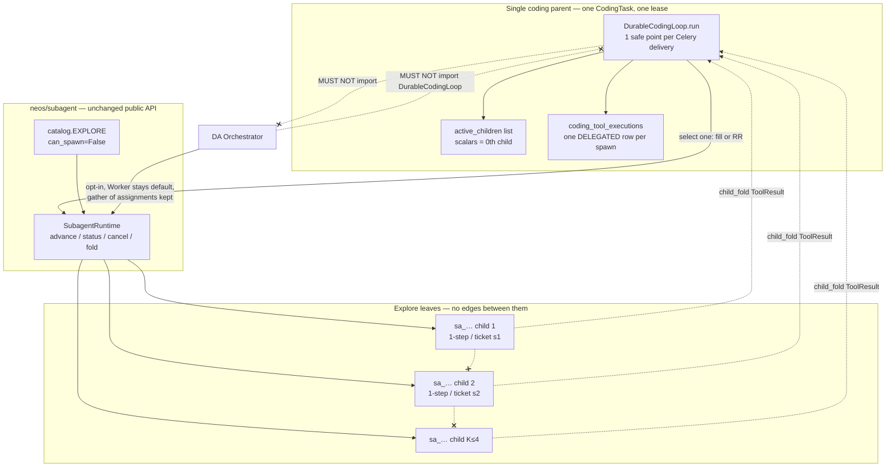

# Parent-Mediated Parallelism (Approach M)

| Field | Value |
|---|---|
| Author | TBD |
| Date | 2026-09-12 |
| Status | Draft |
| Branch | `dev` |
| Product docs | `docs/NEOS_CODING.md` (Phase 7), `docs/SUBAGENT_RUNTIME_DESIGN.md` (K1–K16) |
| Supersedes | K8's "one-active-child is a hard constant, not a knob" — **amended, not reopened**. Approach C, 1-step, import law, and the rest of K1–K16 stay locked. |
| Concepts from | hermes-agent, iii harness spec, Claude Code — **behavior only**. No source, no prompts, no product port. |

---

## Overview

NEOS does not have a multi-agent collaboration platform. It has a parent-driven 1-step explore stepper (`neos/subagent/`, Approach C, commit `062bf836`), a LangGraph pipeline of fixed specialist classes (`MultiAgentWorkflow`), a deep-analysis orchestrator that fans out pure `Worker` functions, and a dead Contract-Net package under `neos/workflow/distributed/`. None of those are "create N agents that collaborate, each of which can spawn subagents."

This document extends Approach C into **Approach M — parent-mediated bounded fan-out**. A coding parent (or the DA orchestrator) may drive **K explore children** (hard cap **4**, default still **1**). Each child remains a 1-step `sa_…` ticket. Children never message each other. There is no coordinator, no mailbox, no team board, no nested `can_spawn`. Merge is the **parent's next model turn after N `child_fold`s**, not peer debate.

The user's "N agents + nested parallel" intent is answered **only** in this shape: the "agents" are parent-mediated explore children; "collaboration" is parent synthesis of N reports; "nested parallel" is parent fan-out, not child-of-child.

This is **not** a collaboration platform. It is a cap raise on an existing delegation primitive.

---

## Background & Motivation

### Investigation verdict (established)

Four live or dead "agent" worlds exist. They are incompatible. Do not unify them.

| World | Path | What it actually is | Collaboration? |
|---|---|---|---|
| Approach C | `neos/subagent/` + `DurableCodingLoop._run_spawn_agent` | Parent-driven 1-step explore stepper. Public API `advance` / `status` / `cancel` / `fold`. Catalog: `explore` only, `can_spawn=False`, `one_shot=True`. Coding: at most **one** active child (`policy_child_already_active`). Flags `coding_model.subagent_enabled` and `deep_analysis.subagent_enabled` default **false**. Child identity `sa_` / `sc_`; channel keys stripped. | **Delegation**, not collaboration. |
| LangGraph pipeline | `MultiAgentWorkflow` (`neos/workflow/graph.py`) | Fixed specialist classes (search / analysis / generation) over shared `AgentState`. `MissionExecutor` is **serial** (`execution_policy={"mode": "serial"}` in `neos/workflow/mission/planner.py`). Custom builder is CLI-only. | **Workflow engine**, not user-created teammates. |
| Deep Analysis | `neos/workflow/deep_analysis/` | Orchestrator fans out `Worker` via `asyncio.gather`, then **only the orchestrator writes the ledger** (DA P2 single-writer + `pg_advisory_xact_lock`). Opt-in adapter: one `advance` per assignment per round. Fold = `unverified_brief`. Track F diagnostician is CLOSED. | Workers do not talk. Fold is not verified claims. |
| Contract Net | `neos/workflow/distributed/` (`form_team`, message bus, `DistributedMultiAgentWorkflow`) | Unused by production coding/DA. `workflow/distributed_graph.py` still imports the package; `neos/agents/autonomous_*.py` are unused examples. **Zero test imports of a live team path.** | **Do not revive.** |

Channels remain 1 session → 1 `channel_coding_bindings` row → 1 `CodingTask` → 1 lease → 1 loop → ≤1 child (today). `ChannelGateway` must not own the coding loop. Mentions are human→bot, not agent routing.

### What Approach C already shipped (do not rebuild)

Verified against `neos/subagent/{runtime,catalog,types,stepper,store,postgres}.py`, `neos/coding/loop/durable.py`, `db/migrations/055_add_subagent_tables.sql`, and `tests/coding/loop/test_spawn_subagent.py`:

- `SubagentRuntime.advance` / `status` / `cancel` / `fold` / `cancel_for_parent`. No `run_until_done`.
- UNIQUE `(parent_kind, parent_id, parent_tool_call_id)` on `subagent_runs`. Multiple children of one parent are **already legal in schema** if `parent_tool_call_id` differs.
- Coding loop state stores a **single** triple: `active_child_run_id` / `active_child_checkpoint_id` / `active_child_tool_call_id` (`AgentLoopState` in `durable.py` ~217–219).
- `_run_spawn_agent` (~1941) errors `policy_child_already_active` when a second `spawn_agent.v1` arrives while that triple is set to a different `tool_call_id`.
- One parent delivery advances the one live child exactly once, parks `DelegatedSpawn`, or `child_fold`s a terminal into the parent `ToolResult`.
- Spawn stays hidden in explore / plan / verify (`phases.py` `_HIDDEN`). `_leading_readonly_batch` breaks on `spawn_agent.v1`.
- DA adapter (`neos/workflow/deep_analysis/subagent_adapter.py`) keeps `Worker` as the default path. Flag-on: one `advance` per `_run_worker`. `asyncio.gather` of assignments is unchanged.

### Pain points this wave actually fixes

1. **K=1 is policy, not schema.** Operators who want two read-only investigates in flight have no knob. The unique parent-triple already allows it.
2. **Child spend is invisible to the parent budget.** `FoldedResult` carries `input_tokens` / `output_tokens` / `cost_micros`, but `_folded_spawn_result` (`durable.py` ~1910) writes only `summary` / `run_id` / `citations`. `_check_usage_budgets` (~1638) never sees child tokens. `ChildStepper` increments child tokens (`stepper.py` ~96–101) and **never writes `cost_micros`** — the field stays `0` on the child row. `SUBAGENT_RUNTIME_DESIGN.md` already required rollup; it is still missing.
3. **DA `unverified_brief` is dropped.** `WorkerResult.unverified_brief` is set by the adapter on terminal fold (`subagent_adapter.py` ~351). `Ledger.commit_pass` (~785) persists claims, repairs, `dead_end`s, and `pass_completed`. It never logs the brief. Graders never see it (good). This wave persists it write-only as `explore_brief` for ledger completeness / debug; nothing queries it for the next assignment or synthesis.
4. **The user asked for N agents + nested parallel.** The wrong answer is a team product. The right answer is raising the existing cap and keeping children as leaves.

### What we are not answering

Hermes `delegate_task` + `run_until_done` + batch-N in-process children, iii Function-Trigger-Worker, Claude Code `TeamCreate` / mailbox / Ink, or a revival of `workflow/distributed/`. Those fight the lease, the 1-step contract, and Phase 7.

---

## Goals & Non-Goals

### Goals

1. A coding parent may have up to `coding_model.subagent_max_active` live explore children (default **1**, hard cap **4**). Each child is its own `sa_…` + `parent_tool_call_id` + `DELEGATED` claim.
2. Fan-out is **concurrency of parked children across parent Celery deliveries**, not K model calls in one 300s slot. One delivery advances **exactly one** child one safe point.
3. The parent is the only collaborator. Children never message each other. Parent synthesis happens on the model turn *after* the spawn window's `child_fold`s are on the transcript.
4. Child token/cost spend increments parent `AgentLoopState` on `child_fold` so `_check_usage_budgets` fires.
5. DA keeps `Worker` as the default. Two correctness fixes: persist `unverified_brief` write-only as ledger event `explore_brief` (not a verified claim, not a `dead_end`, not consumed this wave); keep `continuing` + `tokens_delta` as progress.
6. Identity fence, import law, catalog (`explore`, `can_spawn=False`), and both default-off flags stay exactly as K1–K16.

### Non-Goals (hard)

- A team / coordinator / swarm / mailbox / Kanban / pairing product.
- Approach A (child blob in parent checkpoint) or B (child is a `CodingTask`).
- `while(true)` / `run_until_done` / nested `query()` / hidden `for max_turns` inside the spawn intercept.
- Putting the coding loop or `SubagentRuntime` into `ChannelGateway`.
- Enabling `learn.coding_lessons`, `channels.coding_invoke`, or `inbound_media` by default. No fail-open learning.
- Nested `can_spawn` on explore children. "Each agent spawns subagents" is satisfied **only** at the parent.
- A second coding parent in one channel session. 1 session → 1 `CodingTask` remains.
- `ParentKind.WORKFLOW`. Do not wire LangGraph specialists to `SubagentRuntime`.
- Reviving `neos/workflow/distributed/`.
- Replacing DA `Worker`. DA must not import `DurableCodingLoop`.
- Treating `child_fold` as verified claims. Graders remain the only verified path.
- Write workers, worktree isolation, merge protocol (named **Subagent P2** — prerequisites only; not this wave).
- Ink, free shell, bypass/yolo, WebSearch/Chrome/cron/MCP/Notebook/image-PDF default ON, team memory, autoDream, CLAUDE.md OVERRIDE, Honcho, DeliveryRouter, Function-Trigger-Worker rewrite, S-codes, Reattach, approval `full`.
- A new package. Stay in `neos/subagent/` + coding loop + DA adapter.
- Flipping `coding_model.subagent_enabled` or `deep_analysis.subagent_enabled` in production.

---

## Key Decisions

K1–K16 in `docs/SUBAGENT_RUNTIME_DESIGN.md` remain locked except **K8**, which is amended (the one-child rule becomes a defaulted knob), not replaced. This wave adds K17–K28. PR 1 patches the K8 row and the config comment in that file so the locked doc does not tell implementers "do not add the knob" after the knob exists. Leave K1–K7 and K9–K16 text locked.

| # | Decision | Rationale |
|---|---|---|
| K17 | **Approach M** — parent-mediated bounded fan-out. Reject T (team of parents), W (workflow-as-team), H (Hermes clone). | Only M answers "N agents + nested parallel" without a coordinator, a second `CodingTask`, or `run_until_done`. See Alternatives. |
| K18 | New knob `coding_model.subagent_max_active` default **1**, `ge=1`, `le=4`. `coding_model.subagent_enabled` stays default **false**. Do **not** flip `deep_analysis.subagent_enabled`. Do not add a separate default-on flag. | Default 1 = today's policy. Raising the knob is the fan-out kill switch. Cap **4** matches `DeepAnalysisConfig.parallel_workers` (`schema.py` ~846; a different profile at ~742 is `2` — do not cite that). Not iii's 5. |
| K19 | **Even with `max_active > 1`, one coding Celery delivery advances exactly one child.** Round-robin by oldest `last_advanced_at`, then lowest `parent_tool_call_id`. DA may keep `asyncio.gather` (long job, not a 300s slot). | Soft/hard limits are 300s / 360s (`CODING_CELERY_*`). K=4 × `model_timeout_sec=120` does not fit. Fan-out is parked concurrency across deliveries, not a gather inside `_run_spawn_agent`. |
| K20 | **Fill-then-RR** over the contiguous `spawn_agent.v1` prefix of `pending_tool_calls` starting at `pending_tool_index`. Start an unstarted spawn if `len(live) < max_active`; else resume one live child. Non-spawn tools never jump the prefix. Extra spawns beyond the cap wait in the pending list; they are **not** started. `policy_child_already_active` remains the fail-closed guard if `_run_spawn_agent` is entered for a new `tool_call_id` while at cap. | `max_active=1` + `[s1, s2]` stays sequential (today). `max_active=2` + `[s1, s2]` parks both, then RR. Mixed `[s1, read, s2]` does not fan-out across `read`. |
| K21 | Persist `active_children[]`. **Every resume looks up the matching entry by `tool_call_id` via `_child_ref`.** Scalars are a 0th-child mirror only — never a resume source. One writer `_sync_active_children` remirrors scalars from `[0]` (or `None`). Missing list restores as `[single]` if scalars are set, else `[]`. | Live `_run_spawn_agent` (~1993) sources `run_id` / `expected` from the scalar triple. Resuming s2 with those scalars is a CAS no-op (`expected is None` vs a real `sc_…`). UNIQUE parent-triple finds the row; `reserve()` still mismatches. |
| K22 | On `child_fold`, price child tokens with **parent** micros-per-million (do not trust `FoldedResult.cost_micros` — stepper leaves it `0`). Crash-safe order: `child_fold` → `complete_tool_execution` → apply usage **in memory** → `_after_result` / drain / drop child → `commit_phase_checkpoint` → `_check_usage_budgets(after)` **before** `yield committed.event` → on raise `fail_all_live_spawn_claims` (siblings; idempotent on COMPLETED) then re-raise → only then yield. COMPLETED-reuse rolls **iff** the id is still in `active_children`. Fold-time-only budgets are intentional this wave. | `CodingRunService.advance_one_safe_point` (`run_service.py` ~284–300) **returns on the first `phase.completed`**. A post-`yield` budget check never runs in production (same trap as today's `consecutive_tool_errors` check at `durable.py` ~941). Mid-fan-out the next delivery is another `_advance_one_tool`, which does **not** call `_check_usage_budgets` (only `_advance_one_model_turn` ~316 does). Incremental CONTINUING rollup is a later wave. |
| K23 | DA: do **not** replace `Worker`. Persist `unverified_brief` write-only as ledger event `explore_brief` (not `dead_end`, not a `ProposedClaim`, not read this wave). Keep `subagent_step_kind == "continuing"` as progress (`orchestrator.py` ~1411). Do not regress stall logic. | `unverified_and_deadends` (`ledger.py` ~1139) reads only `kind == "dead_end"` plus unverified **claim** rows. `explore_brief` does not leak into failure memory. Graders ignore log kinds they do not grade. |
| K24 | **No nested spawn.** `can_spawn` stays `False` on `EXPLORE`. Children remain leaves. Nested spawn, if ever enabled, is Subagent P2+ and still explore-only. | "Each agent spawns subagents" is parent fan-out, not child-of-child. Recursion + write + merge is a different product. |
| K25 | **No colleague parents in one channel session.** 1 session → 1 `channel_coding_bindings` → 1 `CodingTask` → 1 lease → 1 loop. ~~No `ParentKind.WORKFLOW`.~~ **Amended as K25′ (approved by the user, 2026-09-14):** `ParentKind.WORKFLOW` exists, restricted to (a) read-only `explore`-family specs, (b) exactly one `advance` per node invocation, (c) assembly only on checkpointed execution paths, (d) folds written to state only as unverified reports. The channel-session rule above is unchanged; a workflow parent never binds to a channel session. Design: `docs/GRAPH_SUBAGENT_INTEGRATION_DESIGN.md`; record: `neos/workflow/deep_analysis/DECISIONS.md` D97. | Multi-parent collaboration is Approach T. LangGraph nodes are tools over `AgentState`, not identities — still true: under K25′ a node stays a tool and one node-execution scope owns the child. Approach W stays rejected. |
| K26 | Name collisions, written once. **DA P2** = ledger single-writer (shipped). **Subagent P2** = write / worktree / merge (not this wave). **`child_fold`** = `SubagentRuntime.fold`. **`channel_fold`** = channel busy park/fold. Never say "fold" or "P2" bare in new code comments. | Two meanings already exist in-tree. This wave must not add a third. |
| K27 | One helper `fail_all_live_spawn_claims`. **Idempotent:** `claim_tool_execution` → `COMPLETED` skips complete and skip append. Inside `_run_spawn_agent` (flag-off / interrupt): complete **siblings only** (`ref.tool_call_id != call.tool_call_id`), then `return self._spawn_tool_error(bound, reason)` as today so the selected claim is completed once by the existing dict path. `_checkpoint_aborted` / `fail_active_run` / `CancelledError`: helper handles every live id. Budget-exceed keeps the folded ToolResult, then fails remaining siblings. | Completing the selected claim in the helper **and** returning `_spawn_tool_error` double-completes (second complete is a no-op on `status='completed'`) and `_after_result` can append a second ToolResult. After the helper appends the selected id, “return error if not on transcript” has no return. |
| K28 | Sibling TTL = **adopt-all**. Each parent delivery `claim_tool_execution`s every live `tool_call_id` (K6 adopt rewrites fencing + TTL). `mark_tool_delegated` only the selected child if CLAIMED/RECLAIMED. Do not add `refresh_delegated_ttls`. | `mark_tool_delegated` (`run_repository.py` ~706) requires current-lease fencing. Sibling rows still hold the previous delivery's token; a fencing-matched UPDATE raises `StaleExecutionLease`. |

---

## Proposed Design

### Architecture



The parent is the hub. Children are spokes. There is no child-to-child channel. DA is a second *kind* of parent, not a teammate of the coding parent.

### Two names, written once

| Phrase | Means | Does not mean |
|---|---|---|
| DA P2 | Ledger single-writer (`commit_pass` + `pg_advisory_xact_lock`). Shipped. | Write workers. |
| Subagent P2 | Write children + worktree + merge protocol. **Not this wave.** | DA single-writer. |
| `child_fold` | `SubagentRuntime.fold` of a terminal `sa_…`. Report-only. | Channel busy park. |
| `channel_fold` | Channel inbound park / busy fold. | `SubagentRuntime.fold`. |

### Coding parent fan-out

#### Invariant I1 — spawn window

`pending_tool_index` always points at the first not-yet-`child_fold`ed tool. Live children correspond to `spawn_agent.v1` calls at indices `>= pending_tool_index`.

The **spawn window** is the contiguous prefix of `pending_tool_calls[pending_tool_index:]` whose `name == "spawn_agent.v1"`. A non-spawn tool ends the window. Fan-out never looks past that tool.

```
pending = [spawn_s1, spawn_s2, read_file, spawn_s3]
index=0  → window = {s1, s2}. s3 waits until s1, s2, and read_file complete.

pending = [spawn_s1, read_file, spawn_s2]
index=0  → window = {s1}. No fan-out across read_file.
```

The parent gets another **model** turn only when `has_pending_tool` is false — i.e. every tool in the turn, including every spawn in the window, has a `ToolResult` on the transcript. That next turn *is* the merge. There is no merge protocol.

#### Invariant I2 — one child step per delivery

`_run_spawn_agent` calls `runtime.advance` **at most once**. No gather, no `for child in live`, no `run_until_done`. Coding has **no** existing advance-spy test (`test_spawn_subagent.py` never wraps `runtime.advance`). DA has `test_flag_on_advances_once_per_run_worker`; that is a different parent. PR 3 **adds** `test_one_delivery_advances_exactly_one_child` (new, not a twin).

#### Resume pointers and remirror (K21)

Scalars are a 0th-child compatibility mirror. They are **never** a resume source. Today's park path (`durable.py` ~818–822) overwrites the scalar triple with the just-advanced child; after s2 parks, a 0th-compat reader would think s2 is the only child. One writer prevents that:

```python
def _child_ref(state, tool_call_id: str) -> ActiveChildRef | None:
    for child in state.active_children:
        if child.tool_call_id == tool_call_id:
            return child
    return None

def _sync_active_children(
    state, children: tuple[ActiveChildRef, ...]
) -> AgentLoopState:
    head = children[0] if children else None
    return replace(
        state,
        active_children=children,
        active_child_run_id=head.run_id if head else None,
        active_child_checkpoint_id=head.checkpoint_id if head else None,
        active_child_tool_call_id=head.tool_call_id if head else None,
    )
```

`_run_spawn_agent` **must** build the ticket from `_child_ref`, not the scalars:

```python
ref = _child_ref(state, call.tool_call_id)   # start ⇒ None
ticket = SubagentTicket(
    ...,
    run_id=ref.run_id if ref else None,
    expected_checkpoint_id=ref.checkpoint_id if ref else None,
)
```

Start = both `None` (UNIQUE parent-triple creates or finds the row; `expected is None` is legal only when there is no checkpoint yet). Resume of s2 = s2's own `sa_…` / `sc_…`. Delivery 4 in the fill-then-RR table then increments s2's `seq` / `turn_count` instead of CAS-no-op CONTINUING.

Every park / update / drop goes through `_sync_active_children`. No other writer touches the three scalars.

#### Selection (`_select_spawn_work`)

```python
@dataclass(frozen=True, slots=True)
class ActiveChildRef:
    run_id: str
    checkpoint_id: str | None
    tool_call_id: str
    last_advanced_at: str  # UTC datetime.isoformat() from self._clock() only

def _select_spawn_work(state, *, max_active: int) -> SpawnWork | None:
    window = _spawn_window(state)          # contiguous spawn prefix
    live = list(state.active_children)     # CONTINUING only
    live_ids = {c.tool_call_id for c in live}
    unstarted = [c for c in window if c.tool_call_id not in live_ids
                 and c.tool_call_id not in _tool_result_ids(state.transcript)]
    if len(live) < max_active and unstarted:
        return SpawnWork(kind="start", call=unstarted[0], child=None)
    if live:
        picked = min(live, key=lambda c: (c.last_advanced_at, c.tool_call_id))
        call = _pending_by_id(state, picked.tool_call_id)
        return SpawnWork(kind="resume", call=call, child=picked)
    return None
```

`max_active` is `min(4, max(1, getattr(config, "subagent_max_active", 1)))`. Missing config (old `CodingLoopConfig`) treats as `1`.

#### Selector insertion vs RO batch (branch table)

`_advance_one_tool_body` today binds `call = state.pending_tool_calls[state.pending_tool_index]` **before** stall, `_leading_readonly_batch` (breaks on `spawn_agent.v1`, `durable.py` ~951), validate, hooks, approval, and claim (~567). The selector must run **first**, then:

| # | Condition | Action |
|---|---|---|
| 1 | Compute `work = _select_spawn_work(...)`. | — |
| 2 | `work` is start/resume **and** `work.call is not None` | Skip `_leading_readonly_batch`. Use `work.call` for stall / validate / hooks / approval / claim / `_run_spawn_agent`. |
| 3 | `work` is resume **and** `work.call is None` (corruption, or the existing mutation test: pending[0] rewritten to s2 while live still holds s1) | Fall through to `pending[pending_tool_index]`. Spawn + at cap → existing `policy_child_already_active`. Do **not** AttributeError on `_pending_by_id`. |
| 4 | `work is None` | Today's path at `pending_tool_index`, including `_leading_readonly_batch` for `[read1, read2]`. |

Keep `test_second_spawn_while_active_is_policy_child_already_active` **unmodified** for `max_active=1`. Branch 3 is how that test still enters `_run_spawn_agent` for s2.

`[s1, s2]` with `max_active=2` hits branch 2 (start s2 on delivery 2). `[read1, read2]` hits branch 4 and still batches. `[s1, read, s2]` window is `{s1}` so s2 is never selected while s1 is live.

#### Fill-then-RR across deliveries

Parent model turn emits `[spawn_s1, spawn_s2]` with `max_active=2`:

| Delivery | live | action | parked after |
|---|---|---|---|
| 1 | 0 | start s1 (first `advance`) | [s1] |
| 2 | 1 < 2 | start s2 | [s1, s2] |
| 3 | 2 | RR: oldest `last_advanced_at` = s1 | [s1, s2] |
| 4 | 2 | RR: s2 | [s1, s2] |
| … | | continue until a child is terminal | |
| n | s1 terminal | `child_fold` s1, complete s1 claim, drop s1, drain prefix | [s2] |
| n+1 | 1 | resume s2 (or start a waiting s3 if the window still has one) | |

`max_active=1` degenerates to today: start s1, RR is only s1, s2 stays unstarted until s1 `child_fold`s and the prefix drains.

#### `policy_child_already_active`

Keep the existing fail-closed guard in `_run_spawn_agent`:

```python
live = state.active_children or _legacy_single(state)
if (
    live
    and call.tool_call_id not in {c.tool_call_id for c in live}
    and len(live) >= max_active
):
    return self._spawn_tool_error(bound, "policy_child_already_active")
```

When `max_active=1` this is the current check (`active_child_tool_call_id not in {None, call.tool_call_id}`). The selector must not enter `_run_spawn_agent` for a new id while at cap (branch 2). Branch 3 + this guard is how the unmodified mutation test still fails closed.

Same `tool_call_id` resume still parks. That path is `kind="resume"` with `_child_ref` pointers, not a new row.

#### Out-of-order `child_fold` vs `pending_tool_index`

`_after_result` (~1540) always increments `pending_tool_index` and appends a tool message. If s2 terminals while s1 is still live, a naive `_after_result` would move the cursor off s1.

Rules:

1. Every `child_fold` completes **that** `coding_tool_executions` row under the current lease (adopt already rewrote fencing).
2. Every `child_fold` appends one `ToolResult` and applies cost rollup.
3. `_after_result(..., advance_index=True)` only when `call.tool_call_id == pending[pending_tool_index].tool_call_id`.
4. Otherwise `_after_result(..., advance_index=False)`.
5. Then `_drain_completed_prefix`: while the tool at `pending_tool_index` already has a tool-result id on the transcript, increment. Do **not** go through the `COMPLETED` claim-reuse path for those slots — that path would append a second `ToolResult`.

Source of truth for "already folded" is the parent transcript (`_tool_result_ids`), not a new set field. A `folded_tool_call_ids` cache is optional and must rebuild from the transcript on `_restore`.

#### Sequence

```mermaid
sequenceDiagram
    participant Celery
    participant Loop as DurableCodingLoop
    participant Sel as _select_spawn_work
    participant RT as SubagentRuntime
    participant Claim as coding_tool_executions

    Celery->>Loop: advance_one_safe_point (delivery N)
    Loop->>Loop: renew_execution_lease
    Loop->>Loop: adopt-all live claims (K28)
    Loop->>Sel: fill-then-RR
    alt start unstarted spawn (live < max_active)
        Sel-->>Loop: start(s_k)
        Loop->>Claim: claim_tool_execution(s_k) CLAIMED
        Loop->>RT: advance(ticket run_id=None expected=None)  %% exactly once
        RT-->>Loop: CONTINUING
        Loop->>Claim: mark_tool_delegated(s_k)
        Loop->>Loop: _sync_active_children(append); park
    else resume one live child
        Sel-->>Loop: resume(oldest last_advanced_at)
        Note over Loop: ticket.run_id/expected from _child_ref(s_k), never scalars
        Loop->>RT: advance(ticket + ref.run_id + ref.checkpoint_id)  %% exactly once
        alt still CONTINUING
            RT-->>Loop: CONTINUING
            Loop->>Loop: _sync_active_children(update ckpt + last_advanced_at)
        else terminal
            RT-->>Loop: COMPLETED/FAILED/CANCELLED
            Loop->>RT: child_fold(run_id)
            Loop->>Claim: complete_tool_execution(fold)
            Loop->>Loop: apply usage in memory; _after_result; drain; _sync drop
            Loop->>Loop: commit_phase_checkpoint
            Loop->>Loop: _check_usage_budgets BEFORE yield
            Note over Loop: on raise fail_all siblings then re-raise; only then yield
        end
    end
    Loop-->>Celery: CONTINUING (more pending or live) or next parent model turn
```

#### Flag-off / interrupt / cancel — `fail_all_live_spawn_claims` (K27)

`_run_spawn_agent` order stays: interrupt → live children + flag-off → `cancel` + `subagent_disabled` → else legacy stub. Mid-flight flag-off must **not** fall through to `_legacy_explore_handoff`.

`cancel_for_parent` already kills every pending/running `subagent_runs` row. It does **not** complete `coding_tool_executions`. Live paths that complete one claim and leave siblings `delegated`:

1. Flag-off / interrupt in `_run_spawn_agent` (~1946–1956): one `_spawn_tool_error` dict → one `complete_tool_execution`.
2. `_checkpoint_aborted` (~1436–1445): `_fail_open_spawn_claim` only for `pending[pending_tool_index]`, then `_after_result`s every remaining pending tool — s2 can get an aborted `ToolResult` on the transcript while its claim is still `delegated`.
3. `CodingRunService.fail_active_run` (~104–152) does **not** call `_cancel_parent_children`. `CodingTaskRunner` (`workers/execution.py` ~97–106) maps non-retryable `CodingLoopFailure` (including `cost_budget_exceeded`) to `fail_active_run`. Remaining K–1 children stay `running` with open `delegated` claims and no more parent deliveries.

One helper. **Idempotent:** if `claim_tool_execution` returns `COMPLETED`, skip `complete_tool_execution` and skip append. Do not invent a third sentinel.

```python
async def fail_all_live_spawn_claims(
    self,
    state,
    deps,
    bound,
    *,
    reason: str,
    task_id: str | None,
    except_tool_call_id: str | None = None,
) -> AgentLoopState:
    """Adopt + complete live delegated claims except except_tool_call_id.
    Kill every sa_… row (cancel_for_parent). Skip COMPLETED claims.
    Append a ToolResult only when that tool_call_id is not already on
    the transcript. Then _sync_active_children of what remains
    (empty, or only the excepted child if it is still live).
    """
    refs = state.active_children or _legacy_single(state)
    if self._subagents is not None and task_id:
        await self._subagents.cancel_for_parent(ParentKind.CODING, task_id, reason)
    done = _tool_result_ids(state.transcript)
    kept: list[ActiveChildRef] = []
    for ref in refs:
        if except_tool_call_id is not None and ref.tool_call_id == except_tool_call_id:
            kept.append(ref)
            continue
        claim = await self._adopt_spawn_claim(deps, ref.tool_call_id)
        if claim is None or claim.disposition is ToolExecutionDisposition.COMPLETED:
            continue
        await self._complete_spawn_claim(deps, claim, bound, reason)
        if ref.tool_call_id not in done:
            # append one error ToolResult
            ...
    return self._sync_active_children(state, tuple(kept))
```

Call sites — **split `_run_spawn_agent` from the others:**

| Path | File | Call |
|---|---|---|
| Flag-off / interrupt in `_run_spawn_agent` | `durable.py` ~1946 | `fail_all_live_spawn_claims(..., reason="subagent_disabled" \| "aborted", except_tool_call_id=call.tool_call_id)` then **always** `return self._spawn_tool_error(bound, reason)` as today. Selected claim is completed **once** by the existing dict path in `_advance_one_tool_body`. |
| `_checkpoint_aborted` | `durable.py` ~1436 | `fail_all_live_spawn_claims(..., "aborted")` with no except — every live id. Existing remaining-pending `_after_result` loop already skips ids in `existing`; keep that. |
| `CancelledError` around `advance` | `_advance_one_tool` ~543 | Helper handles every live id (no current dict return). |
| `_fail_open_delegated_spawn` / `_cancel_parent_children` | `run_service.py` ~610 | Every live id. |
| `fail_active_run` | `run_service.py` ~104 | After acquiring the fail lease, `_cancel_parent_children` **before** `fail_run`. Helper is idempotent if budget-exceed already completed sibling claims in the same delivery. |

Budget-exceed (`cost_budget_exceeded` after a `child_fold` that crossed the cap) — **same delivery, before yield:**

1. `commit_phase_checkpoint` — folded ToolResult + rolled usage durable; folded child already dropped; siblings still in `active_children`.
2. `_check_usage_budgets(after)` **before** `yield committed.event`.
3. On raise: `fail_all_live_spawn_claims(..., "cost_budget_exceeded")` (no except; folded claim is already COMPLETED so the helper no-ops it). Then re-raise.
4. Only then `yield committed.event`. Production `advance_one_safe_point` returns on that `phase.completed`; the raise happens first so `CodingTaskRunner` maps it to `fail_active_run` (helper is idempotent on the second call).

Pin tests: two live children × {flag-off, `/stop`, `cost_budget_exceeded` on first fold}. The budget-exceed test **must** go through `CodingRunService.advance_one_safe_point` (or a stub that returns on the first `phase.completed`), **not** only `collect()` of the loop generator — `collect()` would execute a post-yield check that production never runs.

#### Sibling TTL = adopt-all (K28)

Starvation math: TTL horizon is `timeout_sec + 30` = 150s (`durable.py` ~1813–1814, ~728–730). K=4 × one 120s model turn between a sibling's turns exceeds 150s. Reclaim-as-resume is already legal. `mark_tool_delegated` cannot refresh siblings: it requires current-lease `worker_id` **and** `fencing_token` (`run_repository.py` ~706–754); sibling rows still hold the previous delivery's fencing → `StaleExecutionLease`.

**Chosen: adopt-all.** Do not add `refresh_delegated_ttls`.

Each parent delivery, **before** the selected `advance`:

```
for ref in state.active_children:          # including the one we are about to resume
    claim = await repo.claim_tool_execution(
        lease=this_delivery_lease,
        tool_call_id=ref.tool_call_id,
        now=now,
        claim_expires_at=now + timedelta(seconds=timeout_sec + 30),
    )
    # K6 adopt UPDATE already rewrites worker_id, fencing_token, claim_expires_at
    # for status='delegated' without matching the old fencing.
```

Then only `mark_tool_delegated` the **selected** child if its disposition is CLAIMED or RECLAIMED (first start, or expired-delegated reclaim). A later DELEGATED resume does not call `mark_tool_delegated` for fencing — adopt already did that. Optionally UPDATE `result_json` child pointers under current fencing.

SQL is the existing adopt CTE (K6 / `run_repository.py`); no new statement. In-memory fake: unexpired `delegated` already adopts the incoming lease (`tests/coding/fakes.py`). Tests in PR 3:

- Two live children. Delivery 1 marks s1 under lease A. Delivery 2 (new worker, new token) adopt-all: s1 **and** s2 rows now have B's fencing and a refreshed TTL. Resume of s2 completes under B. Completing s1 under A after adopt fails (`StaleExecutionLease`).
- Four live children, clock + 160s without an adopt-all delivery → expired delegated of the unpicked sibling is `RECLAIMED` then re-marked `delegated` (legal resume). With adopt-all each delivery, that path is not taken.

#### Lease vs Celery 300s (resolved)

Defaults: parent lease 30s, tool-claim TTL 30s, `model_timeout_sec=120`, Celery soft/hard 300s/360s (`CODING_CELERY_SOFT_TIME_LIMIT_SECONDS` / `HARD`). DA jobs are 3600/3900 — gather of assignments is not a 300s coding slot.

- Renew the parent lease **around the one** `advance` (already K16). Horizon: `max(lease_ttl, model_timeout_sec + 30s)`. `_renew_lease_for_child` gates on `active_children or active_child_run_id`.
- Do **not** gather K model calls in one delivery. That is the whole point of K19.
- A delivery's worst case is one child model turn + one RO tool batch + SQL, bounded by `model_timeout_sec + tool_timeout_sec` ≪ 300s.
- Parked siblings wait on later deliveries. Their claims are adopt-all refreshed (K28) or legally `RECLAIMED` and re-marked `delegated`.

### Deep analysis (Worker stays default)

Do not replace `Worker`. Do not add `ParentKind.WORKFLOW`. Do not flip `deep_analysis.subagent_enabled`.

Two correctness fixes, same series:

#### 1. Persist `unverified_brief` as `explore_brief`

Today: adapter sets `WorkerResult.unverified_brief` on terminal fold; `commit_pass` drops it.

In `Ledger.commit_pass`, after the `dead_end` loop (~849) and **before** `pass_completed`:

```python
brief = (result.unverified_brief or "").strip()
if brief:
    await self.log(
        "explore_brief",
        question_id,
        {
            "text": brief[:16_384],
            "run_id": result.subagent_run_id or "",
            "truncated": len(brief) > 16_384,
            "child_status": result.subagent_step_kind or result.status,
        },
    )
```

- Kind is `explore_brief`, **not** `dead_end`. `dead_end`s are failure memory (`result.dead_ends`). `unverified_and_deadends` (`ledger.py` ~1139–1161) reads **only** `kind == "dead_end"` plus unverified **claim** rows — a `dead_end` write would have leaked the brief into failure memory.
- Payload is not a `ProposedClaim`. `_upsert_claim` is not called.
- **Write-only this wave.** Nothing queries `explore_brief` for the next assignment or for synthesis. Goal is ledger completeness / debug, not a new reader. If a later wave injects `payload["text"]` into a new question, wrap it as quoted data (same fence as briefing fields in `identity.py` / `prompts.py`).
- `DAEvent.kind` is `String(40)`; `explore_brief` fits; no CHECK on kind.
- Orchestrator remains the single writer. The adapter still must not import the ledger (`investigate_via_subagent` does not read or write it — keep `test_investigate_does_not_read_or_write_ledger`).
- Tests (pin all three): `deep_analysis_claims` **row count is 0** (not only `verified` empty); `unverified_and_deadends` does **not** contain the brief; graders are not invoked on the brief.

#### 2. Do not regress stall logic

Already shipped (`orchestrator.py` ~1411):

```python
if result.subagent_step_kind == "continuing":
    made_progress = True
```

`tokens_spent=outcome.tokens_delta` is already added in `commit_pass`. Leave both. A continuing explore that spent tokens is progress, not a stall. Tests must pin this; do not "simplify" `stall.made_progress` (and the `continuing` override in `Orchestrator._run_round`) by ignoring `subagent_step_kind`.

DA fan-out of assignments stays `asyncio.gather` of `_run_worker`. Each worker still does **one** `advance`. That is DA's existing long-job shape, not a coding 300s slot. Do not change it to serial-one-child in this wave.

### Cost rollup

`ChildStepper._run_model` adds usage tokens and never prices them (`stepper.py` ~96–101, `cost_micros` stays 0). `neos/subagent/metrics.py` already increments `subagent_cost_micros_total` from `subagent.completed` `cost_micros`, so that counter stays 0 until this wave observes **parent-priced** micros on `child_fold`. Pricing belongs on the parent: the stepper must not import `CodingLoopConfig` or coding repos.

**Fold-time-only budgets are intentional this wave.** K=4 × `max_turns=8` can spend a full explore window before `_check_usage_budgets` sees it. That is the same "pay then check" shape as a parent model turn (`_completed_turn` then `_check_usage_budgets`). CONTINUING `StepOutcome.tokens_delta` (`types.py` ~108) exists if a later wave wants incremental rollup; do not add it here.

```python
def _price_child_usage(self, folded) -> tuple[int, int, int]:
    in_tokens = int(folded.input_tokens or 0)
    out_tokens = int(folded.output_tokens or 0)
    priced = (
        in_tokens * self._config.input_cost_micros_per_million
        + out_tokens * self._config.output_cost_micros_per_million
    ) // 1_000_000
    # Never roll from folded.cost_micros alone (it is 0).
    return in_tokens, out_tokens, priced

def _apply_child_fold_usage(self, state, folded) -> AgentLoopState:
    in_tokens, out_tokens, child_cost = self._price_child_usage(folded)
    return replace(
        state,
        input_tokens=state.input_tokens + in_tokens,
        output_tokens=state.output_tokens + out_tokens,
        cost_micros=state.cost_micros + child_cost,
    )
```

**Canonical order (crash-safe, once-and-only-once, visible to `run_service`):**

`commit_phase_checkpoint` emits `phase.completed` (`durable.py` ~931–940). `CodingRunService.advance_one_safe_point` (`run_service.py` ~284–300) **returns on the first `phase.completed`** and does not continue the generator. Anything after `yield committed.event` in `_advance_one_tool_body` does not run in production. Today's `consecutive_tool_errors` check after that yield (~941–942) is already dead in prod for the same reason; it is rescued by a start-of-`run()` re-check. `_check_usage_budgets` is **not** called at the start of a pending-tool delivery — only at the start of `_advance_one_model_turn` (~316). Mid-fan-out the next delivery is another `_advance_one_tool`. A post-`yield` budget check would let siblings keep advancing.

1. `child_fold(run_id)`
2. `complete_tool_execution(fold)` — claim becomes COMPLETED
3. `_apply_child_fold_usage` **in memory** (do not raise yet)
4. `_after_result` / drain / `_sync_active_children` drop this child
5. `commit_phase_checkpoint` — ToolResult + rolled totals durable; folded child dropped; siblings still in `active_children`
6. `_check_usage_budgets(after)` **before** `yield committed.event`
7. On raise: `fail_all_live_spawn_claims(..., "cost_budget_exceeded")` (idempotent on the already-COMPLETED folded claim; completes remaining siblings), then re-raise
8. Only then `yield committed.event`

Do **not** rely on a start-of-`run()` re-check as the primary path. An extra sibling delivery is not acceptable.

**COMPLETED-reuse** (`durable.py` ~759–775): roll up **iff** `call.tool_call_id` is still in `active_children` (crash after complete, before checkpoint). Otherwise skip (already rolled). Drain-from-transcript still prevents a second ToolResult.

Crash test: complete claim, kill before checkpoint, resume → tokens counted once, one ToolResult.

Observe parent-priced micros on the `child_fold` path (`subagent_fold_rollup_tokens_total` / a `cost_micros` field on the parent sink event). Do not increment `subagent_cost_micros_total` from `FoldedResult.cost_micros`.

DA already charges `tokens_spent` on the synthetic `WorkerResult`. No change beyond the `explore_brief` log.

### Identity / import law (unchanged)

- Tickets still have no channel keys. `identity.py` still strips `session_key` / `chat_id` / `thread_id` / `channel_id` on JSON write.
- `neos/subagent/` still must not import `durable` / `LoopDependencies` / `ChannelGateway` / sandbox bindings / coding repos / DA.
- DA still must not import `DurableCodingLoop`.
- `tests/subagent/test_import_law.py` and `tests/workflow/deep_analysis/test_harness_bridge.py::test_importing_da_llm_does_not_import_durable_loop` stay green. No new package, so no new deletion-test.

### Nested spawn and Subagent P2 (prerequisites only)

This wave does **not** invent a merge protocol.

If write workers ever ship (Subagent P2), they require, in order:

1. Single-agent coding metrics stable, then `subagent_enabled` on in staging (Phase 7 gate). Approach M metrics (K>1) stable after that.
2. A new catalog spec (`implement` or similar) with `can_spawn=False`, write tools, and an isolated worktree / branch per child. Explore stays read-only.
3. A merge protocol: fast-forward, conflict, parent-only apply, approval on the **parent** `spawn_agent.v1` (children still cannot approve).
4. Only then consider `can_spawn=True`, and only on a non-explore spec, still depth-1 from the coding parent.

Until those exist, `lookup_spec("implement")` stays `UnknownSpec`. Do not sketch the merge algorithm in implementation PRs.

---

## API / Interface Changes

### Config

```python
# neos/config/schema.py — CodingModelConfig
subagent_enabled: bool = False
subagent_report_budget_chars: int = Field(default=4000, ge=256, le=16384)
subagent_max_active: int = Field(default=1, ge=1, le=4)   # NEW

# DeepAnalysisConfig — unchanged
subagent_enabled: bool = False
# no deep_analysis.subagent_max_active in this wave (DA gather is assignment-level)
```

```python
# neos/coding/loop/durable.py — CodingLoopConfig
subagent_enabled: bool = False
subagent_max_active: int = 1   # NEW; clamp 1–4 in __post_init__
```

`neos/coding/runtime.py` already copies `subagent_enabled` into `CodingLoopConfig` (~587). Copy `subagent_max_active` the same way.

YAML (`config/neos.default.yaml`):

```yaml
coding_model:
  subagent_enabled: false
  subagent_report_budget_chars: 4000
  subagent_max_active: 1
deep_analysis:
  subagent_enabled: false
```

Do **not** set `learn.coding_lessons`, `channels.coding_invoke`, or `inbound_media` to true.

### Parent loop_state

```python
@dataclass(frozen=True, slots=True)
class ActiveChildRef:
    run_id: str
    checkpoint_id: str | None
    tool_call_id: str
    last_advanced_at: str  # required; UTC datetime.isoformat() from self._clock()

# AgentLoopState — additive. Append active_children AFTER the three
# scalars so positional _restore cannot silently rebind the triple.
# New code uses keyword arguments only.
active_child_run_id: str | None = None
active_child_checkpoint_id: str | None = None
active_child_tool_call_id: str | None = None
active_children: tuple[ActiveChildRef, ...] = ()
```

`_restore` today constructs `AgentLoopState` **positionally** (`durable.py` ~2149–2186) with the three scalars as the last args. Inserting `active_children` *before* the scalars, without switching to keywords, silently rebinds the triple. **Required:** `_restore` and `_dump_state` use **keyword arguments** and finish with `_sync_active_children`.

`last_advanced_at` clock:

- Persist only `self._clock().astimezone(UTC).isoformat()` (aware UTC, offset `+00:00`). No `Z`, no naive, no empty string when `len(active_children) > 1`.
- Reject empty stamps when `len(active_children) > 1` on restore: rebuild from `subagent_runs.updated_at.isoformat()` if the store is reachable, else treat as Unix epoch (`1970-01-01T00:00:00+00:00`) so RR is deterministic.
- Scalar-only restore (K=1, no list) may use epoch. Fine for one child; never mix `""` and real stamps in one list.
- Tests **must tick the clock** between deliveries (`NOW + timedelta(seconds=1)`). Frozen `NOW` makes two `last_advanced_at` equal and the RR test flakes onto `tool_call_id` order.

`_dump_state` / `_restore`:

| On disk | Restore |
|---|---|
| `active_children` present (list, maybe empty) | Prefer the list. Ignore stale scalars except to **assert** they equal `[0]` (log + remirror on mismatch; do not resume from scalars). Call `_sync_active_children`. |
| list missing, scalars set | `active_children = (ActiveChildRef(run, ckpt, tool, epoch),)` then remirror. |
| both missing | `()` / `None` (today's older-checkpoint path) |

Writers always persist **both** the list and the remirrored scalars. Readers prefer the list. Resume always uses `_child_ref`.

### `spawn_agent.v1`

No schema change. Briefing fields stay as K5. The parent model emits K calls in one assistant message when it wants fan-out. There is no `count` argument and no `spawn_many.v1`.

### `SubagentRuntime`

No new public method. `cancel_for_parent` already returns every killed child. Parents that need "list live children" read `active_children` (coding) or `latest_subagent_pointers` per question (DA). Do not add `ParentKind.WORKFLOW`.

### Channel / HTTP

No new public HTTP route. No `ChannelGateway` change. Snapshot may later expose `active_children` as an opaque list of `{run_id, status, spec}` for the Code UI; that is Subagent P2 UI and must not stream child tokens.

---

## Data Model Changes

**No new table.** `UNIQUE (parent_kind, parent_id, parent_tool_call_id)` in `db/migrations/055_add_subagent_tables.sql` already allows multiple children of one parent when tool-call ids differ. The one-child rule is policy (`policy_child_already_active` + `subagent_max_active=1`), not schema.

Fan-out does **not** need a migration if each spawn keeps its own `parent_tool_call_id` (it does: each `ToolCallCompleted.tool_call_id` is unique in the parent turn).

`subagent_runs` has **no FK** to `coding_tasks`. Deleting a coding task does not CASCADE. The orphan janitor named in K7 remains a later PR: `DELETE FROM subagent_runs WHERE parent_kind='coding' AND parent_id=?` when the parent task is archived. Until then, orphan rows are bounded (≤4 live + completed history per spawn) and hold no channel secrets. This wave does **not** design a reaper.

Optional, not required: a later migration could add `last_advanced_at` on `subagent_runs`. Approach M stores that clock on the **parent** checkpoint (`ActiveChildRef.last_advanced_at`) so RR works without a child-table change.

DA `explore_brief` is a new `da_events.kind` string. No CHECK constraint on kind exists today (`ledger.log` is free-form). No migration.

---

## Alternatives Considered

### Approach T — Team of parents

N `CodingTask`s share a board + mailbox (Hermes Kanban / Claude Code swarm / `form_team`).

| Pros | Cons |
|---|---|
| Matches the user's words ("N agents") literally | Fights 1 session → 1 binding → 1 task → 1 lease → 1 inflight |
| Familiar "teammates" metaphor | Is a coordinator/team product (forbidden) |
| | Needs a merge protocol, identity, and routing we do not have |
| | Mentions become agent routing; `ChannelGateway` grows a loop |
| | Revives the gravity of `workflow/distributed/` |

**Rejected.** Multi-parent collaboration is a different product. K25.

### Approach W — Workflow-as-team

Turn `MultiAgentWorkflow` nodes into collaborating personas. Add a sixth "planner" that talks to search/analysis/generation.

| Pros | Cons |
|---|---|
| Code already named "MultiAgent" | Those nodes are tools over `AgentState`, not identities |
| Shared state looks like a blackboard | Adding a planner fights `DeepEngine` routing and DA |
| | MissionExecutor is serial by contract |
| | Wiring specialists to `SubagentRuntime` invents `ParentKind.WORKFLOW` |

**Rejected.** A workflow engine is not a teammate runtime. K25.

### Approach H — Hermes clone

In-process `AIAgent`, `run_until_done`, batch N children (cap 10), background wake, tool intersection, fold summary.

| Pros | Cons |
|---|---|
| Capability intersection and identity fence are portable (already in C) | `run_until_done` / nested full loops violate 1-step and K3/K4 |
| Feels like "real" subagents | Holds the parent lease across many child turns (K16 failure mode) |
| | One delivery × K × `model_timeout` blows 300s |
| | Kanban / Bot Mode / pairing / Honcho / team MEMORY.md / DeliveryRouter / CLAUDE.md override / fail-open learning must not port |

**Rejected.** Portable ideas (capability intersection, identity fence, fold budget, one-writer, named durable assignment) are already in Approach C. The clone is the forbidden part.

### Approach M′ — gather K children in one coding delivery

The first sketch of M said "one parent Celery delivery advances each live child exactly one `advance` (DA-shaped gather)."

| Pros | Cons |
|---|---|
| True wall-clock overlap of child model calls | K=4 × 120s > 300s soft limit |
| Matches DA `_run_round` | Renewing the lease "around the whole gather" still dies on Celery SIGTERM |
| | Hidden inner concurrency next to `_leading_readonly_batch` |

**Rejected for coding.** Kept for DA, which is already a long job with `asyncio.gather` of assignments and is not a 300s Celery coding delivery. K19.

### Approach M (chosen)

Parent-mediated bounded fan-out. Children are leaves. Merge is N `child_fold`s plus the parent's next model turn.

This is the only increment that answers the user's intent without breaking locked law.

---

## Security & Privacy Considerations

K12–K14 and the Approach C threat model still apply. Deltas:

| Threat | Severity | Mitigation |
|---|---|---|
| K children × prompt injection from workspace / git | High | Unchanged: explore system prompt treats tool bodies as data; no project-instruction layer; no write / execute / web_fetch. Cap 4 bounds blast radius. |
| Child inherits a channel session | High | Unchanged identity fence. Fan-out does not add ticket fields. |
| Parent model emits 20 `spawn_agent.v1` | Medium | Window starts at most `max_active` (4). The rest wait or, if `_run_spawn_agent` is entered at cap, `policy_child_already_active`. `max_turns` still 1–8 per child. |
| Cost runaway across K children | Medium | K22 rollup + `_check_usage_budgets` after every `child_fold`. Token/cost caps are parent-level. |
| Flag-off leaves K-1 orphans | High | `fail_all_live_spawn_claims` (K27): cancel_for_parent **and** complete every delegated claim. Tests: two live × {flag-off, `/stop`, budget-exceed}. |
| DA `explore_brief` treated as verified | Medium | Write-only log. Tests: claims table row count 0; `unverified_and_deadends` does not contain the brief. |
| Cross-child transcript leak | Low | Distinct `sa_…` transcripts. Parent sees only `child_fold` summaries. No child-to-child channel to leak through. |
| Second worker double-starts child i of K | Medium | Unchanged: UNIQUE parent-triple + `DELEGATED` adopt + child SQL CAS. Each spawn has its own triple. |

AuthZ: spawn is still a parent tool call under the parent lease and approval gate. Explore is `READ_ONLY`. Child tools still go through `CodingToolPort` ∩ spec allowlist.

---

## Observability

Reuse Approach C events and metrics. Do not invent a process-local `subagent_active` Gauge (Celery workers each see a slice).

Additive:

| Signal | Type | Labels / payload |
|---|---|---|
| `subagent.parked` (optional; may reuse `subagent.step` with `step_kind=continuing`) | Event | existing allowlist + `live_count` |
| `subagent_live_children` | Histogram (parent delivery) | `parent_kind`, `spec` — observed `len(active_children)` after each coding delivery |
| `subagent_policy_capped_total` | Counter | `parent_kind` — `policy_child_already_active` |
| `subagent_fold_rollup_tokens_total` | Counter | `parent_kind`, `direction` — **parent-priced** tokens, first non-zero cost signal |
| `subagent_fold_rollup_cost_micros_total` | Counter | `parent_kind`, `provider` — parent-priced micros on `child_fold`, **not** `FoldedResult.cost_micros` (that stays 0) |

`subagent_cost_micros_total` (already shipped, incremented from `subagent.completed` `cost_micros`) stays 0 until a later wave teaches the stepper to price — **do not** treat it as the budget signal this wave.

Payload allowlist still forbids transcript, file bodies, and brief text. `explore_brief` lives on the DA ledger, not in `subagent.*` events. It is write-only this wave.

Alerting (additive):

- `subagent_policy_capped_total` spike with `max_active=1` → parent model emitting extra spawns (expected, not a page).
- `COUNT(*)` of non-terminal `subagent_runs` per `parent_id` > 4 → selector bug or missed cancel. Admin SQL, not a process gauge.

Logging: include `live_count` and `selected_tool_call_id` on coding spawn deliveries. Never log briefing text.

---

## Rollout Plan

### Flags

| Flag | Default | Role |
|---|---|---|
| `coding_model.subagent_enabled` | `false` | Existing kill switch. Flag-off = stub + handoff, or `subagent_disabled` if children are live. |
| `coding_model.subagent_max_active` | `1` | Fan-out kill switch. `1` = today's policy even when the first flag is on. |
| `deep_analysis.subagent_enabled` | `false` | Do not flip. |

Production flip of `subagent_enabled` still waits for single-agent metrics (Phase 7). Raising `subagent_max_active` above 1 waits for **that** plus Approach M tests green in staging. Neither flip is a PR in this series.

### Stages

1. Land config + K8 patch in `docs/SUBAGENT_RUNTIME_DESIGN.md` (flag off, max_active=1). No behavior change.
2. Land `active_children` + `_sync_active_children` + drain helpers + `fail_all_live_spawn_claims` (still K=1 policy). Flag-off tests stay green.
3. Land selector + adopt-all TTL + fan-out tests (including the **new** coding advance-spy). `max_active=1` twins stay green. Add `max_active=2` twins.
4. Land cost rollup (crash-safe order). Budget tests with a cheap child.
5. Land DA `explore_brief` (write-only). Worker path unchanged. DA flag stays off.
6. Dev YAML may set `subagent_enabled: true` and `subagent_max_active: 2` **locally**. Do not commit that to `config/neos.production.yaml`.
7. Staging canary after Phase 7 single-agent gate, first with `max_active=1`, then `2`, then `4`.

### Rollback

1. Set `subagent_max_active: 1`. Next deliveries stop starting new children; live extras RR to completion or cancel on parent stop.
2. Set `subagent_enabled: false`. Next parent step cancels **all** live children (`subagent_disabled`), no prompt paste.
3. Revert PRs in reverse order. Schema is unchanged (no new table). Leaving extra completed `sa_…` rows is safe.

Never roll forward by enabling learning, channel invoke, or DA subagent in production.

---

## Testing

TDD-style, per PR. Keep every flag-off original. Add twins; do not rewrite in place.

### Coding (`tests/coding/loop/test_spawn_subagent.py` and neighbors)

| Test | Asserts |
|---|---|
| `test_second_spawn_while_active_is_policy_child_already_active` | **Still passes** when `max_active=1` (existing mutation: parked s1, pending id rewritten to s2). |
| `test_max_active_2_allows_two_different_tool_call_ids` | Parent emits `[s1, s2]`. After two deliveries both `active_children` are set, both claims `DELEGATED`, `pending_tool_index==0`. |
| `test_same_tool_call_id_resume_still_parks` | Second delivery of s1 does not create a second `sa_…`. UNIQUE triple holds. |
| `test_one_delivery_advances_exactly_one_child` | **New coding spy test** (does not exist today). Two live children; one `collect()` calls `runtime.advance` once. |
| `test_fill_before_rr` | Delivery 1 starts s1, delivery 2 starts s2 (does not resume s1). Clock ticks between deliveries. |
| `test_rr_picks_oldest_last_advanced_at` | After both parked, delivery 3 advances s1; delivery 4 advances s2. **Clock must tick** or the test flakes onto `tool_call_id` order. Delivery 4 **increments s2 `seq` / `turn_count`** (not a CAS-no-op CONTINUING). |
| `test_resume_uses_child_ref_not_scalars` | Two live children; scalars still mirrored from s1 (`[0]`). Resume of s2 sends `ticket.run_id == s2` and `expected == s2.checkpoint_id`. |
| `test_fold_of_one_child_does_not_complete_the_sibling` | s1 terminals, s2 stays `DELEGATED` / in `active_children`. `pending_tool_index` drains only past s1. |
| `test_out_of_order_fold_does_not_double_append` | s2 folds first; transcript has one s2 result; later drain does not append a second. |
| `test_non_spawn_breaks_the_window` | `[s1, read, s2]` never starts s2 while s1 is live. |
| `test_flag_off_mid_flight_cancels_all_live_children` | Two live children; flip flag; both `killed`; sibling claim completed by the helper; **selected** claim completed once by the `_spawn_tool_error` dict path; one ToolResult each; no prompt paste. |
| `test_stop_cancels_all_live_claims` | Two live; `/stop` / `_checkpoint_aborted`; both claims completed `aborted`. |
| `test_budget_exceed_keeps_folded_result_and_cancels_siblings` | Two live; first fold crosses `max_cost_micros`. Drive through **`CodingRunService.advance_one_safe_point`** (or a stub that returns on first `phase.completed`), **not** only `collect()` of the loop generator. Folded ToolResult persisted; sibling claim failed `cost_budget_exceeded` **in the same delivery**; run failed. No sibling `advance` after the fold. |
| `test_cost_rollup_increments_parent_tokens` | Child usage (2, 3); parent prices 1_000_000 / 1_000_000; after `child_fold`, parent `input_tokens+=2`, `output_tokens+=3`, `cost_micros+=5` (**parent-priced**, not `folded.cost_micros`). |
| `test_cost_rollup_completed_reuse_counts_once` | Complete claim, kill before checkpoint, resume → tokens counted once, one ToolResult. |
| `test_adopt_all_rewrites_sibling_fencing` | Delivery 2 adopt-all: s1 and s2 fencing become lease B; complete s2 under B; complete s1 under A fails. |
| `test_restore_missing_list_uses_scalars` | Older checkpoint with only `active_child_*` restores `active_children` of length 1. Keyword `_restore`. |
| `test_restore_list_mirrors_scalars` | List of two; scalars == `[0]` via `_sync_active_children`. Stale scalars ignored. |
| `test_import_law_still_holds` | Existing subprocess tests. |

### DA (`tests/workflow/deep_analysis/test_subagent_adapter.py` + ledger)

| Test | Asserts |
|---|---|
| `test_explore_brief_persisted_but_not_claimed` | `commit_pass` writes `explore_brief`; `result.claims == []`; **`deep_analysis_claims` row count is 0** (not only `verified` empty); graders not invoked on the brief. |
| `test_explore_brief_not_in_unverified_and_deadends` | `unverified_and_deadends(qid)` does **not** contain the brief text. |
| `test_explore_brief_is_not_a_dead_end` | `dead_end` events unchanged; kind is `explore_brief`. |
| `test_continuing_plus_tokens_is_progress` | `subagent_step_kind=="continuing"` ⇒ `_register_progress(..., True)` even if verified count is flat. |
| `test_flag_off_uses_worker` | Unchanged. |
| `test_one_advance_per_run_worker` | Unchanged. No inner `for max_turns`. |

### Config

`tests/config/test_config_schema.py`: default `subagent_max_active==1`; `0` and `5` fail validation; `4` accepted.

---

## Risks

| Risk | Severity | Mitigation |
|---|---|---|
| Gather-in-one-delivery regresses into `_run_spawn_agent` | Critical | K19 + **new** coding spy test: `advance` called once per `collect()` even with `max_active=4`. Code review invariant. |
| Resume of child i uses 0th scalars → CAS no-op | Critical | `_child_ref` + `_sync_active_children`. Test: delivery 4 increments s2 `seq`. |
| `pending_tool_index` skips a live child | Critical | I1 + drain-from-transcript. Tests: fold-one-not-sibling, out-of-order no double-append. |
| Parent lease 30s vs child 120s | High | Unchanged K16 renew around the **one** `advance`. Adopt-all live claims each delivery (K28). |
| RR starvation expires sibling claims | Medium | Adopt-all (K28). Expired `delegated` → `RECLAIMED` remains a legal resume. |
| Child cost stays 0 and rollup uses it | High | K22 prices from tokens × parent prices. Observe parent-priced micros, not `FoldedResult.cost_micros`. |
| Flag-off / abort / budget-exceed leaves sibling claims `delegated` | High | `fail_all_live_spawn_claims` (K27) on every path including `fail_active_run`. |
| Operators raise `max_active` before single-agent metrics | Medium | Both flags default off / 1. Production YAML untouched. |
| DA `explore_brief` accidentally becomes a claim | Medium | Write-only `commit_pass` log. Tests: claims row count 0; brief absent from `unverified_and_deadends`. |
| Orphan `sa_…` after parent delete | Low | No FK (existing). Mention janitor; do not build it here. |
| Import-law regression | High | Existing subprocess tests; no new package. |

---

## Open Questions

All items below are **resolved** for this wave. Do not reopen them in implementation PRs.

1. **Cap = 4 vs 5?**  
   **Resolved: 4.** Matches `DeepAnalysisConfig.parallel_workers` (`neos/config/schema.py` ~846). A different profile at ~742 is `2` — do not cite that. iii harness `max_children=5` is not a NEOS number.

2. **Persist `unverified_brief` as `log("explore_brief")` vs `dead_ends`?**  
   **Resolved: ledger event `explore_brief`.** `dead_end`s are failure memory.

3. **Advance order when K children are live?**  
   **Resolved:** deterministic by oldest `last_advanced_at`, then lowest `parent_tool_call_id`. Coding advances **one** per delivery. DA keeps gather of assignments (each assignment still one `advance`).

4. **Start unstarted vs resume live when both are possible?**  
   **Resolved: fill first** (`len(live) < max_active` and an unstarted spawn exists). Then RR.

5. **May the parent take a model turn while children are parked?**  
   **Resolved: no.** `has_pending_tool` stays true until the spawn window (and the rest of the pending list) is `child_fold`ed. The next model turn is the merge. A thinking-while-children-run coordinator is Approach T.

If a later wave needs a human decision, make it multiple-choice and do not block Approach M on it.

---

## References

- `docs/SUBAGENT_RUNTIME_DESIGN.md` — K1–K16, Approach C, DA adapter, import law, deletion-test. **K8 and the config comment are patched by Approach M PR 1** (default 1 / cap 4 / knob `coding_model.subagent_max_active`; write/worktree/merge stay Subagent P2).
- `docs/NEOS_CODING.md` — Phase 7: RO investigation subagents only after single-agent metrics stabilize; no write workers without worktree/merge; no coordinator / nested `query()` / `while(true)` / ChannelGateway loop.
- `neos/subagent/{runtime,catalog,types,stepper,store,postgres,identity,fold}.py` — live Approach C.
- `neos/coding/loop/durable.py` — `_run_spawn_agent`, `DelegatedSpawn`, `active_child_*`, `policy_child_already_active`, `_folded_spawn_result`, `_check_usage_budgets`.
- `neos/coding/repositories/run_repository.py` — `DELEGATED` adopt / complete.
- `neos/coding/application/run_service.py` — `_fail_open_delegated_spawn`, `_renew_lease_for_child`, `cancel_for_parent`.
- `db/migrations/055_add_subagent_tables.sql` — UNIQUE parent triple, no FK to `coding_tasks`.
- `neos/workflow/deep_analysis/{orchestrator,subagent_adapter,ledger,models}.py` — Worker default, gather, `unverified_brief` gap, continuing-as-progress.
- `neos/config/schema.py` — `coding_model.subagent_enabled`, `deep_analysis.subagent_enabled`, `DeepAnalysisConfig.parallel_workers=4` (~846).
- `tests/coding/loop/test_spawn_subagent.py` — flag-on park / multi-delivery `child_fold` / flag-off / `policy_child_already_active`.
- `tests/workflow/deep_analysis/test_subagent_adapter.py` — Worker default, one `advance`, `unverified_brief` on terminal, import law.
- `tests/subagent/test_import_law.py` — package must not import durable / gateway / DA.
- hermes-agent, iii, Claude Code — concepts only; do not copy source or prompts.

---

## PR Plan

Incremental, each PR independently reviewable and mergeable. `subagent_enabled` stays default false. `subagent_max_active` stays default 1. No production default-on. No new package.

### PR 1 — Config knob + locked K8 patch (behavior-neutral)

- **Title:** `coding: add subagent_max_active default 1 cap 4`
- **Files:** `neos/config/schema.py`; `neos/coding/loop/durable.py` (`CodingLoopConfig.subagent_max_active`); `neos/coding/runtime.py` (copy the field); `config/neos.default.yaml`; `tests/config/test_config_schema.py`; **`docs/SUBAGENT_RUNTIME_DESIGN.md`** (K8 row + config comment ~820–821)
- **Depends on:** none
- **Changes:** Field + clamp. Missing / old configs behave as 1. No selector change. Flag-off tests stay green. Patch locked C doc K8 to: default 1, hard cap 4, knob name `coding_model.subagent_max_active`, fan-out is Approach M / this document, write/worktree/merge remain Subagent P2. Leave K1–K7 and K9–K16 text locked.

### PR 2 — `active_children` list, remirror, drain, all-live claim fail

- **Title:** `coding: persist active_children and fail every live spawn claim`
- **Files:** `neos/coding/loop/durable.py` (`ActiveChildRef`, `_child_ref`, `_sync_active_children`, keyword `_dump_state` / `_restore`, `_after_result(advance_index=)`, `_drain_completed_prefix`, `fail_all_live_spawn_claims`, `_checkpoint_aborted`); `neos/coding/application/run_service.py` (`_fail_open_delegated_spawn` iterates the list; `_cancel_parent_children`; `fail_active_run` calls it; `_renew_lease_for_child` gates on any child); `tests/coding/loop/test_spawn_subagent.py` (restore missing list; restore list mirrors scalars; keyword restore; flag-off / `/stop` with two planted children complete **both** claims)
- **Depends on:** PR 1
- **Changes:** Writers persist list + remirrored scalars. Readers prefer the list; resume helpers exist but selector still picks `pending[index]` (K=1). Drain-from-transcript is a no-op for sequential K=1. `fail_all_live_spawn_claims` is the single claim-complete path. Policy still one-child (`max_active` unused except clamp).

### PR 3 — Fill-then-RR selector + adopt-all TTL (the fan-out)

- **Title:** `coding: parent-mediated explore fan-out behind subagent_max_active`
- **Files:** `neos/coding/loop/durable.py` (`_select_spawn_work`, `_advance_one_tool_body` branch table, `_run_spawn_agent` uses `_child_ref` + cap guard, adopt-all live claims); `tests/coding/loop/test_spawn_subagent.py` (fan-out twins + **new** `test_one_delivery_advances_exactly_one_child` + `test_resume_uses_child_ref_not_scalars` + `test_adopt_all_rewrites_sibling_fencing`); `tests/coding/fakes.py` if adopt-all needs a tighter fake
- **Depends on:** PR 2
- **Changes:** Selector + branch table vs RO batch. `max_active=1` = today, including unmodified `policy_child_already_active` mutation test. `max_active=2` allows two different `tool_call_id`s. Resume pointers from `_child_ref`. Same id resume still parks. **New** coding advance-spy: one `advance` per delivery. Fold of one child does not complete the sibling. Out-of-order fold does not double-append (drain already in PR 2). Non-spawn breaks the window. Adopt-all sibling TTL. Hidden in explore/plan/verify unchanged. Executor stub unchanged. Clock ticks in RR tests.

### PR 4 — Cost rollup

- **Title:** `coding: roll child tokens and cost into parent budget on child_fold`
- **Files:** `neos/coding/loop/durable.py` (`_price_child_usage`, `_apply_child_fold_usage`, crash-safe order next to `_folded_spawn_result`); `tests/coding/loop/test_spawn_subagent.py` (rollup + COMPLETED-reuse once + budget-exceed keeps folded ToolResult and cancels siblings)
- **Depends on:** PR 3 (can land after PR 2 if rollup is tested on the one-child path only; prefer after PR 3 so K-child rollup is covered)
- **Changes:** Parent `input_tokens` / `output_tokens` / `cost_micros` increment from child usage × parent prices. Order: fold → complete claim → apply usage in memory → after_result/drain → commit → `_check_usage_budgets` **before yield** → on raise fail siblings then re-raise → only then yield. COMPLETED-reuse rolls iff still in `active_children`. Budget-exceed test goes through `advance_one_safe_point`, not only `collect()`. Fold-time-only budgets are intentional. Does not teach `ChildStepper` about prices (import law). Observe parent-priced micros, not `FoldedResult.cost_micros`.

### PR 5 — DA `explore_brief` + stall pin

- **Title:** `deep-analysis: persist unverified explore_brief without claiming it`
- **Files:** `neos/workflow/deep_analysis/ledger.py` (`commit_pass` logs `explore_brief`); `tests/workflow/deep_analysis/test_subagent_adapter.py` and/or a new `test_commit_pass_explore_brief.py`; existing continuing-progress assertion pinned
- **Depends on:** none (can parallel PRs 1–4). Does **not** depend on coding fan-out.
- **Changes:** Terminal fold text survives write-only as a ledger event. Not a `dead_end`. Not a `ProposedClaim`. No reader this wave. Tests: claims table row count 0; `unverified_and_deadends` does not contain the brief; graders ignore it. `continuing` + `tokens_delta` still counts as progress. `deep_analysis.subagent_enabled` stays false. Import law remains green. Adapter still does not touch the ledger.

### PR 6 — Observability (additive)

- **Title:** `subagent: live_count histogram and parent-priced fold rollup`
- **Files:** `neos/observability/metrics.py`; `neos/coding/loop/durable.py` (observe `len(active_children)`, increment cap counter, observe parent-priced micros on `child_fold`); `tests/subagent/test_metrics.py` / coding metric twins
- **Depends on:** PR 3 (rollup counter can wait for PR 4)
- **Changes:** Low-cardinality metrics listed above. No process-local Gauge. Payload allowlist tests. Do not treat shipped `subagent_cost_micros_total` (still 0) as the budget signal.

### PR 7 — Docs only

- **Title:** `docs: record Approach M in NEOS_CODING Phase 7`
- **Files:** `docs/NEOS_CODING.md` (Phase 7 pointer to this document); this file already in `docs/PARENT_MEDIATED_COLLABORATION_DESIGN.md`. K8 patch already landed in PR 1; this PR only adds the Phase 7 product pointer.
- **Depends on:** PR 3
- **Changes:** Document the knob, 1-child-step-per-delivery, `child_fold` vs `channel_fold`, DA P2 vs Subagent P2. No CLAUDE.md / AGENTS.md. Do not claim write workers or a collaboration platform.

Each PR is revertible. Enabling fan-out in production is an ops config change (`subagent_enabled: true` **and** `subagent_max_active: N`) after Phase 7 metrics, not a PR in this series.
