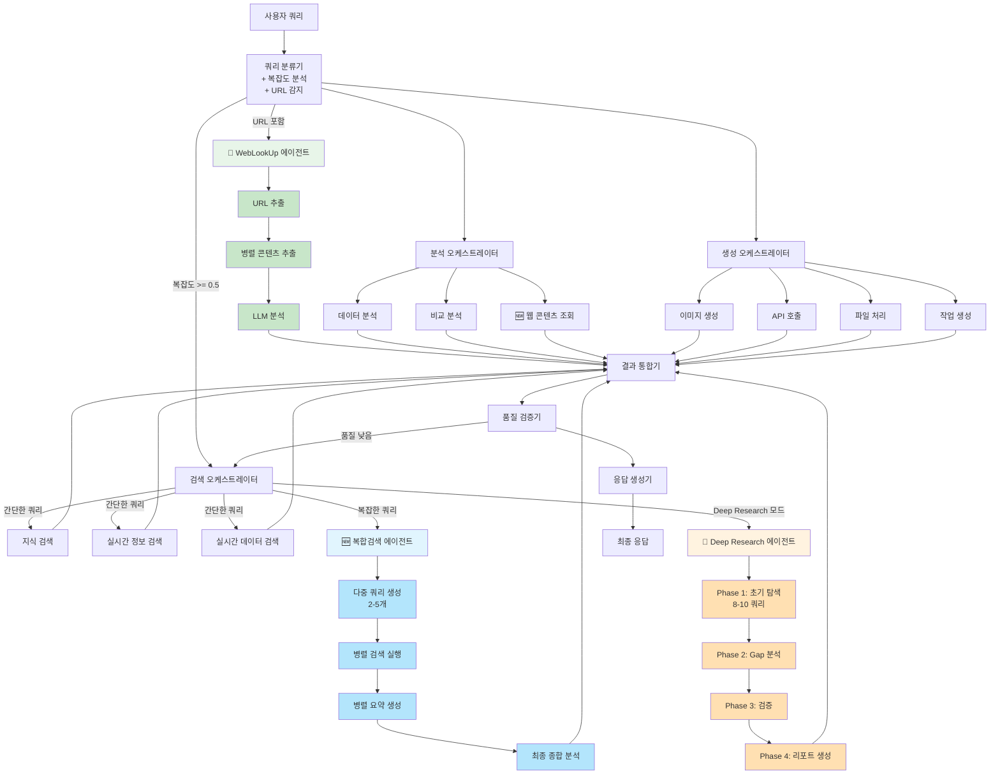

# NEOS 파이프라인 구조 (WebLookUp Agent 포함)

## 업데이트된 파이프라인 구조



## 주요 변경사항

### 1. 쿼리 분류기 개선
- **URL 감지 기능 추가**: 쿼리에 URL이 포함되어 있는지 자동으로 감지
- **우선순위 조정**: URL이 발견되면 WebLookUp 에이전트를 최우선으로 선택
- **다중 URL 지원**: 여러 URL이 포함된 경우 모두 처리

### 2. WebLookUp 에이전트 추가
- **위치**: 검색 오케스트레이터의 검색 에이전트 그룹
- **역할**: 사용자가 제공한 특정 URL의 내용을 추출하고 분석
- **처리 방식**:
  1. URL 추출: 쿼리에서 모든 URL을 추출
  2. 병렬 콘텐츠 추출: 여러 URL의 내용을 동시에 다운로드
  3. LLM 분석: 추출된 콘텐츠를 사용자 질문에 맞게 분석

### 3. 에이전트 선택 로직

#### URL 포함 쿼리
```
사용자 쿼리: "https://example.com에 대해 설명해줘"
            ↓
      URL 감지: True
            ↓
   선택된 에이전트: web_lookup
```

#### URL 미포함 쿼리
```
사용자 쿼리: "최신 AI 뉴스 알려줘"
            ↓
      URL 감지: False
            ↓
   복잡도 분석: 0.3
            ↓
   선택된 에이전트: realtime_info_search, knowledge_search
```

## 사용 시나리오

### 시나리오 1: 단일 URL 분석
```
입력: "https://www.anthropic.com/claude 이 페이지 요약해줘"

처리 흐름:
1. 쿼리 분류기 → URL 감지 (1개 URL 발견)
2. WebLookUp 에이전트 선택
3. URL 콘텐츠 추출
4. LLM 분석 및 요약
5. 결과 반환

출력: Claude에 대한 상세 정보 및 주요 특징 요약
```

### 시나리오 2: 다중 URL 비교
```
입력: "이 두 사이트를 비교해줘: https://github.com, https://gitlab.com"

처리 흐름:
1. 쿼리 분류기 → URL 감지 (2개 URL 발견)
2. WebLookUp 에이전트 선택
3. 2개 URL 병렬 콘텐츠 추출
4. LLM 비교 분석
5. 결과 반환

출력: GitHub와 GitLab의 주요 차이점 및 공통점 분석
```

### 시나리오 3: URL + 추가 질문
```
입력: "https://blog.openai.com/chatgpt 이 글의 주요 내용과 시사점은?"

처리 흐름:
1. 쿼리 분류기 → URL 감지
2. WebLookUp 에이전트 선택
3. URL 콘텐츠 추출
4. LLM이 "주요 내용"과 "시사점"에 집중하여 분석
5. 결과 반환

출력: 글의 핵심 내용과 기술적/사회적 시사점 분석
```

### 시나리오 4: 복잡한 쿼리 (URL 없음)
```
입력: "삼성전자와 TSMC의 반도체 기술을 비교 분석해줘"

처리 흐름:
1. 쿼리 분류기 → URL 미감지, 복잡도 0.65
2. 복합검색 에이전트 선택
3. 다중 검색 쿼리 생성
4. 병렬 검색 및 분석
5. 최종 종합 분석

출력: 두 회사의 반도체 기술 비교 분석
```

## 에이전트 우선순위

에이전트 선택은 다음 우선순위를 따릅니다:

1. **URL 감지** (최우선)
   - URL 포함 → `web_lookup`

2. **Deep Research 요청**
   - "deep research" 키워드 또는 복잡도 >= 0.75 → `deep_research`

3. **복잡한 분석**
   - 복잡도 >= 0.65 + complex_analysis 의도 → `deep_research`
   - 복잡도 >= 0.5 → `multi_query_search`

4. **일반 검색**
   - 의도 기반 에이전트 선택 (realtime_info_search, knowledge_search 등)

## 성능 특성

### WebLookUp 에이전트
- **응답 시간**:
  - 단일 URL: ~3-5초
  - 다중 URL (3개): ~5-8초 (병렬 처리)
- **정확도**: 높음 (직접 URL 내용을 분석하므로)
- **적용 범위**: HTML 페이지에 한정

### 기존 검색 에이전트
- **응답 시간**:
  - 간단한 검색: ~2-4초
  - 복합 검색: ~8-15초
  - Deep Research: ~30-60초
- **정확도**: 중상 (여러 소스 종합)
- **적용 범위**: 웹 전체

## 통합 효과

### 장점
1. **정확성 향상**: 사용자가 명시한 URL의 정확한 내용을 분석
2. **유연성**: URL이 있으면 WebLookUp, 없으면 일반 검색
3. **확장성**: 새로운 검색 방식 추가로 다양한 시나리오 커버

### 주의사항
1. **URL 형식**: 잘못된 URL 형식은 감지되지 않을 수 있음
2. **접근 제한**: 인증이 필요한 페이지는 처리 불가
3. **동적 콘텐츠**: JavaScript로 생성되는 내용은 추출 불가

## 코드 변경 사항

### 새로 추가된 파일
- `neos/agents/search_agents/web_lookup.py` - WebLookUpAgent 구현
- `neos/utils/url_detector.py` - URL 감지 유틸리티
- `docs/WEB_LOOKUP_AGENT.md` - 상세 가이드

### 수정된 파일
- `neos/workflow/utils/query_classifier.py` - URL 감지 로직 추가
- `neos/workflow/state.py` - SEARCH_AGENTS에 web_lookup 추가
- `neos/workflow/graph.py` - WebLookUpAgent 등록
- `neos/agents/search_agents/__init__.py` - WebLookUpAgent export

## 테스트

테스트 스크립트: `test_web_lookup.py`

```bash
# URL 감지 테스트만 실행
python test_web_lookup.py

# 전체 통합 테스트 (주석 해제 필요)
# WebLookUpAgent 실행 테스트 포함
```

## 다음 단계

- [ ] JavaScript 렌더링 지원 (Playwright 통합)
- [ ] PDF 문서 추출 지원
- [ ] 이미지 OCR 지원
- [ ] 여러 페이지 크롤링 (sitemap 기반)
- [ ] 콘텐츠 캐싱 최적화
