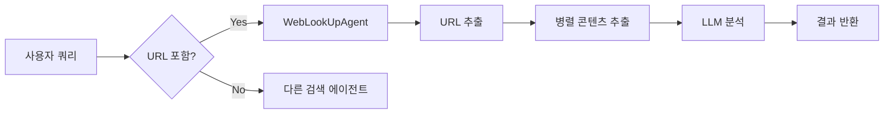

# WebLookUp Agent 가이드

## 개요

WebLookUpAgent는 사용자가 제공한 특정 URL의 내용을 추출하고 분석하는 검색 에이전트입니다. 일반적인 웹 검색과 달리, 사용자가 명시적으로 제공한 URL의 내용을 직접 방문하여 분석합니다.

## 주요 기능

### 1. URL 자동 감지
- 사용자 쿼리에서 URL을 자동으로 감지합니다
- 다양한 URL 형식을 지원합니다:
  - `https://example.com`
  - `http://example.com`
  - `www.example.com` (자동으로 https:// 추가)
  - 도메인만 있는 경우도 감지 가능

### 2. 다중 URL 처리
- 하나의 쿼리에 여러 URL이 포함된 경우, 모든 URL을 병렬로 처리합니다
- 각 URL의 내용을 독립적으로 추출하고 분석합니다

### 3. 콘텐츠 추출
- HTML 페이지에서 주요 콘텐츠를 자동으로 추출합니다
- 불필요한 요소 제거:
  - 광고, 네비게이션, 사이드바
  - 스크립트, 스타일시트
  - 헤더, 푸터
- 메타데이터 추출:
  - 페이지 제목
  - 설명 (description)
  - 주요 콘텐츠

### 4. LLM 기반 분석
- 추출된 콘텐츠를 LLM으로 분석하여 사용자 질문에 맞는 답변을 생성합니다
- 다중 언어 지원 (한국어, 영어, 일본어, 중국어)
- 각 URL의 출처를 명확히 인용합니다

## 사용 예시

### CLI 명령어 (권장)

#### 단일 URL 분석
```bash
uv run python -m neos.cli workflow web-lookup https://www.example.com
```

#### 다중 URL 비교
```bash
uv run python -m neos.cli workflow web-lookup https://github.com https://gitlab.com
```

#### 특정 질문과 함께
```bash
uv run python -m neos.cli workflow web-lookup https://blog.openai.com/chatgpt --query "이 글의 핵심 내용은?"
```

#### JSON 출력
```bash
uv run python -m neos.cli workflow web-lookup https://www.anthropic.com/claude --output json
```

#### Verbose 모드
```bash
uv run python -m neos.cli workflow web-lookup https://example.com -v
```

### 워크플로우 통합 (자동 라우팅)

#### 단일 URL 분석
```python
query = "https://www.example.com에 대해 설명해줘"
# WebLookUpAgent가 자동으로 선택되어 해당 URL의 내용을 분석합니다
```

#### 다중 URL 비교
```python
query = "이 두 사이트를 비교해줘: https://github.com, https://gitlab.com"
# 두 URL의 내용을 모두 추출하고 비교 분석을 제공합니다
```

#### 특정 글 요약
```python
query = "https://blog.openai.com/chatgpt 이 글을 요약해줘"
# 해당 블로그 글의 내용을 추출하고 요약을 제공합니다
```

## 파이프라인 통합

### 쿼리 분류 단계
1. 사용자 쿼리에서 URL 감지
2. URL이 발견되면 `web_lookup` 에이전트를 자동으로 선택
3. 다른 검색 에이전트보다 우선순위가 높음

### 실행 흐름


## 기술 상세

### URL 감지 알고리즘
- 정규식 기반 URL 패턴 매칭
- URL 끝의 구두점 자동 제거
- 중복 URL 제거
- 유효성 검증

### 콘텐츠 추출 방식
- `aiohttp`를 사용한 비동기 HTTP 요청
- `BeautifulSoup`을 사용한 HTML 파싱
- 주요 콘텐츠 영역 우선 추출:
  - `<main>` 태그
  - `<article>` 태그
  - `role="main"` 속성
  - `#content` 또는 `.content` 클래스

### 성능 최적화
- 비동기 처리로 여러 URL 병렬 다운로드
- HTTP 타임아웃: 30초
- 콘텐츠 길이 제한: 10,000자 (각 URL당)
- LLM 처리 시 최대 2,000자로 제한

## 에러 처리

### HTTP 에러
- 404, 500 등의 HTTP 에러 발생 시 해당 URL 스킵
- 다른 URL이 있으면 계속 처리

### 타임아웃
- 30초 이내에 응답이 없으면 해당 URL 스킵
- 다른 URL 처리에는 영향 없음

### LLM 처리 실패
- LLM 분석 실패 시 원본 콘텐츠를 요약하여 반환
- Fallback 모드로 기본적인 정보 제공

## 제한사항

1. **HTML 페이지만 지원**: PDF, 이미지 등은 현재 지원하지 않음
2. **JavaScript 렌더링 미지원**: 동적으로 생성되는 콘텐츠는 추출 불가
3. **인증 필요 페이지**: 로그인이 필요한 페이지는 접근 불가
4. **콘텐츠 길이 제한**: 매우 긴 페이지는 잘림

## 향후 개선 계획

- [ ] PDF, Word 문서 지원
- [ ] JavaScript 렌더링 지원 (Playwright 통합)
- [ ] 이미지 OCR 지원
- [ ] 로그인 세션 지원
- [ ] 더 정교한 콘텐츠 추출 알고리즘

## 관련 파일

- [neos/agents/search_agents/web_lookup.py](../neos/agents/search_agents/web_lookup.py) - 메인 에이전트 구현
- [neos/utils/url_detector.py](../neos/utils/url_detector.py) - URL 감지 유틸리티
- [neos/workflow/utils/query_classifier.py](../neos/workflow/utils/query_classifier.py) - 쿼리 분류기 (URL 감지 로직 포함)

## 예제 코드

### 직접 사용
```python
from neos.agents.search_agents import WebLookUpAgent

agent = WebLookUpAgent()

query = "https://www.anthropic.com 이 회사에 대해 설명해줘"
context = {
    "session_id": "session_123",
    "user_id": "user_456",
    "detected_language": "ko"
}

result = await agent.execute(query, context)
print(result)
```

### 워크플로우 통합
```python
from neos.workflow import MultiAgentWorkflow

workflow = MultiAgentWorkflow()

# URL이 포함된 쿼리는 자동으로 WebLookUpAgent를 사용합니다
result = await workflow.execute_workflow(
    user_id="user_123",
    session_id="session_456",
    query="https://blog.anthropic.com/claude에 대해 설명해줘"
)
```

## 디버깅

디버그 모드를 활성화하면 상세한 로그를 확인할 수 있습니다:

```python
import logging
logging.basicConfig(level=logging.DEBUG)

# [DEBUG] WebLookUpAgent.execute called with query: ...
# [DEBUG] Found 2 URLs to look up: ['https://...', 'https://...']
# [DEBUG] Fetching content from: https://...
# [DEBUG] Successfully extracted content from https://...
# [DEBUG] Title: ...
# [DEBUG] Content length: 5432 characters
```
