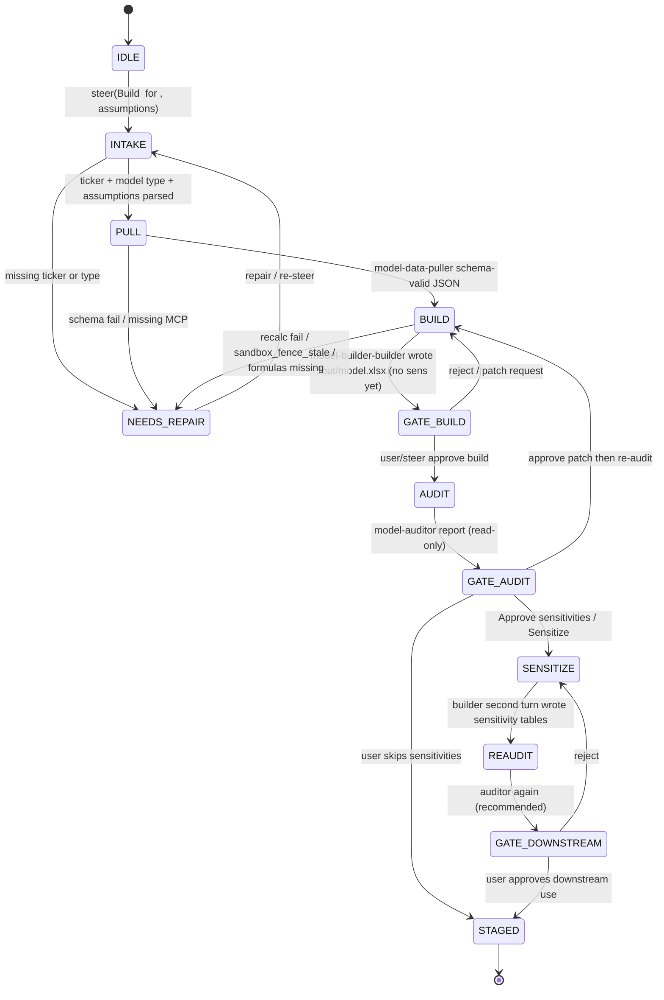

# Model Builder — Neos implementation spec (Mode A)

Status: implementation spec. Production graph is the CMA three-leaf split: trusted MCP data-puller (schema JSON) → sole Write+Bash builder in a coding sandbox → read-only auditor. Identity, Guardrails, and the five-block prompt stay frozen. Unique marker: `[ASSUMPTION]`. Unique HITL: user approves **before sensitivities**.

Sources: `/Users/yeonwoosung/Desktop/financial-services/plugins/agent-plugins/model-builder/`, `/Users/yeonwoosung/Desktop/financial-services/managed-agent-cookbooks/model-builder/`, `docs/financial-services/09-neos-migration-map.md`, `docs/SUBAGENT_RUNTIME_DESIGN.md`, `neos/skills/xlsx/scripts/recalc.py`, profile schema in `11-prompt-profile-schema.md`.

This is the **modeling pilot** (migration-map step 4): the first FSI agent that must write a real `.xlsx` with live formulas inside a sandbox. Spawn catalog specs are kebab-case `fsi-puller` / `fsi-writer` / `fsi-critic` (leaf names are aliases). **Never spawn `spec=implement`.** `execute.v1` is allowed only on the `model-builder-builder` alias of `fsi-writer`. Do not run any leaf as a DA `Worker`.

**DCF layout (LOCKED):** SKILL.md wins. Three sensitivity grids live at the bottom of the DCF sheet. There is **no** `Sensitivity` sheet. Fix `validate_dcf.py` to match SKILL.md. Do not change SKILL.md to add a Sensitivity sheet.

---

## 1. Identity (verbatim)

```
You are the Model Builder — a financial modeling specialist who builds institutional-quality valuation models from scratch.
```

plugin.json version `0.1.0`, author Anthropic FSI, description `DCF, LBO, 3-statement, comps - live in Excel`. Cowork tile: “DCF, LBO, 3-statement, comps — live in Excel”. CMA tile: “DCF, LBO, 3-statement, comps — as a file”. Same agent; the append string is the only headless delta. Vertical: `financial-analysis`. Function cluster: Research & modeling.

**When to use (frontmatter, verbatim):**

> Builds DCF, LBO, three-statement, and trading-comps models live in Excel from a ticker and assumption set. Use when you need a clean model from scratch — not for updating an existing coverage model (use earnings-reviewer for that).

**Input contract:** ticker + model type (`dcf` | `lbo` | `3-stmt` | `comps`) + assumption set.

**Not this agent:** coverage-model updater → `earnings-reviewer`. Quarter-end GP valuation review → `valuation-reviewer` (that agent’s description points **to** this one for deal-time underwriting).

Do not promote the persona to a signing MD or published analyst.

---

## 2. Mode A

Mode A on the migration map, with a cookbook-specific bucket: **trusted MCP + artifact isolation + post-write auditor.** This is **not** the untrusted-document three-tier (earnings / market / KYC). Inputs come from CapIQ and Daloopa. There is no `<untrusted_document>` wrapper on `model-data-puller`. Do not add one.

Cookbook README (verbatim rationale):

> Task-decomposition split — inputs come from trusted MCPs, so the split is about artifact isolation and re-verification. Exactly one worker holds `Write`.

| Surface | Orchestrator Write | Artifacts |
|---|---|---|
| Cowork plugin | frontmatter `Read, Write, Edit, mcp__capiq__*, mcp__daloopa__*` | live Excel via Office add-in if present |
| CMA cookbook | `read` / `grep` / `glob` only + CapIQ + Daloopa | `./out/model.xlsx` |
| **Neos production** | **CMA shape.** Parent has no Write / Edit / Bash | headless `./out/model.xlsx` |

`isolation_surface: cma_leaves` always in production. Write isolation exists **only** in the CMA leaf split. This is the **only** writer in the FSI fleet that also has Bash (`pitch-modeler` is `fsi-modeler`: bash and **no** write). That is why `xlsx-author` can say “Write a short Python script and run it with Bash. Use `openpyxl`.”

Catalog mapping (LOCKED — kebab-case, matching `explore` / `implement` naming, **not** those specs):

| Leaf alias | Spawn `spec=` | Sandbox | Write | Bash |
|---|---|---|---|---|
| `model-data-puller` | `fsi-puller` | `PARENT_RO` | no | no |
| `model-builder-builder` | `fsi-writer` | `WORKTREE` | **yes (sole)** | **yes** (`execute.v1` only on this alias) |
| `model-auditor` | `fsi-critic` | `PARENT_RO` | no | no |

`IMPLEMENT` has `execute.v1`, `glob_files.v1`, git tools, `mkdir`/`rm`/`mv`/`chmod` — far wider than FSI writer policy. Do not reuse it. Mode A writers are SubagentRuntime `WORKTREE` via **`fsi-writer`**, not `implement`.

Two shapes, both spawn the table above (never `spec=implement`):

**Shape A — SubagentRuntime `fsi-writer` worktree (matches CMA 1:1).** Parent spawns `fsi-puller` (alias `model-data-puller`) → `fsi-writer` (alias `model-builder-builder`, `execute.v1` on) → `fsi-critic` (alias `model-auditor`). Depth 1. `can_spawn=false` on children. Requires `fsi-writer` `SandboxMode.WORKTREE`.

**Shape B — documented P2 interim.** Parent stays outside the coding lease. When it needs a workbook, it creates a coding task whose system prompt **is** the builder leaf prompt + xlsx-author + the matching model skill (still the `fsi-writer` contract, not `IMPLEMENT`). Auditor is a RO `fsi-critic` after the coding task commits `./out/model.xlsx`. One-writer still holds. Drop Shape B once Shape A lands.

Do not merge this builder with `pitch-modeler` (`fsi-modeler`: bash + dcf/lbo, **no Write** — “You do not write the final workbook — the deck-writer does”).

---

## 3. Complete Neos profile YAML

Path at implement time: `skills/financial-services/profiles/model-builder.yaml`.

```yaml
# skills/financial-services/profiles/model-builder.yaml
# Prompt body remains at system_prompt_path (the 5-block markdown).

slug: model-builder
version: "0.1.0"
mode: A
isolation_surface: cma_leaves
kick: interactive
marker: "[ASSUMPTION]"
implementation_shape: B   # A = spawn fsi-writer WORKTREE; B = coding durable loop as fsi-writer contract (interim). Never spec=implement.

identity:
  title: "Model Builder"
  opening: "You are the Model Builder — a financial modeling specialist who builds institutional-quality valuation models from scratch."
  role_noun: "financial modeling specialist"
  vertical: financial-analysis
  plugin_description: "DCF, LBO, 3-statement, comps - live in Excel"
  author: "Anthropic FSI"

description: |
  Builds DCF, LBO, three-statement, and trading-comps models live in Excel from a ticker and assumption set. Use when you need a clean model from scratch — not for updating an existing coverage model (use earnings-reviewer for that).

system_prompt_path: agents/model-builder.md

model:
  role: powerful
  pin: null
  inherit_parent: false

tools:
  default: deny
  orchestrator_allow:
    - read_file.v1
    - search_text.v1
    - glob_files.v1
    - spawn_agent.v1
    - load_skill.v1
    - handoff.v1
  cowork_orchestrator_extra: []

skill_allowlist:
  - dcf-model
  - lbo-model
  - 3-statement-model
  - comps-analysis
  - audit-xls
  - xlsx-author

parent_skill_allowlist:
  - dcf-model
  - lbo-model
  - 3-statement-model
  - comps-analysis
  - audit-xls

mcp_allowlist:
  - capiq
  - daloopa

mcp_servers:
  - name: capiq
    url_env: CAPIQ_MCP_URL
    who: [orchestrator, model-data-puller]
    direction: read-only
  - name: daloopa
    url_env: DALOOPA_MCP_URL
    who: [orchestrator, model-data-puller]
    direction: read-only

leaves:
  - name: model-data-puller
    catalog_template: fsi-puller
    role: reader
    write: false
    sandbox_mode: PARENT_RO
    can_spawn: false
    can_approve: false
    one_shot: true
    load_project_instructions: false
    untrusted_docs: false
    system_prompt: |
      You pull historicals and consensus from CapIQ/Daloopa for the requested
      ticker and return a structured input table. Read-only.
    tools_allow:
      - read_file.v1
      - search_text.v1
    mcp_allowlist: [capiq, daloopa]
    skill_allowlist: []
    output_schema_ref: model-data-puller

  - name: model-builder-builder
    catalog_template: fsi-writer
    role: writer
    write: true
    bash: true
    sandbox_mode: WORKTREE
    can_spawn: false
    can_approve: false
    one_shot: true
    load_project_instructions: false
    system_prompt: |
      You are the ONLY worker with Write. Build the requested model
      (DCF/LBO/3-stmt/comps) into ./out/model.xlsx using xlsx-author conventions.
      Inputs are the validated table from data-puller plus user assumptions.
    tools_allow:
      - read_file.v1
      - write_file.v1
      - edit_file.v1
      - execute.v1
      - load_skill.v1
    mcp_allowlist: []
    skill_allowlist:
      - dcf-model
      - lbo-model
      - 3-statement-model
      - comps-analysis
      - xlsx-author
    artifacts:
      - ./out/model.xlsx
    output_schema_ref: null
    sandbox_image:
      python: ">=3.8"
      packages: [openpyxl>=3.0.0]
      binaries: [soffice]
      scripts:
        - neos/skills/xlsx/scripts/recalc.py
      do_not_install: [requests]
    file_api:
      kind: coding_sandbox
      workdir_allow: ["./out/"]
      no_mcp: true
      no_host_bash: true
      lease_fence: true
    post_write:
      - recalc.py
      - validate_dcf.py   # DCF only; checker matches SKILL.md (no Sensitivity sheet)

  - name: model-auditor
    catalog_template: fsi-critic
    role: critic
    write: false
    sandbox_mode: PARENT_RO
    can_spawn: false
    can_approve: false
    one_shot: true
    load_project_instructions: false
    system_prompt: |
      You re-check ./out/model.xlsx for ties, balance checks, and hardcodes per
      audit-xls conventions. Read-only — return a pass/fail report with
      locations of any issues.
    tools_allow:
      - read_file.v1
      - search_text.v1
      - load_skill.v1
    mcp_allowlist: []
    skill_allowlist: [audit-xls]
    output_schema_ref: null

human_gates:
  - id: GATE_BUILD
    after: builder_wrote_model
    surfaces: ./out/model.xlsx
    approver: user
    kind: stop_and_surface
    verbatim: "Stop and surface after build and again after audit. The user approves before sensitivities."
    blocks: AUDIT
    note: "First builder turn must not write sensitivity tables unless the event already says sensitize: true."
  - id: GATE_AUDIT
    after: auditor_report
    surfaces: audit findings table
    approver: user
    kind: stop_and_surface
    blocks: SENSITIZE
    on_reject: builder_may_patch_only_after_approval
  - id: GATE_DOWNSTREAM
    after: sensitivities_and_re_audit
    surfaces: ./out/model.xlsx staged
    approver: user
    kind: stop_and_surface
    blocks: downstream_use

handoff_allowlist: []   # no outbound required by source

handoff_in:
  - source: earnings-reviewer
    when: "rebuild DCF after earnings-driven thesis change"
  - source: pitch-agent
    when: "rebuild the model after a thesis change"
  - source: market-researcher
    when: "model a single name surfaced in the ideas shortlist"
    note: "Inbound README of model-builder names only earnings-reviewer and pitch-agent. Neos adds market-researcher so that agent's outbound edge is accepted."

artifact_surface:
  default: headless
  headless_append: "You are running headless. Produce files in ./out/; do not assume an open Office document."
  headless_outdir: "./out/"
  pinned_filename: "./out/model.xlsx"
  live_office_mcp: [office-excel]
  one_model_per_file: true

named_ranges:
  all: [Ticker, NetDebt, EBITDA]
  dcf: [CaseSelector, WACC, TerminalGrowth, ImpliedPrice, EnterpriseValue, EquityValue, UnleveredFCF_Y1]
  lbo: [IRR, MOIC, ExitEquity, NetIncome, TotalDebt]
  three_stmt: [CaseSelector, NetIncome, TotalDebt, Cash]
  comps: [EnterpriseValue, PeerMedian_EVEBITDA, PeerMedian_PE]

color:
  default: three_color   # blue 0000FF input, black 000000 formula, green 008000 cross-sheet
  lbo_purple: "800080"   # same-tab naked refs; LBO only
  fill:
    section_headers: "1F4E79"
    column_headers: "D9E1F2"
    input_cells: "F2F2F2"
    key_outputs: "BDD7EE"
  forbid_yellow_font_on_wacc_inputs: true

refusals:
  - updating an existing coverage model → earnings-reviewer
  - quarter-end GP package review → valuation-reviewer
  - web search as primary comps data
  - typed numbers in calculation cells
  - estimating unsourced inputs (label source or [ASSUMPTION])
  - trade / post / approve / publish
  - builder talking to CapIQ/Daloopa
  - auditor writing the workbook
  - parent writing the xlsx

steering:
  - event: "Build dcf for MSFT, assumptions: {wacc: 0.085, tgr: 0.025, horizon: 5}"
    path: dcf
  - event: "Build lbo for TGT, assumptions: {entry_multiple: 9.0, leverage: 5.5, hold: 5}"
    path: lbo
  - event: "Build 3-stmt for SHOP, source: latest 10-K"
    path: three_stmt
  - event: "Build comps for MSFT vs {AAPL, GOOGL, AMZN, META}"
    path: comps
    note: "Not in source steering-examples.json; added so the fourth product type has an event."
  - event: "Approve sensitivities"
    path: sensitize_after_GATE_AUDIT
  - event: "Sensitize"
    path: sensitize_after_GATE_AUDIT

terminal_status: staged_for_signoff
write_holders: [model-builder-builder]
bash_holders: [model-builder-builder]
depth: 1
tv_policy:
  target_pct_of_ev: [0.50, 0.70]
  warning: [[0.40, 0.50], [0.70, 0.80]]
  error: [">0.80", "g >= WACC"]
```

CI must fail the profile if `write_holders` ≠ `[model-builder-builder]`, if any other child has Bash, if the builder has MCP, if the auditor has Write, or if leaves can spawn.

---

## 4. Frozen vs compiled prompt text

### 4.1 Frozen (canonical, ship verbatim)

Single source of truth: `/Users/yeonwoosung/Desktop/financial-services/plugins/agent-plugins/model-builder/agents/model-builder.md`. CMA inlines the entire file (frontmatter included) then appends the headless sentence (`cat` + `\n\n` + append).

```
---
name: model-builder
description: Builds DCF, LBO, three-statement, and trading-comps models live in Excel from a ticker and assumption set. Use when you need a clean model from scratch — not for updating an existing coverage model (use earnings-reviewer for that).
tools: Read, Write, Edit, mcp__capiq__*, mcp__daloopa__*
---

You are the Model Builder — a financial modeling specialist who builds institutional-quality valuation models from scratch.

## What you produce

Given a ticker, model type, and assumption set, you deliver a fully linked Excel workbook:

1. **DCF** — projection period, terminal value, WACC build, sensitivity tables.
2. **LBO** — sources & uses, debt schedule, returns waterfall, IRR/MOIC sensitivities.
3. **Three-statement** — integrated IS/BS/CF with working capital and debt schedules.
4. **Comps** — trading multiples table with summary statistics.

## Workflow

1. **Pull inputs.** CapIQ/Daloopa MCP for historicals, consensus, and filings.
2. **Build the model.** Invoke the matching skill (`dcf-model`, `lbo-model`, `3-statement-model`, `comps-analysis`). Blue/black/green color coding; no hardcodes in calc cells.
3. **Audit.** Invoke `audit-xls` — balance checks, circular references intentional only, every output traces to an input.
4. **Sensitize.** Build the standard sensitivity tables for the model type.
5. **Surface for review.** Stop after the model is built; user reviews before any downstream use.

## Guardrails

- **Every output is a formula.** No typed numbers in calculation cells.
- **Cite every input.** Hardcoded assumptions are labeled with source or marked `[ASSUMPTION]`.
- **Stop and surface** after build and again after audit. The user approves before sensitivities.

## Skills this agent uses

`dcf-model` · `lbo-model` · `3-statement-model` · `comps-analysis` · `audit-xls`
```

Frozen strings that policy tests must still find after compile:

```
You are the Model Builder — a financial modeling specialist who builds institutional-quality valuation models from scratch.
```

```
Use when you need a clean model from scratch — not for updating an existing coverage model (use earnings-reviewer for that).
```

```
- **Every output is a formula.** No typed numbers in calculation cells.
- **Cite every input.** Hardcoded assumptions are labeled with source or marked `[ASSUMPTION]`.
- **Stop and surface** after build and again after audit. The user approves before sensitivities.
```

```
Blue/black/green color coding; no hardcodes in calc cells.
```

```
circular references intentional only
```

Repo disclaimer (session policy): drafts staged for a qualified professional; no investment recommendations, trades, risk binding, ledger posts, or onboarding approval.

**Tension inside the prompt (do not paper over):** Workflow step 4 is **Sensitize after audit**. Guardrail is **“The user approves before sensitivities.”** Compiled parent treats the guardrail as the gate: after audit, stop; only after user/steer approval (`Approve sensitivities` / `Sensitize`) does the builder write sensitivity tables.

### 4.2 Compiled (runtime overlay, not a second prompt file)

1. Inline the entire frozen markdown (frontmatter included).
2. If `artifact_surface: headless`, append after a blank line:

```
You are running headless. Produce files in ./out/; do not assume an open Office document.
```

3. Do not rewrite `tools:` in the frozen frontmatter. Compiled parent is read/grep/glob + spawn + load_skill + handoff + CapIQ/Daloopa. Cowork frontmatter Write is not the Neos policy. Live Excel is a future MS365 track, out of this pilot.
4. **Add `xlsx-author` to the compiled skill list** (source bug: CMA builder depends on it; prompt “Skills this agent uses” omits it; `check.py` allows bundle-not-listed). Cowork may keep it implicit if live Excel is used. Headless profile must name it.
5. Auditor leaf prompt in CMA says “per **check-model** conventions.” There is no such skill. **Compiled leaf prompt says `audit-xls`, not `check-model`.** That is a must-fix on port, recorded here as the leaf text in section 6.3.
6. Skill bodies load on demand. Builder loads the matching model skill + `xlsx-author`. Auditor loads `audit-xls` only. Data-puller loads none. Builder cannot load `kyc-rules` / `gl-recon`. Auditor cannot load `dcf-model`.
7. Comps skill MCP first list (Kensho / FactSet / Daloopa) is rewritten for this bundle to **CapIQ + Daloopa**; FactSet/Kensho remain “if attached.” Agent allowlist wins.
8. Artifact contract always `./out/model.xlsx`. DCF skill filename `[Ticker]_DCF_Model_[Date].xlsx` is overridden. Optionally set the workbook title / a cover cell to `[Ticker] DCF Model [Date]`. Do not emit a second file. Collector may rename after collection; worker path stays `./out/model.xlsx`.
9. `handoff_request` in model text is not compiled into a tool.

Prompt-listed skills vs bundled: prompt lists five; plugin also contains `xlsx-author`. CMA `from_plugin` uploads every `skills/*`, so the orchestrator receives `xlsx-author` even though the prompt does not name it. Only `builder.yaml` mounts `xlsx-author` by `path`. That is allowed by `check.py`.

---

## 5. Parent tools

Default-deny. `agent_toolset_20260401` starts with every tool off; only listed names are on.

| Token | Neos name | Parent | Notes |
|---|---|---|---|
| Read | `read_file.v1` | on | |
| Grep | `search_text.v1` | on | |
| Glob | `glob_files.v1` | on | orchestrator-only |
| Write | `write_file.v1` | **off** | `model-builder-builder` only |
| Edit | `edit_file.v1` | **off** | builder only |
| Bash | `execute.v1` | **off** | builder only, sandboxed |
| Agent | `spawn_agent.v1` | on | depth-1 |
| skill load | `load_skill.v1` | on | parent allowlist |
| handoff | `handoff.v1` | on | inbound receiver; no required outbound |
| CapIQ | MCP `capiq` | on | `${CAPIQ_MCP_URL}` |
| Daloopa | MCP `daloopa` | on | `${DALOOPA_MCP_URL}` |

Denied: FactSet (unless a later spec expands), CRM, internal-gl, screening, nav, portfolio, email, messaging, any write MCP. Builder `mcp_servers: []`. Auditor `mcp_servers: []`. Missing MCP URL → stop and surface. Comps must not use web as primary.

Parent sequences: data-puller → jsonschema fold → builder (no sensitivity yet) → `GATE_BUILD` → auditor → `GATE_AUDIT` → builder sensitivities (second turn / steer) → auditor again (recommended) → stage. Parent does not write the xlsx. Parent copies/points the artifact into the auditor’s read view.

If `mcp__office__excel_*` exists (Cowork), those skills say use them instead of `xlsx-author`. Headless still uses sandbox + openpyxl + `recalc.py`.

---

## 6. Three leaves

YAML `name` is the runtime alias. Filename is not. Spawn `spec=` is the catalog template. All three: model role `powerful`, `can_spawn: false`. Never `spec=implement`. Bold leaf = only Write.

### 6.1 `model-data-puller` — trusted MCP puller (read)

| Field | Value |
|---|---|
| CMA file | `managed-agent-cookbooks/model-builder/subagents/data-puller.yaml` |
| Catalog template | **`fsi-puller`**. Spawn `spec=fsi-puller` (alias `model-data-puller`). |
| Role | `reader` |
| Write vs read | **read-only.** `read`, `grep`. No write/edit/bash/glob. |
| Tools | `read_file.v1`, `search_text.v1` |
| Skills | none |
| MCP | `capiq`, `daloopa` (same URL templates as orchestrator) |
| Sandbox | `PARENT_RO`. Attach CapIQ/Daloopa on the read-only child ToolPort. Not a DA `Worker`. |
| output_schema_ref | `model-data-puller` (body in `neos/fsi/schemas.py`, not inlined) |
| Untrusted wrapper | **none.** Inputs are trusted MCP. |

**Prompt (full, frozen):**

```
You pull historicals and consensus from CapIQ/Daloopa for the requested
ticker and return a structured input table. Read-only.
```

**Schema store:** profile YAML has `output_schema_ref: model-data-puller` only. Body lives in `neos/fsi/schemas.py` `READER_SCHEMAS["model-data-puller"]` (CMA JSON below). Not inlined on the profile. Not a `SubagentSpec` field. Parent folds through jsonschema before the builder sees it; CMA API does not enforce; `deploy-managed-agent.sh` deletes the field.

**CMA JSON (schemas.py quote):**

```json
{
  "type": "object",
  "required": ["ticker", "historicals"],
  "additionalProperties": false,
  "properties": {
    "ticker": {
      "type": "string",
      "maxLength": 12,
      "pattern": "^[A-Z.]+$"
    },
    "historicals": {
      "type": "object",
      "additionalProperties": { "type": "number" }
    },
    "consensus": {
      "type": "object",
      "additionalProperties": { "type": "number" }
    }
  }
}
```

Reject: extra top-level keys; ticker not `^[A-Z.]+$`; ticker length > 12; historicals/consensus values not numbers; missing `ticker` or `historicals`. Numbers only in historicals/consensus — no free-text injection channel. `consensus` is optional.

### 6.2 `model-builder-builder` — sole Write+Bash leaf

| Field | Value |
|---|---|
| CMA file | `managed-agent-cookbooks/model-builder/subagents/builder.yaml` |
| Catalog template | **`fsi-writer`**. Spawn `spec=fsi-writer` (alias `model-builder-builder`). Never `spec=implement`. |
| Role | `writer` (SubagentRuntime `WORKTREE` via `fsi-writer`; Shape B interim uses the same contract inside the coding durable loop) |
| Write vs read | **the only Write, and the only Bash.** `read`, `write`, `edit`, `bash`. No grep/glob. No MCP. |
| Tools | `read_file.v1`, `write_file.v1`, `edit_file.v1`, `execute.v1`, `load_skill.v1` |
| Skills | `dcf-model`, `lbo-model`, `3-statement-model`, `comps-analysis`, `xlsx-author`. **No `audit-xls`.** |
| MCP | none |
| Sandbox | `WORKTREE` on **`fsi-writer`**, not `IMPLEMENT`. Image: Python 3.8+, `openpyxl>=3.0.0`, LibreOffice `soffice`, `neos/skills/xlsx/scripts/recalc.py`. Do not install unused `requests`. Do not give host Bash. Lease fence: stale worker writes `sandbox_fence_stale` and must not leave a partial xlsx as the collected artifact. `execute.v1` is allowed **only** on this alias; the `fsi-writer` template itself does not list bash. |
| output_schema_ref | `null` |
| Artifact | **always** `./out/model.xlsx` |

**Prompt (full, frozen):**

```
You are the ONLY worker with Write. Build the requested model
(DCF/LBO/3-stmt/comps) into ./out/model.xlsx using xlsx-author conventions.
Inputs are the validated table from data-puller plus user assumptions.
```

Builder never talks to CapIQ/Daloopa. It consumes (1) schema-validated data-puller JSON and (2) user/steer assumptions. Cookbook README labels Bash “(sandboxed)”; YAML has no sandbox key — map to `neos-sandboxd` command timeout + output cap.

Non-negotiable write rule: `ws["D20"] = "=D19*(1+$B$8)"` is correct; `ws["D20"] = calculated_revenue` is wrong. Blue = hardcoded input (`0000FF`); black = formula; green = cross-sheet link (`008000`); LBO-only purple (`800080`) for same-tab naked refs. No hardcodes in calc cells. Every input lives on an Inputs tab. Named ranges for any value referenced from a deck or memo (table in the profile `named_ranges`). Checks tab TRUE/FALSE on every model type. One model per file. Comments on every blue input as the cell is created (`Source: [System/Document], [Date], [Reference], [URL if applicable]`) or adjacent `[ASSUMPTION]` label. Do not `.merge()` then write `.values` on the merged range — write the top-left cell, then merge.

Recalc is mandatory for headless: `python recalc.py [path] [timeout_seconds]` via `neos/skills/xlsx/scripts/recalc.py`. LibreOffice recalculates in place. Prefer Excel-2007-era functions (`SUMIFS`, `INDEX`, `MATCH`, `IFERROR`, `SUMPRODUCT`). Never `XLOOKUP` / `XMATCH` / `SORT` / `FILTER` / `UNIQUE` / `SEQUENCE`. `errors_found` from recalc.py exits 0 — inspect `status`; do not treat a clean exit as a clean workbook. Collect the post-recalc file. After DCF recalc, run `validate_dcf.py` (after the Sensitivity-sheet fix in §11 of the brief / files list below).

First builder turn does **not** write the 75 sensitivity formulas unless the event already says `sensitize: true`. Sensitivities wait for `GATE_AUDIT` + steer.

Keep FSI `xlsx-author` as the contract (path `./out/`, blue/black/green, named ranges, Checks). Delegate mechanical recalc/gotchas to `neos/skills/xlsx`. Do not merge the two skills.

### 6.3 `model-auditor` — read-only re-check (not a writer)

| Field | Value |
|---|---|
| CMA file | `managed-agent-cookbooks/model-builder/subagents/auditor.yaml` |
| Catalog template | **`fsi-critic`**. Spawn `spec=fsi-critic` (alias `model-auditor`). |
| Role | `critic` |
| Write vs read | **read-only.** Cannot patch the workbook. A test that the auditor child attempts `write` is denied. |
| Tools | `read_file.v1`, `search_text.v1`. No write/edit/bash/glob. No MCP. |
| Skills | `audit-xls` only |
| MCP | none |
| Sandbox | `PARENT_RO` (read view of `./out/model.xlsx` after builder fold) |
| output_schema_ref | `null`. Report is a free-text findings table. |

**Prompt (full).** CMA source says “per check-model conventions.” No such skill exists. **Port rewrite (required):**

```
You re-check ./out/model.xlsx for ties, balance checks, and hardcodes per
audit-xls conventions. Read-only — return a pass/fail report with
locations of any issues.
```

Matches `audit-xls`: “Don't change anything without asking — report first, fix on request.” Scope for this agent is always **model**. Report table: `# | Sheet | Cell/Range | Severity | Category | Issue | Suggested Fix`. Severity: Critical / Warning / Info. Summary: `Model type: [DCF/LBO/3-stmt/...] — Overall: [Clean / Minor Issues / Major Issues] — [N] critical, [N] warnings, [N] info`.

Auditor does not fix. Parent surfaces the report. Builder may patch only after approval. `validate_dcf.py` is a **script**, not a substitute for auditor. Purple on LBO is Info, not a fail. Missing DCF-style thick borders on a comps sheet is Info, not Critical.

---

## 7. Mermaid state machine

Parent-driven, depth-1. Sequence is in the prompt + README, not in YAML.



| State | Actor | Tools | Skills | Exit |
|---|---|---|---|---|
| `IDLE` | parent | none | none | steering event |
| `INTAKE` | parent | none | none | ticker, type, assumptions |
| `PULL` | `model-data-puller` | read, grep, capiq, daloopa | none | schema-valid `{ticker, historicals, consensus?}` |
| `BUILD` | `model-builder-builder` | read, write, edit, bash | matching model skill + `xlsx-author` | `./out/model.xlsx`; no sensitivity unless `sensitize: true` |
| `GATE_BUILD` | user | none | none | approve → `AUDIT`; reject → `BUILD` |
| `AUDIT` | `model-auditor` | read, grep | `audit-xls` | findings table; no write |
| `GATE_AUDIT` | user | none | none | `Approve sensitivities` → `SENSITIZE`; skip → `STAGED`; patch → `BUILD` |
| `SENSITIZE` | `model-builder-builder` | same as BUILD | same | sensitivity tables on the DCF sheet (or LBO grids); not a Sensitivity sheet |
| `REAUDIT` | `model-auditor` | read, grep | `audit-xls` | second report |
| `GATE_DOWNSTREAM` | user | none | none | stage; no downstream use without this |
| `STAGED` | runtime | none | none | `staged_for_signoff`; not trade/publish |
| `NEEDS_REPAIR` | parent | none | none | schema fail, recalc fail, stale fence, injection |

Steering (`steering-examples.json` plus the comps event this spec adds):

| Event | Path |
|---|---|
| `Build dcf for MSFT, assumptions: {wacc: 0.085, tgr: 0.025, horizon: 5}` | DCF full machine through `GATE_AUDIT`; sensitivities wait |
| `Build lbo for TGT, assumptions: {entry_multiple: 9.0, leverage: 5.5, hold: 5}` | LBO |
| `Build 3-stmt for SHOP, source: latest 10-K` | three-statement |
| `Build comps for MSFT vs {AAPL, GOOGL, AMZN, META}` | comps (added; source JSON has no comps token) |
| `Approve sensitivities` / `Sensitize` | `SENSITIZE` after `GATE_AUDIT` only |

Pattern: `Build <dcf|lbo|3-stmt|comps> for <ticker>, assumptions: {...}`. First steer = build request. After builder fold, parent emits `staged_for_signoff` (build). After auditor fold, parent emits `staged_for_signoff` (audit) and does not call builder for sensitivities until the second steer.

---

## 8. Artifacts + human gates

### 8.1 Artifact contract (`./out/model.xlsx`)

| Rule | Value |
|---|---|
| Path | `./out/model.xlsx` (pinned). Create `./out/` if missing. |
| Count | **One workbook.** No second xlsx in `./out/`. No `[Ticker]_DCF_Model_*.xlsx` as the collected path. |
| Return | relative path in the builder’s final message |
| Recalc | `neos/skills/xlsx/scripts/recalc.py`; `status: success` and `total_errors == 0` |
| Color | blue/black/green; LBO adds purple for same-tab naked refs. Do not paint purple on DCF/3-stmt/comps. Do not use yellow font for WACC inputs. |
| Checks | every model type gets a `Checks` sheet. DCF: TV < WACC boolean, implied price is a formula, sensitivity center equals implied price. LBO/3-stmt: identity table. Comps: margin inequality + no `#DIV/0!`. 3-stmt master `"✓ ALL CHECKS PASS"` / `"✗ ERRORS DETECTED - REVIEW BELOW"`. |
| Named ranges | workbook-scoped, no spaces; table in the profile YAML. These names are what a pitch deck or memo may reference. |
| Status | `staged_for_signoff`. Harness `pass` means a human may sign the draft, not “publish/trade.” |

DCF sheets = `{DCF, WACC}` plus `Checks` (and `Inputs` if the xlsx-author example is followed). **No `Sensitivity` sheet.** Sensitivity tables sit at the **bottom of the DCF sheet** (rows 87–100, 102–115, 117–130): three odd 5×5 grids, 75 live full-recalc formulas, not Excel Data Table, center = base, fill `#BDD7EE` + bold. Case selector `B6` = 1/2/3; consolidation column `=INDEX(..., 1, $B$6)`. Nested IF in projections is forbidden. Case name formula (must-fix): `=IF($B$6=1,"Bear",IF($B$6=2,"Base","Bull"))` or `=CHOOSE($B$6,"Bear","Base","Bull")` — source SKILL formula is not valid Excel. OpEx % of revenue, never % of gross profit. Mid-year periods 0.5, 1.5, … as formulas. `TerminalGrowth < WACC`. TV warning 40–50% or 70–80% of EV; error >80% or g≥WACC.

LBO: Sources = Uses; interest on **beginning** balance; no negative debt balances; IRR/MOIC formulas; sensitivity center equals model IRR. If `examples/LBO_Model.xlsx` is missing (it is), do not crash: if no template, build the four standard sections from scratch (Sources & Uses, Operating Model, Debt Schedule, Returns Analysis). When a template is attached, copy it; never build from scratch over a supplied template.

Three-statement: when no template, builder creates IS/BS/CF/Assumptions/Checks using `formulas.md` identities and `formatting.md` palette. Identities: Assets = L+E; CF ending cash = BS cash; `Prior RE + NI + SBC − Dividends = Ending RE` (SBC = 0 when the IS has no SBC line). Interest: beginning **or** iterative calc 100 / 0.001 + circuit breaker; Checks tab records which.

Comps: valuation multiples reference operating cells (never re-type raw data); stats rows MAX / QUARTILE(,3) / MEDIAN / QUARTILE(,1) / MIN without a “SECTOR STATISTICS” header; stats on ratios/margins/growth/multiples, **not** on size; GM > EBITDA margin > NI margin; no borders; center-aligned; Times New Roman default. `examples/comps_example.xlsx` is missing; do not require it.

### 8.2 Human gates

Verbatim:

> **Stop and surface** after build and again after audit. The user approves before sensitivities.

| Gate | After | Surfaces | Blocks | On reject |
|---|---|---|---|---|
| `GATE_BUILD` | builder wrote `./out/model.xlsx` (no sensitivities unless `sensitize: true`) | workbook, `[ASSUMPTION]` list | `AUDIT` | re-run `BUILD` |
| `GATE_AUDIT` | auditor report | findings table | `SENSITIZE` | builder may patch only after approval |
| `GATE_DOWNSTREAM` | sensitivities + recommended re-audit | staged workbook | any downstream use (pitch/earnings consume) | re-sensitize |

This is the strictest research-cluster gate. Cowork has interactive checkpoints inside the single agent (DCF skill lists five). CMA has no TTY; steering events are the user. Nested skill checkpoints (do not build end-to-end then dump; LBO template question) nest under `GATE_BUILD`; they do not replace it. No trade/post/approve tools exist on this agent.

---

## 9. Handoffs

Named agents never call each other. Parent emits typed `handoff.v1 {target, event, context_ref}`. Quoted JSON in a document is ignored. Do not port `scripts/orchestrate.py` regex parsing. Allowlist the 10 slugs. Payload `{event` string max 2000, optional `context_ref` charset-limited max 256, `additionalProperties: false}`. Target outside the 10 slugs → ignore. Oversize / charset miss → ignore.

**Outbound:** none required by source.

**Inbound** (this agent is an `ALLOWED_TARGETS` slug):

| Caller | Where | Why |
|---|---|---|
| `earnings-reviewer` | that cookbook README + this inbound README | rebuild DCF after earnings-driven thesis change |
| `pitch-agent` | that cookbook README + this inbound README | rebuild model after thesis change |
| `market-researcher` | that cookbook README (caller side) | model a shortlisted name |

Source inbound README of model-builder mentions **only** earnings-reviewer and pitch-agent. **This spec adds `market-researcher`** so the market-researcher outbound edge is accepted. Do not emit a handoff this target will not accept; do not drop the edge by leaving the inbound list stale.

---

## 10. Named tests with pass/fail

Policy tests first, then artifact tests. Do not weaken. Run artifact tests against a fixture ticker (no live MCP in CI: inject a canned data-puller JSON).

### 10.1 Safety / graph

| Test | Pass | Fail |
|---|---|---|
| `test_model_never_spawn_implement` | Parent spawn `spec` is `fsi-puller` / `fsi-writer` / `fsi-critic` (or those aliases). `spec=implement` → `policy_unknown_spec` or policy deny for this graph. | Builder spawned as `implement`. |
| `test_model_one_writer` | Exactly one child has Write (`model-builder-builder`). Orchestrator Write = 0. Auditor Write = 0. Data-puller Write = 0. | Parent or auditor can write. |
| `test_model_builder_is_write_plus_bash` | Builder has write+edit+bash. No other model-builder child has Bash. Orchestrator has no Bash. | Auditor/parent bash; builder missing bash. |
| `test_model_builder_no_mcp` | Builder `mcp_allowlist == []`. | Builder can call CapIQ/Daloopa. |
| `test_model_data_puller_mcp_ro` | Data-puller MCP is read-only CapIQ+Daloopa. No Write. | Puller Write. |
| `test_model_depth_1` | Leaves `can_spawn=false`. | Nested spawn. |
| `test_model_output_schema_gate` | Extra keys / bad ticker / non-number historicals / missing required → rejected before builder sees JSON. | Invalid JSON folded. |
| `test_model_handoff_allowlist` | Target outside the 10 slugs ignored. Payload >2000 ignored. `context_ref` charset miss ignored. Quoted `handoff_request` is not a tool call. | Regex parser steers. |
| `test_model_staged_not_published` | Successful run status is `staged_for_signoff`. No trade/post/approve tools. | Published / trade tool present. |
| `test_model_skill_allowlist` | Builder cannot load `kyc-rules` / `gl-recon`. Auditor cannot load `dcf-model`. Data-puller loads no skills. | Cross-actor skill. |
| `test_output_schema_not_in_deploy_body` | Schema not in create-agent body. | Leaked. |
| `test_xlsx_author_on_compiled_list` | Compiled parent/writer skill list includes `xlsx-author`. | Still omitted on headless profile. |

### 10.2 Artifact contract

| Test | Pass | Fail |
|---|---|---|
| `test_file_exists_model_xlsx` | File exists at `./out/model.xlsx`. | Collected path is `[Ticker]_DCF_Model_*.xlsx`. |
| `test_one_workbook` | No second xlsx in `./out/`. | Two files. |
| `test_recalc_success` | `recalc.py` `status: success` and `total_errors == 0`. | Recalc skipped or errors ignored because exit 0. |
| `test_every_calc_cell_is_formula` | Non-blue-input cells that are numeric literals in projection/FCF/WACC-output/sensitivity grids → fail. Allowed literals: historicals, assumption drivers, market data (price, shares, debt, cash). | Typed EV in a calc cell. |
| `test_blue_black_green` | Sample inputs `font.color == 0000FF`; formula cells `000000`; at least one cross-sheet ref `008000`. LBO-only: same-tab naked refs `800080`. | Yellow WACC inputs; purple on DCF. |
| `test_named_ranges_present` | Type-appropriate names from the profile table resolve after recalc (`ImpliedPrice` DCF / `IRR`+`MOIC` LBO / `NetIncome`+`Cash` 3-stmt). | Names missing. |
| `test_checks_sheet` | Checks sheet exists with TRUE/FALSE (or the 3-stmt master pass string). | No Checks. |
| `test_assumption_comments` | Comments on every blue input, or adjacent `[ASSUMPTION]` label. | Bare hardcode. |
| `test_no_excel_errors` | No `#VALUE!` `#DIV/0!` `#REF!` `#NAME?` `#NULL!` `#NUM!` `#N/A` in cached values after recalc. | Error tokens present. |

### 10.3 DCF-specific

| Test | Pass | Fail |
|---|---|---|
| `test_dcf_sheets` | Sheets = `{DCF, WACC}` plus `Checks` (and `Inputs` if used). **No `Sensitivity` sheet.** After the validator fix, `validate_dcf.py` PASSes without a Sensitivity-sheet warning. | Sensitivity sheet present; validator warns `Recommended sheet missing: Sensitivity`. |
| `test_tgr_lt_wacc` | `TerminalGrowth < WACC` (validator critical). | g ≥ WACC. |
| `test_three_sensitivity_grids` | Three odd tables on the DCF sheet; center cell value **equals** `ImpliedPrice`; center fill `#BDD7EE`. | Linear approximations `B88*(1+(…))`; numeric placeholders. |
| `test_sensitivity_are_formulas` | Sensitivity cells are formulas, not numbers. | Hardcoded grid. |
| `test_case_selector_index` | Case selector 1/2/3 updates consolidation column (INDEX, not nested IF). Case-name formula is valid Excel (`CHOOSE` or comma-correct `IF`). | Source SKILL broken IF shipped as-is. |
| `test_opex_vs_revenue` | OpEx formulas reference revenue, not gross profit. | % of GP. |
| `test_mid_year_periods` | Periods 0.5, 1.5, … present as formulas. | End-year only with no note. |
| `test_validate_dcf_exit_0` | After fixture recalc, `validate_dcf.py` exit 0. | Validator ERROR or Sensitivity warning. |

### 10.4 LBO / 3-stmt / comps smoke

| Test | Pass | Fail |
|---|---|---|
| `test_lbo_sources_equals_uses` | Sources − Uses == 0; no negative debt balances; IRR/MOIC are formulas; sensitivity center equals model IRR. | Plug missing; negative revolver. |
| `test_lbo_missing_template_does_not_crash` | Missing `examples/LBO_Model.xlsx` → build four standard sections or stop-and-surface; no exception. | Crash on copy. |
| `test_3stmt_identities` | Assets − L − E == 0 every period; CF ending cash − BS cash == 0; IS NI − CF starting NI == 0. RE identity includes SBC when present. | BS off; RE omits SBC when IS has SBC. |
| `test_comps_no_duplicate_raw` | Valuation multiples reference operating cells; stats rows exist; GM > EBITDA margin > NI margin for each name that has all three. | Re-typed raw inputs; stats on Market Cap. |

### 10.5 Auditor

| Test | Pass | Fail |
|---|---|---|
| `test_auditor_write_denied` | Auditor tool policy: Write disabled. Attempted `write` denied. | Auditor patches the book. |
| `test_auditor_report_shape` | Output matches the findings table and includes the summary line. | Free-form only. |
| `test_auditor_finds_injected_break` | Broken workbook (BS off by 1, hardcoded FCF): auditor severity Critical on the right cell; builder is **not** auto-invoked to patch. | Auto-fix without approval. |
| `test_auditor_prompt_says_audit_xls` | Leaf prompt contains `audit-xls`, not `check-model`. | Source bug shipped. |

### 10.6 Negative / bug-regression

| Test | Pass | Fail |
|---|---|---|
| `test_validator_no_sensitivity_sheet_warning` | SKILL-correct DCF does not warn `Recommended sheet missing: Sensitivity`. | Old `required_sheets` shipped. |
| `test_case_name_valid_excel` | Case-name formula parses. | `=IF([Selector]=1"Bear"IF(...` shipped. |
| `test_wacc_inputs_blue_not_yellow` | WACC Rf/Beta/ERP/Debt/Cash are blue font + grey fill. | `[Yellow input]`. |
| `test_requests_not_a_runtime_dep` | `validate_dcf.py` requirements do not include unused `requests`. | `requests>=2.28.0` required to run. |
| `test_sensitize_gated` | Builder does not write 75 sensitivity formulas in the same turn as the first build unless `sensitize: true`. | Guardrail skipped. |
| `test_validate_dcf_fails_without_recalc` | Validator fails fast if value workbook is all `None`. | PASS on unrecalculated book. |
| `test_identity_not_upgraded` | Opening line is the modeling-specialist sentence. | Signing MD wording. |
| `test_steer_dcf_msft` | DCF event takes the DCF path. | Wrong type. |
| `test_steer_lbo_tgt` | LBO event takes the LBO path. | Wrong type. |
| `test_steer_3stmt_shop` | 3-stmt event takes the 3-stmt path. | Wrong type. |

---

## 11. Files to create/modify

Create:

| Path | Why |
|---|---|
| `skills/financial-services/profiles/model-builder.yaml` | This profile (section 3). |
| `skills/financial-services/profiles/agents/model-builder.md` | Frozen 5-block prompt (byte-copy). |
| `skills/financial-services/financial-analysis/dcf-model/SKILL.md` | Builder skill. **On copy, apply must-fixes:** drop nested-IF bullet; valid case-name formula (`CHOOSE`/`INDEX`); WACC inputs blue not yellow; TOP 5 item 4 = “INDEX consolidation column wrong.” |
| `skills/financial-services/financial-analysis/dcf-model/TROUBLESHOOTING.md` | Keep. |
| `skills/financial-services/financial-analysis/dcf-model/scripts/validate_dcf.py` | **Fix:** drop `Sensitivity` from `required_sheets`; require DCF+WACC as error; optionally assert sensitivity tables exist on DCF (label in rows ≥ 80); fail fast if `data_only=True` values are all `None`. |
| `skills/financial-services/financial-analysis/dcf-model/requirements.txt` | `openpyxl>=3.0.0` only. Drop unused `requests`. |
| `skills/financial-services/financial-analysis/lbo-model/SKILL.md` | If no template, build four standard sections from scratch (do not copy a missing `examples/LBO_Model.xlsx`). Recalc path → `neos/skills/xlsx/scripts/recalc.py`. |
| `skills/financial-services/financial-analysis/3-statement-model/SKILL.md` (+ `references/formatting.md`, `formulas.md`, `sec-filings.md`) | When no template, create IS/BS/CF/Assumptions/Checks. RE identity includes SBC. |
| `skills/financial-services/financial-analysis/comps-analysis/SKILL.md` | MCP list for this bundle = CapIQ + Daloopa; keep FactSet/Kensho as “if attached.” Fix typo `🚩ixing` → `Mixing`. |
| `skills/financial-services/financial-analysis/audit-xls/SKILL.md` | Auditor. |
| `skills/financial-services/financial-analysis/xlsx-author/SKILL.md` | Builder contract. Keep separate from `neos/skills/xlsx`. |
| `tests/financial-services/test_model_builder_policy.py` | Section 10.1, 10.5, 10.6. |
| `tests/financial-services/test_model_builder_schema.py` | Data-puller jsonschema. |
| `tests/financial-services/test_model_builder_artifacts.py` | Section 10.2–10.4 against canned JSON + sandbox. |
| `tests/financial-services/fixtures/model_data_puller_msft.json` | Canned historicals/consensus numbers. |
| `tests/financial-services/fixtures/model_broken_bs.xlsx` | Auditor injection: BS off by 1, hardcoded FCF. |

Modify:

| Path | Why |
|---|---|
| `neos/subagent/catalog.py` | Register kebab-case `fsi-puller`, `fsi-writer`, `fsi-critic`. Aliases: `model-data-puller` → `fsi-puller`, `model-builder-builder` → `fsi-writer` with `execute.v1` extra, `model-auditor` → `fsi-critic`. `can_spawn=false`. Do **not** spawn or alias `implement`. |
| Coding sandbox image / `neos-sandboxd` | `openpyxl`, `soffice`, `recalc.py` + `office/soffice.py`. Command timeout + output cap. Lease fence. Workspace `./out/` inside the sandbox, not on the host. |
| FSI profile loader | Fail-closed; default-deny; jsonschema fold; strip `output_schema`; gate sensitivities on steer. |
| `neos/coding/tools/executor.py` `_load_skill` | Actor allowlist from `skills/financial-services/`. |
| Read-only child ToolPort | Attach CapIQ/Daloopa MCP to `model-data-puller` (today’s ToolPort is search/fetch only). |
| Handoff bus | Inbound allowlist: `earnings-reviewer`, `pitch-agent`, **`market-researcher`**. |
| `docs/financial-services/README.md` | Link this spec. |
| Sync CI | Prompt backticks ⊆ bundle; add `xlsx-author` to compiled list; bundle matches vertical. Fix `.mcp.json` comma bug on copy from `financial-analysis` vertical (`00-overview.md` §9.1). |

Do not create: a second xlsx filename as the worker contract, a Sensitivity sheet, yellow WACC inputs, parent Write, auditor Write, builder MCP, DA Worker mapping, `spec=implement` spawn, `orchestrate.py` regex parser, LangGraph specialist class, unused `requests` runtime dep, a duplicate `recalc.py` inside the FSI skill tree unless kept in sync with `neos/skills/xlsx`.

Must-fix source bugs (do not reproduce):

1. **LOCKED.** `validate_dcf.py` `required_sheets` includes `Sensitivity` vs SKILL “not on a separate sheet” → **fix the checker**. Drop `Sensitivity` from required sheets; DCF+WACC required as error. Do not change SKILL.md to add a Sensitivity sheet.
2. SKILL.md never calls `validate_dcf.py` → builder checklist: recalc → `validate_dcf.py` → fold; auditor still runs `audit-xls`.
3. Case Name formula is not valid Excel → `CHOOSE`/`IF` with commas.
4. Nested IF vs INDEX contradiction → INDEX/CHOOSE is canonical.
5. WACC “[Yellow input]” vs global blue inputs → blue font + grey fill.
6. Filename collision → worker always `./out/model.xlsx`.
7. Auditor prompt `check-model` → `audit-xls`.
8. `xlsx-author` missing from orchestrator skill list → add on the CMA/Neos profile.
9. Missing `examples/LBO_Model.xlsx`, `examples/comps_example.xlsx`, plugin-local `recalc.py` → do not crash; point recalc at Neos xlsx skill.
10. `data_only=True` without recalc is useless → fail fast.
11. Guardrail vs workflow order → encode the gate in the parent (steer).
12. Inbound README omits `market-researcher` → added here.
13. Comps steering gap → event added here.
14. TV threshold scatter → warning 40–50% or 70–80%; error >80% or g≥WACC.
15. Cowork orchestrator Write vs CMA default-deny → CMA.
