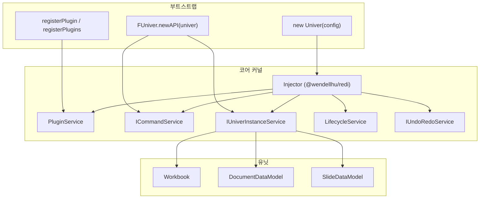
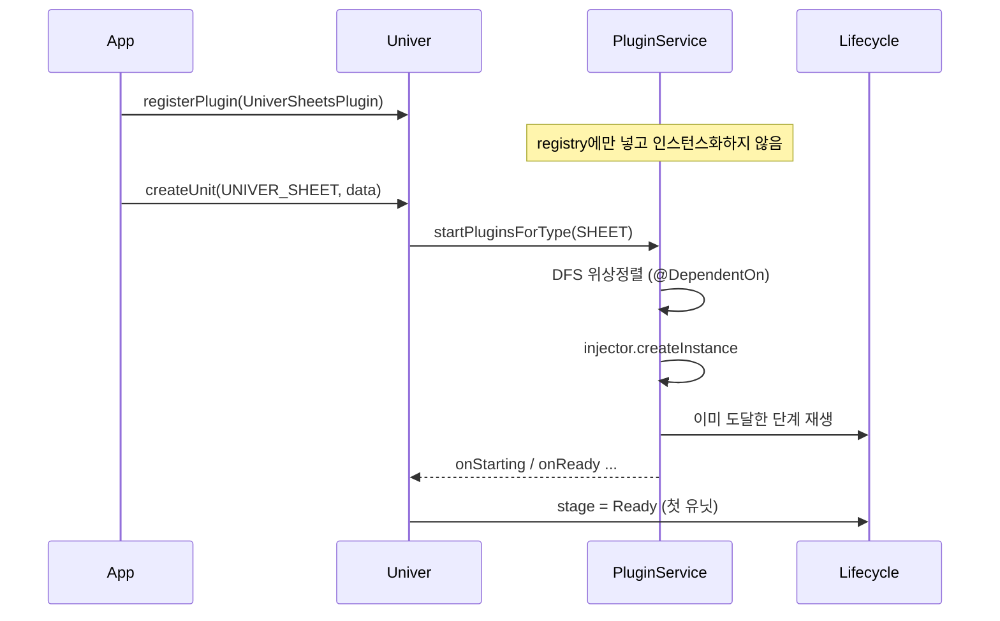
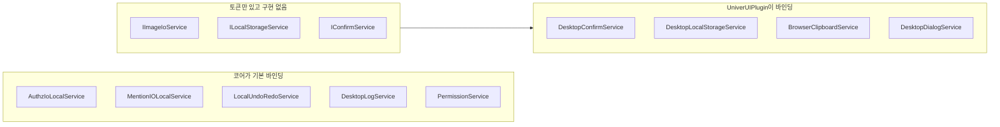
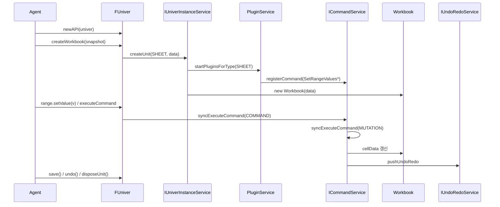

# 하네스와 런타임 아키텍처

조사 기준: DreamNum `univer` 클론 `/Users/yeonwoosung/Desktop/univer`, `@univerjs/core` **1.0.2**. 이 문서는 마케팅이 아니라 소스의 플러그인·커맨드·Facade 하네스를 고정한다. 에이전트가 문서를 다루는 경로는 `FUniver.newAPI` → `createWorkbook` → `executeCommand`다. 커맨드 ID 전수·인터셉터·권한 포인트 템플릿은 [11-commands-permissions.md](./11-commands-permissions.md).

## 1. 하네스가 무엇인가

Univer는 호스팅된 오피스 앱이 아니라 **임베드 가능한 Office SDK**다. README가 말하는 “The Office Harness for AI Agents”는 별도 에이전트 런타임이 아니라, 브라우저와 Node.js에서 같은 커널로 Spreadsheet · Document · Presentation을 돌리는 이 조합을 가리킨다.

| 층 | 역할 | 핵심 타입 |
|---|---|---|
| 런타임 | DI 컨테이너, 설정, 로케일, 라이프사이클 | `Univer`, `Injector` |
| 플러그인 | 기능 모듈. 커맨드·서비스·컨트롤러를 주입 | `Plugin`, `PluginService` |
| 커맨드 | 모든 데이터 변경의 유일한 통로 | `ICommandService` |
| 유닛 | 열린 문서 인스턴스 (workbook/doc/slide) | `UnitModel`, `IUniverInstanceService` |
| Facade | 에이전트/앱이 만지는 단일 API | `FUniver` |

`@univerjs/core`는 그 기초다. 런타임, DI, 커맨드/뮤테이션, 데이터 모델, 설정, 로케일, 공유 Facade 엔트리를 제공한다 (`packages/core/README.md:7`).

동형(isomorphic) 규칙 (`docs/ISOMORPHIC.md`): 로직 플러그인(`sheets`)과 UI 플러그인(`sheets-ui`)을 분리한다. 커맨드·뮤테이션은 UI 상태를 읽지 않아 Node에서도 돈다. Facade는 로직 플러그인에 구현하고, 사용자가 `@univerjs/sheets/facade` 같은 사이드이펙트 import로 합성한다.



## 2. `Univer` 클래스 — 루트 런타임

생성자 (`packages/core/src/univer.ts:142-163`):

1. `createUniverInjector(parentInjector, config.override)`로 자식/루트 `Injector`를 만든다.
2. `theme` / `darkMode` / `locale` / `region` / `locales` / `direction` / `logLevel`을 해당 서비스에 넣는다.
3. `logCommandExecution` → config 키 `command.logExecution`.
4. `undoRedoHistoryLimit` → `undoRedo.historyLimit` (기본 50, `0`이면 히스토리 없음).
5. `_init()`에서 유닛 생성자를 등록하고 생성 핸들러를 건다.

공개 API는 얇다.

- `registerPlugin(plugin, config?)` / `registerPlugins([[P, cfg?], ...])` — 플러그인 등록 (`packages/core/src/univer.ts:241-271`).
- `createUnit(type, data)` — 유닛 생성. Facade의 `createWorkbook`이 이 경로를 탄다 (`packages/core/src/univer.ts:198-200`).
- `__getInjector()` — Facade가 내부 컨테이너를 꺼내는 훅 (`packages/core/src/univer.ts:168-170`).
- `setLocale` / `setRegion` / `onDispose` / `dispose`.

### 2.1 기본으로 바인딩되는 서비스

`createUniverInjector` (`packages/core/src/univer.ts:274-306`)가 루트 DI에 넣는 목록:

| 토큰 | 구현 | 비고 |
|---|---|---|
| `ErrorService` | 자기 자신 | |
| `LocaleService` / `RegionService` / `ThemeService` | 자기 자신 | |
| `LifecycleService` | 자기 자신 | 시작 단계 `Starting` |
| `PluginService` | 자기 자신 | |
| `UserManagerService` | 자기 자신 | 생성 직후 `touch` |
| `IUniverInstanceService` | `UniverInstanceService` | |
| `IPermissionService` | `PermissionService` | 인메모리 권한 포인트 |
| `ObjectPermissionService` | 자기 자신 | Authz IO와 권한 캐시 조율 |
| `ILogService` | `DesktopLogService` | `lazy` |
| `ICommandService` | `CommandService` | |
| `IUndoRedoService` | `LocalUndoRedoService` | `lazy` |
| `IConfigService` | `ConfigService` | |
| `IContextService` | `ContextService` | 포커스 플래그 |
| `IResourceManagerService` | `ResourceManagerService` | `lazy` |
| `IResourceLoaderService` | `ResourceLoaderService` | `lazy`, 생성 직후 `touch` |
| `IAuthzIoService` | **`AuthzIoLocalService`** | 로컬 스텁 |
| `IMentionIOService` | **`MentionIOLocalService`** | `lazy` 로컬 스텁 |

`override`는 identifier가 있는 의존성만 교체한다. 값이 `null`이면 항목을 제거한다 (`packages/core/src/services/plugin/plugin-override.ts:28-43`). 프리셋 `createUniver({ collaboration: true })`는 이걸로 `IUndoRedoService` / `IAuthzIoService` / `IMentionIOService`를 빼서 Pro 콜라보가 원격 구현을 넣게 한다 (`presets/src/preset.ts:51-55`).

부모 `Injector`를 넘기면 `parentInjector.createChild(dependencies)`다 (`packages/core/src/univer.ts:299`). 테스트·임베드 렌더가 계층 DI를 쓸 때 이 경로다.

### 2.2 첫 유닛이 플러그인을 깨운다

`_init` (`packages/core/src/univer.ts:202-231`):

1. 타입별 생성자 등록: `UNIVER_SHEET → Workbook`, `UNIVER_DOC → DocumentDataModel`, `UNIVER_SLIDE → SlideDataModel`.
2. `UniverInstanceService.__setCreateHandler`에 실제 생성 로직을 건다.
3. 해당 타입의 **첫** `createUnit`에서만 `PluginService.startPluginsForType(type)`을 호출한다.
4. `injector.createInstance(ctor, data)`로 모델을 만들고 `__addUnit`한다.
5. 라이프사이클이 `Ready` 이전이면 `Ready`로 올린다.

즉 플러그인을 `registerPlugin`해도 타입 플러그인은 **그 타입 유닛이 생기기 전까지 로드되지 않는다.** `UNIVER_UNKNOWN` 플러그인만 등록 즉시 로드된다.

코어의 `SlideDataModel`은 메서드가 `throw new Error('Method not implemented.')`인 자리표시자다 (`packages/core/src/slides/slide-data-model.ts:20-45`). 실제 슬라이드 모델은 `packages/slides`가 생성자를 덮어쓴다.

## 3. DI — `@wendellhu/redi` 래퍼

`packages/core/src/common/di.ts`는 redi를 재export하고 두 헬퍼만 추가한다.

- `registerDependencies(injector, deps)` — `injector.add` 루프 (`packages/core/src/common/di.ts:64-66`).
- `touchDependencies(injector, [[Token], ...])` — 등록된 토큰을 `injector.get`해서 즉시 인스턴스화 (`packages/core/src/common/di.ts:73-79`). 플러그인이 `onStarting`/`onReady`에서 컨트롤러를 “깨우는” 수단이다.

식별자는 `createIdentifier<T>('univer.core.command-service')` 형태다. 클래스 생성자 파라미터의 `@ICommandService` / `@Inject(Injector)`가 주입점이다. `Optional`, `Many`, `Self`, `SkipSelf`, `WithNew`, `forwardRef`도 그대로 노출된다.

플러그인 쪽 패턴 (`packages/sheets/src/plugin.ts:144-152`):

```ts
registerDependencies(this._injector, mergeOverrideWithDependencies(dependencies, this._config.override));
touchDependencies(this._injector, [
  [SheetInterceptorService],
  [RangeProtectionService],
  // ...
]);
```

`lazy: true`로 등록된 서비스는 첫 `get`/`touch` 전까지 생성되지 않는다. 코어의 로그·undo·리소스·멘션이 이 경로다.

## 4. 플러그인

### 4.1 `Plugin` 베이스

모든 플러그인은 `Plugin`을 상속한다 (`packages/core/src/services/plugin/plugin.service.ts:42-74`).

정적 필드:

- `pluginName` — 전역 유일. 중복이면 throw (`plugin.service.ts:214-216`).
- `packageName` / `version` — `@univerjs/core`의 `package.json`과 버전이 다르면 에러 로그 후 계속 (`plugin.service.ts:200-212`).
- `type: UniverInstanceType` — 기본 `UNIVER_UNKNOWN`. `UNRECOGNIZED`면 등록 거부 (`plugin.service.ts:192-194`).

인스턴스 훅: `onStarting` / `onReady` / `onRendered` / `onSteady`. 기본은 빈 구현. 라이프사이클이 이미 지나갔으면 로드 시점에 지난 단계를 재생한다 (`plugin.service.ts:294-308`).

의존성은 `@DependentOn(UniverFormulaEnginePlugin)` 데코레이터가 `DependentOnSymbol`에 생성자 배열을 붙인다 (`plugin.service.ts:115-119`). 미등록 의존성은 **기본 config로 자동 등록**된다 (`plugin.service.ts:274-280`). `UNIVER_UNKNOWN` 플러그인이 다른 타입에 의존하면 throw (`plugin.service.ts:261-264`).

예: `UniverSheetsPlugin`은 `@DependentOn(UniverFormulaEnginePlugin)`이고 `type = UNIVER_SHEET`, `pluginName = 'SHEET_PLUGIN'` (`packages/sheets/src/plugin.ts:56-61`). `UniverUIPlugin`은 `@DependentOn(UniverRenderEnginePlugin)`이고 타입을 안 덮어쓰므로 `UNIVER_UNKNOWN` — 등록 즉시 로드된다 (`packages/ui/src/plugin.ts:91-95`).

### 4.2 `PluginService` 로드 규칙



- `UNIVER_UNKNOWN`은 `_loadedPluginTypes`에 처음부터 들어 있어 등록 즉시 `_loadFromPlugins` (`plugin.service.ts:131`, `158-164`).
- 타입 플러그인은 첫 `startPluginsForType`까지 대기.
- 타입이 이미 시작된 뒤 같은 타입을 추가 등록하면 `setTimeout(..., 4)`로 모아 플러시한다 (`plugin.service.ts:28`, `222-228`). 테스트가 이 lazy flush를 고정한다 (`plugin.service.spec.ts:227-297`).

`dispose()`는 인스턴스 `plugin.dispose()`와 플러시 타이머를 정리한다 (`plugin.service.ts:139-142`). `Univer.dispose()` → injector dispose 경로로 탄다.

## 5. 커맨드 vs 뮤테이션 vs 오퍼레이션

주석이 계약을 분명히 한다 (`packages/core/src/services/command/command.service.ts:37-55`, `58-64`):

> 모든 데이터 수정은 커맨드로 실행해야 한다. undo/redo, 협업, 기능 간 연관 로직을 이 경로로 추적한다.

| `CommandType` | 값 | 스냅샷 | 협업 | 용도 |
|---|---|---|---|---|
| `COMMAND` | 0 | 직접 쓰지 않음 | 뮤테이션을 통해 | 비즈니스 오케스트레이션. undo 뮤테이션을 만들고 `pushUndoRedo` |
| `OPERATION` | 1 | 저장하지 않음 | 충돌 해결 없음 | 스크롤, 사이드바, 활성 시트 전환 |
| `MUTATION` | 2 | 저장 | 충돌 해결의 최소 단위 | 행/열 삽입, 셀 값, 필터 범위 |

ID 규칙: `<namespace>.<type>.<command-name>`. 예: `sheet.command.set-range-values`, `sheet.operation.set-worksheet-active`, `univer.command.undo`.

핸들러 시그니처 (`command.service.ts:85`):

```ts
handler(accessor: IAccessor, params?: P, options?: IExecutionOptions): Promise<R> | R
```

`accessor.get(IUndoRedoService)`처럼 DI를 다시 꺼낸다. 파라미터는 직렬화 가능해야 한다.

### 5.1 실행 경로

`CommandService.executeCommand` / `syncExecuteCommand` (`command.service.ts:416-535`):

1. dispose되었으면 warn 후 `false`.
2. 레지스트리에서 id로 조회. 없으면 throw.
3. `MUTATION`이면 실행 스택에서 가장 가까운 `COMMAND`(없으면 `OPERATION`) id를 `params.trigger`에 붙인다 (`command.service.ts:576-605`).
4. `beforeCommandExecuted` 리스너. Facade가 여기서 `event.cancel`이면 `CanceledError`를 던져 중단한다 (`packages/core/src/facade/f-univer.ts:257-271`, `packages/core/src/common/error.ts:24-28`). `CanceledError`는 `CustomCommandExecutionError`라 서비스가 `false`로 삼킨다.
5. `options.syncOnly`면 로컬 핸들러를 건너뛰고 `true`를 반환한다. 협업 레이어가 changeset만 보낼 때 쓴다 (`command.service.ts:608-611`).
6. `_injector.invoke(command.handler, params, options)`.
7. `onCommandExecuted`. 뮤테이션이면 `onMutationExecutedForCollab`도 호출. `syncOnly`면 collab 리스너만.

`syncExecuteCommand`의 핸들러가 `Promise`를 반환하면 `TypeError` (`command.service.ts:651-653`).

유틸 `sequenceExecute` / `sequenceExecuteAsync`는 커맨드 배열을 앞에서부터 동기/비동기로 돌리고, 실패 인덱스에서 멈춘다 (`command.service.ts:720-732`). undo/redo와 `SetRangeValuesCommand`가 이걸 쓴다.

`IExecutionOptions` (`command.service.ts:186-199`): `onlyLocal`, `fromCollab`, `fromChangeset`, `syncOnly`, 그 외 임의 키.

`IMultiCommand`는 같은 id에 여러 구현을 `priority` 내림차순으로 쌓고, `preconditions(contextService)`가 true인 첫 성공 구현을 고른다 (`command.service.ts:666-717`). 컨텍스트 키(`FOCUSING_SHEET` 등)로 시트/독 undo 구현을 가르는 용도.

`NilCommand` (`id: 'nil'`)은 부트 시 등록되는 no-op이다 (`command.service.ts:314-318`).

### 5.2 실제 한 사이클: 셀 값

에이전트/Facade가 셀을 쓰면:

1. `FRange.setValue`가 `syncExecuteCommand('sheet.command.set-range-values', { unitId, subUnitId, range, value })` (`packages/sheets/src/facade/f-range.ts:1351-1365`).
2. `SetRangeValuesCommand` (type `COMMAND`)가 타깃 시트를 찾고, redo/undo 뮤테이션 파라미터를 만들고, interceptor에서 부가 뮤테이션(자동 높이 등)을 모은다 (`packages/sheets/src/commands/commands/set-range-values.command.ts:52-160`).
3. `SetRangeValuesMutation`이 스냅샷의 `cellData`를 바꾼다.
4. `undoRedoService.pushUndoRedo({ unitID, undoMutations, redoMutations })`.

오퍼레이션 예: `SetWorksheetActiveOperation` (`id: 'sheet.operation.set-worksheet-active'`)은 `workbook.setActiveSheet`만 하고 스냅샷 히스토리에 안 남는다 (`packages/sheets/src/commands/operations/set-worksheet-active.operation.ts:25-42`).

커맨드 등록은 플러그인 컨트롤러가 한다. `BasicWorksheetController`가 뮤테이션 목록을 `registerCommand`하고, worker면 `onlyRegisterFormulaRelatedMutations`로 공식 관련만 남긴다 (`packages/sheets/src/controllers/basic-worksheet.controller.ts:230-239`).

## 6. Undo / Redo

`LocalUndoRedoService` (`packages/core/src/services/undoredo/undoredo.service.ts:179-440`).

- 스택은 **유닛 id별** `_undoStacks` / `_redoStacks`.
- 새 undo를 넣으면 그 유닛의 redo는 비운다 (`undoredo.service.ts:225-226`).
- 히스토리 상한은 config. 초과 시 맨 앞을 `splice` (`undoredo.service.ts:254-258`).
- `UndoCommand` / `RedoCommand` (`univer.command.undo` / `univer.command.redo`)는 포커스된 유닛의 top을 `sequenceExecute`한다 (`undoredo.service.ts:127-174`).
- 포커스 해석: 시트 포커스 + 수식바/셀 에디터면 내부 에디터 유닛 id(`__INTERNAL_EDITOR__DOCS_NORMAL` 등)를 쓴다 (`undoredo.service.ts:419-438`, `packages/core/src/common/const.ts:17-21`).
- `beginUndoRedoGroup(unitId, groupId, 'replace'|'append')` — 같은 그룹 id면 연속 push를 한 아이템으로 합친다.
- `rollback(id)` — 마지막 아이템 id가 일치하면 undo 뮤테이션을 실행하고 스택에서 제거 (커밋 실패 보상).
- `__tempBatchingUndoRedo`는 deprecated 임시 배치.

Facade: `univerAPI.undo()` / `redo()`는 이 커맨드 id를 `executeCommand`한다 (`packages/core/src/facade/f-univer.ts:356-370`).

## 7. 라이프사이클

단계 enum (`packages/core/src/services/lifecycle/lifecycle.ts:20-41`):

| 단계 | 의미 | 누가 올리는가 |
|---|---|---|
| `Starting` (0) | 플러그인 등록 | `LifecycleService` 생성 시 |
| `Ready` (1) | 유닛 생성, 플러그인 서비스 초기화, 첫 렌더 준비 | 첫 `createUnit` (`univer.ts:233-237`) |
| `Rendered` (2) | 첫 렌더 완료 | UI `SingleUnitUIController` |
| `Steady` (3) | lazy 작업 완료, 기능 제공 가능 | UI가 Rendered 후 3초 |

단방향만 허용. 같은 단계 setter는 no-op. setter 재진입은 lock으로 throw (`lifecycle.service.ts:56-65`). dispose 중 도달 불가 단계를 기다리면 `LifecycleUnreachableError`.

`onStage(stage)`는 현재 ≥ stage면 즉시 resolve (`lifecycle.service.ts:81-93`). `subscribeWithPrevious()`는 현재까지 단계를 재생한 뒤 `Steady`에서 끝낸다.

UI가 Rendered/Steady를 올리는 코드 (`packages/ui/src/controllers/ui/ui-shared.controller.ts:69-96`):

1. `await lifecycleService.onStage(Ready)`
2. 300ms 후 캔버스를 붙이고 `stage = Rendered`
3. 3000ms (`STEADY_TIMEOUT`) 후 `stage = Steady`

**헤드리스에는 UI 컨트롤러가 없으므로 Ready에서 멈춘다.** 에이전트는 `Ready`만 기다리면 커맨드를 실행할 수 있다. 공식 계산 트리거 등 일부 기능은 `Steady`를 구독하므로, Node에서 그 경로를 쓰려면 테스트처럼 단계를 직접 올리거나 해당 서비스를 명시적으로 깨워야 한다.

플러그인 훅은 단계와 1:1이다. `UniverSheetsPlugin.onStarting`은 기본 컨트롤러를 `touch`하고, `onReady`에서 나머지, `onRendered`에서 `INumfmtService` (`packages/sheets/src/plugin.ts:155-190`).

## 8. 유닛 — 생성과 주소

`UniverInstanceType`은 프로토콜 enum의 alias다 (`packages/core/src/common/unit.ts:18-21`, `packages/protocol/src/ts/univer/constants/univer.ts:17-27`):

| 값 | 이름 | 코어 모델 |
|---|---|---|
| 0 | `UNIVER_UNKNOWN` | 타입 비종속 플러그인 |
| 1 | `UNIVER_DOC` | `DocumentDataModel` |
| 2 | `UNIVER_SHEET` | `Workbook` |
| 3 | `UNIVER_SLIDE` | `SlideDataModel` (코어는 stub) |
| 4 | `UNIVER_PROJECT` | — |
| 5 | `UNIVER_BASE` | Base 패키지 |
| 6 | `UNIVER_BOARD` | Board 패키지 |
| 7 | `UNIVER_PDF` | coming soon |
| -1 | `UNRECOGNIZED` | 플러그인 type으로 사용 금지 |

모든 유닛은 `UnitModel<D, T>` (`packages/core/src/common/unit.ts:26-42`): `type`, `getUnitId()`, `name$` / `setName`, `getSnapshot()`, `getRev()` / `incrementRev()` / `setRev()`. revision은 1부터.

### 8.1 `IUniverInstanceService`

보관 구조 (`packages/core/src/services/instance/instance.service.ts:123-124`):

- `_unitsByType: Map<UniverInstanceType, UnitModel[]>`
- `_currentUnits: Map<type, UnitModel>` — 타입별 “현재” 유닛
- `_focused$: BehaviorSubject<unitId>` — 앱 전역 포커스는 하나
- `_unitCreateOptions` — 생성 시 `ICreateUnitOptions` 보존

생성 옵션 (`instance.service.ts:34-62`):

- `makeCurrent` 기본 `true` — 타입의 current로 지정
- `skipAutoRender` — 임베드 호스트가 캔버스를 직접 붙일 때
- `embeddedRender` — 메인 워크벤치 상태를 건드리지 않는 렌더
- `renderParentInjector` — 임베드 렌더의 DI 부모

주소 지정:

- `getUnit(id, type?)` — 전 타입 선형 검색 (`instance.service.ts:361-368`)
- `getCurrentUnitOfType(type)` / `setCurrentUnitForType(unitId)`
- `getAllUnitsForType(type)`
- `focusUnit(id)` — 컨텍스트 키를 켠다: `FOCUSING_SHEET` / `FOCUSING_DOC` / `FOCUSING_SLIDE` / `FOCUSING_BOARD` (`instance.service.ts:267-309`)
- `disposeUnit(unitId)` — 목록에서 제거하고 current/focus를 리셋한 뒤 `unit.dispose()`

같은 `unitId`를 두 번 넣으면 throw (`instance.service.ts:223-225`).

Workbook 스냅샷 최소형 (`packages/core/src/sheets/empty-snapshot.ts:27-38`): `{ id, sheetOrder, name, appVersion, locale, dateSystem, styles, sheets, resources }`. 빈 `createWorkbook({})`는 이 디폴트에 랜덤 6자 id를 붙인다 (`packages/core/src/sheets/workbook.ts:93-111`).

시트 안의 워크시트는 `subUnitId` (= `sheetId`)로 커맨드가 가리킨다. `getSheetCommandTarget({ unitId, subUnitId })`가 Facade에서 그 쌍을 푼다 (`packages/sheets/src/facade/f-univer.ts:185-204`).

내부 에디터 유닛 id는 `__INTERNAL_EDITOR__` prefix다. 리소스 로더는 이 id의 문서를 스냅샷 리소스로 로드하지 않는다 (`packages/core/src/services/resource-loader/resource-loader.service.ts:108-114`).

## 9. 스냅샷과 플러그인 리소스

유닛 `getSnapshot()`은 코어 모델만 준다. 필터·데이터검증·권한 같은 플러그인 상태는 `IResourceManagerService` 훅으로 스냅샷 `resources: [{ name, data }]`에 붙는다.

훅 계약 (`packages/core/src/services/resource-manager/type.ts:26-34`):

```ts
{
  pluginName: `${IBusinessName}_${string}_PLUGIN`,  // 예: SHEET_AuthzIoMockService_PLUGIN
  businesses: UniverInstanceType[],
  toJson(unitId): string,
  parseJson(bytes): T,
  onLoad(unitId, resource): void,
  onUnLoad(unitId): void,
}
```

`ResourceLoaderService`는 유닛 add/dispose 스트림을 구독해 `loadResources` / `unloadResources`를 호출한다. `saveUnit(unitId)`는 스냅샷을 deep clone한 뒤 현재 훅 데이터를 `resources`에 덮어쓴다 (`resource-loader.service.ts:164-173`).

Facade `FWorkbook.save()`가 바로 이 경로다 (`packages/sheets/src/facade/f-workbook.ts:180-183`). 에이전트가 파일을 직렬화하려면 `workbook.save()`이지 `getSnapshot()`이 아니다.

## 10. 권한

세 층이 겹친다.

1. **`IPermissionService`** — `id → IPermissionPoint{ type, subType: UnitAction, value, status }` 인메모리 맵 (`packages/core/src/services/permission/permission.service.ts`). UI/커맨드가 `composePermission(ids)`로 AND 검사.
2. **`IAuthzIoService`** — 원격 권한 IO 인터페이스 (`packages/core/src/services/authz-io/type.ts:40-54`). 코어 기본은 `AuthzIoLocalService`.
3. **`ObjectPermissionService`** — 객체(문단·도형 등) 정책을 Authz에 쓰고, 현재 사용자 유효 권한을 1의 캐시에 반영. `objectPermissionTypes` config에 타입이 들어 있어야 `supports()`가 true (`packages/core/src/services/permission/object-permission.service.ts:188-191`).

`AuthzIoLocalService`는 주석 그대로 “Do not use the mock implementation in a production environment” (`packages/core/src/services/authz-io/authz-io-local.service.ts:41-54`). 동작:

- 현재 유저가 없으면 `Owner_${random}` 디폴트 유저를 넣는다 (`authz-io-local.service.ts:73-79`, `user-manager/const.ts:27-43`).
- `isDevRole`은 `userID.startsWith('Owner'|'Editor'|...)`.
- 권한 맵을 리소스 훅 `SHEET_AuthzIoMockService_PLUGIN`으로 스냅샷에 넣는다.
- collaborator list/role/update는 빈 구현.

시트 보호(워크북/시트/레인지)는 `@univerjs/sheets`의 `WorkbookPermissionService` 등이 1번 포인트와 Authz를 조합한다. 헤드리스 에이전트는 기본 Owner라 대부분 통과한다.

## 11. Facade — 에이전트 엔트리

`FUniver`는 `@univerjs/core/facade`의 루트 객체다. 생성자는 숨기고 정적 팩토리만 쓴다 (`packages/core/src/facade/f-univer.ts:74-89`):

```ts
static newAPI(wrapped: Univer | Injector): FUniver {
  const injector = wrapped instanceof Univer ? wrapped.__getInjector() : wrapped;
  return injector.createInstance(FUniver);
}
```

코어 `FUniver`가 **직접 제공하는 것**:

- `executeCommand` / `syncExecuteCommand` — `ICommandService` 위임 (`f-univer.ts:547-576`)
- `undo` / `redo`
- `disposeUnit(unitId)`
- `getCurrentLifecycleStage`
- 테마·로케일·리전·방향
- `addEvent` / `fireEvent` / `Event` / `Enum` / `Util`
- `getUserManager`, `newBlob`, `newRichText*`
- 문서 생성/폐기 이벤트 (`DocCreated` / `DocDisposed`)

**없는 것:** `createWorkbook`, `getActiveWorkbook`, `createDocument`. 이건 제품 플러그인의 mixin이다.

합성 방법 (`packages/core/src/facade/f-univer.ts:101-121`, `packages/sheets/src/facade/f-univer.ts:744-747`):

```ts
FUniver.extend(FUniverSheetsMixin);
declare module '@univerjs/core/facade' {
  interface FUniver extends IFUniverSheetsMixin {}
}
```

`extend`는 prototype 메서드를 복사하고, `_initialize`는 `InitializerSymbol` 배열에 쌓아 생성자 끝에서 실행한다. **사이드이펙트 import가 필수**다:

```ts
import { FUniver } from '@univerjs/core/facade'
import '@univerjs/sheets/facade'          // createWorkbook
import '@univerjs/docs/facade'            // createDocument
import '@univerjs/sheets-formula/facade'  // 수식 API
```

`createWorkbook` 구현 (`packages/sheets/src/facade/f-univer.ts:161-165`):

```ts
createWorkbook(data, options?) {
  const workbook = instanceService.createUnit(UNIVER_SHEET, data, options);
  return this._injector.createInstance(FWorkbook, workbook);
}
```

`createDocument`도 동일하게 `UNIVER_DOC` (`packages/docs/src/facade/f-univer.ts:64-71`).

이벤트 버스는 lazy다. `registerEventHandler`는 리스너가 생길 때만 구독을 열고, 마지막 리스너가 빠지면 닫는다 (`packages/core/src/facade/f-event-registry.ts:42-52`). `BeforeCommandExecute`에서 `params.cancel = true`면 커맨드가 취소된다.

`FWorkbook` / `FRange` / `FWorksheet`는 Google Apps Script 스타일 체이닝이다 (`docs/CONTRIBUTING-FACADE.md`). modify는 `this`, create는 새 인스턴스, delete는 boolean. 내부는 전부 커맨드.

## 12. 헤드리스 vs UI — 어떤 서비스가 로컬 스텁인가



**코어가 제공하는 로컬 스텁**

| 토큰 | 구현 | 의미 |
|---|---|---|
| `IAuthzIoService` | `AuthzIoLocalService` | Owner/Editor 전부 허용. 협업자 API는 no-op |
| `IMentionIOService` | `MentionIOLocalService` | 현재 유저 한 명만 반환 (`mention-io-local.service.ts:27-47`) |
| `IUndoRedoService` | `LocalUndoRedoService` | 프로세스 메모리 스택 |
| `ILogService` | `DesktopLogService` | `console.*` |
| `IPermissionService` | `PermissionService` | 인메모리 |

**코어는 identifier만 export**

- `IImageIoService` (`packages/core/src/services/image-io/image-io.service.ts:67`) — 업로드/호스팅. UI·drawing 플러그인이 구현.
- `ILocalStorageService` (`packages/core/src/services/local-storage/local-storage.service.ts:19`) — UI가 `DesktopLocalStorageService` 바인딩 (`packages/ui/src/plugin.ts:152`).
- `IConfirmService` — 테스트용 `TestConfirmService`는 항상 `true` (`packages/core/src/services/confirm/confirm.service.ts:33-46`). 실제 confirm은 UI의 `DesktopConfirmService`.

**UI 플러그인이 채우는 것** (`packages/ui/src/plugin.ts:123-158`): clipboard, notification, gallery, dialog, confirm, sidebar, message, local storage, local file, canvas popup, ribbon, shortcut, workbench. `IUIController`가 `SingleUnitUIController._bootstrapWorkbench`로 Rendered/Steady를 올린다.

**헤드리스 프리셋** `UniverSheetsNodeCorePreset` (`presets/packages/preset-sheets-node-core/src/preset.ts:64-95`):

- 넣는 것: formula engine, docs(내부 에디터용), sheets, formula/filter/hyperlink/drawing/sort/thread-comment **로직** 플러그인, 각 `facade` 사이드이펙트.
- 안 넣는 것: `UniverUIPlugin`, `UniverSheetsUIPlugin`, `UniverRenderEnginePlugin`.
- 선택: `workerSrc`가 있으면 `UniverRPCNodeMainPlugin` + `notExecuteFormula: true`.

에이전트가 서버에서 워크북을 돌릴 때의 최소 집합은 이 프리셋이다. Canvas·메뉴·confirm 다이얼로그는 없다. 커맨드와 스냅샷은 있다.

`createUniver` 헬퍼 (`presets/src/preset.ts:48-104`)는 `new Univer` → 프리셋/추가 플러그인 등록 → `FUniver.newAPI`를 한 번에 한다. 중복 `pluginName`은 throw.

## 13. 에이전트가 하네스를 구동하는 경로

소스에서 꺼낸 최소 루프. UI 컨테이너 없이 동작한다.

```ts
import { LocaleType, Univer, UniverInstanceType } from '@univerjs/core'
import { FUniver } from '@univerjs/core/facade'
import { UniverSheetsPlugin } from '@univerjs/sheets'
import { UniverFormulaEnginePlugin } from '@univerjs/engine-formula'
import '@univerjs/sheets/facade'

const univer = new Univer({ locale: LocaleType.EN_US })
univer.registerPlugin(UniverFormulaEnginePlugin)
univer.registerPlugin(UniverSheetsPlugin)

const api = FUniver.newAPI(univer)

const wb = api.createWorkbook({
  id: 'book-1',
  name: 'Book',
  sheets: {
    'sheet-1': { id: 'sheet-1', name: 'Sheet1', cellData: {}, rowCount: 20, columnCount: 10 },
  },
  sheetOrder: ['sheet-1'],
})
// 이 시점에 라이프사이클 = Ready, SHEET_PLUGIN onStarting/onReady 완료.

wb.getActiveSheet().getRange('A1').setValue(123)
// == syncExecuteCommand('sheet.command.set-range-values', { unitId, subUnitId, range, value })

await api.executeCommand('sheet.command.set-range-values', {
  unitId: wb.getId(),
  range: { startRow: 0, startColumn: 1, endRow: 0, endColumn: 1 },
  value: { v: 'Hello, Univer!' },
})

await api.undo()
const snapshot = wb.save()   // resources 포함
api.disposeUnit(wb.getId())
univer.dispose()
```

프리셋으로 줄이면:

```ts
import { createUniver, LocaleType } from '@univerjs/presets'
import { UniverSheetsNodeCorePreset } from '@univerjs/preset-sheets-node-core'

const { univer, univerAPI } = createUniver({
  locale: LocaleType.EN_US,
  presets: [UniverSheetsNodeCorePreset()],
})
univerAPI.createWorkbook({})
```

브라우저 임베드는 같은 `createUniver`에 `UniverSheetsCorePreset({ container: 'app' })`를 넣고 CSS를 로드한다 (`README.md:243-255`). 커맨드 경로와 Facade는 동일하다.

저수준 탈출구: `univer.createUnit(UniverInstanceType.UNIVER_SHEET, data)` 또는 `univer.__getInjector().get(ICommandService)`. 에이전트 코드는 Facade를 쓰는 것이 계약이다.



## 14. 에이전트가 알아야 할 제약

- **플러그인 없이 유닛만 만들면 커맨드가 없다.** `new Univer(); createWorkbook()`은 모델만 생기고 `sheet.command.*`는 미등록이라 throw. 반드시 해당 타입 플러그인을 등록하고, Facade mixin을 import한다.
- **첫 `createWorkbook`이 Ready로 올린다.** 그 전에 `onStage(Ready)`를 기다리면 유닛 생성 시점까지 블록된다.
- **헤드리스는 Steady에 도달하지 않는다.** Steady를 가정하는 컨트롤러는 직접 깨우거나 단계를 올려야 한다.
- **undo는 포커스된 유닛 기준.** `createWorkbook(..., { makeCurrent: false })`로 만든 책에 `undo()`하면 다른 유닛 스택을 건드릴 수 있다. `focusUnit` 또는 그 책의 커맨드 파라미터에 `unitId`를 명시한다.
- **`save()` ≠ `getSnapshot()`.** 플러그인 리소스(필터, 권한, 댓글)는 `IResourceLoaderService.saveUnit`을 통해야 한다.
- **Authz/Mention/Undo는 로컬 스텁.** 멀티유저·서버 권한을 기대하면 `override`로 구현을 교체해야 한다. `collaboration: true`는 스텁을 **제거**만 하고 대체 구현을 넣지는 않는다.
- **커맨드 파라미터는 직렬화 가능해야 한다.** 협업 changeset과 동일한 단위다.
- **`SlideDataModel` 코어 구현은 stub.** 슬라이드는 `packages/slides` 플러그인이 생성자를 교체한 뒤에만 의미 있다.
- **버전 정렬.** 플러그인 `version !== Plugin.version`이면 로드는 되지만 에러 로그가 난다. 모든 `@univerjs/*`를 같은 릴리스로 고정한다.

## 15. 파일 지도

| 경로 | 내용 |
|---|---|
| `packages/core/src/univer.ts` | 루트 런타임, 인젝터 조립, 첫 유닛 → Ready |
| `packages/core/src/common/di.ts` | redi 재export, `registerDependencies` / `touchDependencies` |
| `packages/core/src/common/unit.ts` | `UnitModel`, `UniverInstanceType` |
| `packages/core/src/services/plugin/plugin.service.ts` | 플러그인 등록, `@DependentOn`, 타입별 lazy start |
| `packages/core/src/services/plugin/plugin-override.ts` | DI override / null 제거 |
| `packages/core/src/services/command/command.service.ts` | COMMAND/OPERATION/MUTATION, 실행 스택, collab 훅 |
| `packages/core/src/services/undoredo/undoredo.service.ts` | 유닛별 스택, Undo/Redo 커맨드 |
| `packages/core/src/services/lifecycle/lifecycle.ts` | 단계 enum |
| `packages/core/src/services/lifecycle/lifecycle.service.ts` | 단방향 진행, `onStage` |
| `packages/core/src/services/instance/instance.service.ts` | 유닛 레지스트리, 포커스, create options |
| `packages/core/src/services/authz-io/authz-io-local.service.ts` | 권한 IO 로컬 스텁 |
| `packages/core/src/services/mention-io/mention-io-local.service.ts` | 멘션 IO 로컬 스텁 |
| `packages/core/src/services/permission/*` | 권한 포인트 + 객체 권한 |
| `packages/core/src/services/resource-manager/*` | 플러그인 리소스 훅 |
| `packages/core/src/services/resource-loader/*` | 유닛 add/dispose 시 리소스 로드, `saveUnit` |
| `packages/core/src/facade/f-univer.ts` | `FUniver.newAPI`, executeCommand, undo, 이벤트 |
| `packages/core/src/facade/f-base.ts` | mixin `extend` |
| `packages/sheets/src/plugin.ts` | 시트 로직 플러그인 |
| `packages/sheets/src/facade/f-univer.ts` | `createWorkbook` mixin |
| `packages/docs/src/facade/f-univer.ts` | `createDocument` mixin |
| `packages/ui/src/plugin.ts` | UI 서비스 바인딩 |
| `packages/ui/src/controllers/ui/ui-shared.controller.ts` | Rendered / Steady |
| `presets/src/preset.ts` | `createUniver` |
| `presets/packages/preset-sheets-node-core/src/preset.ts` | 헤드리스 시트 프리셋 |
| `docs/ISOMORPHIC.md` | 로직/UI/Facade 분리 규칙 |
