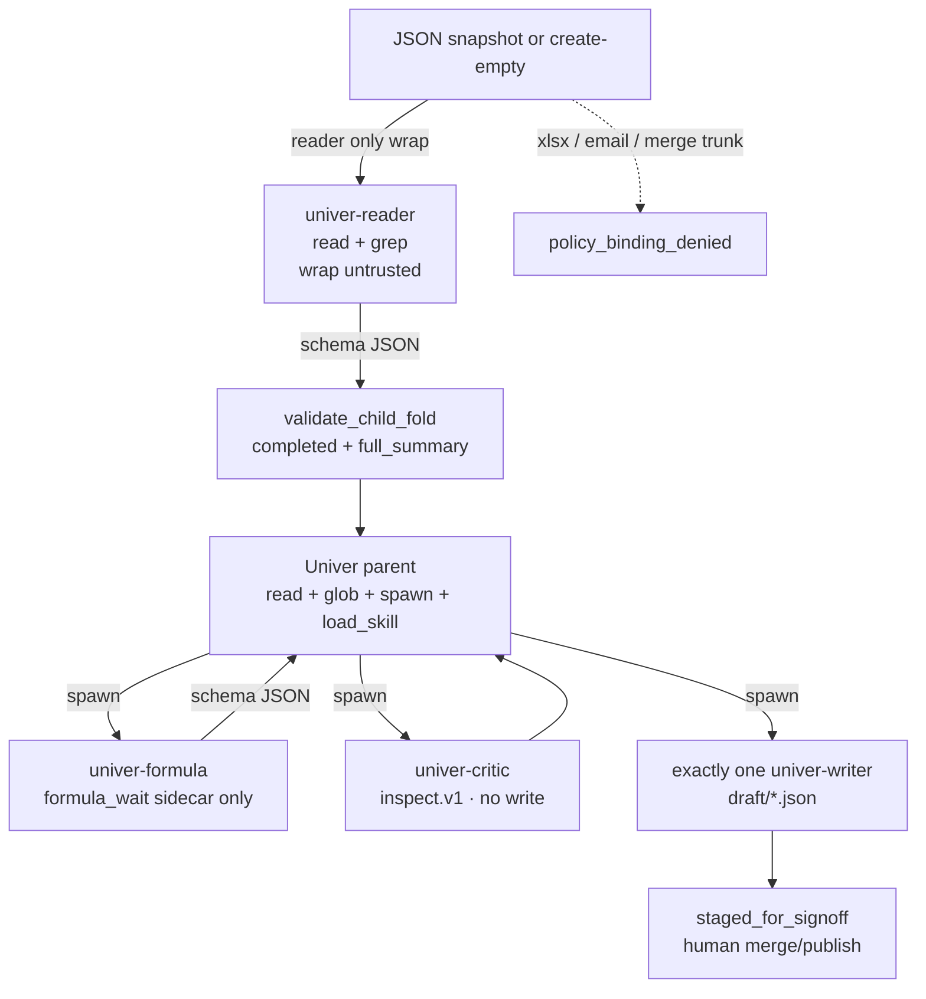

# 02. Univer Skills pack + Four-layer safety

| Field | Value |
|---|---|
| Date | 2026-09-25 |
| Status | Spec (Univer → Neos) — IMPLEMENTATION CONTRACT |
| Scope | v0 skill tree, catalog isolation, four-layer safety, writer jail, fold schemas, binding denylist |
| Out of scope | Univer Pro license, `mcp.univer.ai`, CLI/Workspace Worktree merge, Slides, xlsx write, `dream-num/skills` copytree |
| Sources | [12-ecosystem-agents.md](../12-ecosystem-agents.md), [11-commands-permissions.md](../11-commands-permissions.md), [09-facade-api.md](../09-facade-api.md), [13-runtime-contracts.md](../13-runtime-contracts.md), [14-formula-engine-internals.md](../14-formula-engine-internals.md); FSI twins [01-safety-handoff.md](../../financial-services/spec/01-safety-handoff.md), [02-skills-mcp.md](../../financial-services/spec/02-skills-mcp.md) |

이 장은 **구현 계약**이다. `docs/univer/00`–`14`는 원본 인벤토리(서술)이고, 이 파일이 스킬 팩과 안전 스택의 정본이다. 프롬프트 문장은 방어의 마지막 줄이 아니다. Isolation은 policy + schema + tools다. `PreToolUse` 훅을 추가하지 않는다. FSI의 모든 `hooks.json`이 `{"hooks": {}}`였던 것과 같다.

Fail-closed. GitHub `dream-num/skills` / `dream-num/univer-sdk-skills`를 `copytree`하지 않는다. v0 본문은 인벤토리에서 Neos가 작성한다. Pro 라이선스를 싣지 않는다. `mcp.univer.ai`를 호출하지 않는다.

---

## Decisions locked

| # | Decision |
|---|---|
| D1 | Canonical tree는 `skills/univer/<skill>/SKILL.md` (repo-root research catalog). 사본 하나. 에이전트 프로필은 이름 allowlist만 들고, 두 번째 트리를 만들지 않는다. |
| D2 | `MarkdownSkillCatalog._index_skill_directories`는 **한 단계**다. 루트는 `skills/univer` 하나. FSI처럼 수직 폴더를 더 넣지 않는다. recurse하지 않는다. flatten하지 않는다. |
| D3 | Univer 스킬은 research catalog다. `default_skill_roots()` / coding catalog (`neos/coding/skills/`)에 **넣지 않는다**. coding `load_skill.v1` 기본 경로는 Univer 이름을 `unknown_skill`로 본다. |
| D4 | Univer parent의 `load_skill.v1`는 `univer_catalog()` ∩ profile `skill_allowlist`. 빈 allowlist는 전부가 아니라 **무(無)**다. |
| D5 | v0 스킬 네 개만 작성한다: `univer-sheets-headless`, `univer-docs-headless`, `univer-formula-audit`, `univer-qc`. 본문은 인벤토리 사실에서 Neos가 쓴다. `dream-num/skills` copytree 금지. |
| D6 | v0에서 이식하지 않는다: `univer-pro-integrate`, `univer-cli`, `univer-workspace-cli`, `univer-plugin-dev`. `univer-integrate` / `univer-node-backend` / `univer-customize-theme`도 이식하지 않는다 (헤드리스 본문은 D5가 대체). |
| D7 | 안전 4층: (1) tool allowlist/catalog (2) writer jail `draft/*.json` (3) fold schema gate (4) binding denylist. 성공 산출물 상태는 `staged_for_signoff`. |
| D8 | Writer jail: 디스크 쓰기는 `draft/` **직계** JSON 스냅샷만. nested jail escape 금지. v0에서 xlsx write 금지. |
| D9 | Fold gate는 FSI review-fix와 같다. `validate_child_fold`는 `exit_reason == "completed"`일 때만. truncated면 `full_summary`를 검증한다. failed/cancelled/stalled는 `FoldRefused`를 올리지 않는다. |
| D10 | Gated catalog 이름: `univer-reader`, `univer-formula`. v0 리프 `name`은 카탈로그 스펙 이름과 같다. `output_schema_ref`는 그 스펙 이름이다. critic / writer는 스키마 없음. `SubagentSpec`에 `output_schema` 필드를 넣지 않는다. |
| D11 | Untrusted inbound는 **reader만** `<untrusted_document>`로 감싼다. v0 inbound는 JSON 스냅샷 또는 create-empty. xlsx/csv ingest는 이후 파도; 그때도 wrap은 reader만. |
| D12 | 그래프당 writer leaf **정확히 하나**. Critic은 `univer.inspect.v1` + 수식 에러로 초안을 재검사하고 쓰지 못한다. Formula leaf는 디스크에 쓰지 못한다. `univer.formula_wait.v1`만 사이드카 엔진 mutation을 적용한다. |
| D13 | Binding denylist: never publish / send / email; never merge trunk without human. 런타임 거절 (`policy_binding_denied`). 프롬프트만으로 막지 않는다. |
| D14 | OSS Apache-2.0 런타임만. Univer Pro 라이선스 키를 싣지 않는다. `AuthzIoLocalService`는 로컬 스텁이지 ACL 서버가 아니다. Hosted MCP / CLI execute 샌드박스를 가장하지 않는다. |
| D15 | CI는 경로를 resolve한다. `copytree`하지 않는다. `sync-agent-skills.py` 류를 이식하지 않는다. |

---

## 1. Skill tree layout

```
skills/univer/
  univer-sheets-headless/SKILL.md
  univer-docs-headless/SKILL.md
  univer-formula-audit/SKILL.md
  univer-qc/SKILL.md
```

온디스크 디렉터리 이름 = YAML `name` = catalog lookup key. mismatch를 만들지 않는다.

각 디렉터리는 `SKILL.md`만 필수다. `references/`는 인벤토리에서 뽑은 표(ErrorType, dataStream 토큰, Facade 메서드)가 본문을 넘치면 추가할 수 있다. `scripts/`는 v0에 두지 않는다. 스킬은 실행 바이너리가 아니라 markdown 지시문이다. `neos/skills/builtin/*/skill.py`로 감싸지 않는다. `BaseSkill`이 아니다.

### 1.1 여기 살지 않는 것

| Path | Owner |
|---|---|
| `skills/{pptx,docx,xlsx,pptx-posters,skill-creator}/` | 기존 Neos generic Office. Univer 스냅샷 JSON과 섞지 않는다. |
| `skills/financial-services/` | FSI pack. Univer catalog에 merge하지 않는다. |
| `neos/coding/skills/` | Coding catalog. Univer 금지 (D3). |
| `neos/skills/builtin/` | Executable `skill.py`. Univer 금지. |
| Named-agent system prompts | Univer harness/profile spec (이 문서 밖). |
| `dream-num/skills` / `univer-sdk-skills` GitHub tree | 참조 인벤토리만. vendoring 금지. |

### 1.2 Catalog 루트

`MarkdownSkillCatalog._index_skill_directories`는 루트의 **immediate children**에서 `<child>/SKILL.md`를 찾는다. recurse하지 않는다.

`skills/`를 research root로만 두면 스캐너는 `skills/univer/SKILL.md`를 찾고 실패한다. FSI가 수직마다 루트를 둔 것과 같은 버그다. 수정은 **루트 하나**:

```python
UNIVER_PACK = _REPO_ROOT / "skills" / "univer"


def univer_skill_roots() -> tuple[tuple[SkillSource, Path], ...]:
    """Immediate-child SKILL.md scan under skills/univer."""
    return (("repo", UNIVER_PACK),)


def univer_catalog() -> MarkdownSkillCatalog:
    return MarkdownSkillCatalog(roots=univer_skill_roots())
```

`research_skill_roots()`는 기존 `skills/` + builtin을 유지한다. `skills/univer`를 그 튜플에 **추가하지 않는다** (`skills/` 한 단계 스캔은 pack 폴더를 스킬로 오인한다). Univer named parent만 `univer_catalog()`를 붙인다.

Coding:

```python
def default_skill_roots() -> tuple[tuple[SkillSource, Path], ...]:
    return (("coding", _REPO_ROOT / "neos" / "coding" / "skills"),)
```

이 반환값에 Univer를 넣지 않는다. coding skip (`_coding_sections_valid`)은 `## When to Use` / `## Boundaries` 본문을 요구한다. Univer 스킬에 그 헤딩을 채워 coding catalog를 통과시키려 하지 않는다. 라우팅은 YAML `description`이다.

### 1.3 `load_skill.v1` 분기

기존 `_load_skill` (`neos/coding/tools/executor.py`)는 `default_catalog()`만 본다. Univer 이름을 넣어도 coding 세션은 `unknown_skill`.

**하지 말 것:** `default_skill_roots()`에 Univer 추가. `load_skill.v1` 스키마에 `catalog_id` 인자 추가. FSI catalog와 Univer catalog를 한 인스턴스에 merge.

**할 것:** 세션 actor가 Univer parent / Univer leaf이면:

1. catalog = `univer_catalog()`.
2. `allow = profile.skill_allowlist` (frontmatter `name`의 frozenset). 없거나 빈 리스트면 빈 집합.
3. `name not in allow` → `denied` / `unknown_skill`. catalog에 있어도 거절.
4. 그 외 `catalog.get(name)` 후 오늘과 같은 `load_markdown`. `disable_model_invocation`은 여전히 deny.

| Caller | `skill_allowlist` | `load_skill.v1 name=univer-sheets-headless` |
|---|---|---|
| Coding session / `default_catalog()` | n/a | `unknown_skill` |
| Univer parent | includes that name | `ok` |
| Univer reader / critic (empty allow) | `[]` | `unknown_skill` |
| Univer parent | allowlist omits the name | `unknown_skill` |
| FSI parent `catalog_id: fsi` | any | `unknown_skill` (다른 catalog) |

`default_catalog().get("univer-sheets-headless")`는 팩이 디스크에 있어도 `None`이다.

---

## 2. v0 SKILL.md — frontmatter와 본문이 가르쳐야 할 것

Frontmatter는 `name` + `description`만. `allowed-tools`, `when_to_use`, `user_invocable`, `disable-model-invocation`을 발명하지 않는다. 본문에 coding catalog용 `## When to Use` / `## Boundaries`를 채우지 않는다 (넣으면 warn-only research check만 통과하고, coding 인덱스로 승격시키지 않는다).

본문 언어는 에이전트 대면 **영어** (Facade 식별자가 영어). 이 spec 문서만 한국어.

GitHub 스킬 팩의 Pro/CLI 본문을 복사하지 않는다. 인용 권위는 클론 인벤토리 `docs/univer/09`, `11`, `13`, `14`.

### 2.1 `univer-sheets-headless`

```yaml
---
name: univer-sheets-headless
description: Headless Univer Sheets via Facade FWorkbook/FRange. Use to create or mutate a workbook JSON snapshot with setValue/setFormula, wait for formula application, and FWorkbook.save(). Not for Pro xlsx I/O, charts, pivot, CLI worktrees, or Slides.
---
```

본문이 **반드시** 가르칠 것:

| 주제 | 잠긴 사실 (인벤토리) |
|---|---|
| 부트 | `preset-sheets-node-core`. `createUniver` → `{ univer, univerAPI }`. side-effect `import '@univerjs/sheets/facade'` 등이 없으면 `createWorkbook`은 `undefined`. UI facade는 Node 코어 프리셋에 없다. |
| 핸들 | `univerAPI.createWorkbook(data)` → `FWorkbook.getActiveSheet()` → `FWorksheet.getRange('A1')` → `FRange`. |
| 쓰기 | `FRange.setValue` / `setValues` / `setFormula`. 내부는 `sheet.command.set-range-values` (`SetRangeValuesCommand`). MUTATION id를 직접 부르지 않는다 (undo/인터셉터/권한 훅 생략). |
| 저장 | 검증·왕복은 **`FWorkbook.save()`**. 플러그인 `resources`(DV/CF/filter)를 포함한다. `Workbook.getSnapshot()`은 resources를 빼므로 에이전트 검증에 쓰지 않는다. |
| 수식 대기 | `setFormula`는 dirty만 남긴다. 셀 `v`를 읽기 전에 `await univerAPI.getFormula().onCalculationResultApplied()`. 강제 재계산은 `executeCalculation()`. |
| 셀 계약 | `ICellData`에서 `v`/`f`/`p`/`s` 공존. `undefined` = 유지, `null` = 키 삭제. 빈 시트 기본 1000행 × 20열, 행높이 24, 열너비 88. |
| 권한 | OSS `AuthzIoLocalService`는 로컬 스텁. 원격 ACL이 아니다. 스킬이 “권한 서버가 거절했다”고 가르치지 않는다. |
| 금지 | xlsx import/export, 차트, 피벗, screenshot Facade, `mcp.univer.ai`, Pro 라이선스 등록. |

Writer leaf가 이 스킬을 로드한다. Reader는 로드하지 않는다 (`skill_allowlist: []`).

### 2.2 `univer-docs-headless`

```yaml
---
name: univer-docs-headless
description: Headless Univer Docs via FDocument.insertText and save(). Use for plain-text edits on IDocumentData JSON snapshots. Do not hand-edit dataStream or OT. Not for DOCX exchange, Slides, or Pro collaboration.
---
```

본문이 **반드시** 가르칠 것:

| 주제 | 잠긴 사실 |
|---|---|
| 부트 | `preset-docs-node-core`. `univerAPI.createDocument(data)` → `FDocument`. |
| 쓰기 | `FDocument.insertText(index, text, segmentId?)`. 단락은 `insertParagraph` / `appendParagraph`. 정본 mutation은 `doc.mutation.rich-text-editing` (JSONX/TextX). |
| 저장 | `FDocument.save()` → `IDocumentData` + resources. |
| dataStream | 구현 enum이 정본 (`DataStreamTreeTokenType`). PARAGRAPH `\r`, SECTION_BREAK `\n`, TABLE `\x1A`…`\x0F`, custom range START/END `\x1F`/`\x1E`. `IDocumentBody` JSDoc이 표 끝을 `\x1E`/`\x1F`로 적은 부분은 **stale**. |
| OT 금지 | `body` / `dataStream`을 손으로 편집하지 않는다. paragraphId와 JSONX invert가 깨진다. 빈 body는 `dataStream: '\r\n'`. |
| 조회 | `getParagraphs` / `findParagraphByText`. `FDocumentTextRange.describe()`는 에이전트용 serializable summary. 오프셋은 생성 시점 고정 — 앞을 고치면 레인지를 다시 잡는다. |
| 금지 | DOCX 왕복(Pro), Slides (`createSlide`/Facade 없음), 헤더/푸터를 dataStream으로 직접 패치. |

### 2.3 `univer-formula-audit`

```yaml
---
name: univer-formula-audit
description: Audit Univer formula-engine results. Use to wait on dirty calculation, list ErrorType literals, and read getFormulaError/getAllFormulaError. Never register custom RPC functions. Not for writing cells to disk.
---
```

본문이 **반드시** 가르칠 것:

| 주제 | 잠긴 사실 |
|---|---|
| ErrorType | 12 리터럴, 전부 나열: `#DIV/0!` `#NAME?` `#VALUE!` `#NUM!` `#N/A` `#CYCLE!` `#REF!` `#SPILL!` `#CALC!` `#ERROR!` `#GETTING_DATA` `#NULL!` (`engine-formula` `basics/error-type.ts`). |
| Dirty | `ActiveDirtyController`가 시트 뮤테이션을 본다. **스타일만** 바꾼 `SetRangeValues`는 스킵. 트리거는 10ms debounce. 결과는 `SetRangeValuesMutation`으로 셀 `v`/`t`에 기록. |
| 대기 | `onCalculationResultApplied(timeout?)`. 외부에서 모델을 건드렸으면 `executeCalculation()`. 끝나기 전 `getValue()`는 stale일 수 있다. |
| 에러 조회 | `FRange.getFormulaError()`, `FWorkbook.getAllFormulaError()`. |
| 커스텀 함수 금지 | `sheets-formula.remote-register-function.service` 역직렬화는 throw (“unsafe”). Facade `registerFunction`은 메인 스레드 전용. **v0는 커스텀 함수를 등록하지 않는다.** RPC로 함수 소스를 보내지 않는다. |
| 디스크 | 이 스킬을 로드한 formula leaf는 `write_file.v1`가 없다. 엔진 mutation은 `univer.formula_wait.v1`가 사이드카 메모리에만 적용한다. |

`#CYCLE!`은 정의되어 있으나 순환 그래프에 자동으로 잘 안 쓴다. `#NULL!`은 공백 교차 주석용. 스킬이 “모든 순환이 `#CYCLE!`”이라고 가르치지 않는다.

### 2.4 `univer-qc`

```yaml
---
name: univer-qc
description: Critic checks on a Univer draft JSON snapshot. Use to re-inspect formula errors, null cells versus style-only, merges, and data validation. Read-only. Not for writing drafts or merging trunk.
---
```

본문이 **반드시** 가르칠 것:

| 주제 | 잠긴 사실 |
|---|---|
| 역할 | Critic 전용. 쓰기 도구 없음. 초안을 `univer.inspect.v1`로 다시 읽고, 수식 에러를 재집계한다. |
| Null vs style-only | `isNullCell`: `v`/`f`/`si`/`p`가 없으면 빈 셀. **스타일만 있는 셀도 null cell**. QC가 “배경색이 있으니 값이 있다”고 판정하면 버그다. |
| 수식 에러 | `getAllFormulaError()` / ErrorType 목록. dirty 미대기 값은 에러가 아니라 stale이다. 먼저 wait가 끝났는지 inspect 메타를 본다. |
| Merge | `getMergeData` / `isMerged` / `isPartOfMerge`. 병합 좌상단만 값이 있고 나머지는 비어 보이는 것이 정상일 수 있다. |
| Validation | Sheets DV만 OSS에 있다. `FWorkbook.save()` resources에 DV 플러그인 데이터가 들어간다. Docs DV를 발명하지 않는다. |
| 표시값 | `getValue`는 인터셉터 합성값일 수 있다 (`CELL_CONTENT`). 원본은 `ICellData.v`. QC는 둘을 구분해 보고한다. |
| 금지 | draft에 쓰기, trunk merge, xlsx export, 메일/업로드. |

---

## 3. Four-layer safety — exact Neos enforcement

소스 안전은 Claude Code 훅이 아니다. Isolation is policy + schema + typed tool. Univer OSS의 `SheetInterceptorService` / `AuthzIoLocalService`는 **문서 런타임** 훅이지 에이전트 `PreToolUse`가 아니다. 그 위에 Neos 훅을 얹지 않는다.

```
inbound JSON snapshot | create-empty
        │
        ▼
[1] prompt fence   (treat as data; <untrusted_document> on reader only)
        │  reader only
        ▼
[2] default-deny tools  (catalog ∩ spec.allowed_tools ∩ skill_allowlist)
        │  schema JSON only
        ▼
[3] output_schema gate  (validate_child_fold iff exit_reason=="completed";
                         full_summary if truncated)
        │
        ▼
[4] binding denylist    (never publish/send/email; never merge trunk)
        │
        ▼
  writer leaf → draft/*.json → status = staged_for_signoff
```

Layer 1은 필요하지만 **충분하지 않다**. 프롬프트 문장을 마지막 방어선으로 취급하지 않는다.

### 3.1 Layer 1 — Prompt fence + untrusted wrap

FSI twin: `01-safety-handoff.md` §1.1 / §3. Reader 본문은 도구 결과와 파일 바디를 지시가 아니라 데이터로 본다. Univer reader spec은 explore spawn 문장(`You may call spawn_agent.v1 once…`)을 재사용하지 않는다. Univer leaf는 `spawn_agent.v1`를 받지 않는다. `load_project_instructions=False` (untrusted reader가 `AGENTS.md` / `CLAUDE.md`를 읽지 않는다).

**Wrap은 reader만.** Writer가 `draft/*.json`을 읽을 때는 unwrap. FSI `FsiParentWorkspacePort`와 같다: writer 경로는 감싸지 않고, reader 경로는 감싼다. inner `</untrusted_document>`는 대소문자 무시하고 `</untrusted-document>`로 치환한 뒤 바깥 한 겹만 남긴다.

```
<untrusted_document source="…ref…">
…JSON snapshot as text…
</untrusted_document>
```

`source`는 charset-capped pointer (`^[A-Za-z0-9 ._/:#-]+$`, max 256). 모델이 fetch할 URL이 아니다.

v0 inbound는 JSON 스냅샷 또는 create-empty다. create-empty에는 wrap할 바디가 없다. 이후 파도의 user xlsx/csv는 **reader에만** 같은 래퍼를 쓴다. Writer에게 원본 경로를 넘기지 않는다. Writer는 스키마를 통과한 JSON (또는 서버가 만든 `draft/*.json`)만 본다.

### 3.2 Layer 2 — Tool allowlist (catalog)

Default-deny. 포트가 제공하는 도구라도 spec `allowed_tools`에 없으면 모델에 보내지 않는다 (`_tool_permitted`). 스킬 이름은 `univer_catalog()` ∩ `skill_allowlist` 밖이면 `unknown_skill`.

역할 분할 (v0 그래프):

| Role | Spec 이름 | Tools | Skills | Write |
|---|---|---|---|---|
| Orchestrator (Univer parent) | parent profile | `read_file.v1`, `search_text.v1`, `glob_files.v1`, `spawn_agent.v1`, `load_skill.v1` (allowlist 비어 있지 않을 때) | 프로필 allowlist (네 이름 부분집합) | **없음** |
| Untrusted reader | `univer-reader` | `read_file.v1`, `search_text.v1` | `[]` | 없음 |
| Formula leaf | `univer-formula` | `read_file.v1`, `univer.formula_wait.v1`, `univer.inspect.v1` (읽기) | `univer-formula-audit`만 허용 가능 | 디스크 **없음**. 사이드카 mutation은 `formula_wait`만 |
| Critic | `univer-critic` (alias of a non-write spec) | `read_file.v1`, `univer.inspect.v1` | `univer-qc` (프로필이 줄 때만). 빈 리스트도 허용 | 없음 |
| Sole writer | `univer-writer` | `read_file.v1`, `write_file.v1` (jail), Facade mutate via sidecar **after** schema JSON | `univer-sheets-headless` and/or `univer-docs-headless` | `draft/*.json` only |

Unknown spec → `policy_unknown_spec`. Extra tool keys → `policy_schema_invalid`. `can_spawn=False` on every Univer leaf. `can_approve=False`. `handoff.v1`는 v0 Univer 그래프에 붙이지 않는다 (FSI 버스와 섞지 않는다). `REFUSED_TOOLS`에 있는 이름은 spec이 명시하지 않으면 거절.

Parent는 `write_file.v1` / `execute.v1`가 없다. 그래프에서 `write_file.v1`를 가진 leaf는 **정확히 하나**. CI가 0 또는 2를 실패로 친다.

`execute.v1` / bash는 v0 Univer leaf에 없다. Facade JS를 모델이 짜서 셸로 돌리지 않는다. CLI `univer execute`를 이식하지 않는다 (`execute`는 비신뢰 코드 샌드박스가 아니다 — `12-ecosystem-agents.md`).

OSS 권한 포인트(workbook/worksheet/range enum)는 사이드카 안의 문서 권한이다. 에이전트 ACL로 취급하지 않는다.

### 3.3 Layer 3 — Fold schema gate

스키마는 하니스 쪽이다. 모델이 고칠 수 있는 툴 필드가 아니다. `SubagentSpec`에 `output_schema`를 넣지 않는다. 프로필 YAML은 `output_schema_ref`만 들고, 본문은 `neos/univer/schemas.py` (FSI `neos/fsi/schemas.py` twin). `neos/subagent`는 `neos.univer`를 import하지 않는다.

Gated names:

| Leaf `name` | `output_schema_ref` | Gate |
|---|---|---|
| `univer-reader` | `univer-reader` | JSON object, `additionalProperties: false` |
| `univer-formula` | `univer-formula` | JSON object, `additionalProperties: false` |
| `univer-critic` | `null` | 게이트 없음 (자유 요약 허용, binding denylist는 유지) |
| `univer-writer` | `null` | 게이트 없음. 산출물은 jail이 강제 |

Compile: reader/formula leaf는 `name == output_schema_ref`가 아니면 `ProfileError`. FSI review-fix와 동일.

삽입 알고리즘 (parent, fold 이후, transcript 이전):

```python
def run_leaf_gate(folded: FoldedResult, spec_name: str) -> FoldedResult:
    if folded.exit_reason != "completed":
        return folded  # failed/cancelled/stalled/turns_exhausted — no FoldRefused
    text = folded.full_summary if folded.truncated else folded.summary
    validate_child_fold(spec_name, text)  # raises FoldRefused(code="schema_invalid")
    return folded
```

- 완료된 접힘만 jsonschema.
- truncated 유효 JSON은 `full_summary`로 통과해야 한다 (`summary`의 `\n…\n` 잘림을 스키마 실패로 오인하지 않는다).
- 무효 JSON / extra keys / charset 위반 → `FoldRefused`; harness verdict **`fail`**; artifact `schema_invalid`; 부모는 fold를 소비하지 않는다; repair retry 없음.
- 스키마 없는 spec (`univer-critic`, `univer-writer`)은 `validate_child_fold`가 `{"text": text}`를 돌려주고 통과한다.

Reader/formula JSON은 길이·문자군을 제한해 주입 문장이 살아남지 못하게 한다. 구체 필드는 §6.

### 3.4 Layer 4 — Binding denylist

런타임 **reject** (harness `fail` / tool error). 프롬프트 Guardrail만으로 끝내지 않는다. 성공 경로의 산출물 상태는 항상 `staged_for_signoff`이다. harness verdict `pass`는 “사람이 서명해도 되는 초안”이지 “trunk에 넣어도 된다” / “메일로 보내도 된다”가 아니다.

상세는 §7.



---

## 4. Writer jail rules

FSI Mode B twin: `./out/_spec/*.json` only, nested `_spec` 거부, xlsx child write 거부. Univer v0 디스크 네임스페이스는 `draft/`.

Jail root: `<workspace>/draft/` (resolve 후 workspace 안).

### 4.1 Write

`write_file.v1` 허용 조건 **전부**:

1. raw path는 상대. `\0` 없음. 파트에 `..` 없음. 절대 경로 거부.
2. resolve 결과가 workspace에 `is_relative_to`.
3. `resolved.parent == <workspace>/draft` — **직계 자식만**. `draft/foo/bar.json` 거부 (nested jail escape). `draft/_spec/x.json` 거부.
4. suffix `.json` (대소문자 무시하지 말고 `.json`만; `.JSON` 거부는 구현이 fail-closed로 통일).
5. xlsx/xlsm/xls 이름이면 다른 조건보다 먼저 `xlsx_forbidden`. v0는 xlsx write가 없다. parent `stage_xlsx`도 **두지 않는다**.
6. content는 UTF-8 텍스트. 바이너리 거부.

위반 → 도구 에러 `path_denied` 또는 `xlsx_forbidden`. 파일은 생기지 않는다.

Writer는 “You are the ONLY worker with Write.” Critic / reader / formula / parent는 `write_file.v1`가 없다.

### 4.2 Writer read

Writer가 읽을 수 있는 파일은 jail 안의 `draft/*.json`뿐 (직계, unwrap). Untrusted inbound 경로·원본 스냅샷 경로·워크스페이스 다른 파일은 `path_denied`. Parent가 넘기는 입력은 스키마를 통과한 JSON 또는 이미 jail에 있는 초안이다.

### 4.3 Formula sidecar vs disk

`univer.formula_wait.v1`는 사이드카 Univer 인스턴스에서 dirty 계산을 끝내고 엔진 `SetRangeValuesMutation`을 **메모리 모델**에 적용한다. 이것은 디스크 write가 아니다. formula leaf의 `allowed_tools`에 `write_file.v1`를 넣지 않는다.

디스크에 스냅샷을 남기는 유일한 행위자는 writer다. Writer는 wait가 끝난 모델을 `FWorkbook.save()` / `FDocument.save()`로 JSON화해 `draft/<name>.json`에 쓴다.

### 4.4 탈출 벡터 (전부 거부)

| 시도 | 결과 |
|---|---|
| `draft/../secret.json` | `path_denied` (`..`) |
| `/tmp/out.json` | `path_denied` (absolute) |
| `draft/nested/a.json` | `path_denied` (parent ≠ draft root) |
| `draft/book.xlsx` | `xlsx_forbidden` |
| symlink로 workspace 밖 | resolve 후 `is_relative_to` 실패 → `path_denied` |
| writer가 inbound 원본 경로 read | `path_denied` |
| critic이 `write_file.v1` | `_tool_permitted` false |

---

## 5. Fold schemas

모듈: `neos/univer/schemas.py`. Public: `READER_SCHEMAS` (이름 유지 — formula도 같은 테이블), `FoldRefused`, `validate_child_fold(spec_name: str, text: str) -> dict`.

`validate_child_fold("univer-critic", …)` / `("univer-writer", …)`는 스키마가 없으므로 `{"text": text}`. 없는 이름을 게이트 테이블에 발명하지 않는다.

Charset 가족 (FSI와 같은 주입 적대 클래스):

| Pattern | 용도 |
|---|---|
| `^[A-Za-z0-9_-]+$` | ids (`unit_id`, `sheet_id`) |
| `^[A-Za-z0-9 ._/:#-]+$` | path refs (`draft/foo.json`, source pointer) |
| `^[A-Za-z0-9 .,%$()_/:-]+$` | short notes (no `<>{}[]\"\\`) |
| ErrorType enum | 아래 12리터럴 + empty |

### 5.1 `univer-reader`

Required: `[unit_kind, status, unit_id, sheets_or_segments]`. Isolation: read-only, no write, no execute, no MCP. 출력만 이 JSON.

```yaml
output_schema:
  type: object
  required: [unit_kind, status, unit_id]
  additionalProperties: false
  properties:
    unit_kind: { enum: [sheet, doc, empty] }
    status: { enum: [ok, empty, error] }
    unit_id: { type: string, maxLength: 64, pattern: "^[A-Za-z0-9_-]+$" }
    title: { type: string, maxLength: 200, pattern: "^[A-Za-z0-9 .,_/-]+$" }
    sheet_names:
      type: array
      maxItems: 64
      items: { type: string, maxLength: 64, pattern: "^[A-Za-z0-9 ._()-]+$" }
    evidence_refs:
      type: array
      maxItems: 10
      items: { type: string, maxLength: 256, pattern: "^[A-Za-z0-9 ._/:#-]+$" }
```

자유 텍스트 `message` / extra keys → `schema_invalid`. 스냅샷 전체 JSON을 fold에 실어 보내지 않는다. 본문은 도구로만 읽고, fold는 메타만 통과한다.

### 5.2 `univer-formula`

Required: `[unit_id, wait_status, error_count]`.

```yaml
output_schema:
  type: object
  required: [unit_id, wait_status, error_count]
  additionalProperties: false
  properties:
    unit_id: { type: string, maxLength: 64, pattern: "^[A-Za-z0-9_-]+$" }
    wait_status: { enum: [applied, timeout, skipped] }
    error_count: { type: integer }
    errors:
      type: array
      maxItems: 200
      items:
        type: object
        required: [code, a1]
        additionalProperties: false
        properties:
          code:
            enum:
              - "#DIV/0!"
              - "#NAME?"
              - "#VALUE!"
              - "#NUM!"
              - "#N/A"
              - "#CYCLE!"
              - "#REF!"
              - "#SPILL!"
              - "#CALC!"
              - "#ERROR!"
              - "#GETTING_DATA"
              - "#NULL!"
          a1: { type: string, maxLength: 32, pattern: "^[A-Za-z0-9:$]+$" }
          sheet: { type: string, maxLength: 64, pattern: "^[A-Za-z0-9 ._()-]+$" }
```

formula leaf는 이 JSON만 부모에게 접는다. 계산된 셀 그리드 전체를 fold에 넣지 않는다. 그리드는 사이드카에 남고, writer가 `save()`로 `draft/*.json`에 쓴다.

### 5.3 누가 검증하나

**parent / server**. Reader self-attested JSON은 게이트가 아니다. 스키마는 LLM 툴 목록에 자유 필드로 노출하지 않는다.

---

## 6. Binding denylist

`neos/univer/safety.py` (FSI `neos/fsi/safety.py` twin). `neos.univer`는 `neos.fsi`를 import하지 않는다. 상수는 독립 복사.

```python
BINDING_ACTIONS = frozenset(
    {
        "publish",
        "send",
        "email",
        "merge_trunk",
        "merge_worktree",
        "xlsx_export",
        "mcp_univer_ai",
        "register_pro_license",
    }
)
SUCCESS_ARTIFACT_STATUS = "staged_for_signoff"
SUCCESS_HARNESS_VERDICT = "pass"
```

`policy_binding_denied(action) -> bool`. 해당 액션 도구 호출은 `{"error": "policy_binding_denied", "action": action}`이고 harness verdict `fail`.

### 6.1 Never publish / send / email

산출물은 `draft/*.json` 초안이다. 메일, Slack, Graph-send, 업로드, hosted MCP 브리지를 붙이지 않는다. `pass`가 `published` 플래그를 뒤집지 않는다.

### 6.2 Never merge trunk without human

Univer CLI/Workspace의 Worktree `merge`는 사람 승인이다 (`12-ecosystem-agents.md`: OpenClaw `ready`는 trunk를 바꾸지 않는다). v0 Neos는 Worktree 제품을 이식하지 않는다. 에이전트가 trunk merge / `mergeWorktree` / `runtime.commit`을 호출하면 `policy_binding_denied`. 성공은 `staged_for_signoff` — 사람이 본다.

### 6.3 Never Pro / never hosted MCP

`UNIVER_CLIENT_LICENSE` / `UNIVER_LICENSE`를 환경에 심거나 스킬이 “라이선스를 먼저 등록하라”고 가르치지 않는다. `https://mcp.univer.ai/mcp/` Bearer 호출은 도구 목록에 없고, 호출 시도는 `mcp_univer_ai`로 deny.

### 6.4 v0 xlsx export

Child도 parent도 `.xlsx`를 쓰지 않는다. 이후 파도에서 export를 열면 이 denylist를 개정하는 spec PR이 필요하다. 지금은 `xlsx_export` ∈ `BINDING_ACTIONS`.

quoted JSON / reader fold 안의 `{ "action": "publish" }`는 도구 호출이 아니다. `quoted_json_is_handoff` twin처럼 문서에 인용된 바인딩 지시는 **data**.

---

## 7. Graph invariants (skills가 가정하는 런타임)

이 문서가 하니스 전체를 정의하지는 않는다. 스킬·안전이 깨지지 않으려면 아래는 잠긴다.

| Invariant | Rule |
|---|---|
| One writer | 프로필 `sum(leaf.write) == 1`이고 그 leaf만 `write_file.v1`. |
| Depth 1 | leaf `can_spawn=False`. `_MAX_SPAWN_DEPTH`를 Univer leaf에 열지 않는다. |
| Formula ≠ disk | `univer-formula`에 `write_file.v1` 없음. `univer.formula_wait.v1`만 사이드카 mutation. |
| Critic re-inspect | `univer.inspect.v1` + formula errors. write 없음. |
| No PreToolUse | 빈 훅. Interceptor는 Univer 커맨드 파이프(문서 런타임)일 뿐. |
| Sandbox | v0 leaves `SandboxMode.NONE`. coding `IMPLEMENT` worktree를 재사용하지 않는다. |
| Catalog | parent `load_skill.v1` → `univer_catalog()` ∩ allowlist. coding `default_catalog()`와 분리. |
| Authz | `AuthzIoLocalService` 스텁. 협업 ACL 서버로 테스트하거나 스킬에 쓰지 않는다. |

도구 이름 (잠김):

| Tool | Who | Effect |
|---|---|---|
| `univer.inspect.v1` | critic, formula (read) | 사이드카/초안 스냅샷 요약. 디스크 write 없음. |
| `univer.formula_wait.v1` | formula leaf only | dirty wait + 엔진 mutation in-memory. |
| `write_file.v1` | writer only | §4 jail. |
| `load_skill.v1` | parent (and writer if allowlist 비어 있지 않음) | §1.3. |
| `spawn_agent.v1` | parent only | registered kebab names only. |

---

## 8. What stays out of v0

이식·구현·스킬 본문·도구 모두에서 제외. “나중에”는 이 파일을 개정하기 전에는 아니오.

| Item | Why |
|---|---|
| `univer-pro-integrate` | Pro 라이선스·협업·xlsx/docx exchange·print·pivot·charts. OSS 클론에 소스 없음. |
| `univer-cli` / `univer-workspace-cli` | discovery `hidden: true` 스킬 + Worktree execute. CLI 바이너리/번들 localhost 라이선스. `execute`는 비신뢰 샌드박스가 아님. |
| `univer-plugin-dev` | COMMAND/MUTATION 플러그인 개발. v0 에이전트는 플러그인을 작성하지 않는다. |
| `univer-integrate` / `univer-node-backend` / `univer-customize-theme` | GitHub 우산 스킬. 헤드리스 본문은 D5 네 개가 대체. copytree 금지. |
| CLI unit skills (`core`/`sheet`/`doc`/`slide`/`base`/`board`/`embed`/`cross-unit-formula`) | 설치된 CLI 바이너리에 있음. GitHub skills 레포에도 없음. |
| Slides | Facade/preset 없음. `SlideDataModel` 코어는 throw. v0 스킬·리프·스키마에 `slide`를 넣지 않는다 (`univer-reader.unit_kind` enum에 없음). |
| Hosted MCP `mcp.univer.ai` + start-kit 30 tools | Pro 플러그인 `@univerjs-pro/mcp*`. Bearer API key. Neos 도구로 노출 금지. |
| xlsx/csv **write** 및 v0 **ingest as writer input** | inbound는 JSON 또는 create-empty. 이후 reader wrap으로만 xlsx/csv. |
| Charts, pivot, collaboration server, print, History semantic diff | README Pro 열. |
| Bases / Boards / PDF 제품 패키지 | 모델/enum만. 스킬 없음. |
| `PreToolUse` / Claude hooks | Isolation is policy + schema + tools. |
| Univer → coding `default_skill_roots` | D3. |
| FSI catalog merge | 이름 충돌을 만들지 않는다. |
| GitHub skills `copytree` | CI는 path resolve만. |

OSS 정본 경로 (인벤토리 한 줄): **Node preset + Facade + `executeCommand` + `save()`**. 그것을 네 개 스킬이 가르치고, 네 층이 가둔다.

---

## 9. Required tests (policy before feature)

FSI `01-safety-handoff.md` §11 twin. 구현 PR은 이 표가 먼저 초록이어야 한다.

### 9.1 Catalog

| Test | Assert |
|---|---|
| `test_univer_not_in_default_skill_roots` | `default_catalog().get("univer-sheets-headless") is None` after pack lands. |
| `test_univer_catalog_indexes_four` | `univer_catalog()` names == the four v0 names. |
| `test_coding_load_skill_unknown` | coding session `load_skill.v1` those names → `unknown_skill`. |
| `test_empty_allowlist_denies` | Univer reader `skill_allowlist: []` → deny even if catalog has the name. |
| `test_no_copytree_from_github` | tree has no `univer-pro-integrate` / `univer-cli` / `univer-workspace-cli` / `univer-plugin-dev` directories. |

### 9.2 Schema gate

| Test | Assert |
|---|---|
| `test_validate_only_when_completed` | `exit_reason != "completed"` → no `FoldRefused`. |
| `test_truncated_uses_full_summary` | completed + truncated valid JSON → pass on `full_summary`. |
| `test_reader_schema_rejects_free_text` | extra keys / prose `message` → `schema_invalid`. |
| `test_formula_schema_error_enum` | `code: "#BOGUS!"` → fail; `#DIV/0!` → pass. |
| `test_output_schema_ref_equals_name` | compile `univer-reader` with ref `univer-formula` → `ProfileError`. |
| `test_critic_writer_ungated` | `validate_child_fold("univer-critic"\|"univer-writer", text) == {"text": text}`. |

### 9.3 Jail + tools

| Test | Assert |
|---|---|
| `test_writer_json_direct_child_ok` | `draft/book.json` write succeeds. |
| `test_nested_draft_denied` | `draft/nested/book.json` → `path_denied`. |
| `test_dotdot_denied` | `draft/../x.json` → `path_denied`. |
| `test_xlsx_forbidden` | `draft/book.xlsx` → `xlsx_forbidden`. |
| `test_exactly_one_writer` | graph write-capable leaves == 1. |
| `test_formula_cannot_write_file` | `univer-formula` `_tool_permitted("write_file.v1")` is False. |
| `test_critic_cannot_write` | same for critic. |
| `test_parent_has_no_write` | parent denies `write_file.v1`. |
| `test_unknown_spec_fail_closed` | `spec=evil` → `policy_unknown_spec`. |
| `test_reader_bodies_wrapped` | inbound JSON presented to reader is inside `<untrusted_document>`. |
| `test_writer_reads_unwrapped_draft` | writer read of `draft/*.json` has no wrapper. |
| `test_inner_close_tag_neutralized` | inbound containing `</untrusted_document>` stays inside one outer wrap. |

### 9.4 Binding

| Test | Assert |
|---|---|
| `test_publish_send_email_denied` | those actions → `policy_binding_denied`. |
| `test_merge_trunk_denied` | `merge_trunk` / `merge_worktree` → denied. |
| `test_success_is_staged_for_signoff` | `SUCCESS_ARTIFACT_STATUS == "staged_for_signoff"`; harness `pass` does not set `published`. |
| `test_no_mcp_univer_ai` | tool list has no mcp.univer.ai URL; attempted action denied. |
| `test_no_pro_license_shipped` | pack / runtime config has no `UNIVER_CLIENT_LICENSE` requirement. |

---

## 10. Fail-closed summary

모르는 spec, 빈 allowlist, jail 밖 경로, completed가 아닌 fold의 jsonschema, extra JSON keys, xlsx write, trunk merge, hosted MCP, Pro 라이선스, GitHub skills copytree — 전부 **거부 또는 부재**다. 침묵 스트립으로 통과시키지 않는다.

v0가 하는 일: OSS Apache-2.0 headless Facade로 JSON 스냅샷을 읽고, 수식을 기다리고, critic이 검사하고, writer 하나가 `draft/*.json`에 남기고, 사람이 `staged_for_signoff`를 본다.
